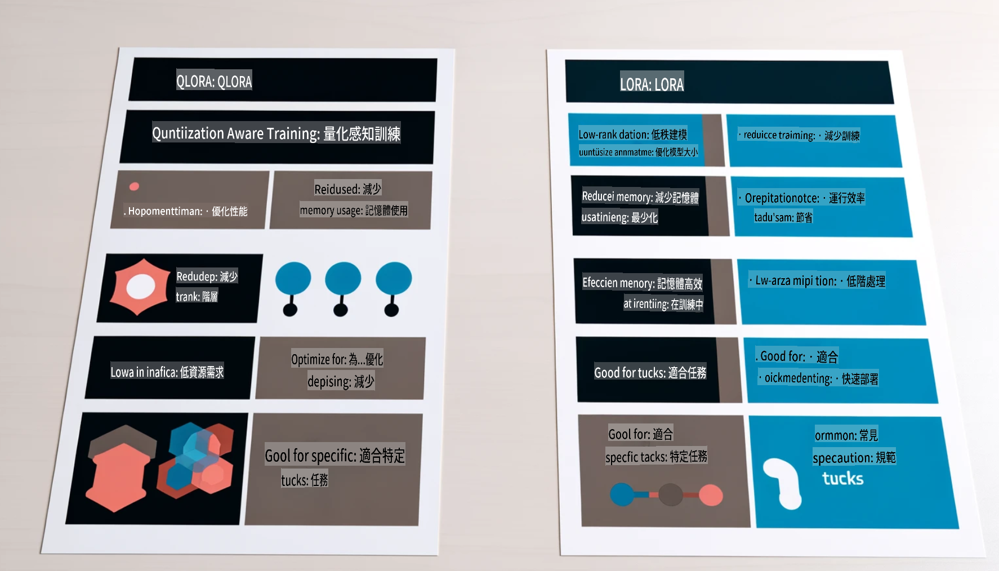

# **讓 Phi-3 成為行業專家**

要將 Phi-3 模型應用於某個行業，需要向 Phi-3 模型添加行業業務數據。我們有兩種不同的選擇：第一種是 RAG（檢索增強生成），第二種是微調（Fine Tuning）。

## **RAG 與微調的比較**

### **檢索增強生成（RAG）**

RAG 是數據檢索與文本生成的結合。企業的結構化數據和非結構化數據被存儲在向量數據庫中。當需要檢索相關內容時，會找到相關摘要和內容來形成上下文，並結合 LLM/SLM 的文本補全能力來生成內容。

### **微調（Fine-tuning）**

微調是基於某個模型的改進，不需要從模型算法開始，但需要不斷累積數據。如果在行業應用中需要更精確的術語和語言表達，微調是更好的選擇。但如果您的數據經常變動，微調可能會變得複雜。

### **如何選擇**

1. 如果我們的答案需要引入外部數據，RAG 是最佳選擇。

2. 如果需要輸出穩定且精確的行業知識，微調會是更好的選擇。RAG 優先檢索相關內容，但可能無法完全掌握專業細節。

3. 微調需要高質量的數據集，如果只是小範圍的數據，效果不會有太大差別。RAG 更加靈活。

4. 微調是一個黑箱過程，機制難以理解。但 RAG 可以更容易找到數據來源，從而有效地調整幻覺或內容錯誤，並提供更好的透明性。

### **應用場景**

1. 垂直行業需要特定的專業詞彙和表達方式時，***微調*** 是最佳選擇。

2. 問答系統，涉及不同知識點的整合時，***RAG*** 是最佳選擇。

3. 自動化業務流程的結合，***RAG + 微調*** 是最佳選擇。

## **如何使用 RAG**

向量數據庫是一種以數學形式存儲數據的集合。向量數據庫使機器學習模型更容易記住先前的輸入，從而支持搜索、推薦和文本生成等應用場景。數據可以基於相似性度量而非精確匹配進行識別，讓計算機模型能理解數據的上下文。

向量數據庫是實現 RAG 的關鍵。我們可以通過向量模型（例如 text-embedding-3、jina-ai-embedding 等）將數據轉換為向量存儲。

了解更多關於創建 RAG 應用：[https://github.com/microsoft/Phi-3CookBook](https://github.com/microsoft/Phi-3CookBook?WT.mc_id=aiml-138114-kinfeylo)

## **如何使用微調**

微調中常用的算法是 Lora 和 QLora。該如何選擇？
- [通過此範例筆記本了解更多](../../../../code/04.Finetuning/Phi_3_Inference_Finetuning.ipynb)
- [Python 微調範例](../../../../code/04.Finetuning/FineTrainingScript.py)

### **Lora 和 QLora**

LoRA（低秩適應）和 QLoRA（量化低秩適應）是用於使用參數高效微調（PEFT）技術對大型語言模型（LLM）進行微調的技術。PEFT 技術的設計目的是比傳統方法更高效地訓練模型。

LoRA 是一種獨立的微調技術，通過對權重更新矩陣進行低秩近似來減少內存佔用。它提供了快速的訓練速度，且性能接近於傳統的微調方法。

QLoRA 是 LoRA 的擴展版本，通過引入量化技術進一步減少內存使用。QLoRA 將預訓練 LLM 的權重參數精度量化為 4 位精度，比 LoRA 更節省內存。然而，由於額外的量化和反量化步驟，QLoRA 的訓練速度比 LoRA 慢約 30%。

QLoRA 使用 LoRA 作為輔助工具來修正量化過程中引入的誤差。QLoRA 能夠在相對較小、資源豐富的 GPU 上微調具有數十億參數的超大模型。例如，QLoRA 可以在僅需 2 張 GPU 的情況下微調原本需要 36 張 GPU 的 70B 參數模型。

**免責聲明**：  
本文件使用基於機器的人工智能翻譯服務進行翻譯。儘管我們努力確保準確性，但請注意，自動翻譯可能包含錯誤或不準確之處。應以原文的母語版本作為權威來源。對於關鍵信息，建議尋求專業人工翻譯。我們對因使用本翻譯而引起的任何誤解或錯誤解釋概不負責。