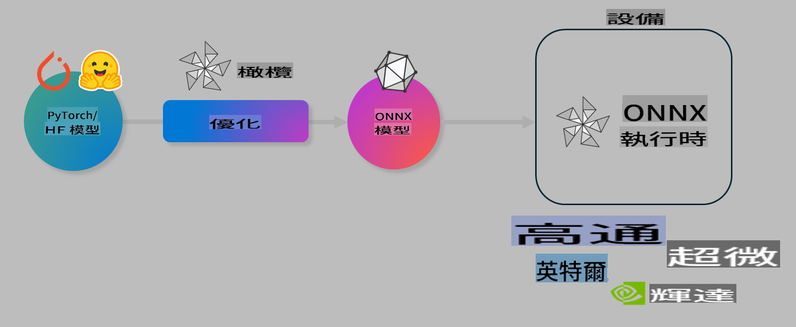

# 實驗室：優化 AI 模型以實現設備端推理

## 簡介

> [!IMPORTANT]  
> 本實驗需要**Nvidia A10 或 A100 GPU**，並安裝相關驅動程式和 CUDA 工具包（版本 12+）。

> [!NOTE]  
> 這是一個**35 分鐘**的實驗，將帶您實際操作並了解如何使用 OLIVE 優化模型以進行設備端推理的核心概念。

## 學習目標

完成本實驗後，您將能夠使用 OLIVE 來：

- 使用 AWQ 量化方法對 AI 模型進行量化。  
- 為特定任務微調 AI 模型。  
- 生成適用於 ONNX Runtime 的 LoRA 適配器（微調模型），以實現高效的設備端推理。

### 什麼是 Olive

Olive (*O*NNX *live*) 是一個模型優化工具包，配有 CLI，可讓您為 ONNX Runtime +++https://onnxruntime.ai+++ 部署高質量和高效能的模型。



Olive 的輸入通常是一個 PyTorch 或 Hugging Face 模型，輸出是一個優化過的 ONNX 模型，可在執行 ONNX Runtime 的設備（部署目標）上運行。Olive 將針對硬體供應商（如 Qualcomm、AMD、Nvidia 或 Intel）提供的 AI 加速器（NPU、GPU、CPU）來優化模型。

Olive 執行的是一個*工作流程*，這是一系列有序的模型優化任務，稱為*通道（passes）*。示例包括模型壓縮、圖捕獲、量化、圖優化等。每個通道都有一組可調參數，以達到最佳的指標，例如準確性和延遲，這些指標由相應的評估器進行評估。Olive 使用搜索策略和搜索演算法來自動調整每個通道或一組通道。

#### Olive 的優勢

- **減少挫折和時間**：避免通過手動試錯不同圖優化、壓縮和量化技術的繁瑣過程。只需定義您的質量和效能約束，Olive 將自動為您找到最佳模型。
- **超過 40 種內建模型優化組件**：涵蓋量化、壓縮、圖優化和微調的前沿技術。
- **簡單易用的 CLI**：適用於常見的模型優化任務。例如，olive quantize、olive auto-opt、olive finetune。
- 支援模型打包和部署。  
- 支援生成適用於**多 LoRA 服務**的模型。  
- 使用 YAML/JSON 構建工作流程以編排模型優化和部署任務。  
- **Hugging Face** 和 **Azure AI** 整合。  
- 內建**快取機制**，可**節省成本**。

## 實驗指導

> [!NOTE]  
> 請確保您已根據實驗 1 設置 Azure AI Hub 和專案，並配置 A100 計算資源。

### 第 0 步：連接到 Azure AI 計算資源

您將使用 **VS Code** 的遠端功能連接到 Azure AI 計算資源。

1. 打開您的 **VS Code** 桌面應用程式：  
2. 使用 **Shift+Ctrl+P** 打開**命令面板**。  
3. 在命令面板中搜索 **AzureML - remote: Connect to compute instance in New Window**。  
4. 按照螢幕上的指示連接到計算資源，這包括選擇您的 Azure 訂閱、資源組、專案和在實驗 1 中設置的計算名稱。  
5. 成功連接到 Azure ML 計算節點後，您將在 **VS Code 左下角**看到顯示 `><Azure ML: Compute Name`。

### 第 1 步：克隆此存儲庫

在 VS Code 中，您可以使用 **Ctrl+J** 打開新終端，然後克隆此存儲庫：

在終端中，您應該看到提示：

```
azureuser@computername:~/cloudfiles/code$ 
```  
克隆解決方案：

```bash
cd ~/localfiles
git clone https://github.com/microsoft/phi-3cookbook.git
```

### 第 2 步：在 VS Code 中打開資料夾

要在相關資料夾中打開 VS Code，請在終端中執行以下命令，這將打開一個新視窗：

```bash
code phi-3cookbook/code/04.Finetuning/Olive-lab
```  

或者，您也可以通過選擇 **File** > **Open Folder** 手動打開資料夾。

### 第 3 步：安裝依賴項

在 Azure AI 計算節點的 VS Code 中打開一個終端視窗（提示：**Ctrl+J**），然後執行以下命令以安裝依賴項：

```bash
conda create -n olive-ai python=3.11 -y
conda activate olive-ai
pip install -r requirements.txt
az extension remove -n azure-cli-ml
az extension add -n ml
```  

> [!NOTE]  
> 安裝所有依賴項大約需要 5 分鐘。

在本實驗中，您將下載並上傳模型到 Azure AI 模型目錄。為了訪問模型目錄，您需要使用以下命令登錄 Azure：

```bash
az login
```  

> [!NOTE]  
> 登錄時系統會要求您選擇訂閱，請確保選擇本實驗提供的訂閱。

### 第 4 步：執行 Olive 命令

在 Azure AI 計算節點的 VS Code 中打開終端視窗（提示：**Ctrl+J**），並確保已激活 `olive-ai` conda 環境：

```bash
conda activate olive-ai
```  

接下來，在命令列中執行以下 Olive 命令：

1. **檢查資料：** 在此示例中，您將微調 Phi-3.5-Mini 模型，使其專注於回答與旅遊相關的問題。以下代碼顯示數據集的前幾條記錄，數據格式為 JSON lines：

    ```bash
    head data/data_sample_travel.jsonl
    ```  

2. **量化模型：** 在訓練模型之前，首先使用 Active Aware Quantization (AWQ) +++https://arxiv.org/abs/2306.00978+++ 技術進行量化。AWQ 通過考慮推理過程中產生的激活值來量化模型的權重。這種方法相比傳統權重量化方法更能保持模型準確性。

    ```bash
    olive quantize \
       --model_name_or_path microsoft/Phi-3.5-mini-instruct \
       --trust_remote_code \
       --algorithm awq \
       --output_path models/phi/awq \
       --log_level 1
    ```  

    該過程大約需要 **8 分鐘**，可將模型大小從 **~7.5GB 減少到 ~2.5GB**。

    在本實驗中，我們演示如何從 Hugging Face 輸入模型（例如：`microsoft/Phi-3.5-mini-instruct`). However, Olive also allows you to input models from the Azure AI catalog by updating the `model_name_or_path` argument to an Azure AI asset ID (for example:  `azureml://registries/azureml/models/Phi-3.5-mini-instruct/versions/4`). 

1. **Train the model:** Next, the `olive finetune` 命令微調量化後的模型。先量化模型再進行微調比事後量化能達到更好的準確性，因為微調過程能恢復一些因量化導致的損失。

    ```bash
    olive finetune \
        --method lora \
        --model_name_or_path models/phi/awq \
        --data_files "data/data_sample_travel.jsonl" \
        --data_name "json" \
        --text_template "<|user|>\n{prompt}<|end|>\n<|assistant|>\n{response}<|end|>" \
        --max_steps 100 \
        --output_path ./models/phi/ft \
        --log_level 1
    ```  

    微調過程（100 步）大約需要 **6 分鐘**。

3. **優化：** 訓練完成後，使用 Olive 的 `auto-opt` command, which will capture the ONNX graph and automatically perform a number of optimizations to improve the model performance for CPU by compressing the model and doing fusions. It should be noted, that you can also optimize for other devices such as NPU or GPU by just updating the `--device` and `--provider` 參數優化模型——但在本實驗中，我們將使用 CPU。

    ```bash
    olive auto-opt \
       --model_name_or_path models/phi/ft/model \
       --adapter_path models/phi/ft/adapter \
       --device cpu \
       --provider CPUExecutionProvider \
       --use_ort_genai \
       --output_path models/phi/onnx-ao \
       --log_level 1
    ```  

    優化過程大約需要 **5 分鐘**。

### 第 5 步：快速測試模型推理

為了測試模型推理，在您的資料夾中創建一個名為 **app.py** 的 Python 文件，並將以下代碼複製粘貼進去：

```python
import onnxruntime_genai as og
import numpy as np

print("loading model and adapters...", end="", flush=True)
model = og.Model("models/phi/onnx-ao/model")
adapters = og.Adapters(model)
adapters.load("models/phi/onnx-ao/model/adapter_weights.onnx_adapter", "travel")
print("DONE!")

tokenizer = og.Tokenizer(model)
tokenizer_stream = tokenizer.create_stream()

params = og.GeneratorParams(model)
params.set_search_options(max_length=100, past_present_share_buffer=False)
user_input = "what is the best thing to see in chicago"
params.input_ids = tokenizer.encode(f"<|user|>\n{user_input}<|end|>\n<|assistant|>\n")

generator = og.Generator(model, params)

generator.set_active_adapter(adapters, "travel")

print(f"{user_input}")

while not generator.is_done():
    generator.compute_logits()
    generator.generate_next_token()

    new_token = generator.get_next_tokens()[0]
    print(tokenizer_stream.decode(new_token), end='', flush=True)

print("\n")
```  

使用以下命令執行代碼：

```bash
python app.py
```  

### 第 6 步：將模型上傳到 Azure AI

將模型上傳到 Azure AI 模型存儲庫可以讓開發團隊的其他成員共享模型，並處理模型的版本控制。要上傳模型，執行以下命令：

> [!NOTE]  
> 更新 `{}` 中的 `resourceGroup` 和 Azure AI 專案名稱，然後運行以下命令：

```
az ml workspace show
```  

或者，您可以訪問 +++ai.azure.com+++，選擇 **管理中心** > **專案** > **概覽**。

更新 `{}` 佔位符為您的資源組名稱和 Azure AI 專案名稱。

```bash
az ml model create \
    --name ft-for-travel \
    --version 1 \
    --path ./models/phi/onnx-ao \
    --resource-group {RESOURCE_GROUP_NAME} \
    --workspace-name {PROJECT_NAME}
```  

然後，您可以在 https://ml.azure.com/model/list 查看您上傳的模型並進行部署。

**免責聲明**：  
本文件使用機器翻譯服務進行翻譯。雖然我們努力確保翻譯的準確性，但請注意，自動翻譯可能包含錯誤或不精確之處。應以原始語言的文件作為權威來源。對於關鍵信息，建議使用專業人工翻譯。我們對因使用此翻譯而引起的任何誤解或錯誤解釋概不負責。