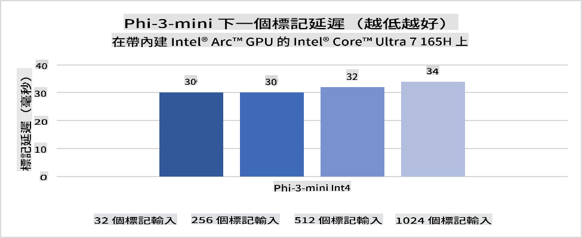
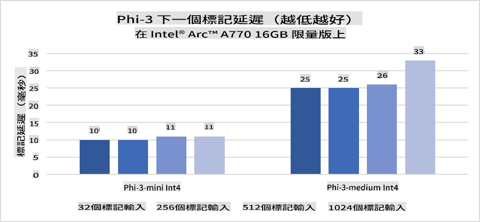
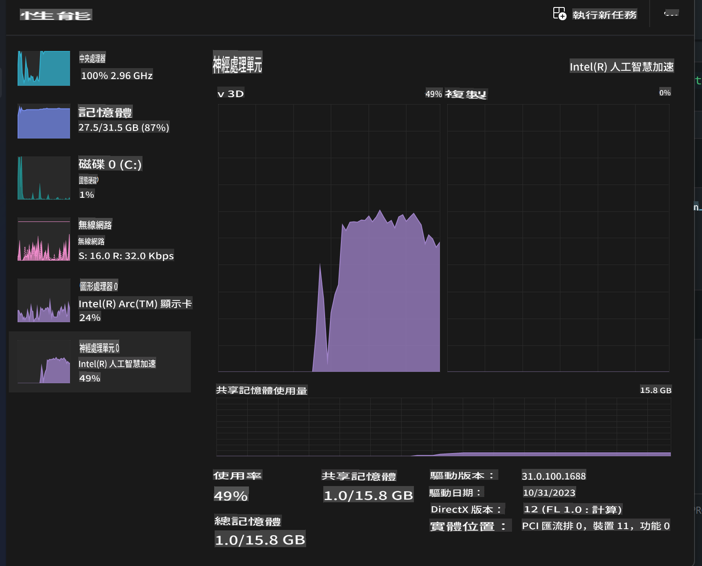
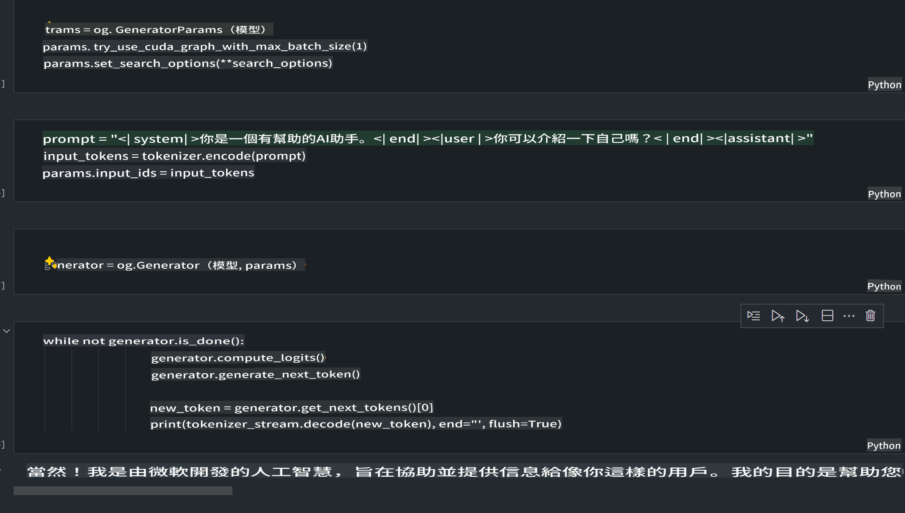
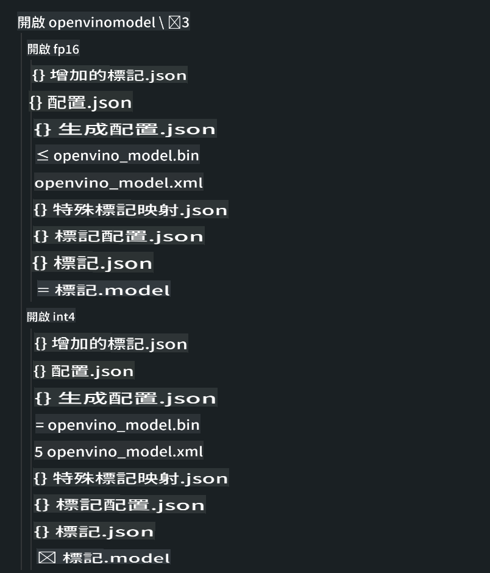

# **AI PC中的Phi-3推理**

隨著生成式AI的進步和邊緣設備硬體能力的提升，越來越多的生成式AI模型現在可以整合到用戶的自帶設備（BYOD）中。AI PC就是其中之一。從2024年開始，Intel、AMD和Qualcomm與PC製造商合作，通過硬體改造推出能夠部署本地生成式AI模型的AI PC。在這次討論中，我們將重點關注Intel AI PC，並探討如何在Intel AI PC上部署Phi-3。

### **什麼是NPU**

NPU（Neural Processing Unit）是一種專門設計用於加速神經網絡操作和AI任務的處理器或處理單元，通常集成在更大的SoC中。與通用的CPU和GPU不同，NPU針對數據驅動的並行計算進行了優化，使其在處理大量多媒體數據（如視頻和圖像）以及神經網絡數據處理方面非常高效。它們特別擅長處理AI相關的任務，例如語音識別、視頻通話中的背景模糊以及照片或視頻編輯中的物體檢測等。

## **NPU vs GPU**
雖然許多AI和機器學習工作負載在GPU上運行，但GPU和NPU之間存在重要區別。GPU以其並行計算能力而聞名，但並非所有GPU在圖形處理之外都同樣高效。另一方面，NPU專為神經網絡操作中的複雜計算而設計，使其在AI任務中非常高效。

總而言之，NPU是加速AI計算的數學高手，在AI PC新時代中扮演著關鍵角色！

***此示例基於Intel最新的Intel Core Ultra處理器***

## **1. 使用NPU運行Phi-3模型**

Intel® NPU設備是與Intel客戶端CPU集成的AI推理加速器，從Intel® Core™ Ultra一代CPU（以前稱為Meteor Lake）開始。它使人工神經網絡任務的能效執行成為可能。





**Intel NPU加速庫**

Intel NPU加速庫 [https://github.com/intel/intel-npu-acceleration-library](https://github.com/intel/intel-npu-acceleration-library) 是一個Python庫，旨在利用Intel神經處理單元（NPU）的強大計算能力來提升應用程序的效率。

使用Intel® Core™ Ultra處理器驅動的AI PC上的Phi-3-mini示例。


使用pip安裝Python庫

```bash

   pip install intel-npu-acceleration-library

```

***Note*** 該項目仍在開發中，但參考模型已經非常完整。

### **使用Intel NPU加速庫運行Phi-3**

使用Intel NPU加速，這個庫不會影響傳統的編碼過程。你只需要使用這個庫來量化原始Phi-3模型，例如FP16，INT8，INT4，等等。

```python

from transformers import AutoTokenizer, pipeline,TextStreamer
import intel_npu_acceleration_library as npu_lib
import warnings

model_id = "microsoft/Phi-3-mini-4k-instruct"

model = npu_lib.NPUModelForCausalLM.from_pretrained(
                                    model_id,
                                    torch_dtype="auto",
                                    dtype=npu_lib.int4,
                                    trust_remote_code=True
                                )

tokenizer = AutoTokenizer.from_pretrained(model_id)

text_streamer = TextStreamer(tokenizer, skip_prompt=True)

```
量化成功後，繼續執行以調用NPU運行Phi-3模型。

```python

generation_args = {
            "max_new_tokens": 1024,
            "return_full_text": False,
            "temperature": 0.3,
            "do_sample": False,
            "streamer": text_streamer,
        }

pipe = pipeline(
            "text-generation",
            model=model,
            tokenizer=tokenizer,
)

query = "<|system|>You are a helpful AI assistant.<|end|><|user|>Can you introduce yourself?<|end|><|assistant|>"

with warnings.catch_warnings():
    warnings.simplefilter("ignore")
    pipe(query, **generation_args)


```

執行代碼時，我們可以通過任務管理器查看NPU的運行狀態。



***Samples*** : [AIPC_NPU_DEMO.ipynb](../../../../code/03.Inference/AIPC/AIPC_NPU_DEMO.ipynb)

## **2. 使用DirectML + ONNX Runtime運行Phi-3模型**

### **什麼是DirectML**

[DirectML](https://github.com/microsoft/DirectML) 是一個高性能、硬件加速的DirectX 12庫，用於機器學習。DirectML為廣泛支持的硬件和驅動程序（包括來自AMD、Intel、NVIDIA和Qualcomm的所有DirectX 12兼容GPU）提供機器學習任務的GPU加速。

當單獨使用時，DirectML API是一個低級DirectX 12庫，適合高性能、低延遲的應用程序，如框架、遊戲和其他實時應用程序。DirectML與Direct3D 12的無縫互操作性以及其低開銷和硬件一致性使DirectML在需要高性能和結果可靠性與可預測性時成為加速機器學習的理想選擇。

***Note*** : 最新的DirectML已經支持NPU(https://devblogs.microsoft.com/directx/introducing-neural-processor-unit-npu-support-in-directml-developer-preview/)

### DirectML和CUDA在能力和性能方面的比較：

**DirectML** 是由Microsoft開發的機器學習庫，旨在加速Windows設備（包括桌面、筆記本電腦和邊緣設備）上的機器學習工作負載。
- DX12基礎：DirectML構建在DirectX 12（DX12）之上，提供了廣泛的硬件支持，包括NVIDIA和AMD的GPU。
- 更廣泛的支持：由於利用DX12，DirectML可以與任何支持DX12的GPU一起工作，甚至是集成GPU。
- 圖像處理：DirectML使用神經網絡處理圖像和其他數據，適合圖像識別、物體檢測等任務。
- 易於設置：設置DirectML非常簡單，不需要GPU製造商的特定SDK或庫。
- 性能：在某些情況下，DirectML性能良好，甚至可能比CUDA更快，特別是對於某些工作負載。
- 限制：然而，在處理float16大批量時，DirectML可能會較慢。

**CUDA** 是NVIDIA的並行計算平台和編程模型。它允許開發者利用NVIDIA GPU的強大性能進行通用計算，包括機器學習和科學模擬。
- NVIDIA專用：CUDA與NVIDIA GPU緊密集成，專為它們設計。
- 高度優化：它為GPU加速任務提供了出色的性能，特別是在使用NVIDIA GPU時。
- 廣泛使用：許多機器學習框架和庫（如TensorFlow和PyTorch）都支持CUDA。
- 自定義：開發者可以為特定任務微調CUDA設置，從而達到最佳性能。
- 限制：然而，CUDA對NVIDIA硬件的依賴可能會限制其在不同GPU上的兼容性。

### 選擇DirectML還是CUDA：
選擇DirectML還是CUDA取決於你的具體用例、硬件可用性和偏好。如果你需要更廣泛的兼容性和易於設置，DirectML可能是一個不錯的選擇。然而，如果你擁有NVIDIA GPU並需要高度優化的性能，CUDA仍然是一個強有力的競爭者。總而言之，DirectML和CUDA各有優勢和劣勢，因此在做出決定時應考慮你的需求和可用硬件。

### **使用ONNX Runtime進行生成式AI**

在AI時代，AI模型的可移植性非常重要。ONNX Runtime可以輕鬆地將訓練好的模型部署到不同的設備上。開發者不需要關注推理框架，使用統一的API即可完成模型推理。在生成式AI時代，ONNX Runtime也進行了代碼優化（https://onnxruntime.ai/docs/genai/）。通過優化的ONNX Runtime，可以在不同終端上推理量化的生成式AI模型。在使用ONNX Runtime進行生成式AI時，可以通過Python、C#、C/C++進行AI模型推理。當然，在iPhone上部署可以利用C++的ONNX Runtime API進行生成式AI。

[示例代碼](https://github.com/Azure-Samples/Phi-3MiniSamples/tree/main/onnx)

***編譯生成式AI與ONNX Runtime庫***

```bash

winget install --id=Kitware.CMake  -e

git clone https://github.com/microsoft/onnxruntime.git

cd .\onnxruntime\

./build.bat --build_shared_lib --skip_tests --parallel --use_dml --config Release

cd ../

git clone https://github.com/microsoft/onnxruntime-genai.git

cd .\onnxruntime-genai\

mkdir ort

cd ort

mkdir include

mkdir lib

copy ..\onnxruntime\include\onnxruntime\core\providers\dml\dml_provider_factory.h ort\include

copy ..\onnxruntime\include\onnxruntime\core\session\onnxruntime_c_api.h ort\include

copy ..\onnxruntime\build\Windows\Release\Release\*.dll ort\lib

copy ..\onnxruntime\build\Windows\Release\Release\onnxruntime.lib ort\lib

python build.py --use_dml

```

**安裝庫**

```bash

pip install .\onnxruntime_genai_directml-0.3.0.dev0-cp310-cp310-win_amd64.whl

```

這是運行結果



***Samples*** : [AIPC_DirectML_DEMO.ipynb](../../../../code/03.Inference/AIPC/AIPC_DirectML_DEMO.ipynb)

## **3. 使用Intel OpenVino運行Phi-3模型**

### **什麼是OpenVINO**

[OpenVINO](https://github.com/openvinotoolkit/openvino) 是一個開源工具包，用於優化和部署深度學習模型。它為來自TensorFlow、PyTorch等流行框架的視覺、音頻和語言模型提供了增強的深度學習性能。開始使用OpenVINO。OpenVINO還可以與CPU和GPU結合使用來運行Phi-3模型。

***Note***: 目前，OpenVINO尚不支持NPU。

### **安裝OpenVINO庫**

```bash

 pip install git+https://github.com/huggingface/optimum-intel.git

 pip install git+https://github.com/openvinotoolkit/nncf.git

 pip install openvino-nightly

```

### **使用OpenVINO運行Phi-3**

與NPU類似，OpenVINO通過運行量化模型來完成生成式AI模型的調用。我們需要首先量化Phi-3模型，並通過optimum-cli在命令行上完成模型量化。

**INT4**

```bash

optimum-cli export openvino --model "microsoft/Phi-3-mini-4k-instruct" --task text-generation-with-past --weight-format int4 --group-size 128 --ratio 0.6  --sym  --trust-remote-code ./openvinomodel/phi3/int4

```

**FP16**

```bash

optimum-cli export openvino --model "microsoft/Phi-3-mini-4k-instruct" --task text-generation-with-past --weight-format fp16 --trust-remote-code ./openvinomodel/phi3/fp16

```

轉換後的格式，如下所示



通過OVModelForCausalLM加載模型路徑(model_dir)、相關配置(ov_config = {"PERFORMANCE_HINT": "LATENCY", "NUM_STREAMS": "1", "CACHE_DIR": ""})和硬件加速設備(GPU.0)

```python

ov_model = OVModelForCausalLM.from_pretrained(
     model_dir,
     device='GPU.0',
     ov_config=ov_config,
     config=AutoConfig.from_pretrained(model_dir, trust_remote_code=True),
     trust_remote_code=True,
)

```

執行代碼時，我們可以通過任務管理器查看GPU的運行狀態。


***Samples*** : [AIPC_OpenVino_Demo.ipynb](../../../../code/03.Inference/AIPC/AIPC_OpenVino_Demo.ipynb)

### ***Note*** : 上述三種方法各有優勢，但建議在AI PC推理中使用NPU加速。

免責聲明：此翻譯由人工智慧模型從原文翻譯而來，可能不完美。請檢查輸出並進行任何必要的修改。