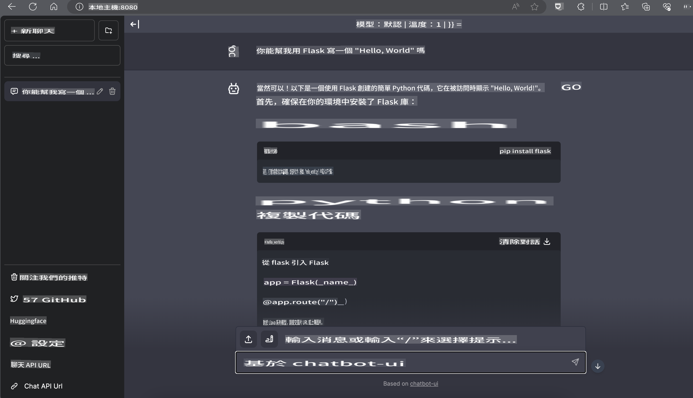

# **在 Nvidia Jetson 上推理 Phi-3**

Nvidia Jetson 是 Nvidia 推出的嵌入式计算板系列。Jetson TK1、TX1 和 TX2 型号都搭载了 Nvidia 的 Tegra 处理器（或 SoC），集成了基于 ARM 架构的中央处理单元（CPU）。Jetson 是一个低功耗系统，专为加速机器学习应用而设计。Nvidia Jetson 被专业开发人员用于创建各行各业的突破性 AI 产品，也被学生和爱好者用于实践 AI 学习和制作令人惊叹的项目。SLM 被部署在诸如 Jetson 这样的边缘设备上，这将有助于更好地实现工业生成式 AI 应用场景。

## 在 NVIDIA Jetson 上部署：
从事自主机器人和嵌入式设备开发的开发人员可以利用 Phi-3 Mini。Phi-3 的相对小尺寸使其非常适合边缘部署。参数在训练过程中经过精心调校，确保响应的高准确性。

### TensorRT-LLM 优化：
NVIDIA 的 [TensorRT-LLM 库](https://github.com/NVIDIA/TensorRT-LLM?WT.mc_id=aiml-138114-kinfeylo) 优化了大语言模型推理。它支持 Phi-3 Mini 的长上下文窗口，增强了吞吐量和延迟。优化包括 LongRoPE、FP8 和 inflight batching 等技术。

### 可用性和部署：
开发人员可以在 [NVIDIA 的 AI](https://www.nvidia.com/en-us/ai-data-science/generative-ai/) 上探索具有 128K 上下文窗口的 Phi-3 Mini。它被打包为一个 NVIDIA NIM，一个具有标准 API 的微服务，可以在任何地方部署。另外，还有 [GitHub 上的 TensorRT-LLM 实现](https://github.com/NVIDIA/TensorRT-LLM)。

 ## **1. 准备工作**

a. Jetson Orin NX / Jetson NX

b. JetPack 5.1.2+
   
c. Cuda 11.8
   
d. Python 3.8+

 ## **2. 在 Jetson 上运行 Phi-3**

 我们可以选择 [Ollama](https://ollama.com) 或 [LlamaEdge](https://llamaedge.com)

 如果你想在云端和边缘设备上同时使用 gguf，LlamaEdge 可以理解为 WasmEdge（WasmEdge 是一个轻量级、高性能、可扩展的 WebAssembly 运行时，适用于云原生、边缘和去中心化应用。它支持无服务器应用、嵌入式函数、微服务、智能合约和物联网设备。你可以通过 LlamaEdge 将 gguf 的量化模型部署到边缘设备和云端。


以下是使用步骤

1. 安装并下载相关库和文件

```bash

curl -sSf https://raw.githubusercontent.com/WasmEdge/WasmEdge/master/utils/install.sh | bash -s -- --plugin wasi_nn-ggml

curl -LO https://github.com/LlamaEdge/LlamaEdge/releases/latest/download/llama-api-server.wasm

curl -LO https://github.com/LlamaEdge/chatbot-ui/releases/latest/download/chatbot-ui.tar.gz

tar xzf chatbot-ui.tar.gz

```

**注意**: llama-api-server.wasm 和 chatbot-ui 需要在同一个目录下

2. 在终端中运行脚本

```bash

wasmedge --dir .:. --nn-preload default:GGML:AUTO:{Your gguf path} llama-api-server.wasm -p phi-3-chat

```

以下是运行结果



***示例代码*** [Phi-3 mini WASM Notebook 示例](https://github.com/Azure-Samples/Phi-3MiniSamples/tree/main/wasm)

总之，Phi-3 Mini 在语言建模方面代表了一次飞跃，结合了效率、上下文感知和 NVIDIA 的优化能力。无论你是在构建机器人还是边缘应用，Phi-3 Mini 都是一个值得关注的强大工具。

**免責聲明**: 
本文件使用機器翻譯服務進行翻譯。儘管我們努力保證準確性，但請注意，自動翻譯可能包含錯誤或不準確之處。應以原語言的文件為權威來源。對於關鍵信息，建議尋求專業人工翻譯。我們對使用此翻譯引起的任何誤解或誤讀不承擔責任。