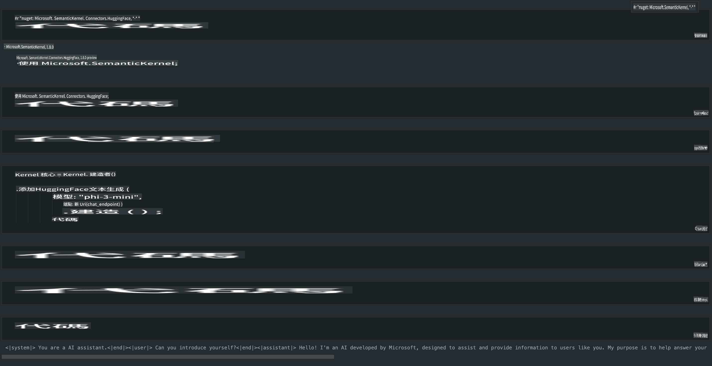

# **在本地服务器上推理 Phi-3**

我們可以在本地伺服器上部署 Phi-3。用戶可以選擇 [Ollama](https://ollama.com) 或 [LM Studio](https://llamaedge.com) 的解決方案，或者他們也可以編寫自己的代碼。你可以通過 [Semantic Kernel](https://github.com/microsoft/semantic-kernel?WT.mc_id=aiml-138114-kinfeylo) 或 [Langchain](https://www.langchain.com/) 連接 Phi-3 的本地服務來構建 Copilot 應用程序。

## **使用 Semantic Kernel 訪問 Phi-3-mini**

在 Copilot 應用程序中，我們通過 Semantic Kernel / LangChain 創建應用程序。這類應用程序框架通常與 Azure OpenAI Service / OpenAI 模型兼容，並且還可以支持 Hugging Face 上的開源模型和本地模型。如果我們想使用 Semantic Kernel 訪問 Phi-3-mini 該怎麼辦？以 .NET 為例，我們可以將其與 Semantic Kernel 中的 Hugging Face Connector 結合使用。默認情況下，它可以對應 Hugging Face 上的模型 id（第一次使用時，模型會從 Hugging Face 下載，這需要很長時間）。你也可以連接到自建的本地服務。相比之下，我們推薦使用後者，因為它具有更高的自主性，尤其是在企業應用中。

從圖中可以看到，通過 Semantic Kernel 訪問本地服務可以輕鬆連接到自建的 Phi-3-mini 模型服務器。這是運行結果。

***示例代碼*** https://github.com/kinfey/Phi3MiniSamples/tree/main/semantickernel

**免責聲明**:
本文件已使用機器翻譯服務進行翻譯。儘管我們努力確保準確性，但請注意，自動翻譯可能包含錯誤或不準確之處。應以原文文件為權威來源。對於關鍵信息，建議尋求專業人工翻譯。我們對因使用本翻譯而引起的任何誤解或誤釋不承擔責任。