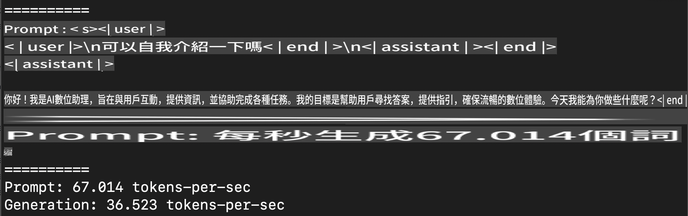
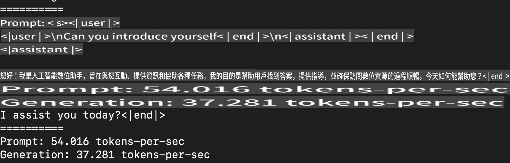
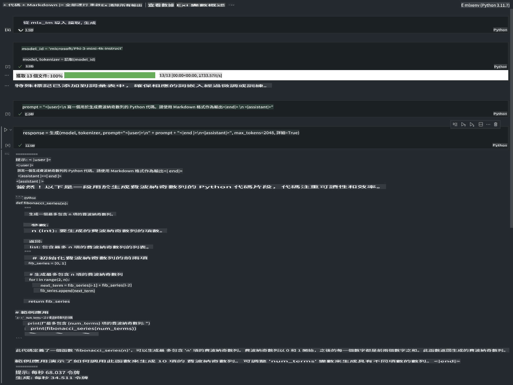

# **使用 Apple MLX 框架进行 Phi-3 推理**

## **什么是 MLX 框架**

MLX 是一个为 Apple Silicon 上的机器学习研究设计的数组框架，由 Apple 机器学习研究团队推出。

MLX 是由机器学习研究人员为机器学习研究人员设计的。该框架旨在易于使用，同时在训练和部署模型时仍然高效。框架本身的设计在概念上也很简单。我们希望研究人员能够轻松扩展和改进 MLX，以便快速探索新想法。

通过 MLX，LLMs 可以在 Apple Silicon 设备上加速运行，模型可以非常方便地在本地运行。

## **使用 MLX 进行 Phi-3-mini 推理**

### **1. 设置你的 MLX 环境**

1. Python 3.11.x
2. 安装 MLX 库

```bash

pip install mlx-lm

```

### **2. 在终端中使用 MLX 运行 Phi-3-mini**

```bash

python -m mlx_lm.generate --model microsoft/Phi-3-mini-4k-instruct --max-token 2048 --prompt  "<|user|>\nCan you introduce yourself<|end|>\n<|assistant|>"

```

结果（我的环境是 Apple M1 Max, 64GB）如下



### **3. 在终端中使用 MLX 量化 Phi-3-mini**

```bash

python -m mlx_lm.convert --hf-path microsoft/Phi-3-mini-4k-instruct

```

***Note：*** 通过 mlx_lm.convert 可以对模型进行量化，默认量化为 INT4。本示例将 Phi-3-mini 量化为 INT4。

通过 mlx_lm.convert 可以对模型进行量化，默认量化为 INT4。本示例将 Phi-3-mini 量化为 INT4。量化后，将存储在默认目录 ./mlx_model

我们可以在终端中测试使用 MLX 量化的模型

```bash

python -m mlx_lm.generate --model ./mlx_model/ --max-token 2048 --prompt  "<|user|>\nCan you introduce yourself<|end|>\n<|assistant|>"

```

结果如下



### **4. 在 Jupyter Notebook 中使用 MLX 运行 Phi-3-mini**



***Note:*** 请阅读此示例 [点击此链接](../../../../code/03.Inference/MLX/MLX_DEMO.ipynb)

## **资源**

1. 了解 Apple MLX 框架 [https://ml-explore.github.io](https://ml-explore.github.io/mlx/build/html/index.html)

2. Apple MLX GitHub 仓库 [https://github.com/ml-explore](https://github.com/ml-explore)

**免責聲明**：
此文件是使用機器翻譯服務翻譯的。我們努力保證準確性，但請注意，自動翻譯可能包含錯誤或不準確之處。應將原始語言的文件視為權威來源。對於關鍵信息，建議使用專業人工翻譯。我們對使用此翻譯引起的任何誤解或誤讀不承擔責任。