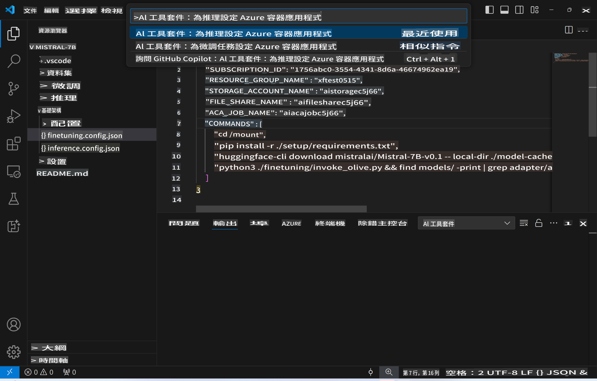
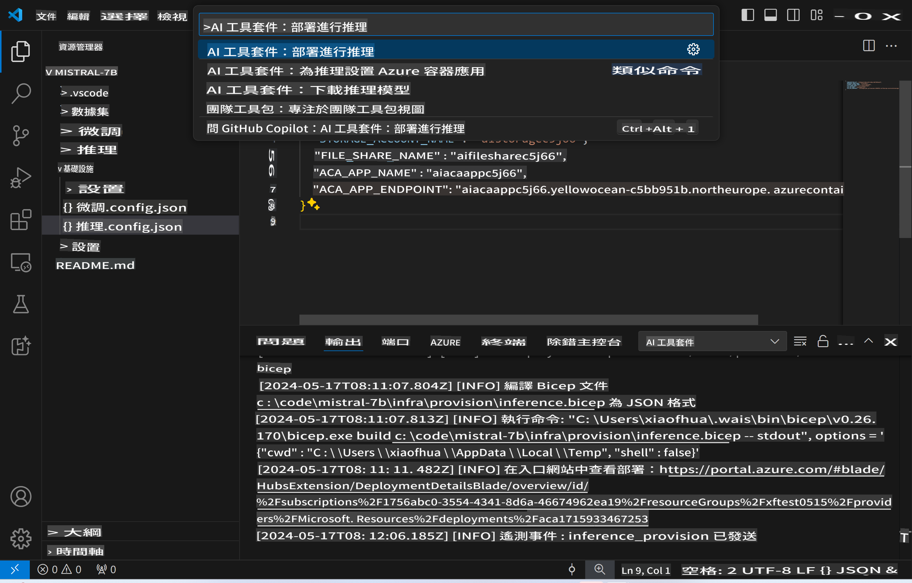

# 遠端推理與微調模型

在遠端環境中訓練好適配器後，可以使用簡單的 Gradio 應用程式與模型互動。


### 設置 Azure 資源
你需要透過執行命令面板中的 `AI Toolkit: Provision Azure Container Apps for inference` 來設置 Azure 資源以進行遠端推理。在此過程中，系統會要求你選擇 Azure 訂閱和資源群組。  

   
預設情況下，推理所用的訂閱和資源群組應該與微調所用的相同。推理將使用相同的 Azure 容器應用環境，並訪問儲存在 Azure Files 中的模型和模型適配器，這些都是在微調步驟中生成的。

## 使用 AI Toolkit 

### 部署推理
如果你希望修改推理代碼或重新載入推理模型，請執行 `AI Toolkit: Deploy for inference` 命令。這將同步你最新的代碼到 ACA 並重啟副本。



部署成功完成後，模型現在可以使用這個端點進行評估。

### 訪問推理 API

你可以點擊 VSCode 通知中顯示的 "*Go to Inference Endpoint*" 按鈕來訪問推理 API。或者，你可以在 `./infra/inference.config.json` 中找到 `ACA_APP_ENDPOINT`，以及在輸出面板中找到網頁 API 端點。


> **Note:** 推理端點可能需要幾分鐘才能完全運行。

## 模板中包含的推理組件

| 資料夾 | 內容 |
| ------ |--------- |
| `infra` | 包含所有遠端操作所需的配置。 |
| `infra/provision/inference.parameters.json` | 包含 bicep 模板的參數，用於設置 Azure 資源進行推理。 |
| `infra/provision/inference.bicep` | 包含設置 Azure 資源進行推理的模板。 |
| `infra/inference.config.json` | 由 `AI Toolkit: Provision Azure Container Apps for inference` 命令生成的配置文件。它用作其他遠端命令面板的輸入。 |

### 使用 AI Toolkit 配置 Azure 資源設置
配置 [AI Toolkit](https://marketplace.visualstudio.com/items?itemName=ms-windows-ai-studio.windows-ai-studio)

Provision Azure Container Apps for inference` 命令。

你可以在 `./infra/provision/inference.parameters.json` 文件中找到配置參數。以下是詳細資訊：
| 參數 | 描述 |
| --------- |------------ |
| `defaultCommands` | 這是啟動網頁 API 的命令。 |
| `maximumInstanceCount` | 此參數設置 GPU 實例的最大容量。 |
| `location` | 這是設置 Azure 資源的位置。預設值與所選資源群組的位置相同。 |
| `storageAccountName`, `fileShareName` `acaEnvironmentName`, `acaEnvironmentStorageName`, `acaAppName`,  `acaLogAnalyticsName` | 這些參數用於命名設置的 Azure 資源。預設情況下，它們將與微調資源名稱相同。你可以輸入一個新的、未使用的資源名稱來創建自定義名稱的資源，或者如果你想使用已存在的 Azure 資源，也可以輸入該名稱。詳細資訊請參閱 [使用現有 Azure 資源](../../../../md/03.Inference) 部分。 |

### 使用現有的 Azure 資源

預設情況下，推理設置使用與微調相同的 Azure 容器應用環境、儲存帳戶、Azure 文件共享和 Azure 日誌分析。會為推理 API 創建一個單獨的 Azure 容器應用。

如果你在微調步驟中自定義了 Azure 資源，或者希望使用你自己的現有 Azure 資源進行推理，請在 `./infra/inference.parameters.json` 文件中指定它們的名稱。然後，從命令面板運行 `AI Toolkit: Provision Azure Container Apps for inference` 命令。這將更新任何指定的資源並創建任何缺失的資源。

例如，如果你有一個現有的 Azure 容器環境，你的 `./infra/finetuning.parameters.json` 應如下所示：

```json
{
    "$schema": "https://schema.management.azure.com/schemas/2019-04-01/deploymentParameters.json#",
    "contentVersion": "1.0.0.0",
    "parameters": {
      ...
      "acaEnvironmentName": {
        "value": "<your-aca-env-name>"
      },
      "acaEnvironmentStorageName": {
        "value": null
      },
      ...
    }
  }
```

### 手動設置
如果你偏好手動配置 Azure 資源，可以使用 `./infra/provision` 資料夾中提供的 bicep 文件。如果你已經設置並配置了所有 Azure 資源而不使用 AI Toolkit 命令面板，只需在 `inference.config.json` 文件中輸入資源名稱即可。

例如：

```json
{
  "SUBSCRIPTION_ID": "<your-subscription-id>",
  "RESOURCE_GROUP_NAME": "<your-resource-group-name>",
  "STORAGE_ACCOUNT_NAME": "<your-storage-account-name>",
  "FILE_SHARE_NAME": "<your-file-share-name>",
  "ACA_APP_NAME": "<your-aca-name>",
  "ACA_APP_ENDPOINT": "<your-aca-endpoint>"
}
```

免責聲明：本翻譯由AI模型從原文翻譯而來，可能不完全準確。請檢查輸出並進行必要的修正。