# 使用 Azure AI Studio 微調 Phi-3

讓我們來探索如何使用 Azure AI Studio 微調 Microsoft 的 Phi-3 Mini 語言模型。微調可以讓你將 Phi-3 Mini 適應特定任務，使其更加強大和具備上下文感知能力。

## 考量因素

- **能力:** 哪些模型可以微調？基礎模型可以被微調成什麼樣子？
- **成本:** 微調的定價模式是什麼？
- **可定制性:** 我可以多大程度上修改基礎模型？有哪些方式？
- **便利性:** 微調實際上是怎麼進行的？我需要編寫自定義代碼嗎？我需要自備計算資源嗎？
- **安全性:** 微調模型已知有安全風險——是否有任何防護措施來防止意外傷害？


## 微調準備

### 先決條件

> [!NOTE]
> 對於 Phi-3 家族模型，按需付費模型微調服務僅在 **East US 2** 區域創建的集線器中可用。

- 一個 Azure 訂閱。如果你還沒有 Azure 訂閱，請創建一個 [付費 Azure 帳戶](https://azure.microsoft.com/pricing/purchase-options/pay-as-you-go) 開始使用。

- 一個 [AI Studio 項目](https://ai.azure.com?WT.mc_id=aiml-138114-kinfeylo)。
- Azure 基於角色的訪問控制 (Azure RBAC) 用於授予在 Azure AI Studio 中執行操作的訪問權限。要執行本文中的步驟，你的用戶帳戶必須被分配到資源組的 __Azure AI 開發者角色__。

### 訂閱提供者註冊

驗證訂閱是否已註冊到 `Microsoft.Network` 資源提供者。

1. 登錄 [Azure 入口網站](https://portal.azure.com)。
1. 從左側菜單中選擇 **訂閱**。
1. 選擇你要使用的訂閱。
1. 從左側菜單中選擇 **AI 項目設置** > **資源提供者**。
1. 確認 **Microsoft.Network** 在資源提供者列表中。否則，添加它。

### 數據準備

準備你的訓練和驗證數據來微調你的模型。你的訓練數據和驗證數據集包括你希望模型如何執行的輸入和輸出示例。

確保所有訓練示例都遵循推理的預期格式。為了有效地微調模型，確保數據集均衡且多樣化。

這包括保持數據平衡，涵蓋各種場景，並定期改進訓練數據以符合現實世界的期望，最終導致更準確和平衡的模型回應。

不同的模型類型需要不同格式的訓練數據。

### 聊天完成

你使用的訓練和驗證數據 **必須** 格式化為 JSON Lines (JSONL) 文檔。對於 `Phi-3-mini-128k-instruct`，微調數據集必須格式化為聊天完成 API 使用的對話格式。

### 示例文件格式

```json
    {"messages": [{"role": "system", "content": "你是一名 Xbox 客戶支持代理，主要目標是幫助用戶解決他們在使用 Xbox 設備時遇到的問題。你友好且簡潔。你只提供事實性的答案，不提供與 Xbox 無關的答案。"}, {"role": "user", "content": "Xbox 比 PlayStation 好嗎？"}, {"role": "assistant", "content": "抱歉，我不能提供個人意見。我的主要工作是幫助你解決與 Xbox 設備相關的任何問題。你有任何與 Xbox 相關的問題需要解決嗎？"}]}
    {"messages": [{"role": "system", "content": "你是一名 Xbox 客戶支持代理，主要目標是幫助用戶解決他們在使用 Xbox 設備時遇到的問題。你友好且簡潔。你只提供事實性的答案，不提供與 Xbox 無關的答案。"}, {"role": "user", "content": "我可以在我的 Xbox 上玩 PC 遊戲嗎？"}, {"role": "assistant", "content": "雖然 Xbox 主機不原生支持 PC 遊戲，但它們可以玩許多 Xbox 遊戲，其中很多也可在 PC 上玩。我可以幫助你找到與你的 Xbox 設備兼容的遊戲嗎？"}]}
    {"messages": [{"role": "system", "content": "你是一名 Xbox 客戶支持代理，主要目標是幫助用戶解決他們在使用 Xbox 設備時遇到的問題。你友好且簡潔。你只提供事實性的答案，不提供與 Xbox 無關的答案。"}, {"role": "user", "content": "我的 Xbox 無法連接到 Wi-Fi。"}, {"role": "assistant", "content": "沒問題，我們來看看你的 Xbox 的網絡設置。當你嘗試連接到 Wi-Fi 時，發生了什麼情況？"}]}
```

支持的文件類型是 JSON Lines。文件上傳到默認數據存儲並在你的項目中可用。

## 使用 Azure AI Studio 微調 Phi-3

Azure AI Studio 允許你通過微調過程將大型語言模型定制到你的個人數據集。微調提供了顯著的價值，能夠針對特定任務和應用進行定制和優化。它可以提高性能、成本效益、減少延遲和定制輸出。

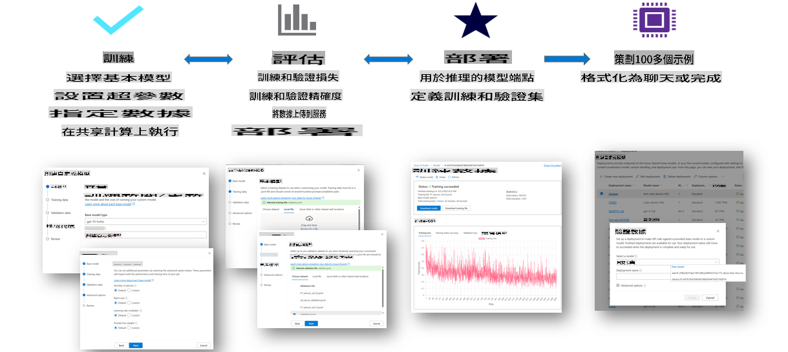

### 創建新項目

1. 登錄 [Azure AI Studio](https://ai.azure.com)。

1. 選擇 **+新項目** 在 Azure AI Studio 中創建新項目。

    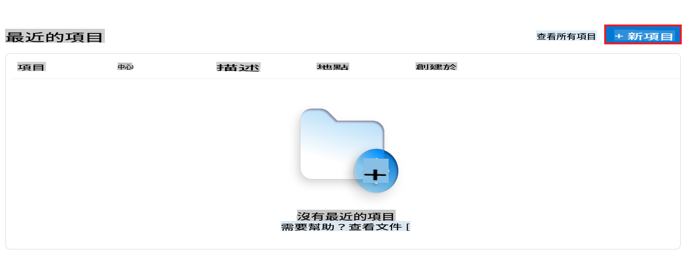

1. 執行以下任務：

    - 項目 **集線器名稱**。必須是唯一值。
    - 選擇要使用的 **集線器**（如有需要，創建新的）。

    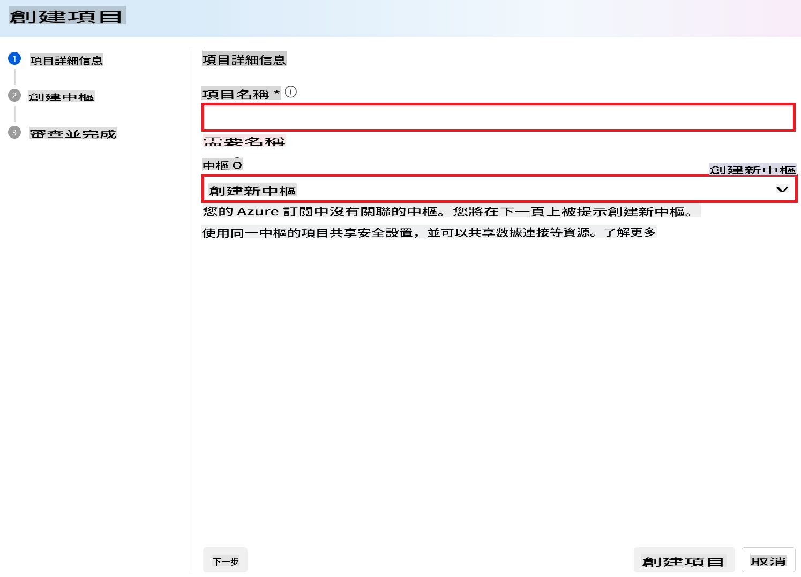

1. 執行以下任務以創建新集線器：

    - 輸入 **集線器名稱**。必須是唯一值。
    - 選擇你的 Azure **訂閱**。
    - 選擇要使用的 **資源組**（如有需要，創建新的）。
    - 選擇你想使用的 **位置**。
    - 選擇要使用的 **連接 Azure AI 服務**（如有需要，創建新的）。
    - 選擇 **連接 Azure AI 搜索** 以 **跳過連接**。

    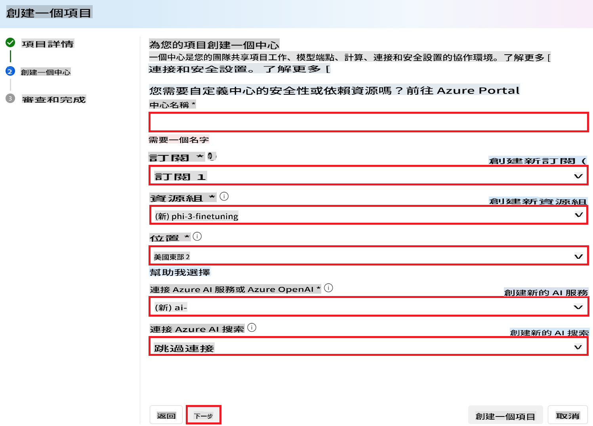

1. 選擇 **下一步**。
1. 選擇 **創建項目**。

### 數據準備

在微調之前，收集或創建與你的任務相關的數據集，例如聊天指令、問答對或任何其他相關文本數據。清理並預處理這些數據，去除噪音、處理缺失值並對文本進行標記。

### 在 Azure AI Studio 中微調 Phi-3 模型

> [!NOTE]
> 目前在 East US 2 的項目中支持微調 Phi-3 模型。

1. 從左側選項卡中選擇 **模型目錄**。

1. 在 **搜索欄** 中輸入 *phi-3* 並選擇你想使用的 phi-3 模型。

    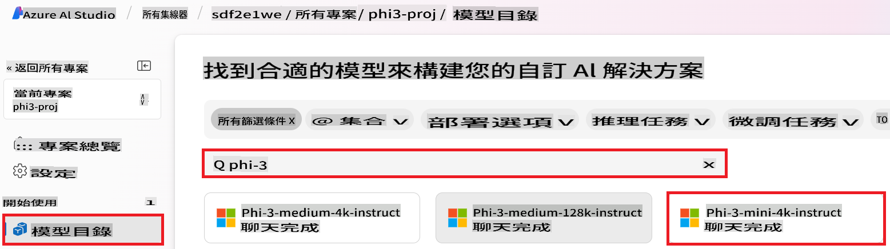

1. 選擇 **微調**。

    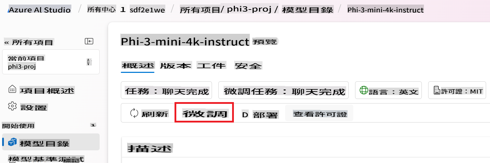

1. 輸入 **微調後的模型名稱**。

    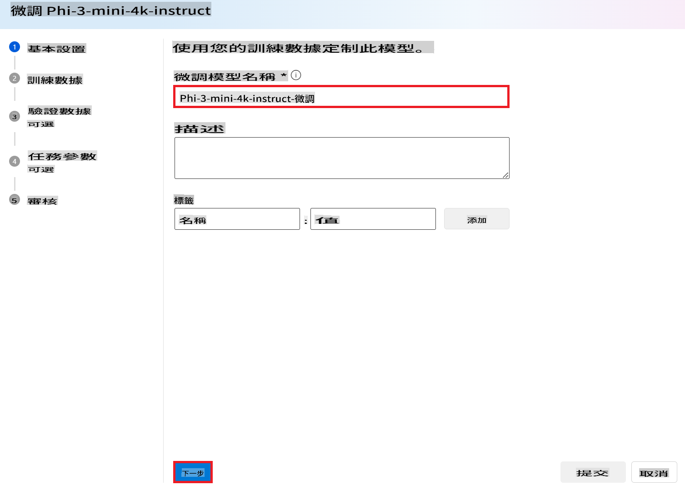

1. 選擇 **下一步**。

1. 執行以下任務：

    - 將 **任務類型** 選擇為 **聊天完成**。
    - 選擇你想使用的 **訓練數據**。你可以通過 Azure AI Studio 的數據上傳或從本地環境上傳。

    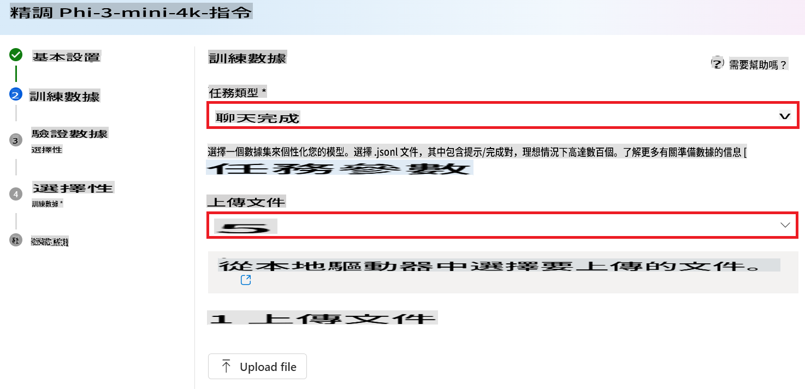

1. 選擇 **下一步**。

1. 上傳你想使用的 **驗證數據**，或者你可以選擇 **自動拆分訓練數據**。

    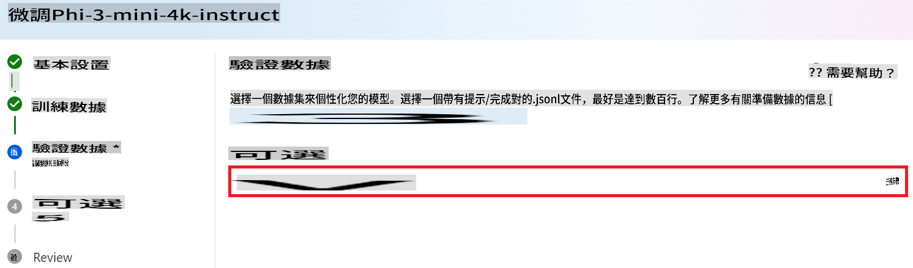

1. 選擇 **下一步**。

1. 執行以下任務：

    - 選擇你想使用的 **批次大小乘數**。
    - 選擇你想使用的 **學習率**。
    - 選擇你想使用的 **訓練輪數**。

    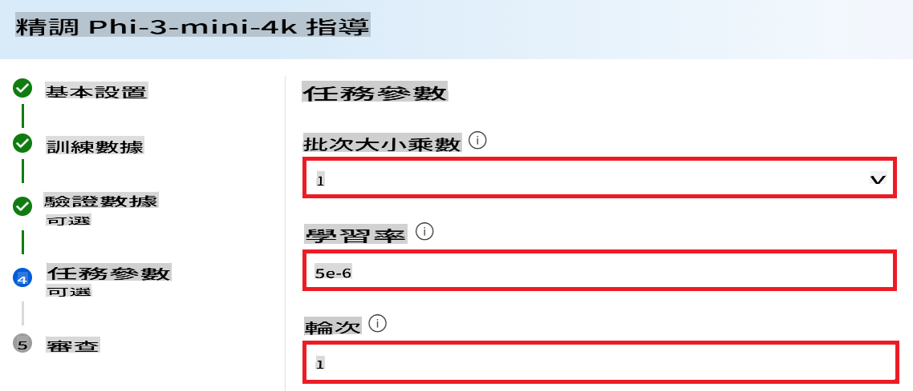

1. 選擇 **提交** 開始微調過程。

    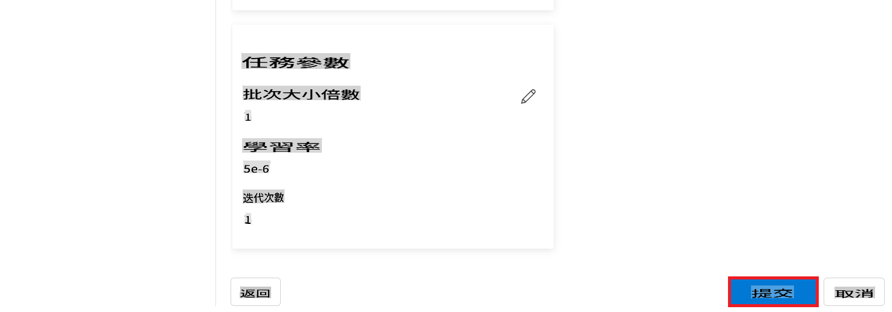

1. 一旦你的模型微調完成，狀態將顯示為 **已完成**，如下圖所示。現在你可以部署模型，並在你的應用程序中使用它，或者在遊樂場或提示流中使用它。更多信息，請參見 [如何使用 Azure AI Studio 部署 Phi-3 小型語言模型家族](https://learn.microsoft.com/azure/ai-studio/how-to/deploy-models-phi-3?tabs=phi-3-5&pivots=programming-language-python)。

    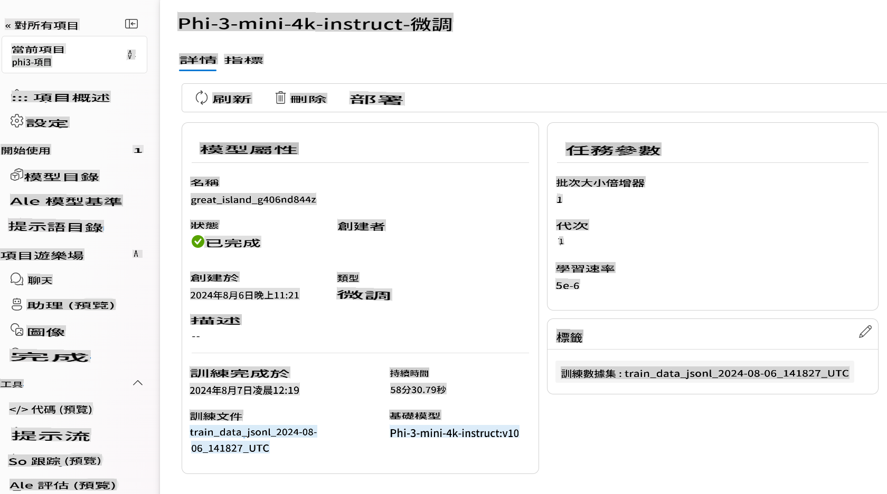

> [!NOTE]
> 有關微調 Phi-3 的更多詳細信息，請訪問 [在 Azure AI Studio 中微調 Phi-3 模型](https://learn.microsoft.com/azure/ai-studio/how-to/fine-tune-phi-3?tabs=phi-3-mini)。

## 清理你的微調模型

你可以從 [Azure AI Studio](https://ai.azure.com) 的微調模型列表或從模型詳細信息頁面中刪除微調模型。從微調頁面中選擇要刪除的微調模型，然後選擇刪除按鈕以刪除微調模型。

> [!NOTE]
> 如果自定義模型有現有部署，你無法刪除它。你必須先刪除模型部署，然後才能刪除自定義模型。

## 成本和配額

### 作為服務微調的 Phi-3 模型的成本和配額考量

Phi 模型作為服務微調由 Microsoft 提供，並集成到 Azure AI Studio 中使用。你可以在[部署](https://learn.microsoft.com/azure/ai-studio/how-to/deploy-models-phi-3?tabs=phi-3-5&pivots=programming-language-python)或微調模型時在部署向導的定價和條款選項卡下找到定價。

## 內容過濾

作為服務部署的按需付費模型受 Azure AI 內容安全保護。當部署到實時端點時，你可以選擇退出此功能。啟用 Azure AI 內容安全時，提示和完成都會通過一組分類模型來檢測和防止有害內容的輸出。內容過濾系統檢測並對輸入提示和輸出完成中的特定類別的潛在有害內容採取行動。了解更多關於 [Azure AI 內容安全](https://learn.microsoft.com/azure/ai-studio/concepts/content-filtering)。

**微調配置**

超參數：定義超參數，如學習率、批次大小和訓練輪數。

**損失函數**

為你的任務選擇合適的損失函數（例如，交叉熵）。

**優化器**

選擇一個優化器（例如，Adam）來在訓練期間進行梯度更新。

**微調過程**

- 加載預訓練模型：加載 Phi-3 Mini 檢查點。
- 添加自定義層：添加任務特定的層（例如，聊天指令的分類頭）。

**訓練模型**
使用你準備的數據集微調模型。監控訓練進度並根據需要調整超參數。

**評估和驗證**

驗證集：將你的數據分為訓練集和驗證集。

**評估性能**

使用準確性、F1 分數或困惑度等指標來評估模型性能。

## 保存微調模型

**檢查點**
保存微調模型檢查點以供將來使用。

## 部署

- 作為 Web 服務部署：將你的微調模型作為 Web 服務部署在 Azure AI Studio 中。
- 測試端點：向部署的端點發送測試查詢以驗證其功能。

## 迭代和改進

迭代：如果性能不滿意，通過調整超參數、添加更多數據或進行更多輪次的微調來迭代。

## 監控和改進

持續監控模型的行為並根據需要進行改進。

## 定制和擴展

自定義任務：Phi-3 Mini 可以微調用於聊天指令之外的各種任務。探索其他使用案例！
實驗：嘗試不同的架構、層組合和技術以提高性能。

> [!NOTE]
> 微調是一個迭代過程。實驗、學習並調整你的模型以達到最佳結果！

免責聲明：此翻譯由AI模型從原文翻譯而來，可能不完美。請檢查輸出並進行任何必要的修改。