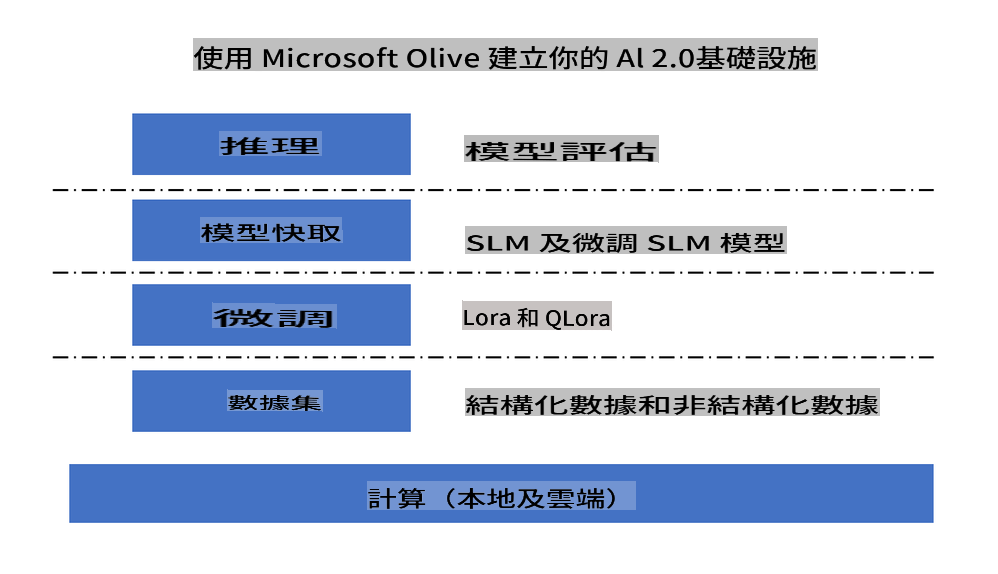
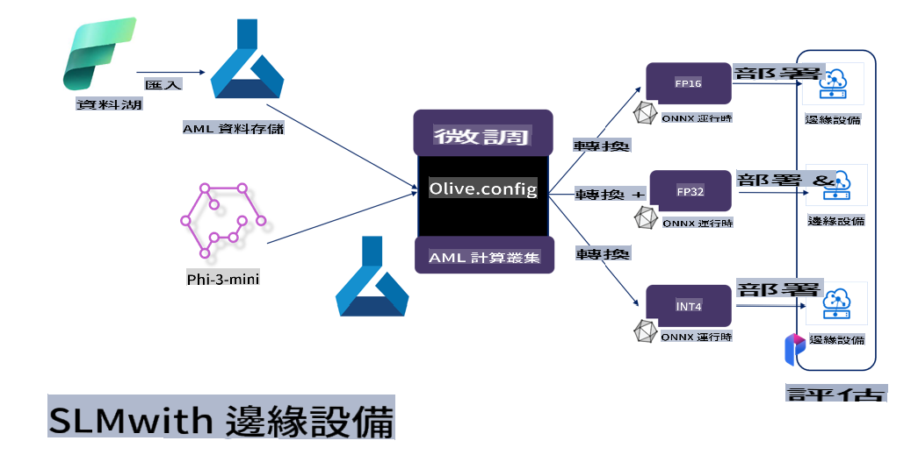

# **使用 Microsoft Olive 進行 Phi-3 微調**

[Olive](https://github.com/microsoft/OLive?WT.mc_id=aiml-138114-kinfeylo) 是一個易於使用的硬件感知模型優化工具，結合了業界領先的模型壓縮、優化和編譯技術。

它旨在簡化機器學習模型的優化過程，確保它們能最有效地利用特定的硬件架構。

無論你是在雲端應用還是邊緣設備上工作，Olive 都能讓你輕鬆高效地優化模型。

## 主要特點:
- Olive 集成並自動化了針對特定硬件目標的優化技術。
- 沒有單一的優化技術適合所有場景，因此 Olive 允許通過行業專家的創新來擴展優化技術。

## 減少工程工作量:
- 開發人員通常需要學習和使用多個硬件供應商特定的工具鏈來準備和優化訓練模型以進行部署。
- Olive 通過自動化所需硬件的優化技術來簡化這一過程。

## 即用型端到端優化解決方案:

通過組合和調整集成技術，Olive 提供了一個統一的端到端優化解決方案。
它在優化模型時考慮了準確性和延遲等限制。

## 使用 Microsoft Olive 進行微調

Microsoft Olive 是一個非常易於使用的開源模型優化工具，可以涵蓋生成式人工智能領域的微調和參考。只需簡單配置，結合使用開源的小型語言模型和相關的運行環境（AzureML / 本地 GPU，CPU，DirectML），即可通過自動優化完成模型的微調或參考，並找到最佳模型部署到雲端或邊緣設備。允許企業在本地和雲端構建自己的行業垂直模型。



## 使用 Microsoft Olive 進行 Phi-3 微調 



## Phi-3 Olive 範例代碼和示例
在此示例中，你將使用 Olive 來：

- 微調 LoRA 適配器以將短語分類為悲傷、喜悅、恐懼、驚訝。
- 將適配器權重合併到基礎模型中。
- 將模型優化和量化為 int4。

[範例代碼](../../code/04.Finetuning/olive-ort-example/README.md)

### 安裝 Microsoft Olive

Microsoft Olive 的安裝非常簡單，並且可以安裝於 CPU、GPU、DirectML 和 Azure ML

```bash
pip install olive-ai
```

如果你希望使用 CPU 運行 ONNX 模型，可以使用

```bash
pip install olive-ai[cpu]
```

如果你希望使用 GPU 運行 ONNX 模型，可以使用

```python
pip install olive-ai[gpu]
```

如果你希望使用 Azure ML，可以使用

```python
pip install git+https://github.com/microsoft/Olive#egg=olive-ai[azureml]
```

**注意**
操作系統要求：Ubuntu 20.04 / 22.04 

### **Microsoft Olive 的 Config.json**

安裝後，你可以通過配置文件配置不同的模型特定設置，包括數據、計算、訓練、部署和模型生成。

**1. 數據**

在 Microsoft Olive 上，本地數據和雲端數據的訓練都可以支持，並且可以在設置中配置。

*本地數據設置*

你可以簡單地設置需要微調的數據集，通常是 json 格式，並使用數據模板進行適配。這需要根據模型的要求進行調整（例如，適配到 Microsoft Phi-3-mini 所需的格式。如果你有其他模型，請參考其他模型所需的微調格式進行處理）

```json

    "data_configs": [
        {
            "name": "dataset_default_train",
            "type": "HuggingfaceContainer",
            "load_dataset_config": {
                "params": {
                    "data_name": "json", 
                    "data_files":"dataset/dataset-classification.json",
                    "split": "train"
                }
            },
            "pre_process_data_config": {
                "params": {
                    "dataset_type": "corpus",
                    "text_cols": [
                            "phrase",
                            "tone"
                    ],
                    "text_template": "### Text: {phrase}\n### The tone is:\n{tone}",
                    "corpus_strategy": "join",
                    "source_max_len": 2048,
                    "pad_to_max_len": false,
                    "use_attention_mask": false
                }
            }
        }
    ],
```

**雲端數據源設置**

通過連接 Azure AI Studio/Azure Machine Learning Service 的數據存儲來鏈接雲端數據，你可以選擇通過 Microsoft Fabric 和 Azure Data 將不同的數據源引入 Azure AI Studio/Azure Machine Learning Service，作為微調數據的支持。

```json

    "data_configs": [
        {
            "name": "dataset_default_train",
            "type": "HuggingfaceContainer",
            "load_dataset_config": {
                "params": {
                    "data_name": "json", 
                    "data_files": {
                        "type": "azureml_datastore",
                        "config": {
                            "azureml_client": {
                                "subscription_id": "Your Azure Subscrition ID",
                                "resource_group": "Your Azure Resource Group",
                                "workspace_name": "Your Azure ML Workspaces name"
                            },
                            "datastore_name": "workspaceblobstore",
                            "relative_path": "Your train_data.json Azure ML Location"
                        }
                    },
                    "split": "train"
                }
            },
            "pre_process_data_config": {
                "params": {
                    "dataset_type": "corpus",
                    "text_cols": [
                            "Question",
                            "Best Answer"
                    ],
                    "text_template": "<|user|>\n{Question}<|end|>\n<|assistant|>\n{Best Answer}\n<|end|>",
                    "corpus_strategy": "join",
                    "source_max_len": 2048,
                    "pad_to_max_len": false,
                    "use_attention_mask": false
                }
            }
        }
    ],
    
```

**2. 計算配置**

如果你需要在本地進行，可以直接使用本地數據資源。你需要使用 Azure AI Studio / Azure Machine Learning Service 的資源。你需要配置相關的 Azure 參數、計算資源名稱等。

```json

    "systems": {
        "aml": {
            "type": "AzureML",
            "config": {
                "accelerators": ["gpu"],
                "hf_token": true,
                "aml_compute": "Your Azure AI Studio / Azure Machine Learning Service Compute Name",
                "aml_docker_config": {
                    "base_image": "Your Azure AI Studio / Azure Machine Learning Service docker",
                    "conda_file_path": "conda.yaml"
                }
            }
        },
        "azure_arc": {
            "type": "AzureML",
            "config": {
                "accelerators": ["gpu"],
                "aml_compute": "Your Azure AI Studio / Azure Machine Learning Service Compute Name",
                "aml_docker_config": {
                    "base_image": "Your Azure AI Studio / Azure Machine Learning Service docker",
                    "conda_file_path": "conda.yaml"
                }
            }
        }
    },
```

***注意***

因為它是通過 Azure AI Studio/Azure Machine Learning Service 上的容器運行的，所以需要配置所需的環境。這是在 conda.yaml 環境中配置的。

```yaml

name: project_environment
channels:
  - defaults
dependencies:
  - python=3.8.13
  - pip=22.3.1
  - pip:
      - einops
      - accelerate
      - azure-keyvault-secrets
      - azure-identity
      - bitsandbytes
      - datasets
      - huggingface_hub
      - peft
      - scipy
      - sentencepiece
      - torch>=2.2.0
      - transformers
      - git+https://github.com/microsoft/Olive@jiapli/mlflow_loading_fix#egg=olive-ai[gpu]
      - --extra-index-url https://aiinfra.pkgs.visualstudio.com/PublicPackages/_packaging/ORT-Nightly/pypi/simple/ 
      - ort-nightly-gpu==1.18.0.dev20240307004
      - --extra-index-url https://aiinfra.pkgs.visualstudio.com/PublicPackages/_packaging/onnxruntime-genai/pypi/simple/
      - onnxruntime-genai-cuda

    

```

**3. 選擇你的 SLM**

你可以直接使用 Hugging face 上的模型，也可以直接結合 Azure AI Studio / Azure Machine Learning 的模型目錄來選擇使用的模型。在下面的代碼示例中，我們將使用 Microsoft Phi-3-mini 作為示例。

如果你有本地模型，你可以使用這種方法

```json

    "input_model":{
        "type": "PyTorchModel",
        "config": {
            "hf_config": {
                "model_name": "model-cache/microsoft/phi-3-mini",
                "task": "text-generation",
                "model_loading_args": {
                    "trust_remote_code": true
                }
            }
        }
    },
```

如果你希望使用來自 Azure AI Studio / Azure Machine Learning Service 的模型，你可以使用這種方法

```json

    "input_model":{
        "type": "PyTorchModel",
        "config": {
            "model_path": {
                "type": "azureml_registry_model",
                "config": {
                    "name": "microsoft/Phi-3-mini-4k-instruct",
                    "registry_name": "azureml-msr",
                    "version": "11"
                }
            },
             "model_file_format": "PyTorch.MLflow",
             "hf_config": {
                "model_name": "microsoft/Phi-3-mini-4k-instruct",
                "task": "text-generation",
                "from_pretrained_args": {
                    "trust_remote_code": true
                }
            }
        }
    },
```

**注意：**
我們需要與 Azure AI Studio / Azure Machine Learning Service 集成，因此在設置模型時，請參考版本號和相關命名。

Azure 上的所有模型都需要設置為 PyTorch.MLflow

你需要擁有一個 Hugging face 帳戶並將密鑰綁定到 Azure AI Studio / Azure Machine Learning 的 Key 值

**4. 算法**

Microsoft Olive 將 Lora 和 QLora 微調算法封裝得非常好。你只需配置一些相關參數。這裡以 QLora 為例。

```json
        "lora": {
            "type": "LoRA",
            "config": {
                "target_modules": [
                    "o_proj",
                    "qkv_proj"
                ],
                "double_quant": true,
                "lora_r": 64,
                "lora_alpha": 64,
                "lora_dropout": 0.1,
                "train_data_config": "dataset_default_train",
                "eval_dataset_size": 0.3,
                "training_args": {
                    "seed": 0,
                    "data_seed": 42,
                    "per_device_train_batch_size": 1,
                    "per_device_eval_batch_size": 1,
                    "gradient_accumulation_steps": 4,
                    "gradient_checkpointing": false,
                    "learning_rate": 0.0001,
                    "num_train_epochs": 3,
                    "max_steps": 10,
                    "logging_steps": 10,
                    "evaluation_strategy": "steps",
                    "eval_steps": 187,
                    "group_by_length": true,
                    "adam_beta2": 0.999,
                    "max_grad_norm": 0.3
                }
            }
        },
```

如果你希望進行量化轉換，Microsoft Olive 主分支已經支持 onnxruntime-genai 方法。你可以根據需要進行設置：

1. 將適配器權重合併到基礎模型中
2. 使用 ModelBuilder 將模型轉換為所需精度的 onnx 模型

例如轉換為量化的 INT4

```json

        "merge_adapter_weights": {
            "type": "MergeAdapterWeights"
        },
        "builder": {
            "type": "ModelBuilder",
            "config": {
                "precision": "int4"
            }
        }
```

**注意** 
- 如果你使用 QLoRA，目前不支持 ONNXRuntime-genai 的量化轉換。

- 需要指出的是，你可以根據自己的需求設置上述步驟。不必完全配置上述這些步驟。根據你的需求，可以直接使用算法的步驟而不進行微調。最後你需要配置相關引擎

```json

    "engine": {
        "log_severity_level": 0,
        "host": "aml",
        "target": "aml",
        "search_strategy": false,
        "execution_providers": ["CUDAExecutionProvider"],
        "cache_dir": "../model-cache/models/phi3-finetuned/cache",
        "output_dir" : "../model-cache/models/phi3-finetuned"
    }
```

**5. 完成微調**

在命令行中，在 olive-config.json 的目錄下執行

```bash
olive run --config olive-config.json  
```

**免責聲明**:
本文件使用機器翻譯服務進行翻譯。我們努力確保準確性，但請注意，自動翻譯可能包含錯誤或不準確之處。應以原文檔案作為權威來源。對於關鍵信息，建議尋求專業人工翻譯。我們對因使用此翻譯而產生的任何誤解或誤讀不承擔責任。