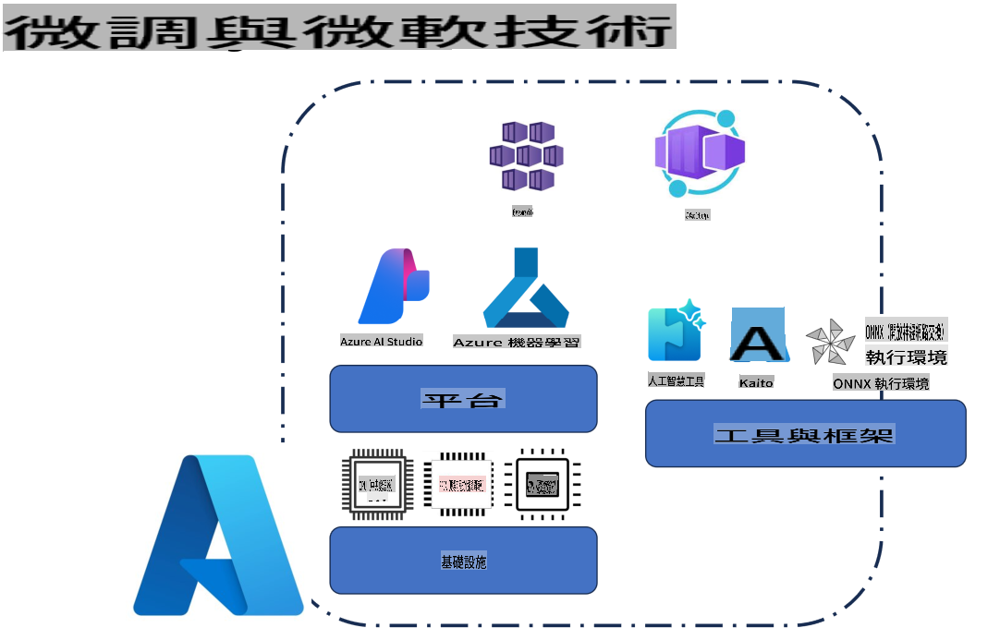
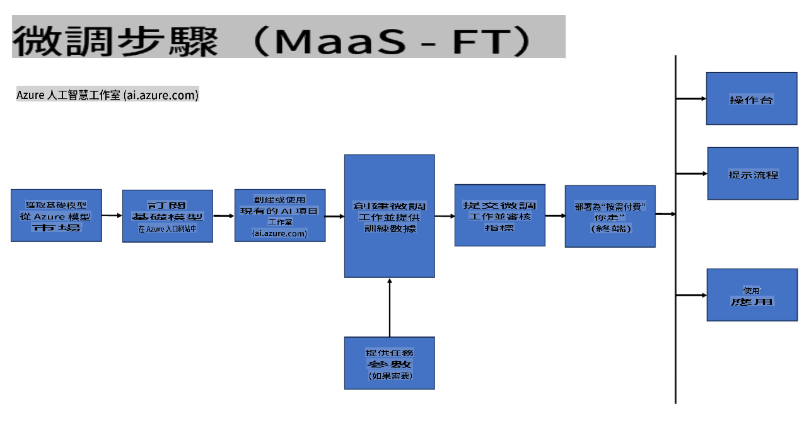
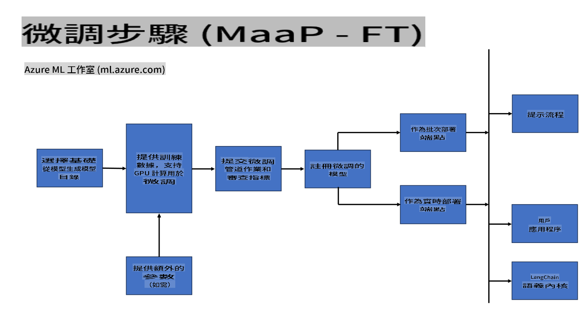
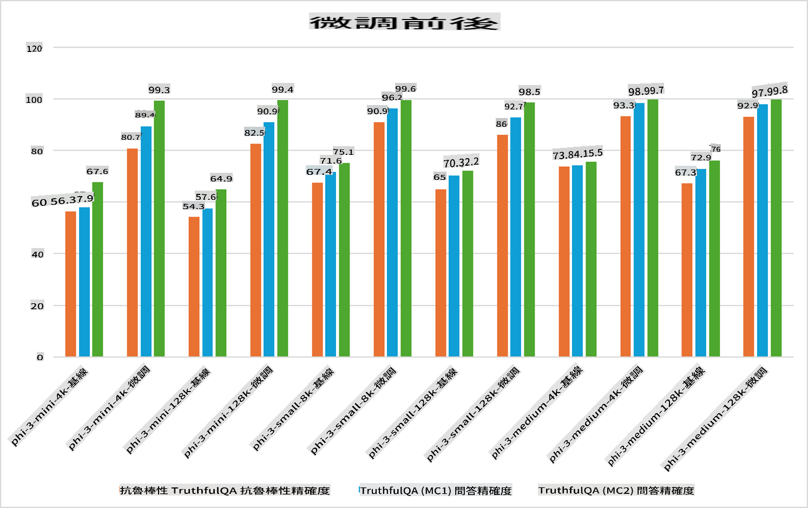

## 微調情境

**平台** 這包括各種技術，例如 Azure AI Foundry、Azure Machine Learning、AI 工具、Kaito 和 ONNX Runtime。

**基礎設施** 這包括 CPU 和 FPGA，這些都是微調過程中不可或缺的部分。讓我展示每種技術的圖標。

**工具和框架** 這包括 ONNX Runtime 和 ONNX Runtime。讓我展示每種技術的圖標。
[插入 ONNX Runtime 和 ONNX Runtime 的圖標]

使用微軟技術進行微調過程涉及各種組件和工具。通過理解和利用這些技術，我們可以有效地微調應用程序並創建更好的解決方案。

## 模型即服務

使用託管微調來微調模型，無需創建和管理計算資源。

無伺服器微調適用於 Phi-3-mini 和 Phi-3-medium 模型，使開發者能夠快速且輕鬆地為雲和邊緣場景定制模型，而無需安排計算資源。我們還宣布 Phi-3-small 現已通過我們的模型即服務（Models-as-a-Service）提供，開發者可以快速且輕鬆地開始 AI 開發，而無需管理底層基礎設施。

[微調範例](https://github.com/microsoft/Phi-3CookBook/blob/main/md/04.Fine-tuning/FineTuning_AIStudio.md)

## 模型即平台

用戶管理自己的計算資源以微調模型。

[微調範例](https://github.com/Azure/azureml-examples/blob/main/sdk/python/foundation-models/system/finetune/chat-completion/chat-completion.ipynb)

## 微調情境

| | | | | | | |
|-|-|-|-|-|-|-|
|情境|LoRA|QLoRA|PEFT|DeepSpeed|ZeRO|DORA|
|將預訓練的 LLMs 調整到特定任務或領域|是|是|是|是|是|是|
|針對 NLP 任務（如文本分類、命名實體識別和機器翻譯）進行微調|是|是|是|是|是|是|
|針對 QA 任務進行微調|是|是|是|是|是|是|
|針對聊天機器人生成類似人類的回應進行微調|是|是|是|是|是|是|
|針對音樂、藝術或其他創意形式的生成進行微調|是|是|是|是|是|是|
|降低計算和財務成本|是|是|否|是|是|否|
|降低內存使用量|否|是|否|是|是|是|
|使用更少的參數進行高效微調|否|是|是|否|否|是|
|內存高效的數據並行形式，可訪問所有可用 GPU 設備的總 GPU 內存|否|否|否|是|是|是|

## 微調性能示例

**免責聲明**：
本文件已使用機器翻譯服務進行翻譯。雖然我們努力確保準確性，但請注意，自動翻譯可能包含錯誤或不準確之處。應以原語言的文件為權威來源。對於關鍵信息，建議尋求專業人工翻譯。我們不對使用此翻譯所引起的任何誤解或誤釋承擔責任。