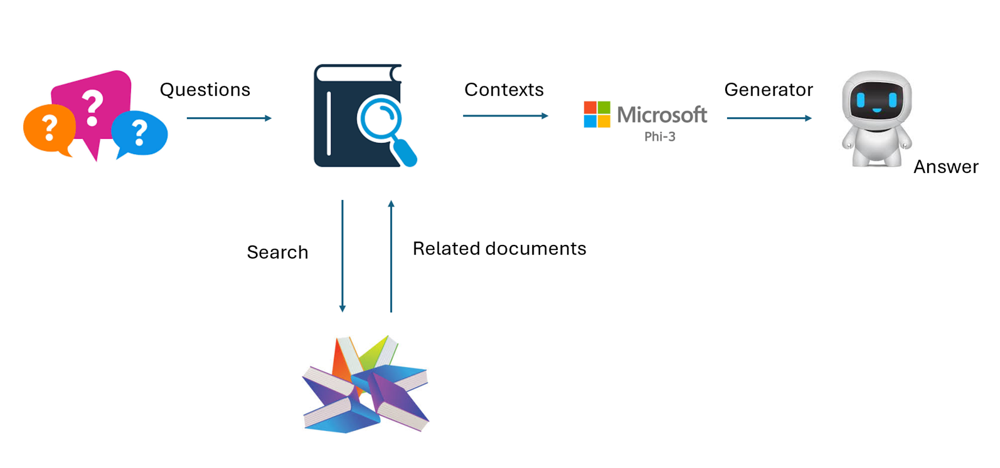

## 精調 vs RAG

## 檢索增強生成

RAG 是數據檢索 + 文字生成。企業的結構化數據和非結構化數據被存儲在向量數據庫中。在搜索相關內容時，會找到相關的摘要和內容來形成上下文，並結合LLM/SLM的文本補全能力來生成內容。

## RAG 過程

## 精調
精調是基於某個模型的改進。不需要從模型算法開始，但需要不斷積累數據。如果你想在行業應用中獲得更精確的術語和語言表達，精調是更好的選擇。但如果你的數據變化頻繁，精調可能會變得複雜。

## 如何選擇
如果我們的答案需要引入外部數據，RAG 是最佳選擇

如果你需要輸出穩定且精確的行業知識，精調會是個好選擇。RAG 優先拉取相關內容，但可能無法總是抓住專業的細微差別。

精調需要高質量的數據集，如果只是小範圍的數據，效果不會太明顯。RAG 更靈活。
精調是一個黑盒子，一種玄學，很難理解內部機制。但RAG 可以更容易找到數據來源，從而有效調整幻覺或內容錯誤，提供更好的透明度。

**免責聲明**：
本文件是使用機器翻譯服務翻譯的。我們努力追求準確性，但請注意，自動翻譯可能包含錯誤或不準確之處。應以原語言的原始文件為權威來源。對於關鍵信息，建議使用專業人工翻譯。我們對使用此翻譯所產生的任何誤解或誤讀不承擔責任。