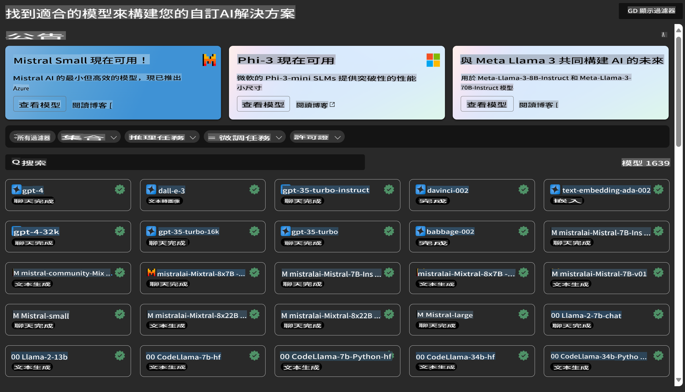
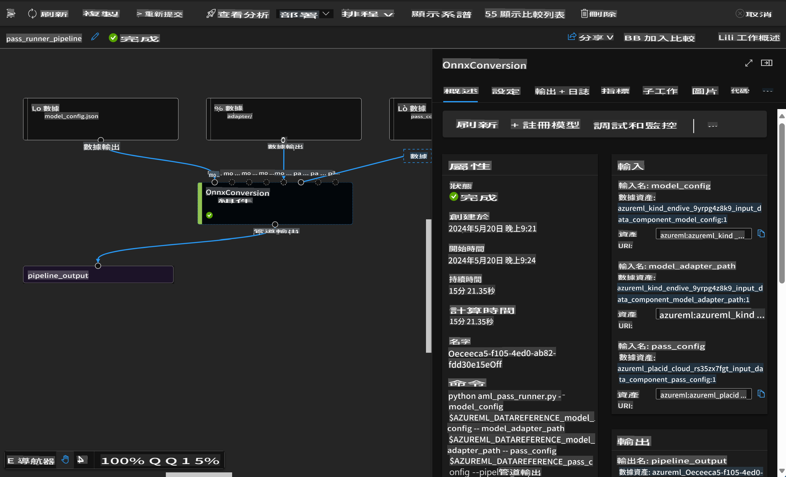

# **介紹 Azure Machine Learning 服務**

[Azure Machine Learning](https://ml.azure.com?WT.mc_id=aiml-138114-kinfeylo) 是一項加速和管理機器學習 (ML) 專案生命周期的雲端服務。

ML 專業人士、資料科學家和工程師可以在日常工作流程中使用它來：

- 訓練和部署模型。
管理機器學習運營 (MLOps)。
- 你可以在 Azure Machine Learning 中創建模型，或使用來自開源平台（如 PyTorch、TensorFlow 或 scikit-learn）的模型。
- MLOps 工具幫助你監控、重新訓練和重新部署模型。

## 誰適合使用 Azure Machine Learning？

**資料科學家和 ML 工程師**

他們可以使用工具來加速和自動化日常工作流程。
Azure ML 提供公平性、可解釋性、跟踪和審計功能。
應用開發者：
他們可以將模型無縫整合到應用程式或服務中。

**平台開發者**

他們可以使用由耐用的 Azure Resource Manager API 支持的一套強大工具。
這些工具允許構建先進的 ML 工具。

**企業**

在 Microsoft Azure 雲端中工作，企業受益於熟悉的安全性和基於角色的訪問控制。
設置專案以控制對受保護資料和特定操作的訪問。

## 提高團隊每個人的生產力
ML 專案通常需要具有多種技能的團隊來構建和維護。

Azure ML 提供的工具使你能夠：
- 通過共享筆記本、計算資源、無伺服器計算、資料和環境與團隊協作。
- 開發具有公平性、可解釋性、跟踪和審計功能的模型，以滿足譜系和審計合規要求。
- 快速輕鬆地大規模部署 ML 模型，並通過 MLOps 高效管理和治理它們。
- 在任何地方運行機器學習工作負載，具有內置的治理、安全性和合規性。

## 跨平台兼容工具

ML 團隊中的任何人都可以使用他們喜歡的工具來完成工作。
無論你是在進行快速實驗、超參數調整、構建管道還是管理推理，你都可以使用熟悉的界面，包括：
- Azure Machine Learning Studio
- Python SDK (v2)
- Azure CLI (v2)
- Azure Resource Manager REST APIs

隨著你在開發周期中不斷完善模型並進行協作，你可以在 Azure Machine Learning studio UI 中共享和查找資產、資源和指標。

## **Azure ML 中的 LLM/SLM**

Azure ML 增加了許多與 LLM/SLM 相關的功能，結合 LLMOps 和 SLMOps，創建了一個企業級的生成性人工智慧技術平台。

### **模型目錄**

企業用戶可以通過模型目錄根據不同的業務場景部署不同的模型，並以 Model as Service 的形式提供服務，供企業開發者或用戶訪問。

Azure Machine Learning studio 中的模型目錄是發現和使用各種模型的中心，使你能夠構建生成性 AI 應用程式。模型目錄提供來自 Azure OpenAI service、Mistral、Meta、Cohere、Nvidia、Hugging Face 等模型提供者的數百個模型，包括 Microsoft 訓練的模型。來自 Microsoft 以外的提供者的模型是非 Microsoft 產品，根據 Microsoft 的產品條款定義，並受模型附帶條款的約束。

### **作業管道**

機器學習管道的核心是將完整的機器學習任務分解為多步驟工作流程。每個步驟都是可以單獨開發、優化、配置和自動化的可管理組件。步驟通過定義良好的接口連接。Azure Machine Learning 管道服務自動協調管道步驟之間的所有依賴關係。

在微調 SLM / LLM 時，我們可以通過管道管理我們的資料、訓練和生成過程。

### **Prompt flow**

使用 Azure Machine Learning prompt flow 的好處
Azure Machine Learning prompt flow 提供了一系列好處，幫助用戶從構思過渡到實驗，最終到達生產就緒的基於 LLM 的應用程式：

**Prompt 工程敏捷性**

互動式編寫體驗：Azure Machine Learning prompt flow 提供了流結構的視覺表示，使用戶能夠輕鬆理解和導航他們的專案。它還提供類似筆記本的編碼體驗，以便高效的流開發和調試。
Prompt 調整的變體：用戶可以創建和比較多個 prompt 變體，促進迭代改進過程。

評估：內置評估流使用戶能夠評估其 prompt 和流的質量和效果。

全面資源：Azure Machine Learning prompt flow 包括一個內置工具、範例和範本庫，作為開發的起點，激發創意並加速過程。

**企業級的 LLM 應用程式準備**

協作：Azure Machine Learning prompt flow 支持團隊協作，允許多個用戶共同進行 prompt 工程專案，分享知識並保持版本控制。

一體化平台：Azure Machine Learning prompt flow 簡化了整個 prompt 工程過程，從開發和評估到部署和監控。用戶可以輕鬆地將他們的流部署為 Azure Machine Learning 端點，並實時監控其性能，確保最佳運行和持續改進。

Azure Machine Learning 企業級解決方案：Prompt flow 利用 Azure Machine Learning 的強大企業級解決方案，提供安全、可擴展和可靠的基礎，用於流的開發、實驗和部署。

通過 Azure Machine Learning prompt flow，用戶可以釋放 prompt 工程的敏捷性，有效協作，並利用企業級解決方案成功開發和部署基於 LLM 的應用程式。

結合 Azure ML 的計算能力、資料和不同組件，企業開發者可以輕鬆構建自己的人工智慧應用程式。

免責聲明：此翻譯由AI模型從原文翻譯而來，可能不夠完美。請檢查輸出內容並進行必要的修正。