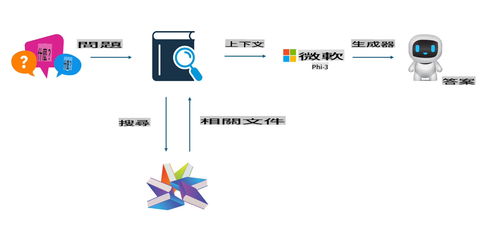
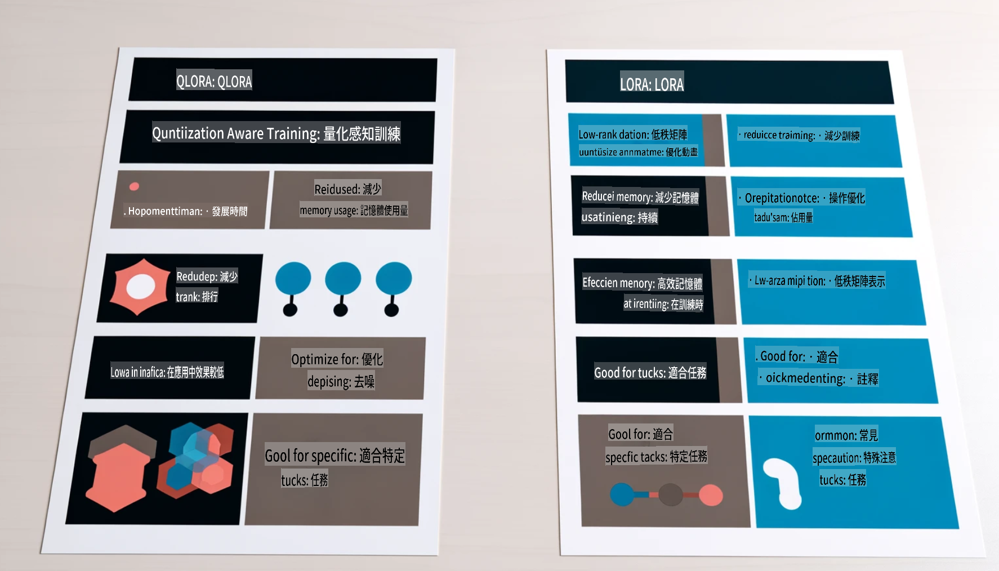

# **讓 Phi-3 成為行業專家**

要將 Phi-3 模型應用於行業中，需要向 Phi-3 模型添加行業業務數據。我們有兩種不同的選擇，第一種是 RAG（檢索增強生成），第二種是微調。

## **RAG vs 微調**

### **檢索增強生成**

RAG 是數據檢索 + 文本生成。企業的結構化數據和非結構化數據存儲在向量數據庫中。在搜索相關內容時，會找到相關的摘要和內容來形成上下文，並結合 LLM/SLM 的文本補全能力生成內容。

### **微調**

微調是基於某個模型的改進。它不需要從模型算法開始，但需要不斷積累數據。如果你想在行業應用中使用更精確的術語和語言表達，微調是更好的選擇。但如果你的數據經常變化，微調可能會變得複雜。

### **如何選擇**

1. 如果我們的答案需要引入外部數據，RAG 是最佳選擇

2. 如果需要輸出穩定且精確的行業知識，微調將是一個不錯的選擇。RAG 優先拉取相關內容，但可能無法總是準確把握專業細節。

3. 微調需要高質量的數據集，如果只是小範圍的數據，效果不會有太大差別。RAG 更靈活

4. 微調是一個黑箱，一種形而上學，難以理解其內部機制。但 RAG 可以更容易找到數據來源，從而有效調整幻覺或內容錯誤，提供更好的透明度。

### **場景**

1. 垂直行業需要特定的專業詞彙和表達，***微調*** 是最佳選擇

2. 問答系統，涉及不同知識點的綜合，***RAG*** 是最佳選擇

3. 自動化業務流程的結合 ***RAG + 微調*** 是最佳選擇

## **如何使用 RAG**

向量數據庫是以數學形式存儲的數據集合。向量數據庫使機器學習模型更容易記住以前的輸入，使機器學習能夠支持搜索、推薦和文本生成等用例。數據可以基於相似性指標而不是精確匹配來識別，允許計算機模型理解數據的上下文。

向量數據庫是實現 RAG 的關鍵。我們可以通過 text-embedding-3、jina-ai-embedding 等向量模型將數據轉換為向量存儲。

了解更多關於創建 RAG 應用 [https://github.com/microsoft/Phi-3CookBook](https://github.com/microsoft/Phi-3CookBook?WT.mc_id=aiml-138114-kinfeylo)

## **如何使用微調**

微調中常用的算法是 Lora 和 QLora。如何選擇？
- [Learn More with this sample notebook](../../../../code/04.Finetuning/Phi_3_Inference_Finetuning.ipynb)
- [Example of Python FineTuning Sample](../../../../code/04.Finetuning/FineTrainingScript.py)

### **Lora 和 QLora**

LoRA（低秩適應）和 QLoRA（量化低秩適應）都是用於使用參數高效微調（PEFT）技術來微調大型語言模型（LLM）的技術。PEFT 技術旨在比傳統方法更高效地訓練模型。
LoRA 是一種獨立的微調技術，通過對權重更新矩陣應用低秩近似來減少內存佔用。它提供快速的訓練時間並保持與傳統微調方法接近的性能。

QLoRA 是 LoRA 的擴展版本，結合了量化技術進一步減少內存使用。QLoRA 將預訓練 LLM 中權重參數的精度量化為 4 位精度，比 LoRA 更節省內存。然而，由於額外的量化和反量化步驟，QLoRA 的訓練速度比 LoRA 慢約 30%。

QLoRA 使用 LoRA 作為輔助來修正量化錯誤引入的誤差。QLoRA 使得在相對較小且高度可用的 GPU 上微調擁有數十億參數的巨大模型成為可能。例如，QLoRA 可以使用僅 2 個 GPU 微調需要 36 個 GPU 的 70B 參數模型。

**免責聲明**：
本文件是使用基於機器的人工智能翻譯服務進行翻譯的。儘管我們努力追求準確性，但請注意，自動翻譯可能包含錯誤或不準確之處。應以原語言的原始文件為權威來源。對於關鍵信息，建議進行專業的人類翻譯。我們對使用此翻譯引起的任何誤解或誤讀不承擔責任。