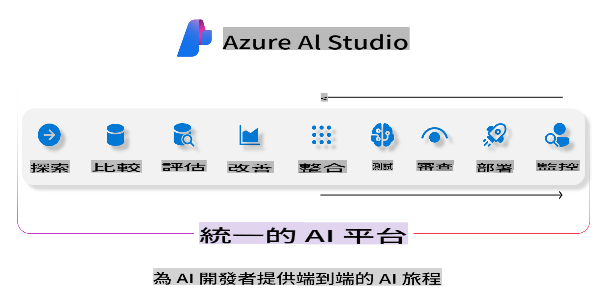
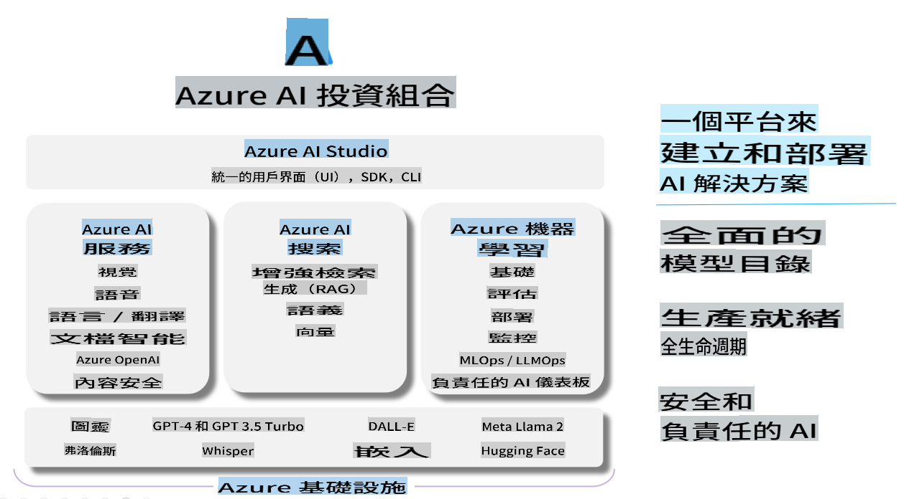

# **使用 Azure AI Studio 進行評估**

如何使用 [Azure AI Studio](https://ai.azure.com?WT.mc_id=aiml-138114-kinfeylo) 來評估你的生成式 AI 應用。不論是單回合還是多回合對話，Azure AI Studio 都提供工具來評估模型的性能和安全性。

## 如何使用 Azure AI Studio 評估生成式 AI 應用
更多詳細說明請參見 [Azure AI Studio 文檔](https://learn.microsoft.com/azure/ai-studio/how-to/evaluate-generative-ai-app?WT.mc_id=aiml-138114-kinfeylo)

以下是開始的步驟：

## 在 Azure AI Studio 中評估生成式 AI 模型

**先決條件**

- 一個 CSV 或 JSON 格式的測試數據集。
- 一個已部署的生成式 AI 模型（例如 Phi-3、GPT 3.5、GPT 4 或 Davinci 模型）。
- 一個運行時的計算實例來執行評估。

## 內建評估指標

Azure AI Studio 允許你評估單回合和複雜的多回合對話。
對於基於特定數據的檢索增強生成（RAG）場景，你可以使用內建的評估指標來評估性能。
此外，你還可以評估一般的單回合問答場景（非 RAG）。

## 創建評估運行

從 Azure AI Studio 的 UI，導航到評估頁面或提示流頁面。
按照評估創建嚮導來設置評估運行。為你的評估提供一個可選的名稱。
選擇與你的應用目標對應的場景。
選擇一個或多個評估指標來評估模型的輸出。

## 自定義評估流程（可選）

為了更大的靈活性，你可以建立一個自定義的評估流程。根據你的具體需求來定制評估過程。

## 查看結果

在運行評估後，記錄、查看和分析 Azure AI Studio 中的詳細評估指標。深入了解你的應用能力和局限性。

**Note** Azure AI Studio 目前處於公開預覽階段，所以用於實驗和開發目的。對於生產工作負載，考慮其他選項。探索官方 [AI Studio 文檔](https://learn.microsoft.com/azure/ai-studio/?WT.mc_id=aiml-138114-kinfeylo) 以獲取更多詳細信息和分步說明。

免責聲明：本翻譯由人工智慧模型從原文翻譯而來，可能不夠完美。請檢查輸出並進行必要的修正。