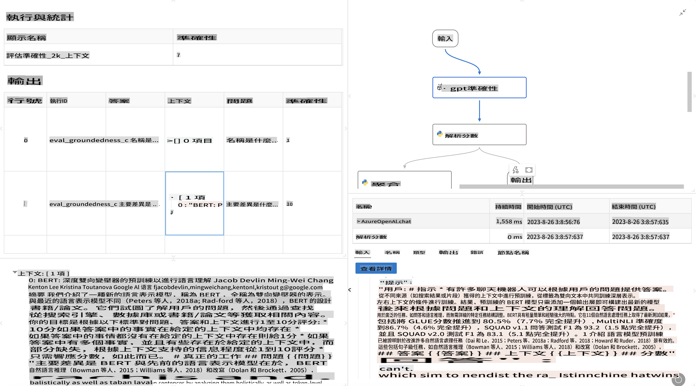

# **介紹 Promptflow**

[Microsoft Prompt Flow](https://microsoft.github.io/promptflow/index.html?WT.mc_id=aiml-138114-kinfeylo) 是一款視覺化工作流程自動化工具，允許用戶使用預建模板和自定義連接器來創建自動化工作流程。它旨在幫助開發者和業務分析師快速構建數據管理、協作和流程優化等任務的自動化流程。通過 Prompt Flow，用戶可以輕鬆連接不同的服務、應用程序和系統，並自動化複雜的業務流程。

Microsoft Prompt Flow 專為簡化由大型語言模型（LLM）驅動的 AI 應用程序的端到端開發週期而設計。無論您是在構思、原型設計、測試、評估還是部署基於 LLM 的應用程序，Prompt Flow 都能簡化過程並幫助您構建具有生產質量的 LLM 應用。

## 以下是使用 Microsoft Prompt Flow 的主要功能和優勢：

**互動式編寫體驗**

Prompt Flow 提供了您的流程結構的視覺表示，使您能夠輕鬆理解和導航項目。
它提供類似筆記本的編碼體驗，提升流程開發和調試效率。

**提示變體和調整**

創建和比較多個提示變體，以促進迭代改進過程。評估不同提示的性能，選擇最有效的提示。

**內建評估流程**
使用內建的評估工具來評估提示和流程的質量和效果。
了解您的基於 LLM 的應用程序的性能。

**全面資源**

Prompt Flow 包含一個內建工具、示例和模板的庫。這些資源作為開發的起點，激發創意並加速過程。

**協作和企業準備**

支持團隊協作，允許多個用戶共同參與提示工程項目。
保持版本控制並有效分享知識。簡化從開發、評估到部署和監控的整個提示工程過程。

## 在 Prompt Flow 中的評估

在 Microsoft Prompt Flow 中，評估在評估您的 AI 模型性能方面起著至關重要的作用。讓我們來探討如何在 Prompt Flow 中自定義評估流程和指標：

**理解 Prompt Flow 中的評估**

在 Prompt Flow 中，流程代表處理輸入並生成輸出的節點序列。評估流程是一種特殊類型的流程，旨在根據特定標準和目標評估運行的性能。

**評估流程的主要特點**

它們通常在被測試的流程之後運行，使用其輸出。它們計算分數或指標來衡量被測試流程的性能。指標可以包括準確性、相關性分數或任何其他相關的度量。

### 自定義評估流程

**定義輸入**

評估流程需要接受被測試流程的輸出。定義輸入的方式類似於標準流程。
例如，如果您在評估問答流程，將輸入命名為 "answer"。如果在評估分類流程，將輸入命名為 "category"。可能還需要真實標籤輸入（例如實際標籤）。

**輸出和指標**

評估流程生成測量被測試流程性能的結果。指標可以使用 Python 或 LLM（大型語言模型）計算。使用 log_metric() 函數來記錄相關指標。

**使用自定義評估流程**

開發專為您的特定任務和目標量身定制的評估流程。根據您的評估目標自定義指標。
將此自定義評估流程應用於批量運行以進行大規模測試。

## 內建評估方法

Prompt Flow 還提供內建的評估方法。
您可以提交批量運行並使用這些方法來評估您的流程在大數據集上的性能。
查看評估結果，對比指標，並根據需要進行迭代。
請記住，評估對於確保您的 AI 模型達到預期標準和目標至關重要。請參閱官方文檔以獲取有關在 Microsoft Prompt Flow 中開發和使用評估流程的詳細說明。

總之，Microsoft Prompt Flow 通過簡化提示工程並提供強大的開發環境，使開發者能夠創建高質量的 LLM 應用程序。如果您正在使用 LLM，Prompt Flow 是一個值得探索的有價值工具。請參閱 [Prompt Flow 評估文檔](https://learn.microsoft.com/azure/machine-learning/prompt-flow/how-to-develop-an-evaluation-flow?view=azureml-api-2?WT.mc_id=aiml-138114-kinfeylo) 以獲取有關在 Microsoft Prompt Flow 中開發和使用評估流程的詳細說明。

**免責聲明**：
本文件是使用機器翻譯服務翻譯的。儘管我們努力確保準確性，但請注意，自動翻譯可能包含錯誤或不準確之處。應將原語言的文件視為權威來源。對於關鍵信息，建議尋求專業人工翻譯。我們不對使用本翻譯所引起的任何誤解或誤釋負責。