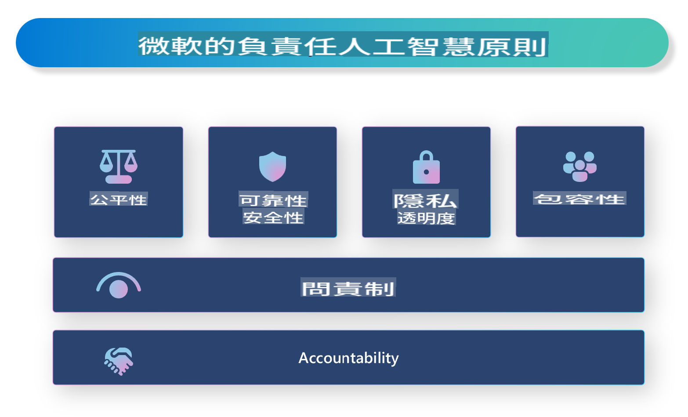

# **介紹負責任的人工智慧**

[Microsoft Responsible AI](https://www.microsoft.com/ai/responsible-ai?WT.mc_id=aiml-138114-kinfeylo) 是一個旨在幫助開發者和組織構建透明、可信和負責任的AI系統的計劃。該計劃提供指導和資源，幫助開發符合隱私、公平和透明等倫理原則的負責任的AI解決方案。我們還將探討構建負責任AI系統的挑戰和最佳實踐。

## Microsoft Responsible AI概述

**倫理原則**

Microsoft Responsible AI 遵循一系列倫理原則，如隱私、公平、透明、問責和安全。這些原則旨在確保AI系統以倫理和負責任的方式開發。

**透明的AI**

Microsoft Responsible AI 強調AI系統的透明性，包括提供清晰的AI模型運作解釋，以及確保數據來源和算法公開可用。

**問責的AI**

[Microsoft Responsible AI](https://www.microsoft.com/ai/responsible-ai?WT.mc_id=aiml-138114-kinfeylo) 推動開發能夠提供AI模型決策見解的問責AI系統，這有助於用戶理解和信任AI系統的輸出。

**包容性**

AI系統應該設計為惠及所有人。Microsoft 致力於創建考慮多樣化觀點並避免偏見或歧視的包容性AI。

**可靠性和安全性**

確保AI系統的可靠性和安全性至關重要。Microsoft 專注於構建穩健的模型，確保其一致性並避免有害結果。

**AI中的公平性**

Microsoft Responsible AI 認識到，如果AI系統基於偏見數據或算法進行訓練，可能會延續偏見。該計劃提供指導，幫助開發不基於種族、性別或年齡等因素歧視的公平AI系統。

**隱私和安全**

Microsoft Responsible AI 強調保護用戶隱私和AI系統數據安全的重要性，包括實施強大的數據加密和訪問控制，並定期審計AI系統的漏洞。

**問責和責任**

Microsoft Responsible AI 推動AI開發和部署中的問責和責任，包括確保開發者和組織意識到AI系統的潛在風險，並採取措施減輕這些風險。

## 構建負責任AI系統的最佳實踐

**使用多樣化數據集開發AI模型**

為了避免AI系統中的偏見，使用代表多種觀點和經驗的多樣化數據集非常重要。

**使用可解釋的AI技術**

可解釋的AI技術可以幫助用戶理解AI模型如何做出決策，從而增加對系統的信任。

**定期審計AI系統的漏洞**

定期審計AI系統可以幫助識別需要解決的潛在風險和漏洞。

**實施強大的數據加密和訪問控制**

數據加密和訪問控制可以幫助保護AI系統中的用戶隱私和安全。

**遵循AI開發中的倫理原則**

遵循公平、透明和問責等倫理原則，可以幫助建立對AI系統的信任，並確保其以負責任的方式開發。

## 使用AI Studio構建負責任的AI

[Azure AI Studio](https://ai.azure.com?WT.mc_id=aiml-138114-kinfeylo) 是一個強大的平台，允許開發者和組織快速創建智能、先進、可上市並負責任的應用程序。以下是Azure AI Studio的一些關鍵功能和能力：

**即用型API和模型**

Azure AI Studio 提供預構建和可定制的API和模型，涵蓋包括生成式AI、對話自然語言處理、搜索、監控、翻譯、語音、視覺和決策在內的廣泛AI任務。

**Prompt Flow**

Azure AI Studio中的Prompt flow使您能夠創建對話式AI體驗，允許您設計和管理對話流程，便於構建聊天機器人、虛擬助手和其他互動應用。

**檢索增強生成（RAG）**

RAG 是一種結合基於檢索和基於生成方法的技術，通過利用現有知識（檢索）和創造性生成（生成）來提高生成回應的質量。

**生成式AI的評估和監控指標**

Azure AI Studio 提供評估和監控生成式AI模型的工具。您可以評估其性能、公平性和其他重要指標，以確保負責任的部署。此外，如果您已創建儀表板，可以使用Azure Machine Learning Studio中的無代碼UI，基於[Repsonsible AI Toolbox](https://responsibleaitoolbox.ai/?WT.mc_id=aiml-138114-kinfeylo) Python庫自定義並生成負責任的AI儀表板和相關評分卡。這些評分卡幫助您與技術和非技術利益相關者分享關於公平性、特徵重要性和其他負責任部署考量的關鍵見解。

要使用AI Studio構建負責任的AI，您可以遵循以下最佳實踐：

**定義AI系統的問題和目標**

在開始開發過程之前，明確定義您的AI系統旨在解決的問題或目標，這將幫助您確定所需的數據、算法和資源，以構建有效的模型。

**收集和預處理相關數據**

用於訓練AI系統的數據質量和數量對其性能有重大影響。因此，重要的是收集相關數據，清理、預處理並確保其代表您試圖解決的人群或問題。

**選擇適當的評估方法**

有各種評估算法可用，根據您的數據和問題選擇最適合的算法非常重要。

**評估和解釋模型**

一旦構建了AI模型，使用適當的指標評估其性能，並以透明的方式解釋結果，這將幫助您識別模型中的任何偏見或限制，並在必要時進行改進。

**確保透明性和可解釋性**

AI系統應該是透明和可解釋的，使用戶能夠理解其工作原理和決策過程，這對於在人類生活中具有重大影響的應用（如醫療、金融和法律系統）尤為重要。

**監控和更新模型**

AI系統應該持續監控和更新，以確保其隨著時間的推移保持準確和有效，這需要持續的維護、測試和模型重訓。

總之，Microsoft Responsible AI 是一個旨在幫助開發者和組織構建透明、可信和負責任AI系統的計劃。記住，負責任的AI實施至關重要，而Azure AI Studio旨在使其對組織實用。通過遵循倫理原則和最佳實踐，我們可以確保AI系統以負責任的方式開發和部署，從而造福整個社會。

免責聲明：此翻譯是由AI模型從原文翻譯而來，可能不完美。請審查翻譯結果並進行必要的修正。