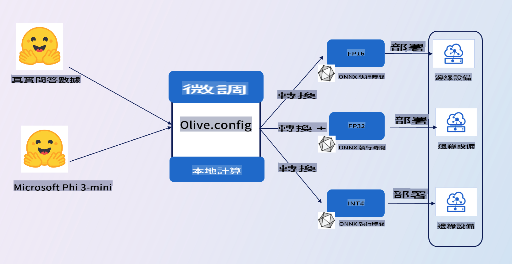

# **介紹 E2E 範例**

這個範例是將 [TruthfulQA 的數據](https://github.com/sylinrl/TruthfulQA/blob/main/TruthfulQA.csv) 用於微調 Phi-3-mini 模型。這是其架構

## **介紹**

我們希望使用 [TruthfulQA 的數據](https://github.com/sylinrl/TruthfulQA/blob/main/TruthfulQA.csv) 集，讓 Phi-3-mini 能夠更專業地回答我們的問題。這是你第一次使用 Phi-3-mini 進行的 E2E 項目

### **需求**

1. Python 3.10+
2. CUDA 12.1
3. Linux / WSL
4. Azure ML
5. Azure Compute A100

### **知識**

1. [了解 Phi-3](../01.Introduce/Phi3Family.md)
2. [了解如何使用 Microsoft Olive 進行微調](../04.Fine-tuning/FineTuning_MicrosoftOlive.md)
3. [了解 ONNX Runtime 用於生成式 AI](https://github.com/microsoft/onnxruntime-genai)

**免責聲明**：
本文件是使用機器翻譯服務翻譯的。儘管我們努力確保準確性，但請注意，自動翻譯可能包含錯誤或不準確之處。應將原語言的原始文件視為權威來源。對於關鍵信息，建議尋求專業人工翻譯。我們對因使用本翻譯而產生的任何誤解或誤讀不承擔責任。