# 微調和整合自訂 Phi-3 模型與 Prompt flow

這個端到端 (E2E) 範例基於 Microsoft Tech Community 的指南 "[Fine-Tune and Integrate Custom Phi-3 Models with Prompt Flow: Step-by-Step Guide](https://techcommunity.microsoft.com/t5/educator-developer-blog/fine-tune-and-integrate-custom-phi-3-models-with-prompt-flow/ba-p/4178612?WT.mc_id=aiml-137032-kinfeylo)"。它介紹了如何使用 Prompt flow 來微調、部署和整合自訂的 Phi-3 模型。

## 概述

在這個 E2E 範例中，你將學習如何微調 Phi-3 模型並與 Prompt flow 整合。通過利用 Azure Machine Learning 和 Prompt flow，你將建立一個部署和使用自訂 AI 模型的工作流程。這個 E2E 範例分為三個情境：

**情境 1: 設置 Azure 資源並準備微調**

**情境 2: 微調 Phi-3 模型並在 Azure Machine Learning Studio 中部署**

**情境 3: 與 Prompt flow 整合並與你的自訂模型聊天**

以下是這個 E2E 範例的概述。

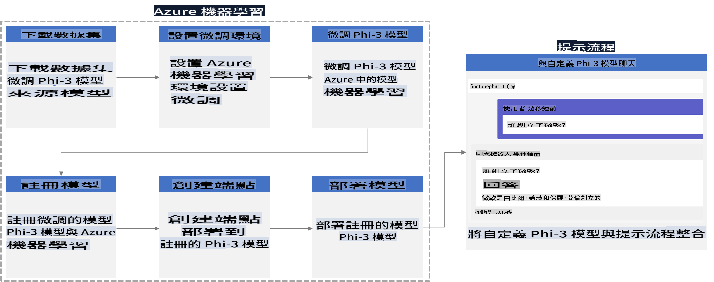

### 目錄

1. **[情境 1: 設置 Azure 資源並準備微調](../../../../md/06.E2ESamples)**
    - [創建 Azure Machine Learning 工作區](../../../../md/06.E2ESamples)
    - [在 Azure 訂閱中申請 GPU 配額](../../../../md/06.E2ESamples)
    - [添加角色分配](../../../../md/06.E2ESamples)
    - [設置項目](../../../../md/06.E2ESamples)
    - [準備微調數據集](../../../../md/06.E2ESamples)

1. **[情境 2: 微調 Phi-3 模型並在 Azure Machine Learning Studio 中部署](../../../../md/06.E2ESamples)**
    - [設置 Azure CLI](../../../../md/06.E2ESamples)
    - [微調 Phi-3 模型](../../../../md/06.E2ESamples)
    - [部署微調後的模型](../../../../md/06.E2ESamples)

1. **[情境 3: 與 Prompt flow 整合並與你的自訂模型聊天](../../../../md/06.E2ESamples)**
    - [將自訂 Phi-3 模型與 Prompt flow 整合](../../../../md/06.E2ESamples)
    - [與你的自訂模型聊天](../../../../md/06.E2ESamples)

## 情境 1: 設置 Azure 資源並準備微調

### 創建 Azure Machine Learning 工作區

1. 在入口頁頂部的 **搜索欄** 中輸入 *azure machine learning*，並從出現的選項中選擇 **Azure Machine Learning**。

    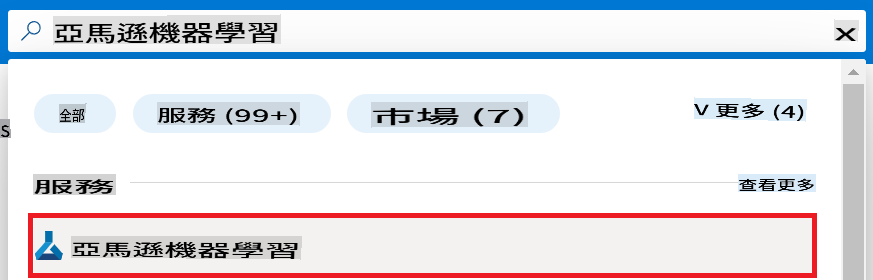

1. 從導航菜單中選擇 **+ Create**。

1. 從導航菜單中選擇 **New workspace**。

    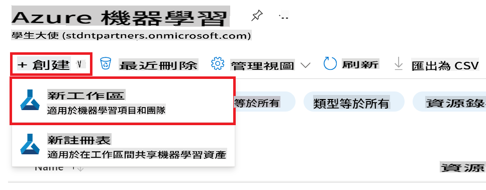

1. 執行以下任務：

    - 選擇你的 Azure **訂閱**。
    - 選擇要使用的 **資源組**（如果需要，創建一個新的）。
    - 輸入 **工作區名稱**。它必須是唯一的值。
    - 選擇你想使用的 **區域**。
    - 選擇要使用的 **儲存帳戶**（如果需要，創建一個新的）。
    - 選擇要使用的 **金鑰保管庫**（如果需要，創建一個新的）。
    - 選擇要使用的 **應用洞察**（如果需要，創建一個新的）。
    - 選擇要使用的 **容器註冊表**（如果需要，創建一個新的）。

    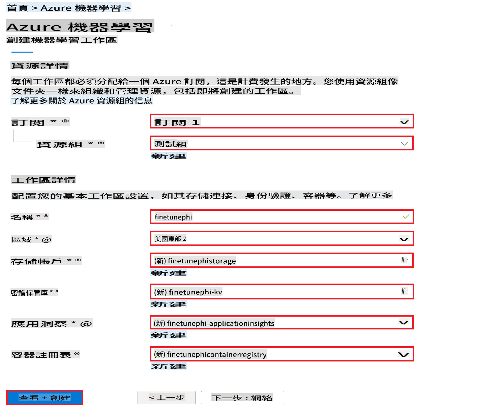

1. 選擇 **Review + Create**。

1. 選擇 **Create**。

### 在 Azure 訂閱中申請 GPU 配額

在這個 E2E 範例中，你將使用 *Standard_NC24ads_A100_v4 GPU* 進行微調，這需要申請配額，並使用 *Standard_E4s_v3* CPU 進行部署，這不需要申請配額。

> [!NOTE]
>
> 只有按需付費訂閱（標準訂閱類型）才有資格分配 GPU；福利訂閱目前不支持。
>
> 對於使用福利訂閱（如 Visual Studio Enterprise 訂閱）或希望快速測試微調和部署過程的人，這個教程還提供了使用 CPU 和最小數據集進行微調的指南。然而，重要的是要注意，使用 GPU 和較大數據集進行微調的結果顯著更好。

1. 訪問 [Azure ML Studio](https://ml.azure.com/home?wt.mc_id=studentamb_279723)。

1. 執行以下任務以申請 *Standard NCADSA100v4 Family* 配額：

    - 從左側選項卡中選擇 **Quota**。
    - 選擇要使用的 **虛擬機系列**。例如，選擇 **Standard NCADSA100v4 Family Cluster Dedicated vCPUs**，其中包括 *Standard_NC24ads_A100_v4* GPU。
    - 從導航菜單中選擇 **Request quota**。

        

    - 在申請配額頁面中，輸入你想使用的 **新核心限制**。例如，24。
    - 在申請配額頁面中，選擇 **Submit** 以申請 GPU 配額。

> [!NOTE]
> 你可以參考 [Azure 虛擬機大小](https://learn.microsoft.com/azure/virtual-machines/sizes/overview?tabs=breakdownseries%2Cgeneralsizelist%2Ccomputesizelist%2Cmemorysizelist%2Cstoragesizelist%2Cgpusizelist%2Cfpgasizelist%2Chpcsizelist) 文件選擇適合你的 GPU 或 CPU。

### 添加角色分配

要微調和部署你的模型，你必須首先創建一個使用者分配的管理身份 (UAI) 並為其分配適當的權限。這個 UAI 將在部署期間用於身份驗證。

#### 創建使用者分配的管理身份 (UAI)

1. 在入口頁頂部的 **搜索欄** 中輸入 *managed identities*，並從出現的選項中選擇 **Managed Identities**。

    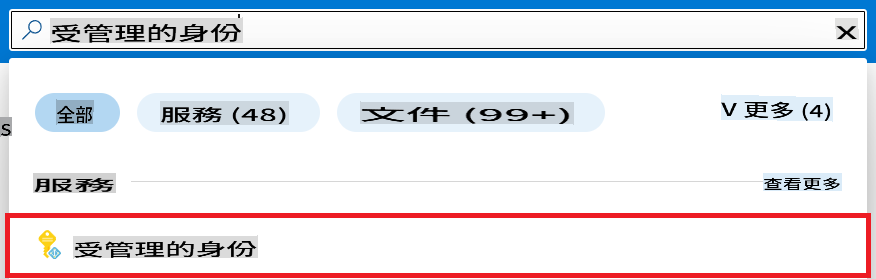

1. 選擇 **+ Create**。

    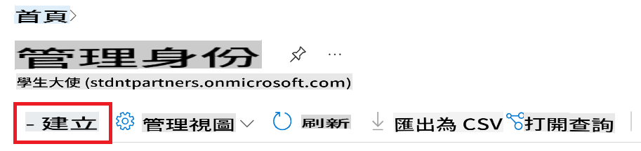

1. 執行以下任務：

    - 選擇你的 Azure **訂閱**。
    - 選擇要使用的 **資源組**（如果需要，創建一個新的）。
    - 選擇你想使用的 **區域**。
    - 輸入 **名稱**。它必須是唯一的值。

1. 選擇 **Review + create**。

1. 選擇 **+ Create**。

#### 為管理身份添加貢獻者角色分配

1. 導航到你創建的管理身份資源。

1. 從左側選項卡中選擇 **Azure role assignments**。

1. 從導航菜單中選擇 **+Add role assignment**。

1. 在添加角色分配頁面中，執行以下任務：
    - 將 **範圍** 設置為 **資源組**。
    - 選擇你的 Azure **訂閱**。
    - 選擇要使用的 **資源組**。
    - 將 **角色** 設置為 **Contributor**。

    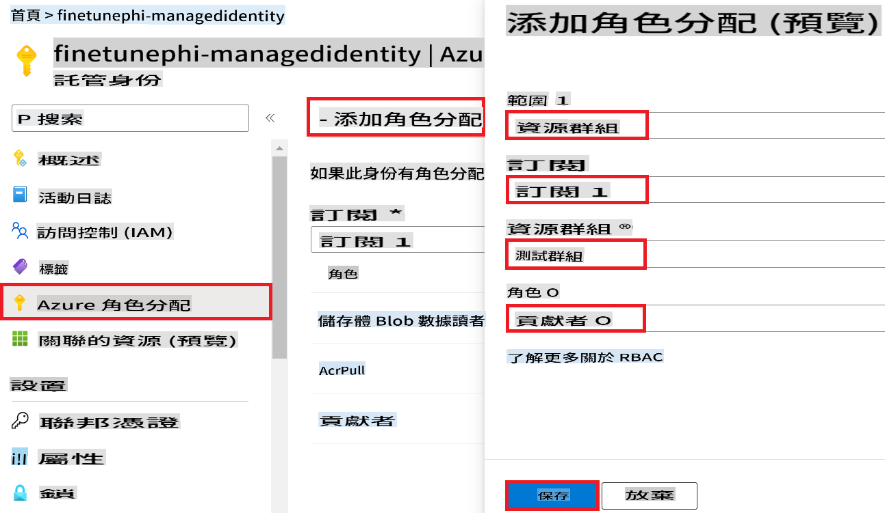

1. 選擇 **Save**。

#### 為管理身份添加 Storage Blob Data Reader 角色分配

1. 在入口頁頂部的 **搜索欄** 中輸入 *storage accounts*，並從出現的選項中選擇 **Storage accounts**。

    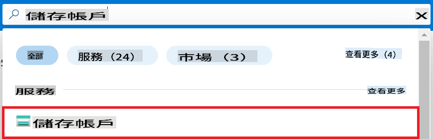

1. 選擇與你創建的 Azure Machine Learning 工作區關聯的存儲帳戶。例如，*finetunephistorage*。

1. 執行以下任務以導航到添加角色分配頁面：

    - 導航到你創建的 Azure 存儲帳戶。
    - 從左側選項卡中選擇 **Access Control (IAM)**。
    - 從導航菜單中選擇 **+ Add**。
    - 從導航菜單中選擇 **Add role assignment**。

    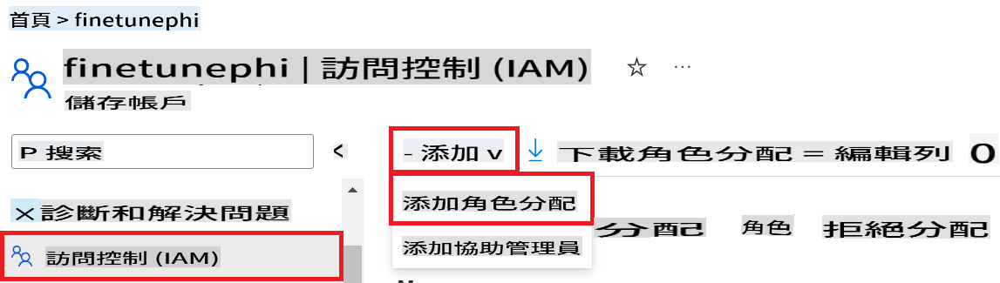

1. 在添加角色分配頁面中，執行以下任務：

    - 在角色頁面中，在 **搜索欄** 中輸入 *Storage Blob Data Reader*，並從出現的選項中選擇 **Storage Blob Data Reader**。
    - 在角色頁面中選擇 **Next**。
    - 在成員頁面中，選擇 **Assign access to** **Managed identity**。
    - 在成員頁面中選擇 **+ Select members**。
    - 在選擇管理身份頁面中，選擇你的 Azure **訂閱**。
    - 在選擇管理身份頁面中，將 **管理身份** 設置為 **Manage Identity**。
    - 在選擇管理身份頁面中，選擇你創建的管理身份。例如，*finetunephi-managedidentity*。
    - 在選擇管理身份頁面中選擇 **Select**。

    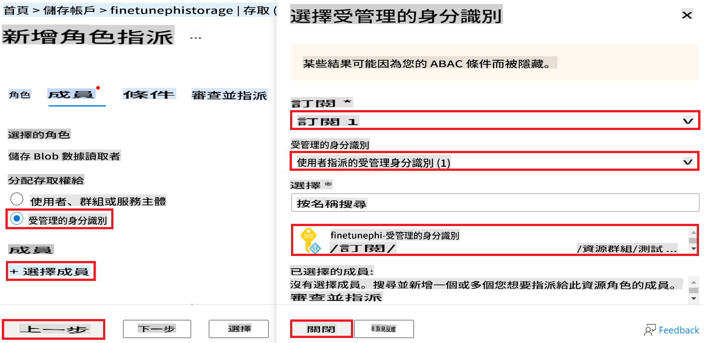

1. 選擇 **Review + assign**。

#### 為管理身份添加 AcrPull 角色分配

1. 在入口頁頂部的 **搜索欄** 中輸入 *container registries*，並從出現的選項中選擇 **Container registries**。

    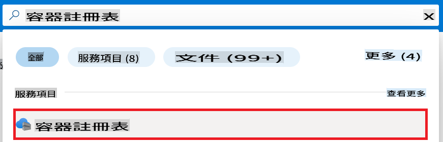

1. 選擇與 Azure Machine Learning 工作區關聯的容器註冊表。例如，*finetunephicontainerregistries*

1. 執行以下任務以導航到添加角色分配頁面：

    - 從左側選項卡中選擇 **Access Control (IAM)**。
    - 從導航菜單中選擇 **+ Add**。
    - 從導航菜單中選擇 **Add role assignment**。

1. 在添加角色分配頁面中，執行以下任務：

    - 在角色頁面中，在 **搜索欄** 中輸入 *AcrPull*，並從出現的選項中選擇 **AcrPull**。
    - 在角色頁面中選擇 **Next**。
    - 在成員頁面中，選擇 **Assign access to** **Managed identity**。
    - 在成員頁面中選擇 **+ Select members**。
    - 在選擇管理身份頁面中，選擇你的 Azure **訂閱**。
    - 在選擇管理身份頁面中，將 **管理身份** 設置為 **Manage Identity**。
    - 在選擇管理身份頁面中，選擇你創建的管理身份。例如，*finetunephi-managedidentity*。
    - 在選擇管理身份頁面中選擇 **Select**。
    - 選擇 **Review + assign**。

### 設置項目

現在，你將創建一個文件夾來工作，並設置一個虛擬環境來開發一個與用戶交互並使用 Azure Cosmos DB 中存儲的聊天歷史記錄來提供回應的程序。

#### 創建一個工作文件夾

1. 打開終端窗口，輸入以下命令在默認路徑中創建一個名為 *finetune-phi* 的文件夾。

    ```console
    mkdir finetune-phi
    ```

1. 在終端中輸入以下命令導航到你創建的 *finetune-phi* 文件夾。

    ```console
    cd finetune-phi
    ```

#### 創建一個虛擬環境

1. 在終端中輸入以下命令創建一個名為 *.venv* 的虛擬環境。

    ```console
    python -m venv .venv
    ```

1. 在終端中輸入以下命令激活虛擬環境。

    ```console
    .venv\Scripts\activate.bat
    ```

> [!NOTE]
>
> 如果成功，你應該會在命令提示符前看到 *(.venv)*。

#### 安裝所需的包

1. 在終端中輸入以下命令來安裝所需的包。

    ```console
    pip install datasets==2.19.1
    pip install transformers==4.41.1
    pip install azure-ai-ml==1.16.0
    pip install torch==2.3.1
    pip install trl==0.9.4
    pip install promptflow==1.12.0
    ```

#### 創建項目文件

在這個練習中，你將創建項目的基本文件。這些文件包括下載數據集的腳本、設置 Azure Machine Learning 環境、微調 Phi-3 模型以及部署微調後的模型的腳本。你還將創建一個 *conda.yml* 文件來設置微調環境。

在這個練習中，你將：

- 創建一個 *download_dataset.py* 文件來下載數據集。
- 創建一個 *setup_ml.py* 文件來設置 Azure Machine Learning 環境。
- 在 *finetuning_dir* 文件夾中創建一個 *fine_tune.py* 文件來使用數據集微調 Phi-3 模型。
- 創建一個 *conda.yml* 文件來設置微調環境。
- 創建一個 *deploy_model.py* 文件來部署微調後的模型。
- 創建一個 *integrate_with_promptflow.py* 文件來整合微調後的模型並使用 Prompt flow 執行模型。
- 創建一個 flow.dag.yml 文件來設置 Prompt flow 的工作流程結構。
- 創建一個 *config.py* 文件來輸入 Azure 信息。

> [!NOTE]
>
> 完整的文件夾結構：
>
> ```text
> └── YourUserName
> .    └── finetune-phi
> .        ├── finetuning_dir
> .        │      └── fine_tune.py
> .        ├── conda.yml
> .        ├── config.py
> .        ├── deploy_model.py
> .        ├── download_dataset.py
> .        ├── flow.dag.yml
> .        ├── integrate_with_promptflow.py
> .        └── setup_ml.py
> ```

1. 打開 **Visual Studio Code**。

1. 從菜單欄中選擇 **File**。

1. 選擇 **Open Folder**。

1. 選擇你創建的 *finetune-phi* 文件夾，位於 *C:\Users\yourUserName\finetune-phi*。

    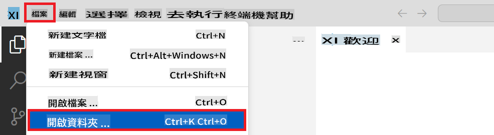

1. 在 Visual Studio Code 的左側窗格中，右鍵單擊並選擇 **New File** 來創建一個名為 *download_dataset.py* 的新文件。

1. 在 Visual Studio Code 的左側窗格中，右鍵單擊並選擇 **New File** 來創建一個名為 *setup_ml.py* 的新文件。

1. 在 Visual Studio Code 的左側窗格中，右鍵單擊並選擇 **New File** 來創建一個名為 *deploy_model.py* 的新文件。

    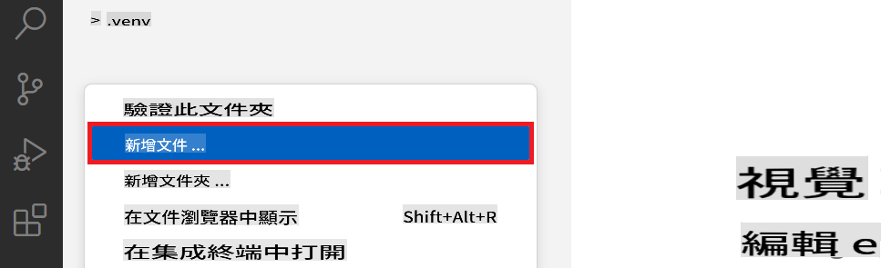

1. 在 Visual Studio Code 的左側窗格中，右鍵單擊並選擇 **New Folder** 來創建一個名為 *finetuning_dir* 的新文件夾。

1. 在 *finetuning_dir* 文件夾中，創建一個名為 *fine_tune.py* 的新文件。

#### 創建和配置 *conda.yml* 文件

1. 在 Visual Studio Code 的左側窗格中，右鍵單擊並選擇 **New File** 來創建一個名為 *conda.yml* 的新文件。

1. 將以下代碼添加到 *conda.yml* 文件中，以設置 Phi-3 模型的微調環境。

    ```yml
    name: phi-3-training-env
    channels:
      - defaults
      - conda-forge
    dependencies:
      - python=3.10
      - pip
      - numpy<2.0
      - pip:
          - torch==2.4.0
          - torchvision==0.19.0
          - trl==0.8.6
          - transformers==4.41
          - datasets==2.21.0
          - azureml-core==1.57.0
          - azure-storage-blob==12.19.0
          - azure-ai-ml==1.16
          - azure-identity==1.17.1
          - accelerate==0.33.0
          - mlflow==2.15.1
          - azureml-mlflow==1.57.0
    ```

#### 創建和配置 *config.py* 文件

1. 在 Visual Studio Code 的左側窗格中，右鍵單擊並選擇 **New File** 來創建一個名為 *config.py* 的新文件。

1. 將以下代碼添加到 *config.py* 文件中，以包含你的 Azure 信息。

    ```python
    # Azure settings
    AZURE_SUBSCRIPTION_ID = "your_subscription_id"
    AZURE_RESOURCE_GROUP_NAME = "your_resource_group_name" # "TestGroup"

    # Azure Machine Learning settings
    AZURE_ML_WORKSPACE_NAME = "your_workspace_name" # "finetunephi-workspace"

    # Azure Managed Identity settings
    AZURE_MANAGED_IDENTITY_CLIENT_ID = "your_azure_managed_identity_client_id"
    AZURE_MANAGED_IDENTITY_NAME = "your_azure_managed_identity_name" # "finetunephi-mangedidentity"
    AZURE_MANAGED_IDENTITY_RESOURCE_ID = f"/subscriptions/{AZURE_SUBSCRIPTION_ID}/resourceGroups/{AZURE_RESOURCE_GROUP_NAME}/providers/Microsoft.ManagedIdentity/userAssignedIdentities/{AZURE_MANAGED_IDENTITY_NAME}"

    # Dataset file paths
    TRAIN_DATA_PATH = "data/train_data.jsonl"
    TEST_DATA_PATH = "data/test_data.jsonl"

    # Fine-tuned model settings
    AZURE_MODEL_NAME = "your_fine_tuned_model_name" # "finetune-phi-model"
    AZURE_ENDPOINT_NAME = "your_fine_tuned_model_endpoint_name" # "finetune-phi-endpoint"
    AZURE_DEPLOYMENT_NAME = "your_fine_tuned_model_deployment_name" # "finetune-phi-deployment"

    AZURE_ML_API_KEY = "your_fine_tuned_model_api_key"
    AZURE_ML_ENDPOINT = "your_fine_tuned_model_endpoint_uri" # "https://{your-endpoint-name}.{your-region}.inference.ml.azure.com/score"
    ```

#### 添加 Azure 環境變量

1. 執行以下任務以添加 Azure 訂閱 ID：

    - 在入口頁頂部的
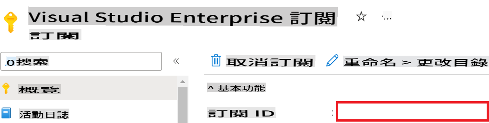

1. 執行以下任務來添加 Azure Workspace 名稱：

    - 瀏覽到你創建的 Azure Machine Learning 資源。
    - 複製並粘貼你的帳戶名稱到 *config.py* 文件中。

    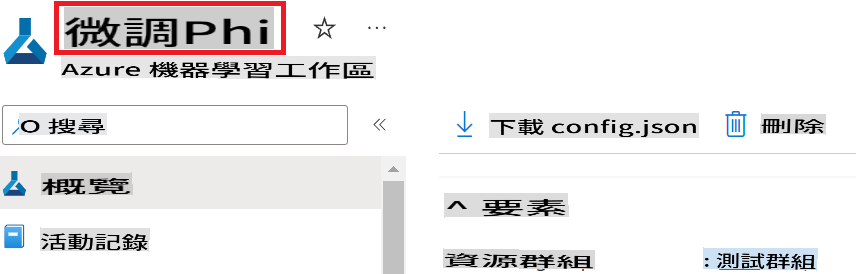

1. 執行以下任務來添加 Azure 資源組名稱：

    - 瀏覽到你創建的 Azure Machine Learning 資源。
    - 複製並粘貼你的 Azure 資源組名稱到 *config.py* 文件中。

    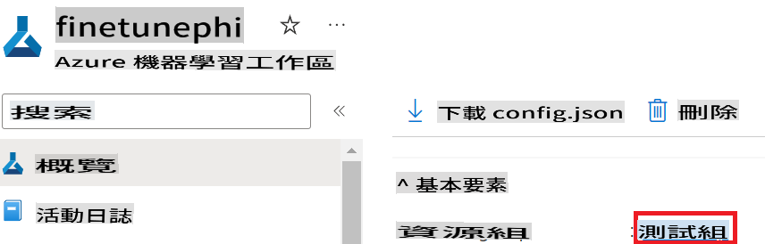

1. 執行以下任務來添加 Azure Managed Identity 名稱：

    - 瀏覽到你創建的 Managed Identities 資源。
    - 複製並粘貼你的 Azure Managed Identity 名稱到 *config.py* 文件中。

    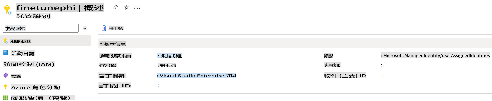

### 準備數據集進行微調

在這個練習中，你將運行 *download_dataset.py* 文件來下載 *ULTRACHAT_200k* 數據集到你的本地環境。然後你將使用這個數據集在 Azure Machine Learning 中微調 Phi-3 模型。

#### 使用 *download_dataset.py* 下載數據集

1. 在 Visual Studio Code 中打開 *download_dataset.py* 文件。

1. 將以下代碼添加到 *download_dataset.py* 文件中。

    ```python
    import json
    import os
    from datasets import load_dataset
    from config import (
        TRAIN_DATA_PATH,
        TEST_DATA_PATH)

    def load_and_split_dataset(dataset_name, config_name, split_ratio):
        """
        Load and split a dataset.
        """
        # Load the dataset with the specified name, configuration, and split ratio
        dataset = load_dataset(dataset_name, config_name, split=split_ratio)
        print(f"Original dataset size: {len(dataset)}")
        
        # Split the dataset into train and test sets (80% train, 20% test)
        split_dataset = dataset.train_test_split(test_size=0.2)
        print(f"Train dataset size: {len(split_dataset['train'])}")
        print(f"Test dataset size: {len(split_dataset['test'])}")
        
        return split_dataset

    def save_dataset_to_jsonl(dataset, filepath):
        """
        Save a dataset to a JSONL file.
        """
        # Create the directory if it does not exist
        os.makedirs(os.path.dirname(filepath), exist_ok=True)
        
        # Open the file in write mode
        with open(filepath, 'w', encoding='utf-8') as f:
            # Iterate over each record in the dataset
            for record in dataset:
                # Dump the record as a JSON object and write it to the file
                json.dump(record, f)
                # Write a newline character to separate records
                f.write('\n')
        
        print(f"Dataset saved to {filepath}")

    def main():
        """
        Main function to load, split, and save the dataset.
        """
        # Load and split the ULTRACHAT_200k dataset with a specific configuration and split ratio
        dataset = load_and_split_dataset("HuggingFaceH4/ultrachat_200k", 'default', 'train_sft[:1%]')
        
        # Extract the train and test datasets from the split
        train_dataset = dataset['train']
        test_dataset = dataset['test']

        # Save the train dataset to a JSONL file
        save_dataset_to_jsonl(train_dataset, TRAIN_DATA_PATH)
        
        # Save the test dataset to a separate JSONL file
        save_dataset_to_jsonl(test_dataset, TEST_DATA_PATH)

    if __name__ == "__main__":
        main()

    ```

> [!TIP]
>
> **使用最小數據集和 CPU 進行微調的指導**
>
> 如果你想使用 CPU 進行微調，這種方法對於擁有福利訂閱（如 Visual Studio Enterprise 訂閱）的人或快速測試微調和部署過程非常理想。
>
> 替換 `dataset = load_and_split_dataset("HuggingFaceH4/ultrachat_200k", 'default', 'train_sft[:1%]')` with `dataset = load_and_split_dataset("HuggingFaceH4/ultrachat_200k", 'default', 'train_sft[:10]')`
>

1. 在終端中輸入以下命令來運行腳本並將數據集下載到本地環境。

    ```console
    python download_data.py
    ```

1. 驗證數據集是否成功保存到本地 *finetune-phi/data* 目錄。

> [!NOTE]
>
> **數據集大小和微調時間**
>
> 在這個 E2E 範例中，你只使用了 1% 的數據集 (`train_sft[:1%]`)。這顯著減少了數據量，加快了上傳和微調過程。你可以調整百分比來找到訓練時間和模型性能之間的最佳平衡。使用較小的數據集子集可以減少微調所需的時間，使 E2E 範例的過程更易於管理。

## 情境 2：微調 Phi-3 模型並在 Azure Machine Learning Studio 中部署

### 設置 Azure CLI

你需要設置 Azure CLI 來驗證你的環境。Azure CLI 允許你直接從命令行管理 Azure 資源，並提供 Azure Machine Learning 訪問這些資源所需的憑據。要開始，請安裝 [Azure CLI](https://learn.microsoft.com/cli/azure/install-azure-cli)

1. 打開一個終端窗口並輸入以下命令登錄到你的 Azure 帳戶。

    ```console
    az login
    ```

1. 選擇你要使用的 Azure 帳戶。

1. 選擇你要使用的 Azure 訂閱。

    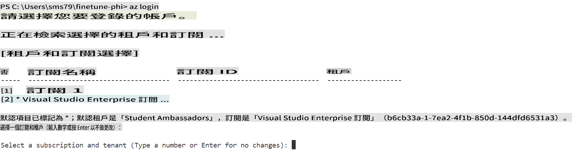

> [!TIP]
>
> 如果你在登錄 Azure 時遇到問題，請嘗試使用設備代碼。打開終端窗口並輸入以下命令登錄到你的 Azure 帳戶：
>
> ```console
> az login --use-device-code
> ```
>

### 微調 Phi-3 模型

在這個練習中，你將使用提供的數據集微調 Phi-3 模型。首先，你將在 *fine_tune.py* 文件中定義微調過程。然後，你將配置 Azure Machine Learning 環境並通過運行 *setup_ml.py* 文件來啟動微調過程。這個腳本確保微調在 Azure Machine Learning 環境中進行。

通過運行 *setup_ml.py*，你將在 Azure Machine Learning 環境中運行微調過程。

#### 在 *fine_tune.py* 文件中添加代碼

1. 瀏覽到 *finetuning_dir* 文件夾並在 Visual Studio Code 中打開 *fine_tune.py* 文件。

1. 將以下代碼添加到 *fine_tune.py* 文件中。

    ```python
    import argparse
    import sys
    import logging
    import os
    from datasets import load_dataset
    import torch
    import mlflow
    from transformers import AutoModelForCausalLM, AutoTokenizer, TrainingArguments
    from trl import SFTTrainer

    # To avoid the INVALID_PARAMETER_VALUE error in MLflow, disable MLflow integration
    os.environ["DISABLE_MLFLOW_INTEGRATION"] = "True"

    # Logging setup
    logging.basicConfig(
        format="%(asctime)s - %(levelname)s - %(name)s - %(message)s",
        datefmt="%Y-%m-%d %H:%M:%S",
        handlers=[logging.StreamHandler(sys.stdout)],
        level=logging.WARNING
    )
    logger = logging.getLogger(__name__)

    def initialize_model_and_tokenizer(model_name, model_kwargs):
        """
        Initialize the model and tokenizer with the given pretrained model name and arguments.
        """
        model = AutoModelForCausalLM.from_pretrained(model_name, **model_kwargs)
        tokenizer = AutoTokenizer.from_pretrained(model_name)
        tokenizer.model_max_length = 2048
        tokenizer.pad_token = tokenizer.unk_token
        tokenizer.pad_token_id = tokenizer.convert_tokens_to_ids(tokenizer.pad_token)
        tokenizer.padding_side = 'right'
        return model, tokenizer

    def apply_chat_template(example, tokenizer):
        """
        Apply a chat template to tokenize messages in the example.
        """
        messages = example["messages"]
        if messages[0]["role"] != "system":
            messages.insert(0, {"role": "system", "content": ""})
        example["text"] = tokenizer.apply_chat_template(
            messages, tokenize=False, add_generation_prompt=False
        )
        return example

    def load_and_preprocess_data(train_filepath, test_filepath, tokenizer):
        """
        Load and preprocess the dataset.
        """
        train_dataset = load_dataset('json', data_files=train_filepath, split='train')
        test_dataset = load_dataset('json', data_files=test_filepath, split='train')
        column_names = list(train_dataset.features)

        train_dataset = train_dataset.map(
            apply_chat_template,
            fn_kwargs={"tokenizer": tokenizer},
            num_proc=10,
            remove_columns=column_names,
            desc="Applying chat template to train dataset",
        )

        test_dataset = test_dataset.map(
            apply_chat_template,
            fn_kwargs={"tokenizer": tokenizer},
            num_proc=10,
            remove_columns=column_names,
            desc="Applying chat template to test dataset",
        )

        return train_dataset, test_dataset

    def train_and_evaluate_model(train_dataset, test_dataset, model, tokenizer, output_dir):
        """
        Train and evaluate the model.
        """
        training_args = TrainingArguments(
            bf16=True,
            do_eval=True,
            output_dir=output_dir,
            eval_strategy="epoch",
            learning_rate=5.0e-06,
            logging_steps=20,
            lr_scheduler_type="cosine",
            num_train_epochs=3,
            overwrite_output_dir=True,
            per_device_eval_batch_size=4,
            per_device_train_batch_size=4,
            remove_unused_columns=True,
            save_steps=500,
            seed=0,
            gradient_checkpointing=True,
            gradient_accumulation_steps=1,
            warmup_ratio=0.2,
        )

        trainer = SFTTrainer(
            model=model,
            args=training_args,
            train_dataset=train_dataset,
            eval_dataset=test_dataset,
            max_seq_length=2048,
            dataset_text_field="text",
            tokenizer=tokenizer,
            packing=True
        )

        train_result = trainer.train()
        trainer.log_metrics("train", train_result.metrics)

        mlflow.transformers.log_model(
            transformers_model={"model": trainer.model, "tokenizer": tokenizer},
            artifact_path=output_dir,
        )

        tokenizer.padding_side = 'left'
        eval_metrics = trainer.evaluate()
        eval_metrics["eval_samples"] = len(test_dataset)
        trainer.log_metrics("eval", eval_metrics)

    def main(train_file, eval_file, model_output_dir):
        """
        Main function to fine-tune the model.
        """
        model_kwargs = {
            "use_cache": False,
            "trust_remote_code": True,
            "torch_dtype": torch.bfloat16,
            "device_map": None,
            "attn_implementation": "eager"
        }

        # pretrained_model_name = "microsoft/Phi-3-mini-4k-instruct"
        pretrained_model_name = "microsoft/Phi-3.5-mini-instruct"

        with mlflow.start_run():
            model, tokenizer = initialize_model_and_tokenizer(pretrained_model_name, model_kwargs)
            train_dataset, test_dataset = load_and_preprocess_data(train_file, eval_file, tokenizer)
            train_and_evaluate_model(train_dataset, test_dataset, model, tokenizer, model_output_dir)

    if __name__ == "__main__":
        parser = argparse.ArgumentParser()
        parser.add_argument("--train-file", type=str, required=True, help="Path to the training data")
        parser.add_argument("--eval-file", type=str, required=True, help="Path to the evaluation data")
        parser.add_argument("--model_output_dir", type=str, required=True, help="Directory to save the fine-tuned model")
        args = parser.parse_args()
        main(args.train_file, args.eval_file, args.model_output_dir)

    ```

1. 保存並關閉 *fine_tune.py* 文件。

> [!TIP]
> **你可以微調 Phi-3.5 模型**
>
> 在 *fine_tune.py* 文件中，你可以更改 `pretrained_model_name` from `"microsoft/Phi-3-mini-4k-instruct"` to any model you want to fine-tune. For example, if you change it to `"microsoft/Phi-3.5-mini-instruct"`, you'll be using the Phi-3.5-mini-instruct model for fine-tuning. To find and use the model name you prefer, visit [Hugging Face](https://huggingface.co/), search for the model you're interested in, and then copy and paste its name into the `pretrained_model_name` 字段。
>
> :::image type="content" source="../../imgs/03/FineTuning-PromptFlow/finetunephi3.5.png" alt-text="Fine tune Phi-3.5.":::
>

#### 在 *setup_ml.py* 文件中添加代碼

1. 在 Visual Studio Code 中打開 *setup_ml.py* 文件。

1. 將以下代碼添加到 *setup_ml.py* 文件中。

    ```python
    import logging
    from azure.ai.ml import MLClient, command, Input
    from azure.ai.ml.entities import Environment, AmlCompute
    from azure.identity import AzureCliCredential
    from config import (
        AZURE_SUBSCRIPTION_ID,
        AZURE_RESOURCE_GROUP_NAME,
        AZURE_ML_WORKSPACE_NAME,
        TRAIN_DATA_PATH,
        TEST_DATA_PATH
    )

    # Constants

    # Uncomment the following lines to use a CPU instance for training
    # COMPUTE_INSTANCE_TYPE = "Standard_E16s_v3" # cpu
    # COMPUTE_NAME = "cpu-e16s-v3"
    # DOCKER_IMAGE_NAME = "mcr.microsoft.com/azureml/openmpi4.1.0-ubuntu20.04:latest"

    # Uncomment the following lines to use a GPU instance for training
    COMPUTE_INSTANCE_TYPE = "Standard_NC24ads_A100_v4"
    COMPUTE_NAME = "gpu-nc24s-a100-v4"
    DOCKER_IMAGE_NAME = "mcr.microsoft.com/azureml/curated/acft-hf-nlp-gpu:59"

    CONDA_FILE = "conda.yml"
    LOCATION = "eastus2" # Replace with the location of your compute cluster
    FINETUNING_DIR = "./finetuning_dir" # Path to the fine-tuning script
    TRAINING_ENV_NAME = "phi-3-training-environment" # Name of the training environment
    MODEL_OUTPUT_DIR = "./model_output" # Path to the model output directory in azure ml

    # Logging setup to track the process
    logger = logging.getLogger(__name__)
    logging.basicConfig(
        format="%(asctime)s - %(levelname)s - %(name)s - %(message)s",
        datefmt="%Y-%m-%d %H:%M:%S",
        level=logging.WARNING
    )

    def get_ml_client():
        """
        Initialize the ML Client using Azure CLI credentials.
        """
        credential = AzureCliCredential()
        return MLClient(credential, AZURE_SUBSCRIPTION_ID, AZURE_RESOURCE_GROUP_NAME, AZURE_ML_WORKSPACE_NAME)

    def create_or_get_environment(ml_client):
        """
        Create or update the training environment in Azure ML.
        """
        env = Environment(
            image=DOCKER_IMAGE_NAME,  # Docker image for the environment
            conda_file=CONDA_FILE,  # Conda environment file
            name=TRAINING_ENV_NAME,  # Name of the environment
        )
        return ml_client.environments.create_or_update(env)

    def create_or_get_compute_cluster(ml_client, compute_name, COMPUTE_INSTANCE_TYPE, location):
        """
        Create or update the compute cluster in Azure ML.
        """
        try:
            compute_cluster = ml_client.compute.get(compute_name)
            logger.info(f"Compute cluster '{compute_name}' already exists. Reusing it for the current run.")
        except Exception:
            logger.info(f"Compute cluster '{compute_name}' does not exist. Creating a new one with size {COMPUTE_INSTANCE_TYPE}.")
            compute_cluster = AmlCompute(
                name=compute_name,
                size=COMPUTE_INSTANCE_TYPE,
                location=location,
                tier="Dedicated",  # Tier of the compute cluster
                min_instances=0,  # Minimum number of instances
                max_instances=1  # Maximum number of instances
            )
            ml_client.compute.begin_create_or_update(compute_cluster).wait()  # Wait for the cluster to be created
        return compute_cluster

    def create_fine_tuning_job(env, compute_name):
        """
        Set up the fine-tuning job in Azure ML.
        """
        return command(
            code=FINETUNING_DIR,  # Path to fine_tune.py
            command=(
                "python fine_tune.py "
                "--train-file ${{inputs.train_file}} "
                "--eval-file ${{inputs.eval_file}} "
                "--model_output_dir ${{inputs.model_output}}"
            ),
            environment=env,  # Training environment
            compute=compute_name,  # Compute cluster to use
            inputs={
                "train_file": Input(type="uri_file", path=TRAIN_DATA_PATH),  # Path to the training data file
                "eval_file": Input(type="uri_file", path=TEST_DATA_PATH),  # Path to the evaluation data file
                "model_output": MODEL_OUTPUT_DIR
            }
        )

    def main():
        """
        Main function to set up and run the fine-tuning job in Azure ML.
        """
        # Initialize ML Client
        ml_client = get_ml_client()

        # Create Environment
        env = create_or_get_environment(ml_client)
        
        # Create or get existing compute cluster
        create_or_get_compute_cluster(ml_client, COMPUTE_NAME, COMPUTE_INSTANCE_TYPE, LOCATION)

        # Create and Submit Fine-Tuning Job
        job = create_fine_tuning_job(env, COMPUTE_NAME)
        returned_job = ml_client.jobs.create_or_update(job)  # Submit the job
        ml_client.jobs.stream(returned_job.name)  # Stream the job logs
        
        # Capture the job name
        job_name = returned_job.name
        print(f"Job name: {job_name}")

    if __name__ == "__main__":
        main()

    ```

1. 替換 `COMPUTE_INSTANCE_TYPE`, `COMPUTE_NAME`, and `LOCATION` 為你的具體信息。

    ```python
   # Uncomment the following lines to use a GPU instance for training
    COMPUTE_INSTANCE_TYPE = "Standard_NC24ads_A100_v4"
    COMPUTE_NAME = "gpu-nc24s-a100-v4"
    ...
    LOCATION = "eastus2" # Replace with the location of your compute cluster
    ```

> [!TIP]
>
> **使用最小數據集和 CPU 進行微調的指導**
>
> 如果你想使用 CPU 進行微調，這種方法對於擁有福利訂閱（如 Visual Studio Enterprise 訂閱）的人或快速測試微調和部署過程非常理想。
>
> 1. 打開 *setup_ml* 文件。
> 1. 替換 `COMPUTE_INSTANCE_TYPE`, `COMPUTE_NAME`, and `DOCKER_IMAGE_NAME` with the following. If you do not have access to *Standard_E16s_v3*, you can use an equivalent CPU instance or request a new quota.
> 1. Replace `LOCATION` 為你的具體信息。
>
>    ```python
>    # Uncomment the following lines to use a CPU instance for training
>    COMPUTE_INSTANCE_TYPE = "Standard_E16s_v3" # cpu
>    COMPUTE_NAME = "cpu-e16s-v3"
>    DOCKER_IMAGE_NAME = "mcr.microsoft.com/azureml/openmpi4.1.0-ubuntu20.04:latest"
>    LOCATION = "eastus2" # Replace with the location of your compute cluster
>    ```
>

1. 輸入以下命令來運行 *setup_ml.py* 腳本並在 Azure Machine Learning 中啟動微調過程。

    ```python
    python setup_ml.py
    ```

1. 在這個練習中，你成功地使用 Azure Machine Learning 微調了 Phi-3 模型。通過運行 *setup_ml.py* 腳本，你已設置 Azure Machine Learning 環境並啟動了 *fine_tune.py* 文件中定義的微調過程。請注意，微調過程可能需要相當長的時間。運行 `python setup_ml.py` command, you need to wait for the process to complete. You can monitor the status of the fine-tuning job by following the link provided in the terminal to the Azure Machine Learning portal.

    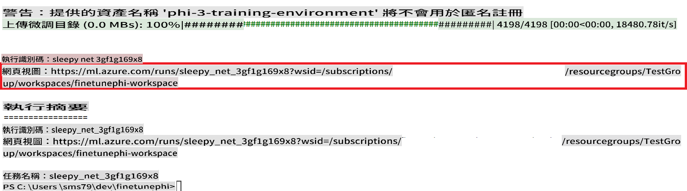

### Deploy the fine-tuned model

To integrate the fine-tuned Phi-3 model with Prompt Flow, you need to deploy the model to make it accessible for real-time inference. This process involves registering the model, creating an online endpoint, and deploying the model.

#### Set the model name, endpoint name, and deployment name for deployment

1. Open *config.py* file.

1. Replace `AZURE_MODEL_NAME = "your_fine_tuned_model_name"` with the desired name for your model.

1. Replace `AZURE_ENDPOINT_NAME = "your_fine_tuned_model_endpoint_name"` with the desired name for your endpoint.

1. Replace `AZURE_DEPLOYMENT_NAME = "your_fine_tuned_model_deployment_name"` 並使用你想要的部署名稱。

#### 在 *deploy_model.py* 文件中添加代碼

運行 *deploy_model.py* 文件會自動完成整個部署過程。它會註冊模型，創建端點，並根據 *config.py* 文件中指定的設置執行部署，包括模型名稱、端點名稱和部署名稱。

1. 在 Visual Studio Code 中打開 *deploy_model.py* 文件。

1. 將以下代碼添加到 *deploy_model.py* 文件中。

    ```python
    import logging
    from azure.identity import AzureCliCredential
    from azure.ai.ml import MLClient
    from azure.ai.ml.entities import Model, ProbeSettings, ManagedOnlineEndpoint, ManagedOnlineDeployment, IdentityConfiguration, ManagedIdentityConfiguration, OnlineRequestSettings
    from azure.ai.ml.constants import AssetTypes

    # Configuration imports
    from config import (
        AZURE_SUBSCRIPTION_ID,
        AZURE_RESOURCE_GROUP_NAME,
        AZURE_ML_WORKSPACE_NAME,
        AZURE_MANAGED_IDENTITY_RESOURCE_ID,
        AZURE_MANAGED_IDENTITY_CLIENT_ID,
        AZURE_MODEL_NAME,
        AZURE_ENDPOINT_NAME,
        AZURE_DEPLOYMENT_NAME
    )

    # Constants
    JOB_NAME = "your-job-name"
    COMPUTE_INSTANCE_TYPE = "Standard_E4s_v3"

    deployment_env_vars = {
        "SUBSCRIPTION_ID": AZURE_SUBSCRIPTION_ID,
        "RESOURCE_GROUP_NAME": AZURE_RESOURCE_GROUP_NAME,
        "UAI_CLIENT_ID": AZURE_MANAGED_IDENTITY_CLIENT_ID,
    }

    # Logging setup
    logging.basicConfig(
        format="%(asctime)s - %(levelname)s - %(name)s - %(message)s",
        datefmt="%Y-%m-%d %H:%M:%S",
        level=logging.DEBUG
    )
    logger = logging.getLogger(__name__)

    def get_ml_client():
        """Initialize and return the ML Client."""
        credential = AzureCliCredential()
        return MLClient(credential, AZURE_SUBSCRIPTION_ID, AZURE_RESOURCE_GROUP_NAME, AZURE_ML_WORKSPACE_NAME)

    def register_model(ml_client, model_name, job_name):
        """Register a new model."""
        model_path = f"azureml://jobs/{job_name}/outputs/artifacts/paths/model_output"
        logger.info(f"Registering model {model_name} from job {job_name} at path {model_path}.")
        run_model = Model(
            path=model_path,
            name=model_name,
            description="Model created from run.",
            type=AssetTypes.MLFLOW_MODEL,
        )
        model = ml_client.models.create_or_update(run_model)
        logger.info(f"Registered model ID: {model.id}")
        return model

    def delete_existing_endpoint(ml_client, endpoint_name):
        """Delete existing endpoint if it exists."""
        try:
            endpoint_result = ml_client.online_endpoints.get(name=endpoint_name)
            logger.info(f"Deleting existing endpoint {endpoint_name}.")
            ml_client.online_endpoints.begin_delete(name=endpoint_name).result()
            logger.info(f"Deleted existing endpoint {endpoint_name}.")
        except Exception as e:
            logger.info(f"No existing endpoint {endpoint_name} found to delete: {e}")

    def create_or_update_endpoint(ml_client, endpoint_name, description=""):
        """Create or update an endpoint."""
        delete_existing_endpoint(ml_client, endpoint_name)
        logger.info(f"Creating new endpoint {endpoint_name}.")
        endpoint = ManagedOnlineEndpoint(
            name=endpoint_name,
            description=description,
            identity=IdentityConfiguration(
                type="user_assigned",
                user_assigned_identities=[ManagedIdentityConfiguration(resource_id=AZURE_MANAGED_IDENTITY_RESOURCE_ID)]
            )
        )
        endpoint_result = ml_client.online_endpoints.begin_create_or_update(endpoint).result()
        logger.info(f"Created new endpoint {endpoint_name}.")
        return endpoint_result

    def create_or_update_deployment(ml_client, endpoint_name, deployment_name, model):
        """Create or update a deployment."""

        logger.info(f"Creating deployment {deployment_name} for endpoint {endpoint_name}.")
        deployment = ManagedOnlineDeployment(
            name=deployment_name,
            endpoint_name=endpoint_name,
            model=model.id,
            instance_type=COMPUTE_INSTANCE_TYPE,
            instance_count=1,
            environment_variables=deployment_env_vars,
            request_settings=OnlineRequestSettings(
                max_concurrent_requests_per_instance=3,
                request_timeout_ms=180000,
                max_queue_wait_ms=120000
            ),
            liveness_probe=ProbeSettings(
                failure_threshold=30,
                success_threshold=1,
                period=100,
                initial_delay=500,
            ),
            readiness_probe=ProbeSettings(
                failure_threshold=30,
                success_threshold=1,
                period=100,
                initial_delay=500,
            ),
        )
        deployment_result = ml_client.online_deployments.begin_create_or_update(deployment).result()
        logger.info(f"Created deployment {deployment.name} for endpoint {endpoint_name}.")
        return deployment_result

    def set_traffic_to_deployment(ml_client, endpoint_name, deployment_name):
        """Set traffic to the specified deployment."""
        try:
            # Fetch the current endpoint details
            endpoint = ml_client.online_endpoints.get(name=endpoint_name)
            
            # Log the current traffic allocation for debugging
            logger.info(f"Current traffic allocation: {endpoint.traffic}")
            
            # Set the traffic allocation for the deployment
            endpoint.traffic = {deployment_name: 100}
            
            # Update the endpoint with the new traffic allocation
            endpoint_poller = ml_client.online_endpoints.begin_create_or_update(endpoint)
            updated_endpoint = endpoint_poller.result()
            
            # Log the updated traffic allocation for debugging
            logger.info(f"Updated traffic allocation: {updated_endpoint.traffic}")
            logger.info(f"Set traffic to deployment {deployment_name} at endpoint {endpoint_name}.")
            return updated_endpoint
        except Exception as e:
            # Log any errors that occur during the process
            logger.error(f"Failed to set traffic to deployment: {e}")
            raise


    def main():
        ml_client = get_ml_client()

        registered_model = register_model(ml_client, AZURE_MODEL_NAME, JOB_NAME)
        logger.info(f"Registered model ID: {registered_model.id}")

        endpoint = create_or_update_endpoint(ml_client, AZURE_ENDPOINT_NAME, "Endpoint for finetuned Phi-3 model")
        logger.info(f"Endpoint {AZURE_ENDPOINT_NAME} is ready.")

        try:
            deployment = create_or_update_deployment(ml_client, AZURE_ENDPOINT_NAME, AZURE_DEPLOYMENT_NAME, registered_model)
            logger.info(f"Deployment {AZURE_DEPLOYMENT_NAME} is created for endpoint {AZURE_ENDPOINT_NAME}.")

            set_traffic_to_deployment(ml_client, AZURE_ENDPOINT_NAME, AZURE_DEPLOYMENT_NAME)
            logger.info(f"Traffic is set to deployment {AZURE_DEPLOYMENT_NAME} at endpoint {AZURE_ENDPOINT_NAME}.")
        except Exception as e:
            logger.error(f"Failed to create or update deployment: {e}")

    if __name__ == "__main__":
        main()

    ```

1. 執行以下任務來獲取 `JOB_NAME`:

    - Navigate to Azure Machine Learning resource that you created.
    - Select **Studio web URL** to open the Azure Machine Learning workspace.
    - Select **Jobs** from the left side tab.
    - Select the experiment for fine-tuning. For example, *finetunephi*.
    - Select the job that you created.
    - Copy and paste your job Name into the `JOB_NAME = "your-job-name"` in *deploy_model.py* file.

1. Replace `COMPUTE_INSTANCE_TYPE` 並填入你的具體信息。

1. 輸入以下命令來運行 *deploy_model.py* 腳本並在 Azure Machine Learning 中啟動部署過程。

    ```python
    python deploy_model.py
    ```

> [!WARNING]
> 為了避免額外的帳戶費用，請確保刪除在 Azure Machine Learning 工作區中創建的端點。
>

#### 在 Azure Machine Learning 工作區中檢查部署狀態

1. 訪問 [Azure ML Studio](https://ml.azure.com/home?wt.mc_id=studentamb_279723)。

1. 瀏覽到你創建的 Azure Machine Learning 工作區。

1. 選擇 **Studio web URL** 打開 Azure Machine Learning 工作區。

1. 從左側選項卡中選擇 **Endpoints**。

    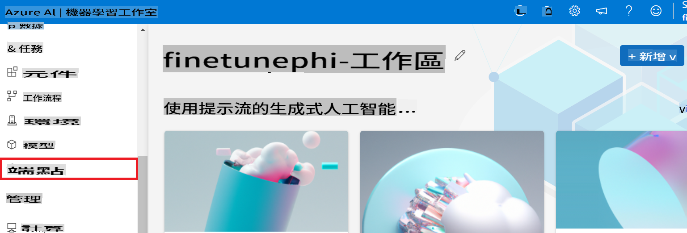

1. 選擇你創建的端點。

    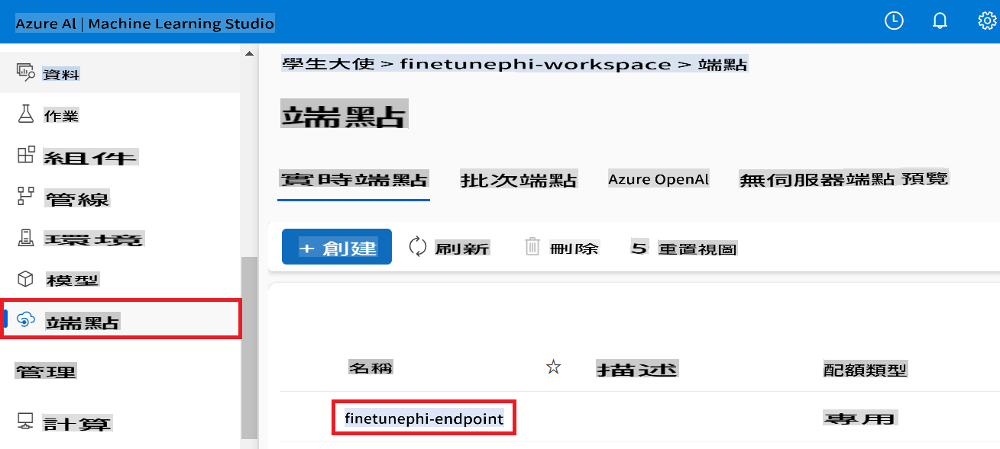

1. 在此頁面中，你可以管理在部署過程中創建的端點。

## 情境 3：與 Prompt flow 集成並與你的自定義模型進行聊天

### 將自定義 Phi-3 模型與 Prompt flow 集成

成功部署你的微調模型後，你現在可以將其與 Prompt flow 集成，實時應用你的模型，實現與自定義 Phi-3 模型進行各種互動任務。

#### 設置微調 Phi-3 模型的 API 密鑰和端點 URI

1. 瀏覽到你創建的 Azure Machine Learning 工作區。
1. 從左側選項卡中選擇 **Endpoints**。
1. 選擇你創建的端點。
1. 從導航菜單中選擇 **Consume**。
1. 複製並粘貼你的 **REST 端點** 到 *config.py* 文件中，替換 `AZURE_ML_ENDPOINT = "your_fine_tuned_model_endpoint_uri"` with your **REST endpoint**.
1. Copy and paste your **Primary key** into the *config.py* file, replacing `AZURE_ML_API_KEY = "your_fine_tuned_model_api_key"` 為你的 **Primary key**。

    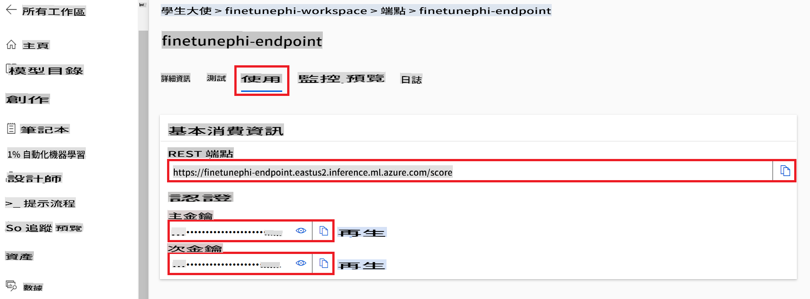

#### 在 *flow.dag.yml* 文件中添加代碼

1. 在 Visual Studio Code 中打開 *flow.dag.yml* 文件。

1. 將以下代碼添加到 *flow.dag.yml* 文件中。

    ```yml
    inputs:
      input_data:
        type: string
        default: "Who founded Microsoft?"

    outputs:
      answer:
        type: string
        reference: ${integrate_with_promptflow.output}

    nodes:
    - name: integrate_with_promptflow
      type: python
      source:
        type: code
        path: integrate_with_promptflow.py
      inputs:
        input_data: ${inputs.input_data}
    ```

#### 在 *integrate_with_promptflow.py* 文件中添加代碼

1. 在 Visual Studio Code 中打開 *integrate_with_promptflow.py* 文件。

1. 將以下代碼添加到 *integrate_with_promptflow.py* 文件中。

    ```python
    import logging
    import requests
    from promptflow.core import tool
    import asyncio
    import platform
    from config import (
        AZURE_ML_ENDPOINT,
        AZURE_ML_API_KEY
    )

    # Logging setup
    logging.basicConfig(
        format="%(asctime)s - %(levelname)s - %(name)s - %(message)s",
        datefmt="%Y-%m-%d %H:%M:%S",
        level=logging.DEBUG
    )
    logger = logging.getLogger(__name__)

    def query_azml_endpoint(input_data: list, endpoint_url: str, api_key: str) -> str:
        """
        Send a request to the Azure ML endpoint with the given input data.
        """
        headers = {
            "Content-Type": "application/json",
            "Authorization": f"Bearer {api_key}"
        }
        data = {
            "input_data": [input_data],
            "params": {
                "temperature": 0.7,
                "max_new_tokens": 128,
                "do_sample": True,
                "return_full_text": True
            }
        }
        try:
            response = requests.post(endpoint_url, json=data, headers=headers)
            response.raise_for_status()
            result = response.json()[0]
            logger.info("Successfully received response from Azure ML Endpoint.")
            return result
        except requests.exceptions.RequestException as e:
            logger.error(f"Error querying Azure ML Endpoint: {e}")
            raise

    def setup_asyncio_policy():
        """
        Setup asyncio event loop policy for Windows.
        """
        if platform.system() == 'Windows':
            asyncio.set_event_loop_policy(asyncio.WindowsSelectorEventLoopPolicy())
            logger.info("Set Windows asyncio event loop policy.")

    @tool
    def my_python_tool(input_data: str) -> str:
        """
        Tool function to process input data and query the Azure ML endpoint.
        """
        setup_asyncio_policy()
        return query_azml_endpoint(input_data, AZURE_ML_ENDPOINT, AZURE_ML_API_KEY)

    ```

### 與你的自定義模型進行聊天

1. 輸入以下命令來運行 *deploy_model.py* 腳本並在 Azure Machine Learning 中啟動部署過程。

    ```python
    pf flow serve --source ./ --port 8080 --host localhost
    ```

1. 這是結果的示例：現在你可以與你的自定義 Phi-3 模型進行聊天。建議根據微調時使用的數據來提問。

    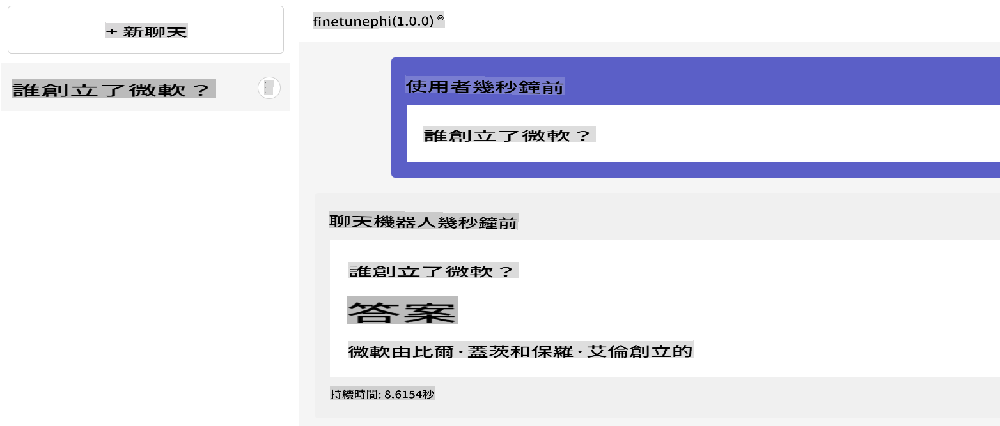

**免責聲明**:
本文件已使用機器翻譯服務進行翻譯。雖然我們努力確保準確性，但請注意，自動翻譯可能包含錯誤或不準確之處。應以原語言的原始文件為權威來源。對於關鍵信息，建議尋求專業人工翻譯。我們對因使用此翻譯而產生的任何誤解或誤釋不承擔任何責任。