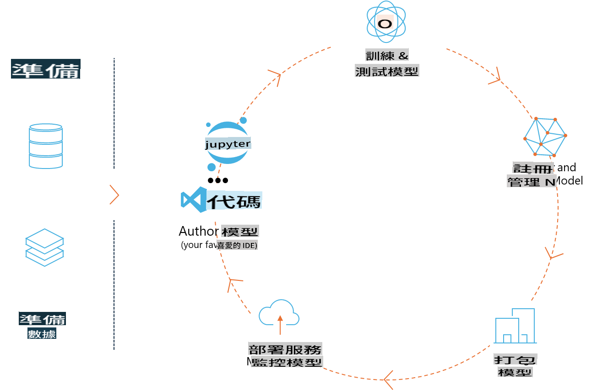
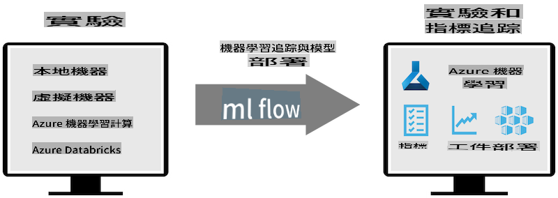
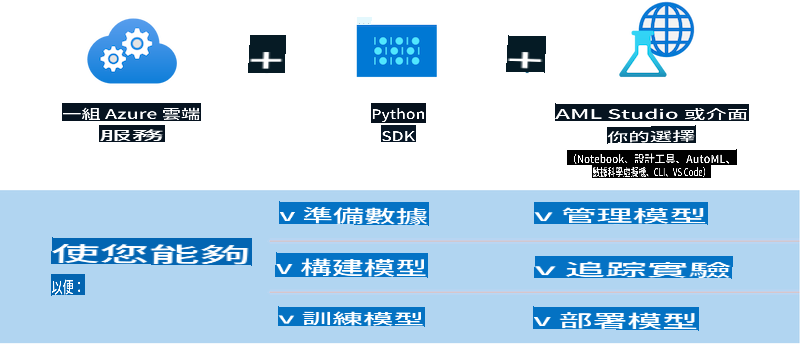

# MLflow

[MLflow](https://mlflow.org/) 是一個開源平台，旨在管理端到端的機器學習生命周期。



MLFlow 用於管理機器學習的生命周期，包括實驗、可重現性、部署和中央模型註冊。MLFlow 目前提供四個組件：

- **MLflow Tracking:** 記錄和查詢實驗、代碼、數據配置和結果。
- **MLflow Projects:** 將數據科學代碼打包成可在任何平台上重現的格式。
- **MLflow Models:** 在多種服務環境中部署機器學習模型。
- **Model Registry:** 在中央存儲庫中存儲、註釋和管理模型。

它包括實驗跟蹤、將代碼打包成可重現的運行以及共享和部署模型的功能。MLFlow 集成到 Databricks 中，支持多種機器學習庫，使其對庫無關。它可以與任何機器學習庫和任何編程語言一起使用，因為它提供了方便的 REST API 和 CLI。



MLFlow 的主要特點包括：

- **實驗跟蹤:** 記錄和比較參數和結果。
- **模型管理:** 將模型部署到各種服務和推理平台。
- **模型註冊:** 協作管理 MLflow 模型的生命周期，包括版本控制和註釋。
- **項目:** 打包機器學習代碼以便共享或生產使用。

MLFlow 還支持 MLOps 循環，包括準備數據、註冊和管理模型、打包模型以便執行、部署服務和監控模型。它旨在簡化從原型到生產工作流程的過程，特別是在雲和邊緣環境中。

## E2E 案例 - 構建包裝器並將 Phi-3 作為 MLFlow 模型使用

在這個端到端示例中，我們將展示兩種不同的方法來構建 Phi-3 小型語言模型 (SLM) 的包裝器，然後將其作為 MLFlow 模型在本地或雲端（例如 Azure Machine Learning 工作區）運行。



| 項目 | 描述 | 位置 |
| ------------ | ----------- | -------- |
| Transformer Pipeline | 如果您想使用 HuggingFace 模型與 MLFlow 的實驗性 transformers 風味，Transformer Pipeline 是構建包裝器的最簡單選擇。 | [**TransformerPipeline.ipynb**](../../../../code/06.E2E/E2E_Phi-3-MLflow_TransformerPipeline.ipynb) |
| 自定義 Python 包裝器 | 在撰寫本文時，transformer pipeline 尚不支持生成 HuggingFace 模型的 MLFlow 包裝器，即使使用實驗性的 optimum Python 包。對於這樣的情況，您可以為 MLFlow 模式構建自定義的 Python 包裝器。 | [**CustomPythonWrapper.ipynb**](../../../../code/06.E2E/E2E_Phi-3-MLflow_CustomPythonWrapper.ipynb) |

## 項目: Transformer Pipeline

1. 您需要從 MLFlow 和 HuggingFace 獲取相關的 Python 包：

    ``` Python
    import mlflow
    import transformers
    ```

2. 接下來，您應該通過引用 HuggingFace 註冊表中的目標 Phi-3 模型來啟動 transformer pipeline。從 _Phi-3-mini-4k-instruct_ 的模型卡中可以看出，它的任務是“文本生成”類型：

    ``` Python
    pipeline = transformers.pipeline(
        task = "text-generation",
        model = "microsoft/Phi-3-mini-4k-instruct"
    )
    ```

3. 現在您可以將 Phi-3 模型的 transformer pipeline 保存為 MLFlow 格式，並提供其他詳細信息，例如目標工件路徑、特定模型配置設置和推理 API 類型：

    ``` Python
    model_info = mlflow.transformers.log_model(
        transformers_model = pipeline,
        artifact_path = "phi3-mlflow-model",
        model_config = model_config,
        task = "llm/v1/chat"
    )
    ```

## 項目: 自定義 Python 包裝器

1. 我們可以利用 Microsoft 的 [ONNX Runtime generate() API](https://github.com/microsoft/onnxruntime-genai) 進行 ONNX 模型的推理和令牌編碼/解碼。您必須為目標計算選擇 _onnxruntime_genai_ 包，以下示例針對 CPU：

    ``` Python
    import mlflow
    from mlflow.models import infer_signature
    import onnxruntime_genai as og
    ```

1. 我們的自定義類實現了兩個方法：_load_context()_ 用於初始化 Phi-3 Mini 4K Instruct 的 **ONNX 模型**、**生成器參數** 和 **tokenizer**；_predict()_ 用於生成提供的提示的輸出令牌：

    ``` Python
    class Phi3Model(mlflow.pyfunc.PythonModel):
        def load_context(self, context):
            # Retrieving model from the artifacts
            model_path = context.artifacts["phi3-mini-onnx"]
            model_options = {
                 "max_length": 300,
                 "temperature": 0.2,         
            }
        
            # Defining the model
            self.phi3_model = og.Model(model_path)
            self.params = og.GeneratorParams(self.phi3_model)
            self.params.set_search_options(**model_options)
            
            # Defining the tokenizer
            self.tokenizer = og.Tokenizer(self.phi3_model)
    
        def predict(self, context, model_input):
            # Retrieving prompt from the input
            prompt = model_input["prompt"][0]
            self.params.input_ids = self.tokenizer.encode(prompt)
    
            # Generating the model's response
            response = self.phi3_model.generate(self.params)
    
            return self.tokenizer.decode(response[0][len(self.params.input_ids):])
    ```

1. 現在您可以使用 _mlflow.pyfunc.log_model()_ 函數生成 Phi-3 模型的自定義 Python 包裝器（以 pickle 格式），以及原始 ONNX 模型和所需的依賴項：

    ``` Python
    model_info = mlflow.pyfunc.log_model(
        artifact_path = artifact_path,
        python_model = Phi3Model(),
        artifacts = {
            "phi3-mini-onnx": "cpu_and_mobile/cpu-int4-rtn-block-32-acc-level-4",
        },
        input_example = input_example,
        signature = infer_signature(input_example, ["Run"]),
        extra_pip_requirements = ["torch", "onnxruntime_genai", "numpy"],
    )
    ```

## 生成的 MLFlow 模型的簽名

1. 在上面 Transformer Pipeline 項目的第 3 步中，我們將 MLFlow 模型的任務設置為“_llm/v1/chat_”。這樣的指令生成了與 OpenAI 的 Chat API 兼容的模型 API 包裝器，如下所示：

    ``` Python
    {inputs: 
      ['messages': Array({content: string (required), name: string (optional), role: string (required)}) (required), 'temperature': double (optional), 'max_tokens': long (optional), 'stop': Array(string) (optional), 'n': long (optional), 'stream': boolean (optional)],
    outputs: 
      ['id': string (required), 'object': string (required), 'created': long (required), 'model': string (required), 'choices': Array({finish_reason: string (required), index: long (required), message: {content: string (required), name: string (optional), role: string (required)} (required)}) (required), 'usage': {completion_tokens: long (required), prompt_tokens: long (required), total_tokens: long (required)} (required)],
    params: 
      None}
    ```

1. 因此，您可以以下列格式提交提示：

    ``` Python
    messages = [{"role": "user", "content": "What is the capital of Spain?"}]
    ```

1. 然後，使用與 OpenAI API 兼容的後處理，例如 _response[0][‘choices’][0][‘message’][‘content’]_，將輸出美化成如下所示：

    ``` JSON
    Question: What is the capital of Spain?
    
    Answer: The capital of Spain is Madrid. It is the largest city in Spain and serves as the political, economic, and cultural center of the country. Madrid is located in the center of the Iberian Peninsula and is known for its rich history, art, and architecture, including the Royal Palace, the Prado Museum, and the Plaza Mayor.
    
    Usage: {'prompt_tokens': 11, 'completion_tokens': 73, 'total_tokens': 84}
    ```

1. 在上面自定義 Python 包裝器項目的第 3 步中，我們允許 MLFlow 包從給定的輸入示例生成模型的簽名。我們的 MLFlow 包裝器的簽名將如下所示：

    ``` Python
    {inputs: 
      ['prompt': string (required)],
    outputs: 
      [string (required)],
    params: 
      None}
    ```

1. 因此，我們的提示需要包含“prompt”字典鍵，類似於這樣：

    ``` Python
    {"prompt": "<|system|>You are a stand-up comedian.<|end|><|user|>Tell me a joke about atom<|end|><|assistant|>",}
    ```

1. 模型的輸出將以字符串格式提供：

    ``` JSON
    Alright, here's a little atom-related joke for you!
    
    Why don't electrons ever play hide and seek with protons?
    
    Because good luck finding them when they're always "sharing" their electrons!
    
    Remember, this is all in good fun, and we're just having a little atomic-level humor!
    ```

**免責聲明**：
本文件是使用機器翻譯服務進行翻譯的。儘管我們努力確保準確性，但請注意，自動翻譯可能包含錯誤或不準確之處。應將原始語言的文件視為權威來源。對於關鍵信息，建議使用專業人工翻譯。我們對使用此翻譯引起的任何誤解或誤讀不承擔責任。