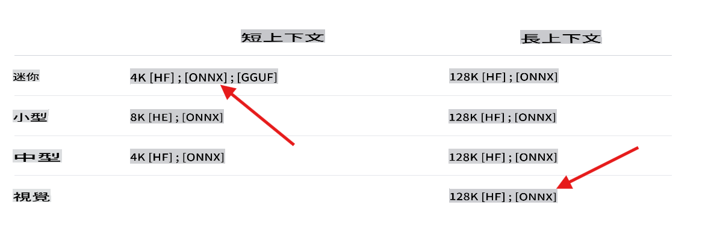

## 歡迎來到使用 C# 的 Phi-3 實驗室

這裡有一系列的實驗室展示如何在 .NET 環境中整合強大的不同版本的 Phi-3 模型。

## 先決條件
在運行範例之前，請確保你已經安裝以下軟體：

**.NET 8:** 確保你的機器上已安裝 [最新版本的 .NET](https://dotnet.microsoft.com/download/dotnet/8.0?WT.mc_id=aiml-137032-kinfeylo)。

**(可選) Visual Studio 或 Visual Studio Code:** 你將需要一個能夠運行 .NET 項目的 IDE 或代碼編輯器。推薦使用 [Visual Studio](https://visualstudio.microsoft.com/) 或 [Visual Studio Code](https://code.visualstudio.com?WT.mc_id=aiml-137032-kinfeylo)。

**使用 git** 從 [Hugging Face](https://huggingface.co) 本地克隆其中一個可用的 Phi-3 版本。

**下載 phi3-mini-4k-instruct-onnx 模型** 到你的本地機器：

### 導航到存儲模型的文件夾
```bash
cd c:\phi3\models
```
### 添加 lfs 支持
```bash
git lfs install 
```
### 克隆並下載 mini 4K instruct 模型
```bash
git clone https://huggingface.co/microsoft/Phi-3-mini-4k-instruct-onnx
```

### 克隆並下載 vision 128K 模型
```
git clone https://huggingface.co/microsoft/Phi-3-vision-128k-instruct-onnx-cpu
```
**重要:** 當前的演示設計使用模型的 ONNX 版本。以上步驟克隆了以下模型。



## 關於實驗室

主要解決方案包含幾個示例實驗室，展示了如何使用 C# 發揮 Phi-3 模型的功能。

| 項目 | 描述 | 位置 |
| ------------ | ----------- | -------- |
| LabsPhi301    | 這是一個示例項目，使用本地 phi3 模型來提問。該項目使用 `Microsoft.ML.OnnxRuntime` 庫加載本地 ONNX Phi-3 模型。 | .\src\LabsPhi301\ |
| LabsPhi302    | 這是一個使用 Semantic Kernel 實現控制台聊天的示例項目。 | .\src\LabsPhi302\ |
| LabsPhi303 | 這是一個使用本地 phi3 視覺模型來分析圖像的示例項目。該項目使用 `Microsoft.ML.OnnxRuntime` 庫加載本地 ONNX Phi-3 視覺模型。 | .\src\LabsPhi303\ |
| LabsPhi304 | 這是一個使用本地 phi3 視覺模型來分析圖像的示例項目。該項目使用 `Microsoft.ML.OnnxRuntime` 庫加載本地 ONNX Phi-3 視覺模型。該項目還提供了一個與用戶交互的菜單選項。 | .\src\LabsPhi304\ |
| LabsPhi305 | 這是一個使用托管在 ollama 上的 Phi-3 模型來回答問題的示例項目。 |**即將推出**|
| LabsPhi306 | 這是一個使用 Semantic Kernel 實現控制台聊天的示例項目。 |**即將推出**|
| LabsPhi307  | 這是一個使用本地嵌入和 Semantic Kernel 實現 RAG 的示例項目。 |**即將推出**|

## 如何運行項目

要運行項目，請按照以下步驟操作：
1. 將存儲庫克隆到你的本地機器。

1. 打開終端並導航到所需項目。例如，讓我們運行 `LabsPhi301`。
    ```bash
    cd .\src\LabsPhi301\
    ```

1. 使用以下命令運行項目
    ```bash
    dotnet run
    ```

1.  示例項目會要求用戶輸入並使用本地模式回覆。

    運行中的演示類似於這個：

    

    ***注意:** 第一個問題中有一個拼寫錯誤，Phi-3 足夠聰明，能夠給出正確的答案！*

1.  項目 `LabsPhi304` 會要求用戶選擇不同的選項，然後處理請求。例如，分析本地圖像。

    運行中的演示類似於這個：

    

免責聲明：此翻譯由AI模型從原文翻譯而來，可能不夠完美。請檢查輸出並做出任何必要的修正。