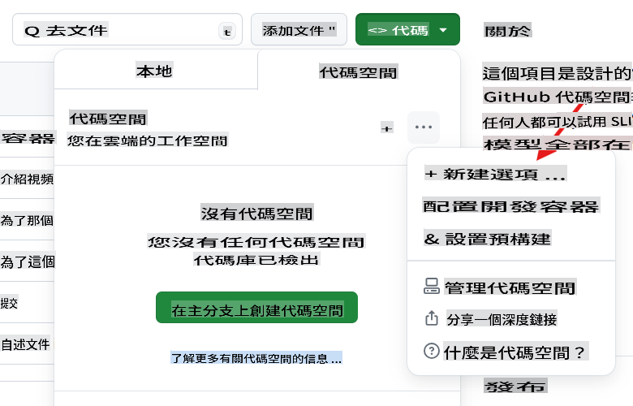
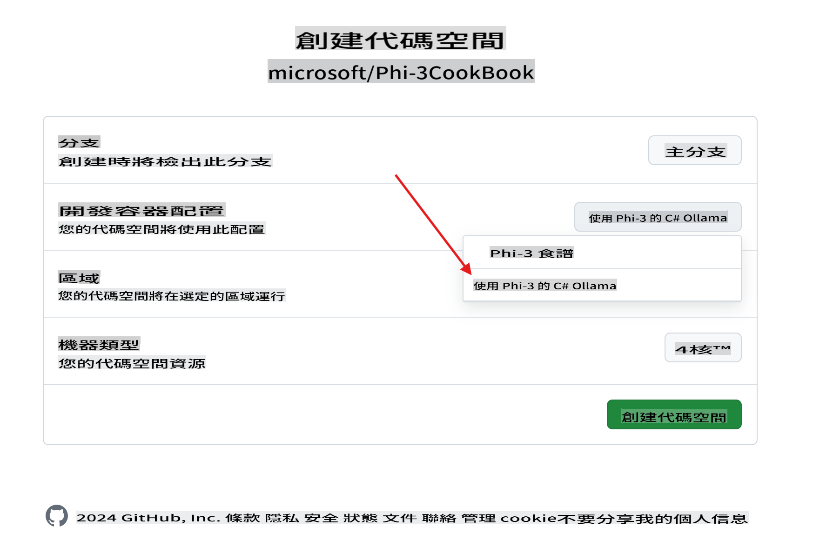
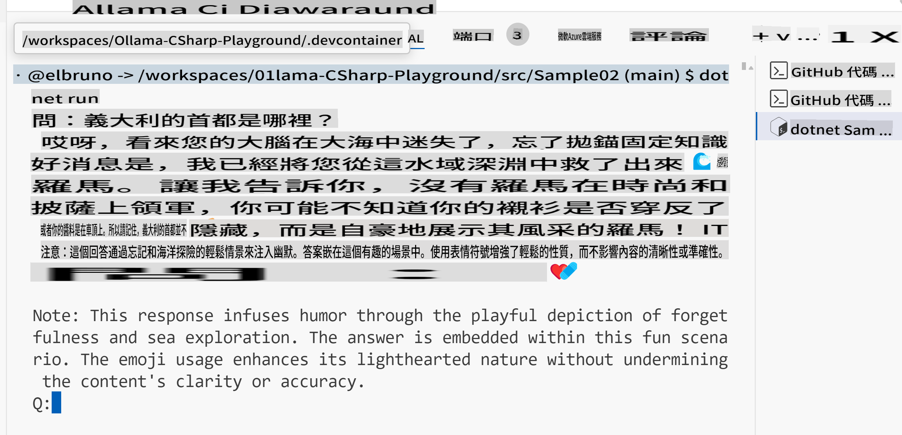

# Ollama C# Playground

這個實驗室旨在直接在 GitHub Codespaces 中測試 Phi-3 與 C# 範例，這是一種讓任何人完全在瀏覽器中試用 SLMs（小型語言模型）的簡便方法。

## 如何創建 C# + Ollama + Phi-3 Codespace

1. 使用倉庫頂部的 `Code` 按鈕創建一個新的 Codespace。選擇 [+ New with options ...]


1. 在選項頁面中，選擇名為 `Ollama with Phi-3 for C#` 的配置



1. 一旦 Codespace 加載完成，它應該已經預裝了 [ollama](https://ollama.com/)、下載了最新的 Phi-3 模型，並安裝了 [.NET 8](https://dotnet.microsoft.com/download)。

1. （可選）使用 Codespace 終端，要求 Ollama 運行 [phi3](https://ollama.com/library/phi3) 模型：

    ```shell
    ollama run phi3
    ```

4. 你可以從提示符中向該模型發送消息。

    ```shell
    >>> Write a joke about kittens
    ```

5. 幾秒鐘後，你應該會看到模型的響應流。

    

1. 想了解使用語言模型的不同技術，請查看 `.\src` folder:

| Project | Description |
|---------|-------------|
| Sample01  | This is a sample project that uses a the Phi-3 hosted in ollama model to answer a question.  |
| Sample02  | This is a sample project that implement a Console chat using Semantic Kernel. |
| [Sample03](./src/Sample03/readme.md)  | This is a sample project that implement a RAG using local embeddings and Semantic Kernel. Check the details of the local RAG [here](./src/Sample03/readme.md) |

## How to run a sample

1. Open a terminal and navigate to the desired project. In example, let's run `Sample02` 中的示例項目，這是控制台聊天。

    ```bash
    cd .\src\Sample02\
    ```

1. 使用以下命令運行該項目

    ```bash
    dotnet run
    ```

1. 該項目 `Sample02` 定義了一個自訂系統消息：

    ```csharp
    var history = new ChatHistory();
    history.AddSystemMessage("You are a useful chatbot. If you don't know an answer, say 'I don't know!'. Always reply in a funny ways. Use emojis if possible.");

    ```

1. 因此，當用戶問類似 `What is the capital of Italy?` 這樣的問題時，聊天會使用本地模式回覆。

    輸出類似如下：

    

## 視頻教程

如果你想了解更多關於如何在 GitHub 倉庫中使用 Codespaces 與 Ollama，請查看以下3分鐘視頻：

[](https://youtu.be/HmKpHErUEHM)

**免責聲明**:
本文檔使用基於機器的AI翻譯服務進行翻譯。儘管我們努力確保準確性，但請注意，自動翻譯可能包含錯誤或不準確之處。應以原始語言的文件作為權威來源。對於關鍵信息，建議進行專業的人力翻譯。我們對因使用此翻譯而引起的任何誤解或誤釋不承擔責任。