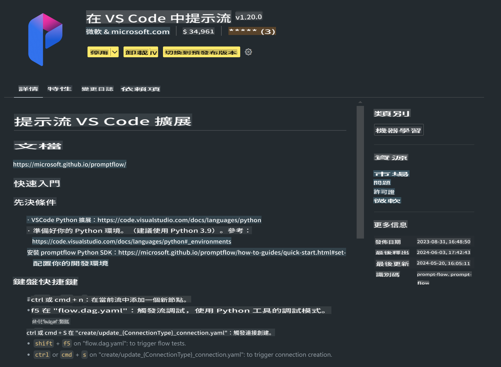

# **Lab 0 - 安裝**

當我們進入實驗室時，需要配置相關的環境：

### **1. Python 3.11+**

建議使用 miniforge 來配置你的 Python 環境

要配置 miniforge，請參考 [https://github.com/conda-forge/miniforge](https://github.com/conda-forge/miniforge)

配置好 miniforge 後，在 Power Shell 中運行以下命令

```bash

conda create -n pyenv python==3.11.8 -y

conda activate pyenv

```

### **2. 安裝 Prompt flow SDK**

在 Lab 1 中，我們會使用 Prompt flow，因此你需要配置 Prompt flow SDK。

```bash

pip install promptflow --upgrade

```

你可以使用以下命令檢查 promptflow sdk

```bash

pf --version

```

### **3. 安裝 Visual Studio Code Prompt flow 擴展**



### **4. Intel NPU 加速庫**

Intel 的新一代處理器支持 NPU。如果你想在本地使用 NPU 來運行 LLMs / SLMs，可以使用 ***Intel NPU 加速庫***。如果你想了解更多，可以閱讀 [https://github.com/microsoft/Phi-3CookBook/blob/main/md/03.Inference/AIPC_Inference.md](https://github.com/microsoft/Phi-3CookBook/blob/main/md/03.Inference/AIPC_Inference.md)。

在 bash 中安裝 Intel NPU 加速庫

```bash

pip install intel-npu-acceleration-library

```

***注意***: 請注意，這個庫支持 transformers ***4.40.2***，請確認版本

### **5. 其他 Python 庫**

創建 requirements.txt 並添加以下內容

```txt

notebook
numpy 
scipy 
scikit-learn 
matplotlib 
pandas 
pillow 
graphviz

```

### **6. 安裝 NVM**

在 Powershell 中安裝 nvm

```bash

winget install -e --id CoreyButler.NVMforWindows

```

安裝 nodejs 18.20

```bash

nvm install 18.20.0

nvm use 18.20.0

```

### **7. 安裝 Visual Studio Code 開發支持**

```bash

npm install --global yo generator-code

```

恭喜！你已成功配置 SDK。接下來，進行實踐步驟。

**免責聲明**：
本文件是使用基於機器的人工智能翻譯服務進行翻譯的。儘管我們努力確保準確性，但請注意，自動翻譯可能包含錯誤或不準確之處。應將原文檔的母語版本視為權威來源。對於關鍵信息，建議使用專業人工翻譯。我們對使用此翻譯所產生的任何誤解或誤讀不承擔責任。