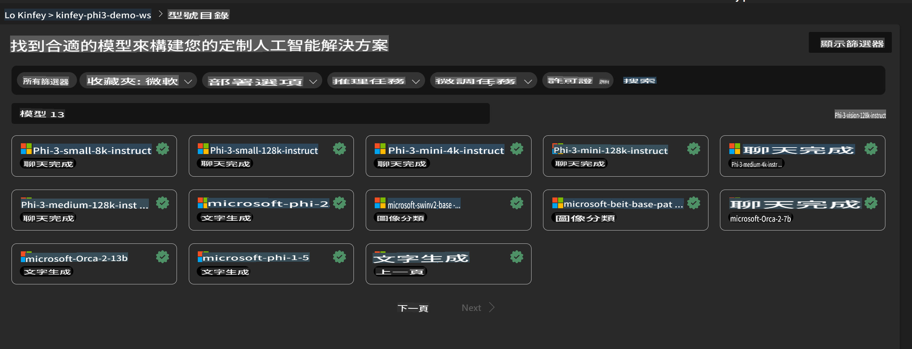
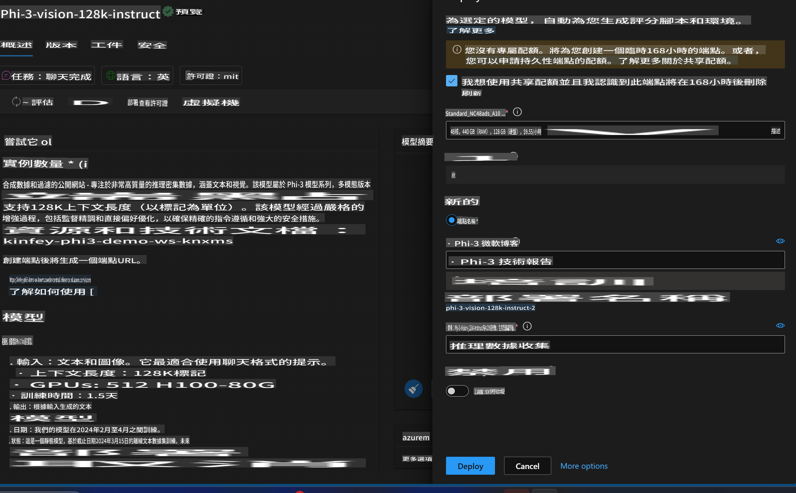
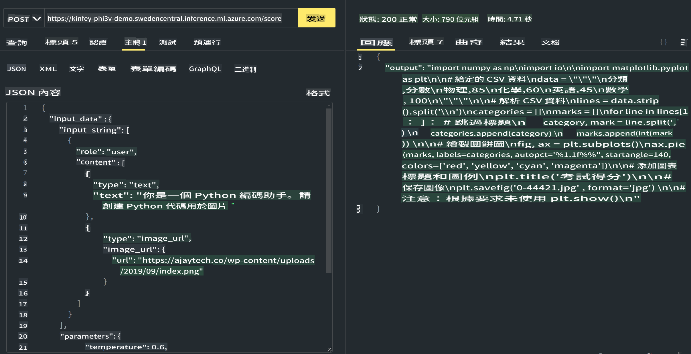

# **實驗室 3 - 在 Azure 機器學習服務上部署 Phi-3-vision**

我們使用 NPU 完成本地代碼的生產部署，然後希望通過它引入 PHI-3-VISION 的能力來實現圖片生成代碼。

在這個介紹中，我們可以快速在 Azure 機器學習服務中構建一個 Model As Service Phi-3 Vision 服務。

***Note***：Phi-3 Vision 需要計算能力來更快地生成內容。我們需要雲計算能力來幫助我們實現這一點。

### **1. 創建 Azure 機器學習服務**

我們需要在 Azure Portal 中創建一個 Azure 機器學習服務。如果你想了解如何創建，請訪問這個鏈接 [https://learn.microsoft.com/azure/machine-learning/quickstart-create-resources?view=azureml-api-2](https://learn.microsoft.com/azure/machine-learning/quickstart-create-resources?view=azureml-api-2)

### **2. 在 Azure 機器學習服務中選擇 Phi-3 Vision**



### **3. 在 Azure 中部署 Phi-3-Vision**



### **4. 在 Postman 中測試端點**



***Note***

1. 傳輸的參數必須包括 Authorization、azureml-model-deployment 和 Content-Type。你需要檢查部署信息來獲取它。

2. 要傳輸參數，Phi-3-Vision 需要傳輸一個圖像鏈接。請參考 GPT-4-Vision 方法來傳輸參數，例如

```json

{
  "input_data":{
    "input_string":[
      {
        "role":"user",
        "content":[ 
          {
            "type": "text",
            "text": "You are a Python coding assistant.Please create Python code for image "
          },
          {
              "type": "image_url",
              "image_url": {
                "url": "https://ajaytech.co/wp-content/uploads/2019/09/index.png"
              }
          }
        ]
      }
    ],
    "parameters":{
          "temperature": 0.6,
          "top_p": 0.9,
          "do_sample": false,
          "max_new_tokens": 2048
    }
  }
}

```

3. 使用 Post 方法調用 **/score**

**恭喜** ！你已經完成了快速 PHI-3-VISION 部署並嘗試了如何使用圖片生成代碼。接下來，我們可以結合 NPU 和雲來構建應用程序。

**免責聲明**：
本文檔使用基於機器的AI翻譯服務進行翻譯。我們努力追求準確性，但請注意，自動翻譯可能包含錯誤或不準確之處。應以原文檔案作為權威來源。對於關鍵信息，建議尋求專業人工翻譯。我們對使用此翻譯所引起的任何誤解或誤釋不承擔責任。