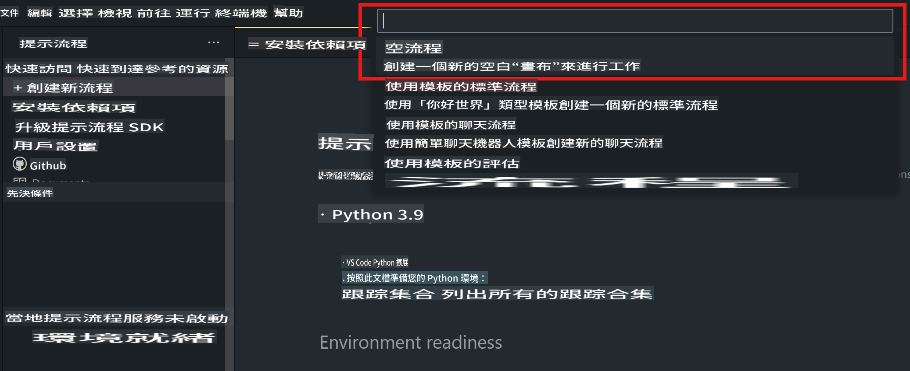
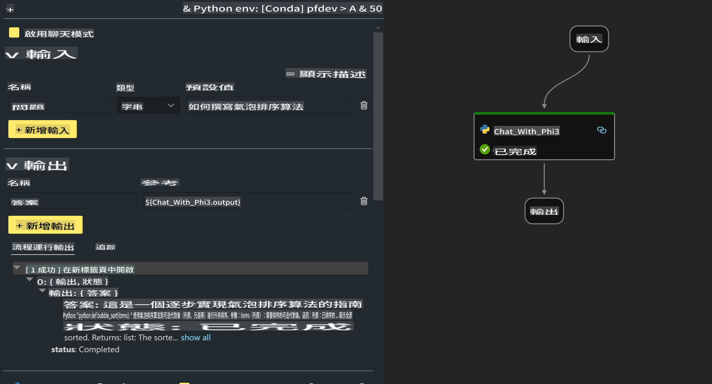

# **Lab 2 - 在 AIPC 中運行 Phi-3-mini 的 Prompt flow**

## **什麼是 Prompt flow**

Prompt flow 是一套開發工具，旨在簡化基於 LLM 的 AI 應用程序的端到端開發周期，從構思、原型設計、測試、評估到生產部署和監控。它使提示工程變得更加容易，並使您能夠構建具有生產質量的 LLM 應用程序。

通過使用 prompt flow，您將能夠：

- 創建將 LLMs、提示、Python 代碼和其他工具連接在一起的可執行工作流程。

- 輕鬆調試和迭代您的工作流程，特別是與 LLMs 的交互。

- 評估您的工作流程，使用更大的數據集計算質量和性能指標。

- 將測試和評估集成到您的 CI/CD 系統中，以確保您的工作流程的質量。

- 部署您的工作流程到您選擇的服務平台或輕鬆集成到您的應用程序代碼庫中。

- （可選但強烈推薦）通過利用 Azure AI 中的 Prompt flow 雲版本與您的團隊協作。


## **在 Apple Silicon 上構建生成代碼的工作流程**

***注意***：如果您尚未完成環境安裝，請訪問 [Lab 0 - 安裝](./01.Installations.md)

1. 打開 Visual Studio Code 中的 Prompt flow 擴展並創建一個空的工作流程項目



2. 添加輸入和輸出參數並添加 Python 代碼作為新的工作流程



您可以參考此結構（flow.dag.yaml）來構建您的工作流程

```yaml

inputs:
  prompt:
    type: string
    default: Write python code for Fibonacci serie. Please use markdown as output
outputs:
  result:
    type: string
    reference: ${gen_code_by_phi3.output}
nodes:
- name: gen_code_by_phi3
  type: python
  source:
    type: code
    path: gen_code_by_phi3.py
  inputs:
    prompt: ${inputs.prompt}


```

3. 量化 phi-3-mini

我們希望能夠在本地設備上更好地運行 SLM。通常，我們會量化模型（INT4、FP16、FP32）

```bash

python -m mlx_lm.convert --hf-path microsoft/Phi-3-mini-4k-instruct

```

**注意:** 默認文件夾是 mlx_model

4. 在 ***Chat_With_Phi3.py*** 中添加代碼

```python


from promptflow import tool

from mlx_lm import load, generate


# The inputs section will change based on the arguments of the tool function, after you save the code
# Adding type to arguments and return value will help the system show the types properly
# Please update the function name/signature per need
@tool
def my_python_tool(prompt: str) -> str:

    model_id = './mlx_model_phi3_mini'

    model, tokenizer = load(model_id)

    # <|user|>\nWrite python code for Fibonacci serie. Please use markdown as output<|end|>\n<|assistant|>

    response = generate(model, tokenizer, prompt="<|user|>\n" + prompt  + "<|end|>\n<|assistant|>", max_tokens=2048, verbose=True)

    return response


```

4. 您可以從 Debug 或 Run 測試工作流程，以檢查生成的代碼是否正確


5. 在終端中將工作流程作為開發 API 運行

```

pf flow serve --source ./ --port 8080 --host localhost   

```

您可以在 Postman / Thunder Client 中測試它


### **注意**

1. 第一次運行需要很長時間。建議從 Hugging face CLI 下載 phi-3 模型。

2. 考慮到 Intel NPU 的計算能力有限，建議使用 Phi-3-mini-4k-instruct

3. 我們使用 Intel NPU 加速來量化 INT4 轉換，但如果重新運行服務，需要刪除緩存和 nc_workshop 文件夾。


## **資源**

1. 學習 Promptflow [https://microsoft.github.io/promptflow/](https://microsoft.github.io/promptflow/)

2. 學習 Intel NPU 加速 [https://github.com/intel/intel-npu-acceleration-library](https://github.com/intel/intel-npu-acceleration-library)

3. 範例代碼，下載 [Local NPU Agent Sample Code](../../../../../../../code/07.Lab/01/AIPC/local-npu-agent)

**免責聲明**:
本文件已使用基於機器的AI翻譯服務進行翻譯。儘管我們努力追求準確性，但請注意，自動翻譯可能包含錯誤或不準確之處。應將原始語言的文件視為權威來源。對於關鍵信息，建議進行專業人工翻譯。我們對使用本翻譯所產生的任何誤解或誤讀不承擔責任。