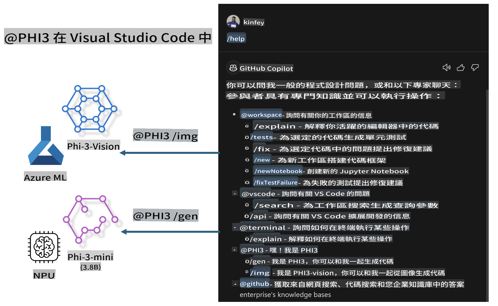

# **建立你自己的 Visual Studio Code GitHub Copilot Chat 與 Microsoft Phi-3 系列**

你是否使用過 GitHub Copilot Chat 中的工作區代理？你是否想建立自己團隊的代碼代理？這個實作實驗希望結合開源模型，來建立企業級的代碼業務代理。

## **基礎**

### **為什麼選擇 Microsoft Phi-3**

Phi-3 是一個系列家族，根據不同的訓練參數，包含 phi-3-mini、phi-3-small 和 phi-3-medium，用於文本生成、對話補全和代碼生成。還有基於視覺的 phi-3-vision。它適合企業或不同團隊創建離線生成 AI 解決方案。

推薦閱讀此連結 [https://github.com/microsoft/Phi-3CookBook/blob/main/md/01.Introduce/Phi3Family.md](https://github.com/microsoft/Phi-3CookBook/blob/main/md/01.Introduce/Phi3Family.md)

### **Microsoft GitHub Copilot Chat**

GitHub Copilot Chat 擴展提供了一個聊天介面，讓你可以與 GitHub Copilot 互動，並在 VS Code 中直接獲得與編碼相關的問題答案，而不需要導航文檔或在線搜索論壇。

Copilot Chat 可能會使用語法高亮、縮排和其他格式化功能來增加生成響應的清晰度。根據用戶的問題類型，結果可能包含 Copilot 用於生成響應的上下文鏈接，如源代碼文件或文檔，或訪問 VS Code 功能的按鈕。

- Copilot Chat 集成在你的開發流程中，並在你需要的地方提供幫助：

- 從編輯器或終端直接開始內聯聊天，以獲得編碼過程中的幫助

- 使用聊天視圖，隨時擁有一個 AI 助手

- 啟動快速聊天，提出快速問題，然後回到你的工作中

你可以在各種場景中使用 GitHub Copilot Chat，例如：

- 回答如何最好地解決問題的編碼問題

- 解釋別人的代碼並提出改進建議

- 提出代碼修復建議

- 生成單元測試案例

- 生成代碼文檔

推薦閱讀此連結 [https://code.visualstudio.com/docs/copilot/copilot-chat](https://code.visualstudio.com/docs/copilot/copilot-chat?WT.mc_id=aiml-137032-kinfeylo)

###  **Microsoft GitHub Copilot Chat @workspace**

在 Copilot Chat 中引用 **@workspace** 讓你可以詢問關於整個代碼庫的問題。根據問題，Copilot 智能地檢索相關文件和符號，並在其答案中以鏈接和代碼示例的形式引用它們。

為了回答你的問題，**@workspace** 會搜索開發者在 VS Code 中導航代碼庫時使用的相同來源：

- 工作區中的所有文件，除了被 .gitignore 文件忽略的文件

- 帶有嵌套文件夾和文件名的目錄結構

- GitHub 的代碼搜索索引（如果工作區是 GitHub 儲存庫並被代碼搜索索引）

- 工作區中的符號和定義

- 當前選中的文本或活動編輯器中可見的文本

注意：如果你打開了一個文件或在忽略的文件中選中了文本，則會繞過 .gitignore。

推薦閱讀此連結 [[https://code.visualstudio.com/docs/copilot/copilot-chat](https://code.visualstudio.com/docs/copilot/workspace-context?WT.mc_id=aiml-137032-kinfeylo)]

## **了解更多關於這個實驗**

GitHub Copilot 極大地提高了企業的編程效率，每個企業都希望定制 GitHub Copilot 的相關功能。許多企業基於自己的業務場景和開源模型定制了類似 GitHub Copilot 的擴展。對於企業來說，定制的擴展更容易控制，但這也影響了用戶體驗。畢竟，GitHub Copilot 在處理一般場景和專業性上功能更強大。如果能保持一致的體驗，定制企業自己的擴展會更好。GitHub Copilot Chat 提供了相關的 API 供企業在聊天體驗中擴展。保持一致的體驗並擁有定制的功能是更好的用戶體驗。

這個實驗主要使用 Phi-3 模型結合本地 NPU 和 Azure 混合，來建立一個自定義代理在 GitHub Copilot Chat ***@PHI3*** 以協助企業開發者完成代碼生成***(@PHI3 /gen)***和基於圖像生成代碼***(@PHI3 /img)***。

### ***注意:*** 

這個實驗目前在 Intel CPU 和 Apple Silicon 的 AIPC 中實現。我們將繼續更新 Qualcomm 版本的 NPU。

## **實驗**

| 名稱 | 描述 | AIPC | Apple |
| ------------ | ----------- | -------- |-------- |
| Lab0 - 安裝(✅) | 配置和安裝相關環境和工具 | [Go](./HOL/AIPC/01.Installations.md) |[Go](./HOL/Apple/01.Installations.md) |
| Lab1 - 使用 Phi-3-mini 運行 Prompt flow (✅) | 結合 AIPC / Apple Silicon，使用本地 NPU 通過 Phi-3-mini 創建代碼生成 | [Go](./HOL/AIPC/02.PromptflowWithNPU.md) |  [Go](./HOL/Apple/02.PromptflowWithMLX.md) |
| Lab2 - 在 Azure 機器學習服務上部署 Phi-3-vision (✅) | 通過部署 Azure 機器學習服務的模型目錄 - Phi-3-vision 圖像來生成代碼 | [Go](./HOL/AIPC/03.DeployPhi3VisionOnAzure.md) |[Go](./HOL/Apple/03.DeployPhi3VisionOnAzure.md) |
| Lab3 - 在 GitHub Copilot Chat 中創建一個 @phi-3 代理 (✅)  | 在 GitHub Copilot Chat 中創建一個自定義 Phi-3 代理來完成代碼生成、圖像生成代碼、RAG 等 | [Go](./HOL/AIPC/04.CreatePhi3AgentInVSCode.md) | [Go](./HOL/Apple/04.CreatePhi3AgentInVSCode.md) |
| 示例代碼 (✅)  | 下載示例代碼 | [Go](../../../../../code/07.Lab/01/AIPC) | [Go](../../../../../code/07.Lab/01/Apple) |

## **資源**

1. Phi-3 Cookbook [https://github.com/microsoft/Phi-3CookBook](https://github.com/microsoft/Phi-3CookBook)

2. 了解更多關於 GitHub Copilot [https://learn.microsoft.com/training/paths/copilot/](https://learn.microsoft.com/training/paths/copilot/?WT.mc_id=aiml-137032-kinfeylo)

3. 了解更多關於 GitHub Copilot Chat [https://learn.microsoft.com/training/paths/accelerate-app-development-using-github-copilot/](https://learn.microsoft.com/training/paths/accelerate-app-development-using-github-copilot/?WT.mc_id=aiml-137032-kinfeylo)

4. 了解更多關於 GitHub Copilot Chat API [https://code.visualstudio.com/api/extension-guides/chat](https://code.visualstudio.com/api/extension-guides/chat?WT.mc_id=aiml-137032-kinfeylo)

5. 了解更多關於 Azure AI Foundry [https://learn.microsoft.com/training/paths/create-custom-copilots-ai-studio/](https://learn.microsoft.com/training/paths/create-custom-copilots-ai-studio/?WT.mc_id=aiml-137032-kinfeylo)

6. 了解更多關於 Azure AI Foundry 的模型目錄 [https://learn.microsoft.com/azure/ai-studio/how-to/model-catalog-overview](https://learn.microsoft.com/azure/ai-studio/how-to/model-catalog-overview)

**免責聲明**:
本文件是使用機器翻譯服務翻譯的。儘管我們努力確保準確性，但請注意，自動翻譯可能包含錯誤或不準確之處。應以原始語言的文件為權威來源。對於關鍵信息，建議尋求專業的人類翻譯。我們不對因使用此翻譯而引起的任何誤解或誤讀承擔責任。