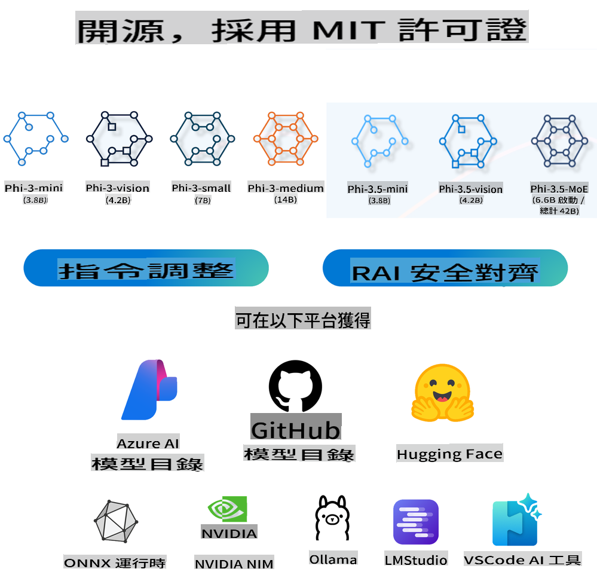
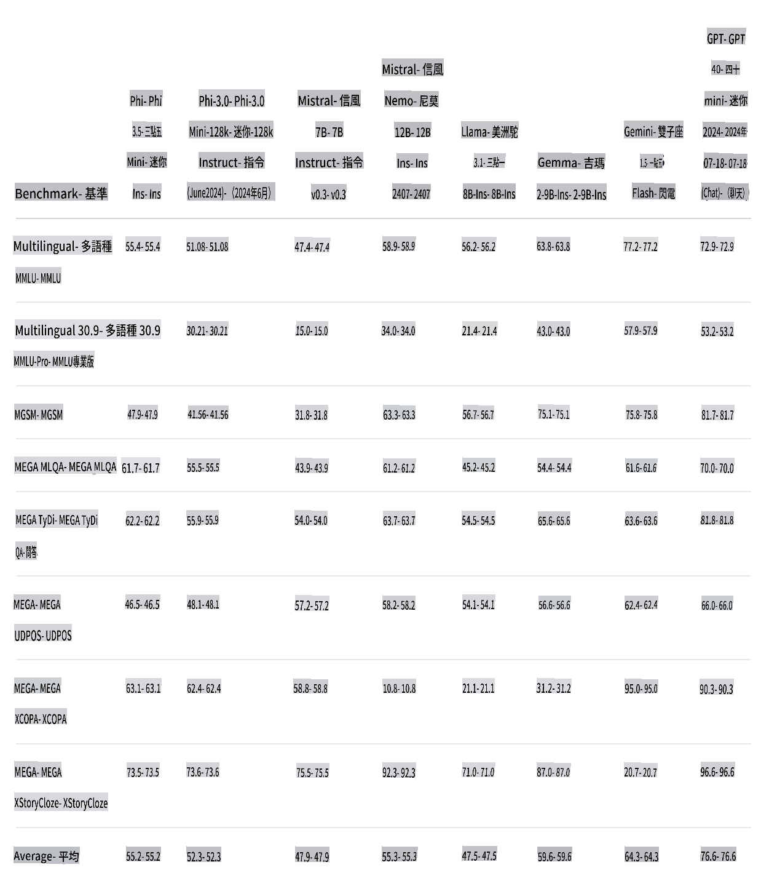
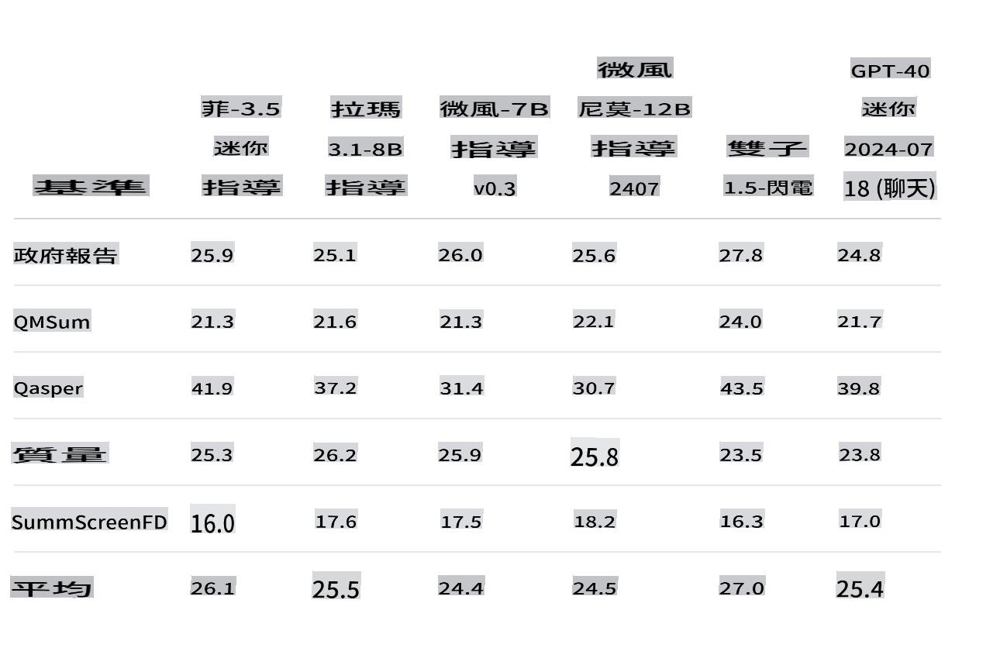
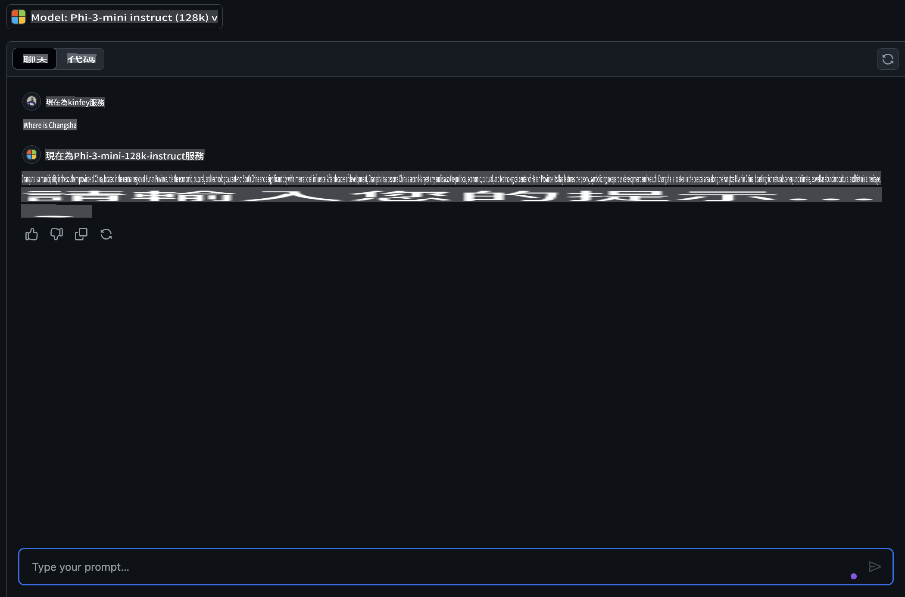
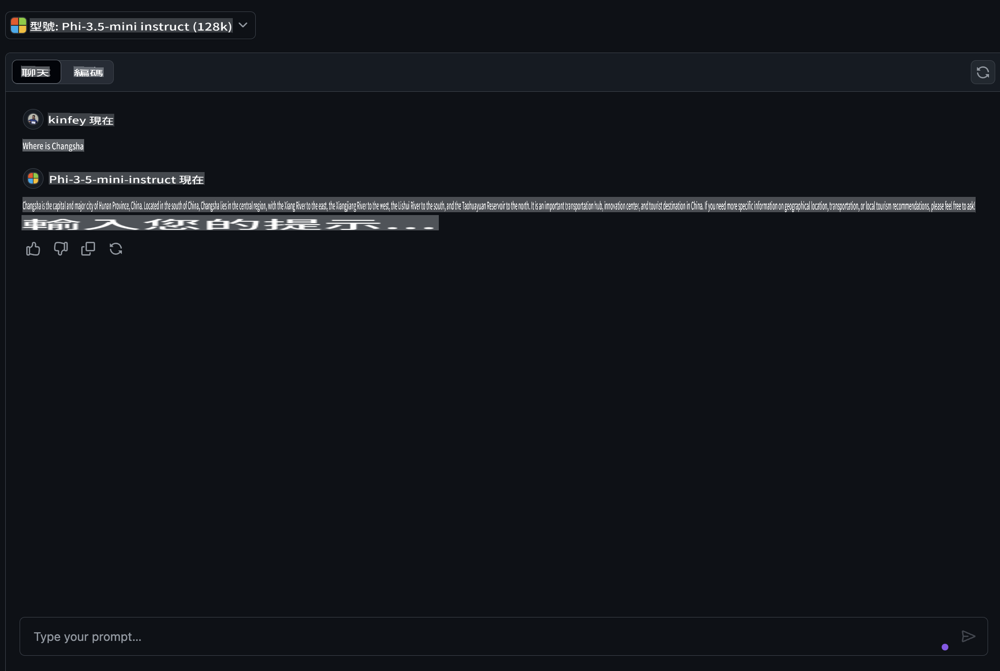
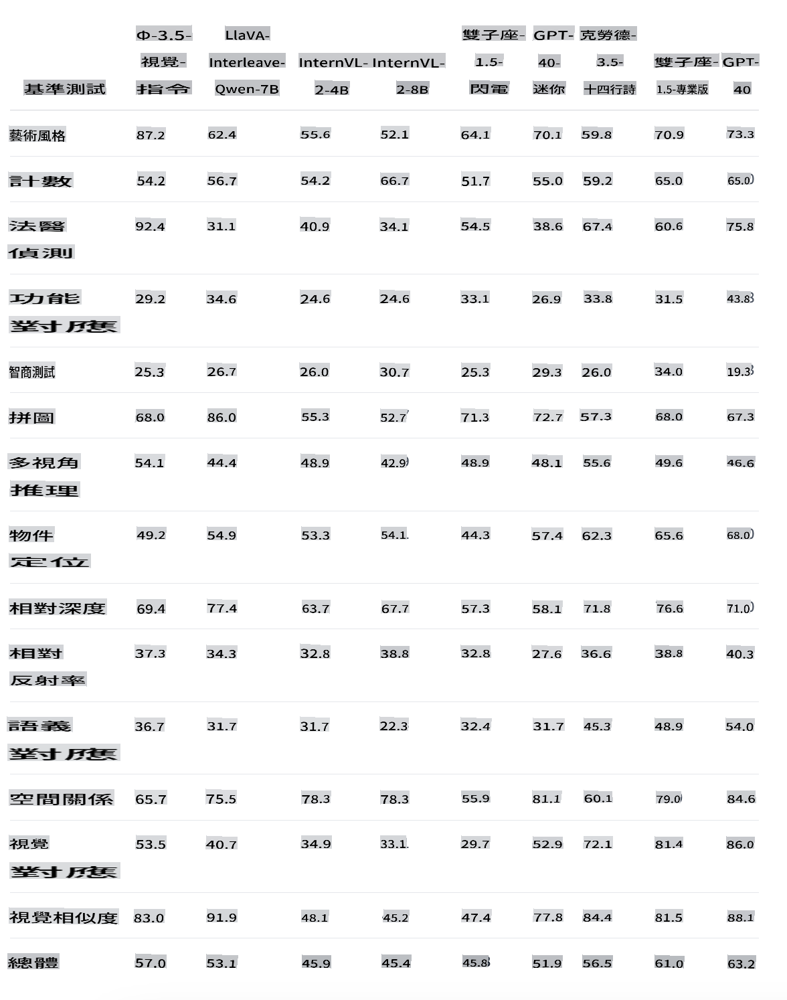
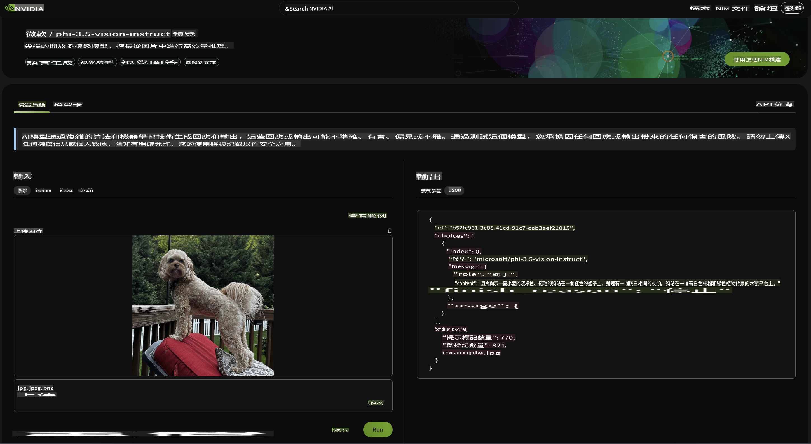
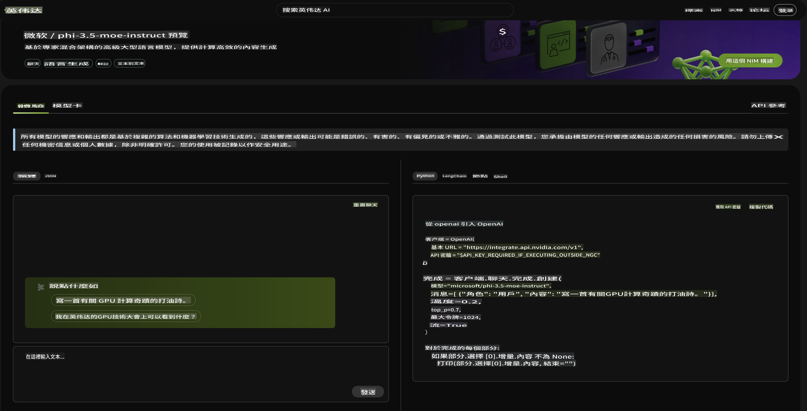

# **Phi-3.5 系列的新功能**

你已經在使用 Phi-3 系列了嗎？你的使用場景是什麼？2024年8月20日，微軟發布了全新的 Phi-3.5 系列，這次在多語言、視覺和 AI 代理方面進行了增強。讓我們結合 Hugging Face 上的 Model Card 來做更詳細的介紹。

## **Phi-3.5-mini-instruct**

Phi-3.5-mini 是一個輕量級、最先進的開放模型，基於 Phi-3 所使用的數據集構建——合成數據和過濾後的公開網站數據——重點是高質量、推理密集的數據。這個模型屬於 Phi-3 模型家族，支持 128K token 的上下文長度。該模型經過嚴格的增強過程，結合了監督微調、近端策略優化和直接偏好優化，以確保精確的指令遵循和強大的安全措施。

通過 Benchmark 上的指標，可以看到 Phi-3.5-mini 相比 Phi-3-mini 在多語言和長文本內容支持方面有了提升，這增強了 Phi-3.5 mini 在邊緣應用中的語言和文本能力。

我們可以通過 GitHub Models 比較中文知識的能力。當我們問 "Where is Changsha?" (长沙在哪里?) 時，可以比較 Phi-3-mini-128k-instruct 和 Phi-3.5-mini-128k-instruct 的結果。

不難看出，在中文語料庫上的數據增強使得 Phi-3.5-mini 在基本文本生成場景中有更好的結果 (***注意:*** 請注意，如果 Phi-3.5-mini 需要更準確的答案，建議根據應用場景進行微調)

## **Phi-3.5-vision-instruct**

Phi-3.5-vision 是一個輕量級、最先進的開放多模態模型，基於包括合成數據和過濾後的公開網站數據的數據集構建，重點是高質量、推理密集的數據，包括文本和視覺。這個模型屬於 Phi-3 模型家族，多模態版本支持 128K 的上下文長度（以 tokens 計）。該模型經過嚴格的增強過程，結合了監督微調和直接偏好優化，以確保精確的指令遵循和強大的安全措施。

通過 Vision，我們讓 Phi-3.x 系列開啟了視覺功能，能夠完成以下場景：

1. 記憶/計算受限的環境
2. 延遲敏感的場景
3. 一般圖像理解
4. 光學字符識別
5. 圖表和表格理解
6. 多圖像比較
7. 多圖像或視頻片段摘要

通過 Vision，我們讓 Phi 系列開啟視覺功能，完成以下場景：

我們還可以使用提供的 Hugging Face benchmark 來了解不同視覺場景下的比較。

如果你想嘗試 Phi-3.5-vision-instruct 的免費試用，我們可以使用 [Nivida NIM](https://build.nvidia.com/microsoft/phi-3_5-vision-instruct) 來完成體驗。

當然，你也可以通過 Azure AI Studio 完成部署。

## **Phi-3.5-MoE-instruct**

Phi-3.5-MoE 是一個輕量級、最先進的開放模型，基於 Phi-3 所使用的數據集構建——合成數據和過濾後的公開文檔數據——重點是高質量、推理密集的數據。這個模型支持多語言，並且支持 128K 的上下文長度（以 tokens 計）。該模型經過嚴格的增強過程，結合了監督微調、近端策略優化和直接偏好優化，以確保精確的指令遵循和強大的安全措施。

隨著 AI 代理的發展，對 MoE 模型的需求將逐漸增加。MoE，全名是混合專家模型，是由多個專家模型混合而成的新模型。MoE 的做法是先將大問題拆分，再逐一解決小問題，然後總結結論。其次，模型規模是提高模型性能的關鍵因素之一。在有限的計算資源下，使用較少的訓練步驟訓練更大的模型通常比用更多步驟訓練較小的模型效果更好。

Phi-3.5-MoE-Instruct 模型比 Phi-3.5-Vision 和 Phi-3.5-Instruct 需要更多的計算能力，建議使用基於雲的方法，如 Azure AI Studio 和 Nvidia NIM 來體驗和使用。

### **🤖 Phi-3.5 與 Apple MLX 的示例**

| 實驗室    | 介紹 | 進入 |
| -------- | ------- |  ------- |
| 🚀 Lab-Introduce Phi-3.5 Instruct  | 學習如何使用 Phi-3.5 Instruct |  [進入](../../../../../code/09.UpdateSamples/Aug/phi3-instruct-demo.ipynb)    |
| 🚀 Lab-Introduce Phi-3.5 Vision (image) | 學習如何使用 Phi-3.5 Vision 來分析圖像 |  [進入](../../../../../code/09.UpdateSamples/Aug/phi3-vision-demo.ipynb)    |
| 🚀 Lab-Introduce Phi-3.5 MoE   | 學習如何使用 Phi-3.5 Vision 來分析圖像 |  [進入](../../../../../code/09.UpdateSamples/Aug/phi3_moe_demo.ipynb)    |

## **資源**

1. Hugging Face 的 Phi 系列 [https://huggingface.co/collections/microsoft/phi-3-6626e15e9585a200d2d761e3](https://huggingface.co/collections/microsoft/phi-3-6626e15e9585a200d2d761e3)

2. 關於 GitHub Models [https://gh.io/models](https://gh.io/models)

3. 關於 Azure AI Studio [https://ai.azure.com/](https://ai.azure.com/)

4. 關於 Nividia NIM [https://build.nvidia.com/explore/discover](https://build.nvidia.com/explore/discover)

免責聲明：此翻譯是由人工智慧模型從原文翻譯而來，可能並不完美。請檢查翻譯結果並進行任何必要的修正。