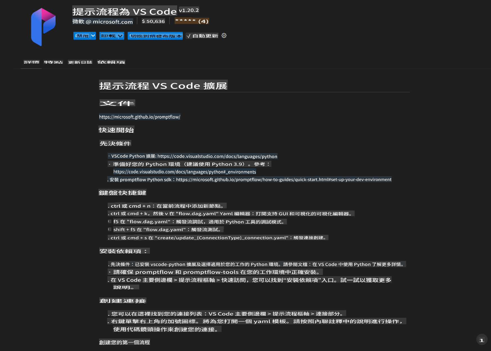
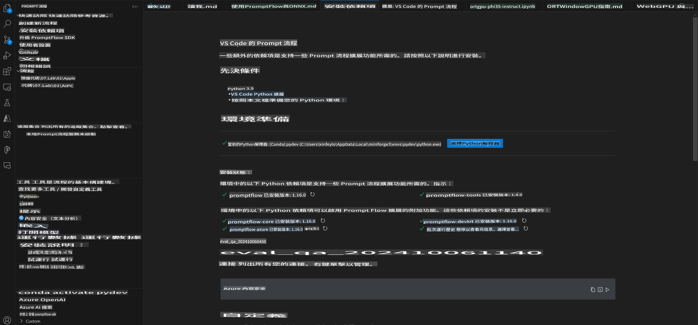
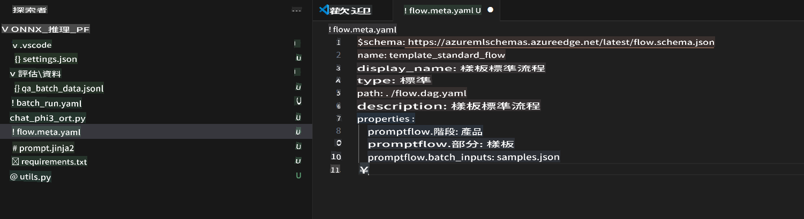
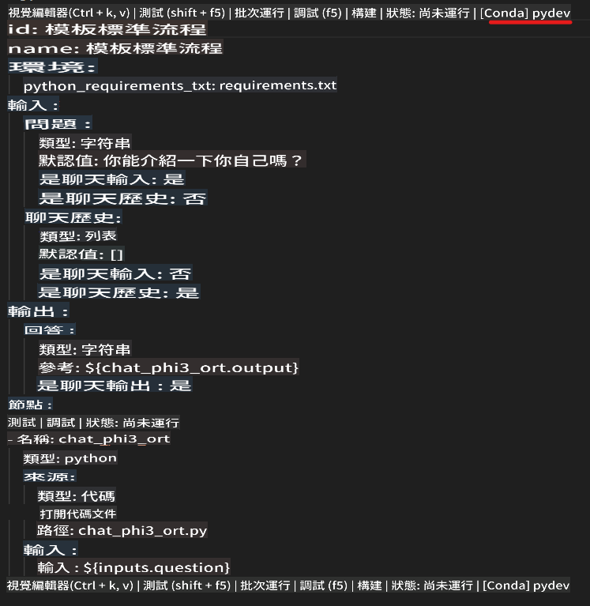
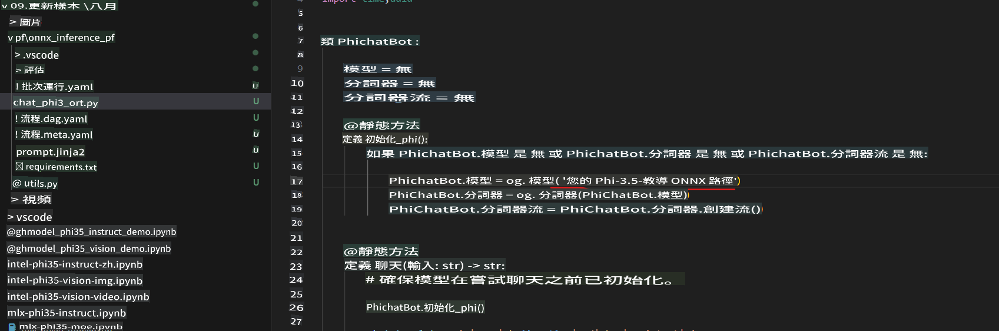
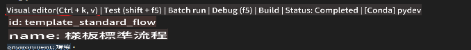
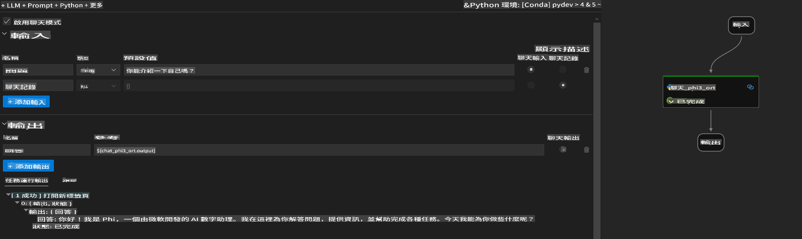

# 使用 Windows GPU 建立 Phi-3.5-Instruct ONNX 的 Prompt flow 解決方案

以下文件是一個使用 PromptFlow 與 ONNX (Open Neural Network Exchange) 開發基於 Phi-3 模型的 AI 應用的範例。

PromptFlow 是一套開發工具，旨在簡化基於大型語言模型 (LLM) 的 AI 應用從構思、原型設計到測試和評估的整個開發週期。

通過將 PromptFlow 與 ONNX 結合，開發者可以：

- 優化模型性能：利用 ONNX 進行高效的模型推理和部署。
- 簡化開發流程：使用 PromptFlow 管理工作流程並自動化重複性任務。
- 增強團隊合作：提供統一的開發環境，促進團隊成員之間更好的合作。

**Prompt flow** 是一套開發工具，旨在簡化基於 LLM 的 AI 應用從構思、原型設計、測試、評估到生產部署和監控的整個開發週期。它使提示工程變得更容易，並使您能夠構建具有生產質量的 LLM 應用。

Prompt flow 可以連接到 OpenAI、Azure OpenAI Service 和可自定義的模型 (如 Huggingface、本地 LLM/SLM)。我們希望將 Phi-3.5 的量化 ONNX 模型部署到本地應用中。Prompt flow 可以幫助我們更好地規劃業務並完成基於 Phi-3.5 的本地解決方案。在這個範例中，我們將結合 ONNX Runtime GenAI Library 來完成基於 Windows GPU 的 Prompt flow 解決方案。

## **安裝**

### **Windows GPU 的 ONNX Runtime GenAI**

閱讀此指南以設置 Windows GPU 的 ONNX Runtime GenAI [點擊這裡](./041.ORTWindowGPUGuideline.md)

### **在 VSCode 中設置 Prompt flow**

1. 安裝 Prompt flow VS Code 擴展



2. 安裝 Prompt flow VS Code 擴展後，點擊擴展，然後選擇 **Installation dependencies**，按照此指南在您的環境中安裝 Prompt flow SDK



3. 下載 [範例代碼](../../../../../code/09.UpdateSamples/Aug/pf/onnx_inference_pf) 並使用 VS Code 打開此範例



4. 打開 **flow.dag.yaml** 選擇您的 Python 環境



   打開 **chat_phi3_ort.py** 更改您的 Phi-3.5-instruct ONNX 模型位置



5. 運行您的 prompt flow 進行測試

打開 **flow.dag.yaml** 點擊視覺化編輯器



點擊後運行進行測試



6. 您可以在終端運行批處理以檢查更多結果

```bash

pf run create --file batch_run.yaml --stream --name 'Your eval qa name'    

```

您可以在默認瀏覽器中檢查結果


**免責聲明**：
本文件是使用機器翻譯服務進行翻譯的。我們努力確保準確性，但請注意，自動翻譯可能包含錯誤或不準確之處。應以原文文件作為權威來源。對於關鍵信息，建議尋求專業人工翻譯。我們對因使用此翻譯而產生的任何誤解或誤釋不承擔責任。