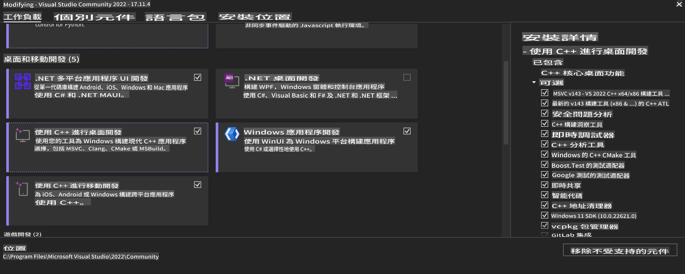
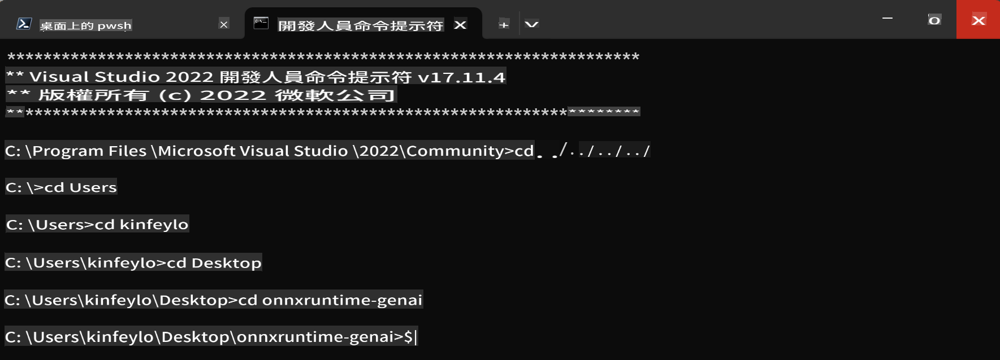

# **OnnxRuntime GenAI Windows GPU 使用指南**

這份指南提供了在 Windows 上設置和使用 ONNX Runtime (ORT) 與 GPU 的步驟。旨在幫助你利用 GPU 加速你的模型，提高性能和效率。

文件提供了以下指導：

- 環境設置：安裝必要依賴項如 CUDA、cuDNN 和 ONNX Runtime 的說明。
- 配置：如何配置環境和 ONNX Runtime 以有效利用 GPU 資源。
- 優化提示：如何微調 GPU 設置以獲得最佳性能的建議。

### **1. Python 3.10.x /3.11.8**

   ***Note*** 建議使用 [miniforge](https://github.com/conda-forge/miniforge/releases/latest/download/Miniforge3-Windows-x86_64.exe) 作為你的 Python 環境

   ```bash

   conda create -n pydev python==3.11.8

   conda activate pydev

   ```

   ***Reminder*** 如果你已經安裝了任何關於 python ONNX 的庫，請卸載它們

### **2. 使用 winget 安裝 CMake**

   ```bash

   winget install -e --id Kitware.CMake

   ```

### **3. 安裝 Visual Studio 2022 - Desktop Development with C++**

   ***Note*** 如果你不想編譯，可以跳過這一步



### **4. 安裝 NVIDIA 驅動**

1. **NVIDIA GPU 驅動**  [https://www.nvidia.com/en-us/drivers/](https://www.nvidia.com/en-us/drivers/)

2. **NVIDIA CUDA 12.4** [https://developer.nvidia.com/cuda-12-4-0-download-archive](https://developer.nvidia.com/cuda-12-4-0-download-archive)

3. **NVIDIA CUDNN 9.4**  [https://developer.nvidia.com/cudnn-downloads](https://developer.nvidia.com/cudnn-downloads)

***Reminder*** 請使用默認設置進行安裝

### **5. 設置 NVIDIA 環境變量**

將 NVIDIA CUDNN 9.4 的 lib、bin、include 複製到 NVIDIA CUDA 12.4 的 lib、bin、include

- 將 *'C:\Program Files\NVIDIA\CUDNN\v9.4\bin\12.6'* 中的文件複製到 *'C:\Program Files\NVIDIA GPU Computing Toolkit\CUDA\v12.4\bin'*

- 將 *'C:\Program Files\NVIDIA\CUDNN\v9.4\include\12.6'* 中的文件複製到 *'C:\Program Files\NVIDIA GPU Computing Toolkit\CUDA\v12.4\include'*

- 將 *'C:\Program Files\NVIDIA\CUDNN\v9.4\lib\12.6'* 中的文件複製到 *'C:\Program Files\NVIDIA GPU Computing Toolkit\CUDA\v12.4\lib\x64'*

### **6. 下載 Phi-3.5-mini-instruct-onnx**

   ```bash

   winget install -e --id Git.Git

   winget install -e --id GitHub.GitLFS

   git lfs install

   git clone https://huggingface.co/microsoft/Phi-3.5-mini-instruct-onnx

   ```

### **7. 運行 InferencePhi35Instruct.ipynb**

   打開 [Notebook](../../../../../code/09.UpdateSamples/Aug/ortgpu-phi35-instruct.ipynb) 並執行


### **8. 編譯 ORT GenAI GPU**

   ***Note*** 
   
   1. 請首先卸載所有關於 onnx、onnxruntime 和 onnxruntime-genai 的內容

   
   ```bash

   pip list 
   
   ```

   然後卸載所有 onnxruntime 庫，例如：

   ```bash

   pip uninstall onnxruntime

   pip uninstall onnxruntime-genai

   pip uninstall onnxruntume-genai-cuda
   
   ```

   2. 檢查 Visual Studio 擴展支持 

   檢查 C:\Program Files\NVIDIA GPU Computing Toolkit\CUDA\v12.4\extras 以確保找到 C:\Program Files\NVIDIA GPU Computing Toolkit\CUDA\v12.4\extras\visual_studio_integration。 
   
   如果未找到，請檢查其他 Cuda 工具包驅動文件夾，並將 visual_studio_integration 文件夾及其內容複製到 C:\Program Files\NVIDIA GPU Computing Toolkit\CUDA\v12.4\extras\visual_studio_integration

   - 如果你不想編譯，可以跳過這一步

   ```bash

   git clone https://github.com/microsoft/onnxruntime-genai

   ```

   - 下載 [https://github.com/microsoft/onnxruntime/releases/download/v1.19.2/onnxruntime-win-x64-gpu-1.19.2.zip](https://github.com/microsoft/onnxruntime/releases/download/v1.19.2/onnxruntime-win-x64-gpu-1.19.2.zip)

   - 解壓 onnxruntime-win-x64-gpu-1.19.2.zip，並將其重命名為 **ort**，將 ort 文件夾複製到 onnxruntime-genai

   - 使用 Windows Terminal，進入 VS 2022 的開發者命令提示符，然後進入 onnxruntime-genai



   - 使用你的 Python 環境進行編譯

   ```bash

   cd onnxruntime-genai

   python build.py --use_cuda  --cuda_home "C:\Program Files\NVIDIA GPU Computing Toolkit\CUDA\v12.4" --config Release
 

   cd build/Windows/Release/Wheel

   pip install .whl

   ```

**免責聲明**：
本文件是使用機器翻譯服務翻譯的。我們努力確保翻譯的準確性，但請注意，自動翻譯可能會包含錯誤或不準確之處。應以原文文件為權威來源。對於關鍵信息，建議尋求專業人工翻譯。我們對因使用此翻譯而引起的任何誤解或誤讀不承擔責任。