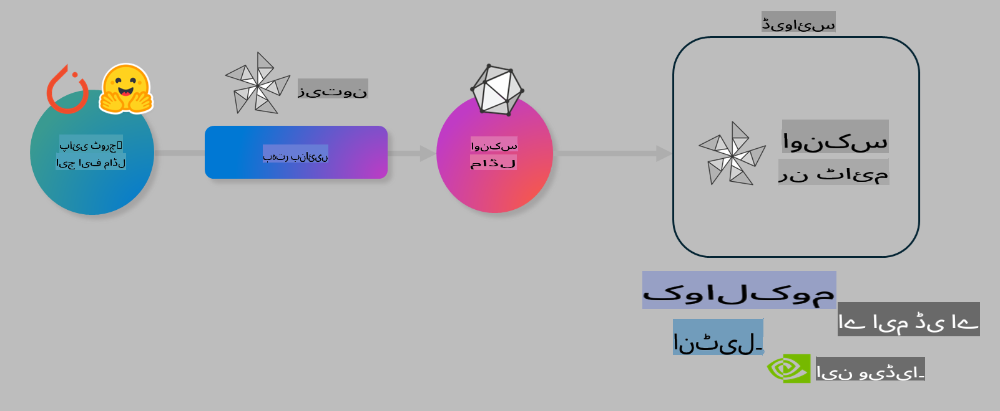

# لیب: AI ماڈلز کو ڈیوائس پر انفرنس کے لیے بہتر بنائیں

## تعارف

> [!IMPORTANT]  
> اس لیب کے لیے **Nvidia A10 یا A100 GPU** درکار ہے، جس کے ساتھ متعلقہ ڈرائیورز اور CUDA ٹول کٹ (ورژن 12+) انسٹال ہو۔

> [!NOTE]  
> یہ ایک **35 منٹ** کا لیب ہے جو آپ کو OLIVE کا استعمال کرتے ہوئے ماڈلز کو ڈیوائس پر انفرنس کے لیے بہتر بنانے کے بنیادی تصورات پر عملی تجربہ فراہم کرے گا۔

## سیکھنے کے مقاصد

اس لیب کے اختتام تک، آپ OLIVE کا استعمال کرتے ہوئے درج ذیل کرنے کے قابل ہوں گے:

- AWQ کوانٹائزیشن طریقہ استعمال کرتے ہوئے AI ماڈل کو کوانٹائز کریں۔
- کسی مخصوص کام کے لیے AI ماڈل کو فائن ٹیون کریں۔
- ONNX Runtime پر مؤثر ڈیوائس انفرنس کے لیے LoRA اڈاپٹرز (فائن ٹیونڈ ماڈل) تیار کریں۔

### اولیو کیا ہے؟

اولیو (*O*NNX *live*) ایک ماڈل آپٹیمائزیشن ٹول کٹ ہے، جس کے ساتھ CLI بھی شامل ہے، جو آپ کو ONNX runtime +++https://onnxruntime.ai+++ کے لیے ماڈلز فراہم کرنے کی اجازت دیتا ہے۔



اولیو میں ان پٹ عام طور پر PyTorch یا Hugging Face ماڈل ہوتا ہے، اور آؤٹ پٹ ایک بہتر بنایا ہوا ONNX ماڈل ہوتا ہے، جو ڈیوائس (ڈپلائمنٹ ٹارگٹ) پر چلایا جاتا ہے، جو ONNX runtime چلاتا ہے۔ اولیو ماڈل کو ہارڈویئر وینڈر (جیسے Qualcomm، AMD، Nvidia یا Intel) کے AI ایکسیلیریٹر (NPU، GPU، CPU) کے لیے بہتر بناتا ہے۔

اولیو ایک *ورک فلو* انجام دیتا ہے، جو انفرادی ماڈل آپٹیمائزیشن ٹاسکس کی ترتیب وار سیریز ہے، جنہیں *پاسز* کہا جاتا ہے - مثال کے طور پر: ماڈل کمپریشن، گراف کیپچر، کوانٹائزیشن، گراف آپٹیمائزیشن۔ ہر پاس میں ایک سیٹ ہوتا ہے جسے بہترین میٹرکس حاصل کرنے کے لیے ٹیون کیا جا سکتا ہے، جیسے ایکوریسی اور لیٹنسی، جنہیں متعلقہ ایویلیوایٹر کے ذریعے جانچا جاتا ہے۔ اولیو ایک سرچ اسٹریٹجی استعمال کرتا ہے جو ایک سرچ الگورتھم کے ذریعے ہر پاس یا پاسز کے سیٹ کو خودکار طور پر ٹیون کرتا ہے۔

#### اولیو کے فوائد

- **پریشانی اور وقت کی بچت:** گراف آپٹیمائزیشن، کمپریشن اور کوانٹائزیشن کے لیے مختلف تکنیکوں کے دستی تجربات کے جھنجھٹ سے بچیں۔ اپنی کوالٹی اور پرفارمنس کی حدود طے کریں اور اولیو کو بہترین ماڈل خودکار طور پر تلاش کرنے دیں۔
- **40+ بلٹ ان ماڈل آپٹیمائزیشن کمپوننٹس:** کوانٹائزیشن، کمپریشن، گراف آپٹیمائزیشن اور فائن ٹیوننگ میں جدید تکنیکوں کا احاطہ۔
- **آسان CLI:** عام ماڈل آپٹیمائزیشن ٹاسکس کے لیے۔ مثال کے طور پر، `olive quantize`, `olive auto-opt`, `olive finetune`۔
- ماڈل پیکجنگ اور ڈپلائمنٹ بلٹ ان۔
- **ملٹی LoRA سروسنگ** کے لیے ماڈلز تیار کرنے کی سپورٹ۔
- YAML/JSON استعمال کرکے ورک فلو تشکیل دیں تاکہ ماڈل آپٹیمائزیشن اور ڈپلائمنٹ ٹاسکس کو ترتیب دیں۔
- **Hugging Face** اور **Azure AI** انٹیگریشن۔
- **کیشنگ** کا بلٹ ان میکانزم تاکہ **لاگت کی بچت** ہو۔

## لیب ہدایات

> [!NOTE]  
> براہ کرم یقینی بنائیں کہ آپ نے اپنے Azure AI Hub اور پروجیکٹ کو تیار کیا ہے اور Lab 1 کے مطابق اپنا A100 کمپیوٹ سیٹ اپ کیا ہے۔

### مرحلہ 0: Azure AI Compute سے جڑیں

آپ **VS Code** کے ریموٹ فیچر کا استعمال کرتے ہوئے Azure AI کمپیوٹ سے جڑیں گے۔

1. اپنی **VS Code** ڈیسک ٹاپ ایپلیکیشن کھولیں:  
1. **کمانڈ پیلیٹ** کھولنے کے لیے **Shift+Ctrl+P** دبائیں۔  
1. کمانڈ پیلیٹ میں **AzureML - remote: Connect to compute instance in New Window** تلاش کریں۔  
1. کمپیوٹ سے جڑنے کے لیے اسکرین پر دی گئی ہدایات پر عمل کریں۔ اس میں آپ کی Azure سبسکرپشن، ریسورس گروپ، پروجیکٹ اور کمپیوٹ کا نام منتخب کرنا شامل ہوگا جو آپ نے Lab 1 میں سیٹ اپ کیا تھا۔  
1. جب آپ اپنے Azure ML کمپیوٹ نوڈ سے جڑ جاتے ہیں، تو یہ **Visual Code کے نیچے بائیں جانب** ظاہر ہوگا `><Azure ML: Compute Name`  

### مرحلہ 1: اس ریپو کو کلون کریں

VS Code میں، **Ctrl+J** دباکر ایک نیا ٹرمینل کھولیں اور اس ریپو کو کلون کریں:

ٹرمینل میں آپ کو یہ پرامپٹ نظر آئے گا:

```
azureuser@computername:~/cloudfiles/code$ 
```  
حل کو کلون کریں  

```bash
cd ~/localfiles
git clone https://github.com/microsoft/phi-3cookbook.git
```  

### مرحلہ 2: فولڈر کو VS Code میں کھولیں

VS Code کو متعلقہ فولڈر میں کھولنے کے لیے، ٹرمینل میں درج ذیل کمانڈ چلائیں، جو ایک نئی ونڈو کھولے گی:

```bash
code phi-3cookbook/code/04.Finetuning/Olive-lab
```  

متبادل طور پر، آپ **File** > **Open Folder** منتخب کرکے فولڈر کھول سکتے ہیں۔

### مرحلہ 3: ڈیپینڈینسز

VS Code میں اپنے Azure AI Compute Instance پر ایک ٹرمینل ونڈو کھولیں (ٹپ: **Ctrl+J**) اور درج ذیل کمانڈز چلائیں تاکہ ڈیپینڈینسز انسٹال ہوں:

```bash
conda create -n olive-ai python=3.11 -y
conda activate olive-ai
pip install -r requirements.txt
az extension remove -n azure-cli-ml
az extension add -n ml
```  

> [!NOTE]  
> تمام ڈیپینڈینسز انسٹال ہونے میں تقریباً **5 منٹ** لگتے ہیں۔

اس لیب میں آپ ماڈلز کو Azure AI Model کیٹلاگ میں ڈاؤن لوڈ اور اپ لوڈ کریں گے۔ ماڈل کیٹلاگ تک رسائی حاصل کرنے کے لیے، آپ کو Azure میں لاگ ان ہونا ہوگا:

```bash
az login
```  

> [!NOTE]  
> لاگ ان کے وقت آپ سے اپنی سبسکرپشن منتخب کرنے کے لیے کہا جائے گا۔ یقینی بنائیں کہ آپ اس لیب کے لیے فراہم کردہ سبسکرپشن سیٹ کریں۔

### مرحلہ 4: اولیو کمانڈز چلائیں

VS Code میں اپنے Azure AI Compute Instance پر ایک ٹرمینل ونڈو کھولیں (ٹپ: **Ctrl+J**) اور یقینی بنائیں کہ `olive-ai` کونڈا ماحول ایکٹیویٹ ہے:

```bash
conda activate olive-ai
```  

اب درج ذیل اولیو کمانڈز کمانڈ لائن میں چلائیں:

1. **ڈیٹا کا معائنہ کریں:** اس مثال میں، آپ Phi-3.5-Mini ماڈل کو فائن ٹیون کریں گے تاکہ یہ سفر سے متعلق سوالات کے جوابات دینے میں مہارت حاصل کرے۔ نیچے دیا گیا کوڈ ڈیٹاسیٹ کے پہلے چند ریکارڈز کو JSON لائنز فارمیٹ میں دکھاتا ہے:  

    ```bash
    head data/data_sample_travel.jsonl
    ```  

1. **ماڈل کوانٹائز کریں:** ماڈل کی تربیت سے پہلے، آپ اسے درج ذیل کمانڈ کے ذریعے کوانٹائز کرتے ہیں، جو ایک تکنیک استعمال کرتی ہے جسے Active Aware Quantization (AWQ) +++https://arxiv.org/abs/2306.00978+++ کہا جاتا ہے۔ AWQ ماڈل کے ویٹس کو انفرینس کے دوران پیدا ہونے والے ایکٹیویشنز پر غور کرتے ہوئے کوانٹائز کرتا ہے۔ یہ عمل ایکٹیویشنز میں موجود اصل ڈیٹا ڈسٹریبیوشن کو مدنظر رکھتا ہے، جس سے روایتی ویٹ کوانٹائزیشن کے مقابلے میں ماڈل کی درستگی بہتر رہتی ہے۔

    ```bash
    olive quantize \
       --model_name_or_path microsoft/Phi-3.5-mini-instruct \
       --trust_remote_code \
       --algorithm awq \
       --output_path models/phi/awq \
       --log_level 1
    ```  

    AWQ کوانٹائزیشن مکمل ہونے میں **تقریباً 8 منٹ** لگتے ہیں، اور یہ **ماڈل کا سائز ~7.5GB سے ~2.5GB** تک کم کر دیتا ہے۔

    اس لیب میں، ہم آپ کو دکھا رہے ہیں کہ Hugging Face سے ماڈلز کو کیسے ان پٹ کیا جائے (مثال کے طور پر: `microsoft/Phi-3.5-mini-instruct`). However, Olive also allows you to input models from the Azure AI catalog by updating the `model_name_or_path` argument to an Azure AI asset ID (for example:  `azureml://registries/azureml/models/Phi-3.5-mini-instruct/versions/4`). 

1. **Train the model:** Next, the `olive finetune` کمانڈ کوانٹائزڈ ماڈل کو فائن ٹیون کرتا ہے۔ ماڈل کوانٹائزیشن کے بعد فائن ٹیون کرنے کے بجائے پہلے کوانٹائز کرنا بہتر ایکوریسی دیتا ہے کیونکہ فائن ٹیوننگ عمل کوانٹائزیشن سے ہونے والے کچھ نقصان کو بحال کرتا ہے۔

    ```bash
    olive finetune \
        --method lora \
        --model_name_or_path models/phi/awq \
        --data_files "data/data_sample_travel.jsonl" \
        --data_name "json" \
        --text_template "<|user|>\n{prompt}<|end|>\n<|assistant|>\n{response}<|end|>" \
        --max_steps 100 \
        --output_path ./models/phi/ft \
        --log_level 1
    ```  

    فائن ٹیوننگ مکمل ہونے میں **تقریباً 6 منٹ** لگتے ہیں (100 مراحل کے ساتھ)۔

1. **آپٹیمائز کریں:** ماڈل کی تربیت کے بعد، آپ اب ماڈل کو اولیو کے `auto-opt` command, which will capture the ONNX graph and automatically perform a number of optimizations to improve the model performance for CPU by compressing the model and doing fusions. It should be noted, that you can also optimize for other devices such as NPU or GPU by just updating the `--device` and `--provider` آرگیومنٹس کا استعمال کرتے ہوئے آپٹیمائز کرتے ہیں - لیکن اس لیب کے مقاصد کے لیے ہم CPU استعمال کریں گے۔

    ```bash
    olive auto-opt \
       --model_name_or_path models/phi/ft/model \
       --adapter_path models/phi/ft/adapter \
       --device cpu \
       --provider CPUExecutionProvider \
       --use_ort_genai \
       --output_path models/phi/onnx-ao \
       --log_level 1
    ```  

    آپٹیمائزیشن مکمل ہونے میں **تقریباً 5 منٹ** لگتے ہیں۔

### مرحلہ 5: ماڈل انفرنس کا فوری ٹیسٹ

ماڈل کا انفرنس ٹیسٹ کرنے کے لیے، اپنے فولڈر میں **app.py** کے نام سے ایک Python فائل بنائیں اور درج ذیل کوڈ کاپی اور پیسٹ کریں:

```python
import onnxruntime_genai as og
import numpy as np

print("loading model and adapters...", end="", flush=True)
model = og.Model("models/phi/onnx-ao/model")
adapters = og.Adapters(model)
adapters.load("models/phi/onnx-ao/model/adapter_weights.onnx_adapter", "travel")
print("DONE!")

tokenizer = og.Tokenizer(model)
tokenizer_stream = tokenizer.create_stream()

params = og.GeneratorParams(model)
params.set_search_options(max_length=100, past_present_share_buffer=False)
user_input = "what is the best thing to see in chicago"
params.input_ids = tokenizer.encode(f"<|user|>\n{user_input}<|end|>\n<|assistant|>\n")

generator = og.Generator(model, params)

generator.set_active_adapter(adapters, "travel")

print(f"{user_input}")

while not generator.is_done():
    generator.compute_logits()
    generator.generate_next_token()

    new_token = generator.get_next_tokens()[0]
    print(tokenizer_stream.decode(new_token), end='', flush=True)

print("\n")
```  

کوڈ کو چلانے کے لیے درج ذیل کمانڈ استعمال کریں:

```bash
python app.py
```  

### مرحلہ 6: ماڈل کو Azure AI پر اپ لوڈ کریں

ماڈل کو Azure AI ماڈل ریپوزٹری پر اپ لوڈ کرنا ماڈل کو آپ کی ڈیولپمنٹ ٹیم کے دیگر ممبران کے ساتھ شیئر کرنے کے قابل بناتا ہے اور ماڈل کا ورژن کنٹرول بھی سنبھالتا ہے۔ ماڈل کو اپ لوڈ کرنے کے لیے درج ذیل کمانڈ چلائیں:

> [!NOTE]  
> `{}` placeholders with the name of your resource group and Azure AI Project Name. 

To find your resource group `"resourceGroup"اور Azure AI پروجیکٹ کا نام اپ ڈیٹ کریں، درج ذیل کمانڈ چلائیں  

```
az ml workspace show
```  

یا +++ai.azure.com+++ پر جاکر **management center** > **project** > **overview** منتخب کریں۔

`{}` پلیس ہولڈرز کو اپنے ریسورس گروپ اور Azure AI پروجیکٹ کے نام سے اپ ڈیٹ کریں۔

```bash
az ml model create \
    --name ft-for-travel \
    --version 1 \
    --path ./models/phi/onnx-ao \
    --resource-group {RESOURCE_GROUP_NAME} \
    --workspace-name {PROJECT_NAME}
```  
اس کے بعد آپ اپنا اپ لوڈ کردہ ماڈل دیکھ سکتے ہیں اور اسے https://ml.azure.com/model/list پر ڈپلائے کر سکتے ہیں۔

**ڈسکلیمر**:  
یہ دستاویز مشین پر مبنی AI ترجمہ خدمات کا استعمال کرتے ہوئے ترجمہ کی گئی ہے۔ اگرچہ ہم درستگی کے لیے کوشش کرتے ہیں، براہ کرم آگاہ رہیں کہ خودکار ترجمے میں غلطیاں یا غیر درستیاں ہو سکتی ہیں۔ اصل دستاویز کو اس کی اصل زبان میں مستند ذریعہ سمجھا جانا چاہیے۔ اہم معلومات کے لیے، پیشہ ور انسانی ترجمہ تجویز کیا جاتا ہے۔ ہم اس ترجمے کے استعمال سے پیدا ہونے والی کسی بھی غلط فہمی یا غلط تشریح کے ذمہ دار نہیں ہیں۔