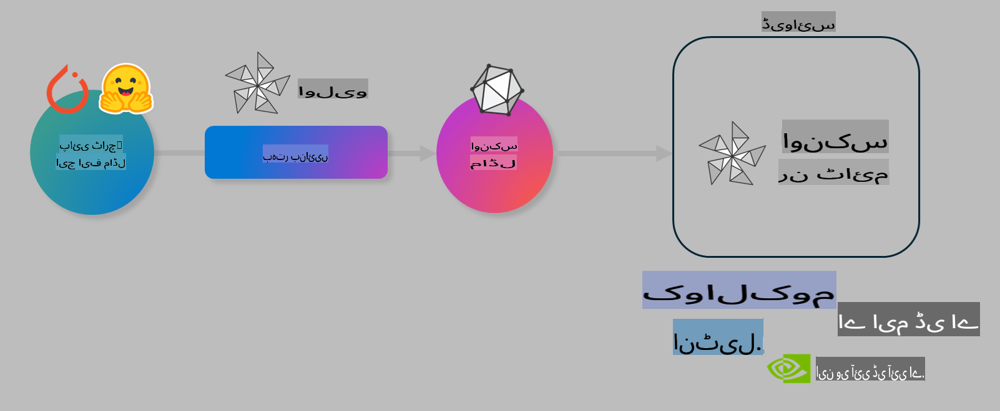

# لیب: AI ماڈلز کو ڈیوائس پر انفیرنس کے لیے بہتر بنائیں

## تعارف 

> [!IMPORTANT]
> اس لیب کے لیے **Nvidia A10 یا A100 GPU** درکار ہے، جس کے ساتھ متعلقہ ڈرائیورز اور CUDA ٹول کٹ (ورژن 12+) انسٹال ہو۔

> [!NOTE]
> یہ ایک **35 منٹ** کا لیب ہے جو آپ کو OLIVE کا استعمال کرتے ہوئے ماڈلز کو ڈیوائس پر انفیرنس کے لیے بہتر بنانے کے بنیادی تصورات پر عملی تعارف فراہم کرے گا۔

## سیکھنے کے مقاصد

اس لیب کے اختتام تک، آپ OLIVE کا استعمال کرتے ہوئے یہ کرنے کے قابل ہوں گے:

- AWQ کوانٹائزیشن طریقہ استعمال کرتے ہوئے AI ماڈل کو کوانٹائز کریں۔
- کسی خاص کام کے لیے AI ماڈل کو فائن ٹیون کریں۔
- ONNX Runtime پر موثر ڈیوائس انفیرنس کے لیے LoRA اڈاپٹرز (فائن ٹیونڈ ماڈل) تیار کریں۔

### اولیو کیا ہے؟

اولیو (*O*NNX *live*) ایک ماڈل آپٹمائزیشن ٹول کٹ ہے جس کے ساتھ CLI آتا ہے، جو آپ کو ONNX runtime +++https://onnxruntime.ai+++ کے لیے ماڈلز تیار کرنے میں مدد دیتا ہے۔



اولیو میں عام طور پر ان پٹ PyTorch یا Hugging Face ماڈل ہوتا ہے، اور آؤٹ پٹ ایک بہتر بنایا گیا ONNX ماڈل ہوتا ہے جو ڈیوائس (ڈیپلائمنٹ ٹارگٹ) پر چلتا ہے جہاں ONNX runtime کام کر رہا ہوتا ہے۔ اولیو ماڈل کو ہارڈویئر وینڈر (جیسے Qualcomm، AMD، Nvidia یا Intel) کے فراہم کردہ AI ایکسیلیریٹر (NPU، GPU، CPU) کے لیے بہتر بناتا ہے۔

اولیو ایک *ورک فلو* چلاتا ہے، جو ماڈل آپٹمائزیشن کے انفرادی کاموں کی ترتیب ہے جنہیں *پاسز* کہا جاتا ہے۔ مثال کے طور پر: ماڈل کمپریشن، گراف کیپچر، کوانٹائزیشن، گراف آپٹمائزیشن۔ ہر پاس کے پیرامیٹرز ہوتے ہیں جنہیں بہترین میٹرکس (جیسے ایکیوریسی اور لیٹینسی) حاصل کرنے کے لیے ٹیون کیا جا سکتا ہے، جو متعلقہ ایویلیوایٹر کے ذریعے جانچے جاتے ہیں۔ اولیو ایک سرچ اسٹریٹجی استعمال کرتا ہے جو ایک سرچ الگورتھم کے ذریعے ہر پاس کو الگ الگ یا پاسز کے سیٹ کو ایک ساتھ آٹو ٹیون کرتا ہے۔

#### اولیو کے فوائد

- گراف آپٹمائزیشن، کمپریشن، اور کوانٹائزیشن کے مختلف طریقوں کے ساتھ آزمائش اور غلطی کے دستی تجربات کی **مایوسی اور وقت کو کم کریں**۔ اپنی کوالٹی اور پرفارمنس کی حدیں متعین کریں اور اولیو کو بہترین ماڈل خود بخود تلاش کرنے دیں۔
- **40+ بلٹ ان ماڈل آپٹمائزیشن کمپوننٹس** جو کوانٹائزیشن، کمپریشن، گراف آپٹمائزیشن اور فائن ٹیوننگ میں جدید ترین تکنیکوں کا احاطہ کرتے ہیں۔
- عام ماڈل آپٹمائزیشن ٹاسکس کے لیے **آسان استعمال CLI**۔ مثال کے طور پر، olive quantize, olive auto-opt, olive finetune۔
- ماڈل پیکجنگ اور ڈیپلائمنٹ بلٹ ان۔
- **ملٹی LoRA سرونگ** کے لیے ماڈلز تیار کرنے کی سپورٹ۔
- ماڈل آپٹمائزیشن اور ڈیپلائمنٹ ٹاسکس کو آرکیسٹریٹ کرنے کے لیے YAML/JSON ورک فلو بنائیں۔
- **Hugging Face** اور **Azure AI** انٹیگریشن۔
- **کیشنگ** کا بلٹ ان میکانزم جو **اخراجات بچاتا ہے**۔

## لیب ہدایات
> [!NOTE]
> یقینی بنائیں کہ آپ نے اپنی Azure AI Hub اور پروجیکٹ کو ترتیب دیا ہے اور اپنا A100 کمپیوٹ Lab 1 کے مطابق سیٹ اپ کیا ہے۔

### مرحلہ 0: Azure AI کمپیوٹ سے کنیکٹ کریں

آپ **VS Code** میں ریموٹ فیچر استعمال کرتے ہوئے Azure AI کمپیوٹ سے کنیکٹ کریں گے۔

1. اپنی **VS Code** ڈیسک ٹاپ ایپلیکیشن کھولیں:
1. **Shift+Ctrl+P** استعمال کرتے ہوئے **کمانڈ پلیٹ** کھولیں۔
1. کمانڈ پلیٹ میں **AzureML - remote: Connect to compute instance in New Window** تلاش کریں۔
1. کمپیوٹ سے کنیکٹ کرنے کے لیے اسکرین پر دی گئی ہدایات پر عمل کریں۔ اس میں آپ کے Azure Subscription، Resource Group، Project اور Compute کا نام منتخب کرنا شامل ہوگا جو آپ نے Lab 1 میں سیٹ اپ کیا تھا۔
1. ایک بار جب آپ Azure ML کمپیوٹ نوڈ سے کنیکٹ ہو جائیں، یہ **Visual Code کے نیچے بائیں جانب** دکھایا جائے گا `><Azure ML: Compute Name`۔

### مرحلہ 1: اس ریپو کو کلون کریں

VS Code میں، آپ **Ctrl+J** کے ساتھ نیا ٹرمینل کھول سکتے ہیں اور اس ریپو کو کلون کر سکتے ہیں:

ٹرمینل میں آپ کو پرامپٹ نظر آئے گا

```
azureuser@computername:~/cloudfiles/code$ 
```
حل کو کلون کریں 

```bash
cd ~/localfiles
git clone https://github.com/microsoft/phi-3cookbook.git
```

### مرحلہ 2: فولڈر کو VS Code میں کھولیں

متعلقہ فولڈر میں VS Code کھولنے کے لیے ٹرمینل میں درج ذیل کمانڈ چلائیں، جو نیا ونڈو کھولے گی:

```bash
code phi-3cookbook/code/04.Finetuning/Olive-lab
```

یا پھر آپ **File** > **Open Folder** منتخب کر کے فولڈر کھول سکتے ہیں۔

### مرحلہ 3: ڈپینڈینسیز

Azure AI کمپیوٹ انسٹینس میں VS Code میں ایک ٹرمینل ونڈو کھولیں (ٹپ: **Ctrl+J**) اور ڈپینڈینسیز انسٹال کرنے کے لیے درج ذیل کمانڈز چلائیں:

```bash
conda create -n olive-ai python=3.11 -y
conda activate olive-ai
pip install -r requirements.txt
az extension remove -n azure-cli-ml
az extension add -n ml
```

> [!NOTE]
> تمام ڈپینڈینسیز انسٹال ہونے میں ~5 منٹ لگیں گے۔

اس لیب میں آپ Azure AI ماڈل کیٹلاگ میں ماڈلز ڈاؤن لوڈ اور اپلوڈ کریں گے۔ ماڈل کیٹلاگ تک رسائی کے لیے، آپ کو Azure میں لاگ ان کرنا ہوگا:

```bash
az login
```

> [!NOTE]
> لاگ ان کے وقت آپ سے اپنی سبسکرپشن منتخب کرنے کو کہا جائے گا۔ اس بات کو یقینی بنائیں کہ آپ اس لیب کے لیے فراہم کردہ سبسکرپشن سیٹ کریں۔

### مرحلہ 4: اولیو کمانڈز چلائیں 

Azure AI کمپیوٹ انسٹینس میں VS Code میں ایک ٹرمینل ونڈو کھولیں (ٹپ: **Ctrl+J**) اور یقینی بنائیں کہ `olive-ai` کونڈا انوائرنمنٹ ایکٹیویٹ ہے:

```bash
conda activate olive-ai
```

اس کے بعد، کمانڈ لائن میں درج ذیل اولیو کمانڈز چلائیں۔

1. **ڈیٹا کا معائنہ کریں:** اس مثال میں، آپ Phi-3.5-Mini ماڈل کو فائن ٹیون کریں گے تاکہ یہ سفر سے متعلق سوالات کے جواب دینے میں مہارت حاصل کر سکے۔ نیچے دی گئی کوڈ ڈیٹاسیٹ کے پہلے چند ریکارڈز دکھاتا ہے، جو JSON لائنز فارمیٹ میں ہیں:

    ```bash
    head data/data_sample_travel.jsonl
    ```
1. **ماڈل کو کوانٹائز کریں:** ماڈل کو ٹرین کرنے سے پہلے، آپ درج ذیل کمانڈ کے ساتھ کوانٹائز کرتے ہیں، جو ایک تکنیک استعمال کرتی ہے جسے Active Aware Quantization (AWQ) +++https://arxiv.org/abs/2306.00978+++ کہا جاتا ہے۔ AWQ ماڈل کے ویٹس کو کوانٹائز کرتا ہے، ان ایکٹیویشنز کو مدنظر رکھتے ہوئے جو انفیرنس کے دوران پیدا ہوتی ہیں۔ اس کا مطلب ہے کہ کوانٹائزیشن کا عمل اصل ڈیٹا ڈسٹریبیوشن کو مدنظر رکھتا ہے، جس سے ماڈل کی ایکیوریسی بہتر طور پر برقرار رہتی ہے۔

    ```bash
    olive quantize \
       --model_name_or_path microsoft/Phi-3.5-mini-instruct \
       --trust_remote_code \
       --algorithm awq \
       --output_path models/phi/awq \
       --log_level 1
    ```
    
    AWQ کوانٹائزیشن مکمل ہونے میں **~8 منٹ** لگتے ہیں، جو ماڈل کے سائز کو **~7.5GB سے ~2.5GB** تک کم کر دیتا ہے۔

   اس لیب میں، ہم آپ کو دکھا رہے ہیں کہ Hugging Face سے ماڈلز کیسے ان پٹ کریں (مثال کے طور پر: `microsoft/Phi-3.5-mini-instruct`). However, Olive also allows you to input models from the Azure AI catalog by updating the `model_name_or_path` argument to an Azure AI asset ID (for example:  `azureml://registries/azureml/models/Phi-3.5-mini-instruct/versions/4`). 

1. **Train the model:** Next, the `olive finetune` کمانڈ کوانٹائزڈ ماڈل کو فائن ٹیون کرتا ہے۔ ماڈل کو فائن ٹیوننگ سے پہلے کوانٹائز کرنا بہتر ایکیوریسی فراہم کرتا ہے کیونکہ فائن ٹیوننگ عمل کوانٹائزیشن سے ہونے والے نقصان کو کسی حد تک بحال کرتا ہے۔

    ```bash
    olive finetune \
        --method lora \
        --model_name_or_path models/phi/awq \
        --data_files "data/data_sample_travel.jsonl" \
        --data_name "json" \
        --text_template "<|user|>\n{prompt}<|end|>\n<|assistant|>\n{response}<|end|>" \
        --max_steps 100 \
        --output_path ./models/phi/ft \
        --log_level 1
    ```
    
    فائن ٹیوننگ مکمل ہونے میں (100 steps کے ساتھ) **~6 منٹ** لگتے ہیں۔

1. **آپٹمائز کریں:** ماڈل ٹرین ہونے کے بعد، آپ اولیو کے `auto-opt` command, which will capture the ONNX graph and automatically perform a number of optimizations to improve the model performance for CPU by compressing the model and doing fusions. It should be noted, that you can also optimize for other devices such as NPU or GPU by just updating the `--device` and `--provider` آرگومنٹس کا استعمال کرتے ہوئے ماڈل کو آپٹمائز کرتے ہیں - لیکن اس لیب کے مقصد کے لیے ہم CPU استعمال کریں گے۔

    ```bash
    olive auto-opt \
       --model_name_or_path models/phi/ft/model \
       --adapter_path models/phi/ft/adapter \
       --device cpu \
       --provider CPUExecutionProvider \
       --use_ort_genai \
       --output_path models/phi/onnx-ao \
       --log_level 1
    ```
    
    آپٹمائزیشن مکمل ہونے میں **~5 منٹ** لگتے ہیں۔

### مرحلہ 5: ماڈل انفیرنس کا فوری ٹیسٹ

ماڈل کا انفیرنس ٹیسٹ کرنے کے لیے، اپنے فولڈر میں **app.py** نامی ایک Python فائل بنائیں اور درج ذیل کوڈ کاپی کریں:

```python
import onnxruntime_genai as og
import numpy as np

print("loading model and adapters...", end="", flush=True)
model = og.Model("models/phi/onnx-ao/model")
adapters = og.Adapters(model)
adapters.load("models/phi/onnx-ao/model/adapter_weights.onnx_adapter", "travel")
print("DONE!")

tokenizer = og.Tokenizer(model)
tokenizer_stream = tokenizer.create_stream()

params = og.GeneratorParams(model)
params.set_search_options(max_length=100, past_present_share_buffer=False)
user_input = "what is the best thing to see in chicago"
params.input_ids = tokenizer.encode(f"<|user|>\n{user_input}<|end|>\n<|assistant|>\n")

generator = og.Generator(model, params)

generator.set_active_adapter(adapters, "travel")

print(f"{user_input}")

while not generator.is_done():
    generator.compute_logits()
    generator.generate_next_token()

    new_token = generator.get_next_tokens()[0]
    print(tokenizer_stream.decode(new_token), end='', flush=True)

print("\n")
```

کوڈ کو چلانے کے لیے درج ذیل کمانڈ استعمال کریں:

```bash
python app.py
```

### مرحلہ 6: ماڈل کو Azure AI پر اپلوڈ کریں

ماڈل کو Azure AI ماڈل ریپوزٹری میں اپلوڈ کرنے سے ماڈل آپ کی ڈیولپمنٹ ٹیم کے دیگر ممبران کے ساتھ شیئر کیا جا سکتا ہے اور ماڈل کا ورژن کنٹرول بھی سنبھالا جا سکتا ہے۔ ماڈل اپلوڈ کرنے کے لیے درج ذیل کمانڈ چلائیں:

> [!NOTE]
> `{}` placeholders with the name of your resource group and Azure AI Project Name. 

To find your resource group `"resourceGroup"اور Azure AI پروجیکٹ کا نام اپڈیٹ کریں، درج ذیل کمانڈ چلائیں:

```
az ml workspace show
```

یا +++ai.azure.com+++ پر جا کر **management center** **project** **overview** منتخب کریں۔

`{}` پلیس ہولڈرز کو اپنے ریسورس گروپ اور Azure AI پروجیکٹ کے نام سے اپڈیٹ کریں۔

```bash
az ml model create \
    --name ft-for-travel \
    --version 1 \
    --path ./models/phi/onnx-ao \
    --resource-group {RESOURCE_GROUP_NAME} \
    --workspace-name {PROJECT_NAME}
```
پھر آپ اپنے اپلوڈ شدہ ماڈل کو دیکھ سکتے ہیں اور اسے https://ml.azure.com/model/list پر ڈیپلائے کر سکتے ہیں۔

**ڈسکلیمر**:  
یہ دستاویز مشین پر مبنی AI ترجمہ سروسز کا استعمال کرتے ہوئے ترجمہ کی گئی ہے۔ ہم درستگی کے لیے کوشش کرتے ہیں، لیکن براہ کرم آگاہ رہیں کہ خودکار ترجمے میں غلطیاں یا خامیاں ہو سکتی ہیں۔ اصل دستاویز کو اس کی اصل زبان میں مستند ذریعہ سمجھا جانا چاہیے۔ اہم معلومات کے لیے، پیشہ ور انسانی ترجمہ تجویز کیا جاتا ہے۔ اس ترجمے کے استعمال سے پیدا ہونے والی کسی بھی غلط فہمی یا غلط تشریح کے لیے ہم ذمہ دار نہیں ہیں۔