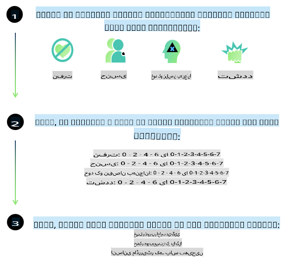
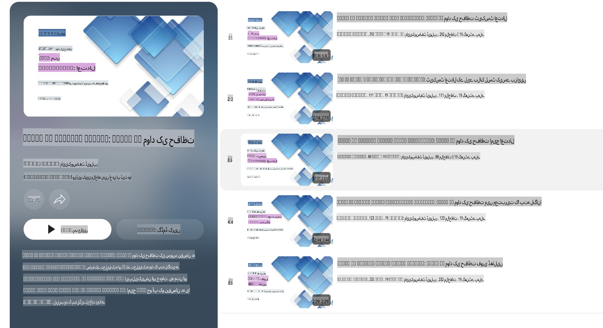

# Phi ماڈلز کے لیے AI سیفٹی

Phi ماڈلز کی فیملی کو [Microsoft Responsible AI Standard](https://query.prod.cms.rt.microsoft.com/cms/api/am/binary/RE5cmFl) کے مطابق ڈیزائن کیا گیا ہے، جو چھ اصولوں پر مبنی کمپنی کی سطح پر ضروریات کا مجموعہ ہے: جوابدہی، شفافیت، انصاف، قابل اعتباریت اور حفاظت، پرائیویسی اور سیکیورٹی، اور شمولیت، جو [Microsoft کے Responsible AI اصولوں](https://www.microsoft.com/ai/responsible-ai) کی بنیاد ہیں۔

پچھلے Phi ماڈلز کی طرح، ایک کثیر پہلو حفاظتی جائزہ اور حفاظتی پوسٹ ٹریننگ کا طریقہ اپنایا گیا، اور اس ریلیز کی کثیر لسانی صلاحیتوں کو مدنظر رکھنے کے لیے اضافی اقدامات کیے گئے۔ ہماری حفاظتی ٹریننگ اور جائزوں کا طریقہ، جس میں مختلف زبانوں اور خطرات کی کیٹیگریز میں ٹیسٹنگ شامل ہے، [Phi Safety Post-Training Paper](https://arxiv.org/abs/2407.13833) میں بیان کیا گیا ہے۔ اگرچہ Phi ماڈلز اس طریقہ سے فائدہ اٹھاتے ہیں، ڈویلپرز کو چاہیے کہ وہ ذمہ دار AI کے بہترین طریقے اپنائیں، جن میں ان کے مخصوص استعمال کے کیس اور ثقافتی و لسانی تناظر سے متعلق خطرات کا نقشہ بنانا، پیمائش کرنا، اور ان کو کم کرنا شامل ہے۔

## بہترین طریقے

دیگر ماڈلز کی طرح، Phi ماڈلز کی فیملی بھی ایسے رویے اختیار کر سکتی ہے جو غیر منصفانہ، ناقابل اعتبار، یا توہین آمیز ہوں۔

SLM اور LLM کے کچھ محدود رویے جن سے آگاہ ہونا ضروری ہے:

- **سروس کا معیار:** Phi ماڈلز بنیادی طور پر انگریزی متن پر تربیت یافتہ ہیں۔ انگریزی کے علاوہ دیگر زبانوں کی کارکردگی کمزور ہوگی۔ وہ انگریزی زبان کی اقسام جو تربیتی ڈیٹا میں کم نمائندگی رکھتی ہیں، ان کی کارکردگی معیاری امریکی انگریزی سے کمزور ہو سکتی ہے۔
- **نقصانات کی نمائندگی اور دقیانوسی تصورات کا فروغ:** یہ ماڈلز لوگوں کے گروپس کو زیادہ یا کم نمایاں کر سکتے ہیں، کچھ گروپس کی نمائندگی کو ختم کر سکتے ہیں، یا توہین آمیز یا منفی دقیانوسی تصورات کو مضبوط کر سکتے ہیں۔ حفاظتی پوسٹ ٹریننگ کے باوجود، ان حدود کا امکان موجود ہے کیونکہ مختلف گروپس کی مختلف سطحوں کی نمائندگی یا تربیتی ڈیٹا میں منفی دقیانوسی تصورات کی مثالوں کی کثرت حقیقی دنیا کے نمونوں اور سماجی تعصبات کی عکاسی کرتی ہے۔
- **نامناسب یا توہین آمیز مواد:** یہ ماڈلز دیگر اقسام کے نامناسب یا توہین آمیز مواد پیدا کر سکتے ہیں، جو انہیں حساس سیاق و سباق میں بغیر اضافی تخفیف کے تعینات کرنے کے لیے نامناسب بنا سکتا ہے۔
- **معلومات کی اعتباریت:** زبان کے ماڈلز غیر منطقی مواد تیار کر سکتے ہیں یا ایسا مواد بنا سکتے ہیں جو بظاہر معقول لگے لیکن غلط یا پرانا ہو۔
- **کوڈ کے لیے محدود دائرہ:** Phi-3 کے تربیتی ڈیٹا کا زیادہ تر حصہ Python پر مبنی ہے اور عام پیکجز جیسے "typing, math, random, collections, datetime, itertools" استعمال کرتا ہے۔ اگر ماڈل Python اسکرپٹس بناتا ہے جو دیگر پیکجز یا دیگر زبانوں میں اسکرپٹس استعمال کرتے ہیں، تو ہم سختی سے سفارش کرتے ہیں کہ صارفین تمام API استعمال کو دستی طور پر چیک کریں۔

ڈویلپرز کو ذمہ دار AI کے بہترین طریقے اپنانے چاہییں اور یہ یقینی بنانا ان کی ذمہ داری ہے کہ مخصوص استعمال کے کیس متعلقہ قوانین اور ضوابط (جیسے پرائیویسی، تجارت وغیرہ) کے مطابق ہوں۔

## ذمہ دار AI کے اعتبارات

دیگر زبان کے ماڈلز کی طرح، Phi سیریز کے ماڈلز بھی ایسے رویے اختیار کر سکتے ہیں جو غیر منصفانہ، ناقابل اعتبار، یا توہین آمیز ہوں۔ کچھ محدود رویے جن سے آگاہ ہونا ضروری ہے:

**سروس کا معیار:** Phi ماڈلز بنیادی طور پر انگریزی متن پر تربیت یافتہ ہیں۔ انگریزی کے علاوہ دیگر زبانوں کی کارکردگی کمزور ہوگی۔ وہ انگریزی زبان کی اقسام جو تربیتی ڈیٹا میں کم نمائندگی رکھتی ہیں، ان کی کارکردگی معیاری امریکی انگریزی سے کمزور ہو سکتی ہے۔

**نقصانات کی نمائندگی اور دقیانوسی تصورات کا فروغ:** یہ ماڈلز لوگوں کے گروپس کو زیادہ یا کم نمایاں کر سکتے ہیں، کچھ گروپس کی نمائندگی کو ختم کر سکتے ہیں، یا توہین آمیز یا منفی دقیانوسی تصورات کو مضبوط کر سکتے ہیں۔ حفاظتی پوسٹ ٹریننگ کے باوجود، ان حدود کا امکان موجود ہے کیونکہ مختلف گروپس کی مختلف سطحوں کی نمائندگی یا تربیتی ڈیٹا میں منفی دقیانوسی تصورات کی مثالوں کی کثرت حقیقی دنیا کے نمونوں اور سماجی تعصبات کی عکاسی کرتی ہے۔

**نامناسب یا توہین آمیز مواد:** یہ ماڈلز دیگر اقسام کے نامناسب یا توہین آمیز مواد پیدا کر سکتے ہیں، جو انہیں حساس سیاق و سباق میں بغیر اضافی تخفیف کے تعینات کرنے کے لیے نامناسب بنا سکتا ہے۔

**معلومات کی اعتباریت:** زبان کے ماڈلز غیر منطقی مواد تیار کر سکتے ہیں یا ایسا مواد بنا سکتے ہیں جو بظاہر معقول لگے لیکن غلط یا پرانا ہو۔

**کوڈ کے لیے محدود دائرہ:** Phi-3 کے تربیتی ڈیٹا کا زیادہ تر حصہ Python پر مبنی ہے اور عام پیکجز جیسے "typing, math, random, collections, datetime, itertools" استعمال کرتا ہے۔ اگر ماڈل Python اسکرپٹس بناتا ہے جو دیگر پیکجز یا دیگر زبانوں میں اسکرپٹس استعمال کرتے ہیں، تو ہم سختی سے سفارش کرتے ہیں کہ صارفین تمام API استعمال کو دستی طور پر چیک کریں۔

ڈویلپرز کو ذمہ دار AI کے بہترین طریقے اپنانے چاہییں اور یہ یقینی بنانا ان کی ذمہ داری ہے کہ مخصوص استعمال کے کیس متعلقہ قوانین اور ضوابط (جیسے پرائیویسی، تجارت وغیرہ) کے مطابق ہوں۔ غور کے اہم شعبے شامل ہیں:

**تقسیم:** ماڈلز ایسے منظرناموں کے لیے موزوں نہیں ہو سکتے جو قانونی حیثیت یا وسائل یا زندگی کے مواقع کی تقسیم پر اثر ڈال سکتے ہیں (مثلاً: رہائش، ملازمت، قرض وغیرہ) جب تک کہ مزید جائزے اور اضافی تعصبات کو کم کرنے کی تکنیکیں نہ اپنائی جائیں۔

**ہائی رسک منظرنامے:** ڈویلپرز کو ایسے ہائی رسک منظرناموں میں ماڈلز کے استعمال کی موزونیت کا جائزہ لینا چاہیے جہاں غیر منصفانہ، ناقابل اعتبار، یا توہین آمیز نتائج انتہائی مہنگے یا نقصان دہ ہو سکتے ہیں۔ اس میں حساس یا ماہر شعبوں میں مشورہ دینا شامل ہے جہاں درستگی اور اعتباریت اہم ہیں (مثلاً: قانونی یا صحت کے مشورے)۔ تعیناتی کے سیاق و سباق کے مطابق ایپلیکیشن کی سطح پر اضافی حفاظتی اقدامات کو نافذ کرنا چاہیے۔

**غلط معلومات:** ماڈلز غلط معلومات پیدا کر سکتے ہیں۔ ڈویلپرز کو شفافیت کے بہترین طریقے اپنانے چاہییں اور اختتامی صارفین کو آگاہ کرنا چاہیے کہ وہ ایک AI سسٹم کے ساتھ تعامل کر رہے ہیں۔ ایپلیکیشن کی سطح پر، ڈویلپرز فیڈبیک میکانزم اور پائپ لائنز بنا سکتے ہیں تاکہ جوابات کو مخصوص استعمال کے کیس کے سیاق و سباق میں موجود معلومات سے ہم آہنگ کیا جا سکے، جسے Retrieval Augmented Generation (RAG) کے نام سے جانا جاتا ہے۔

**نقصان دہ مواد کی تخلیق:** ڈویلپرز کو ان کے سیاق و سباق کے مطابق آؤٹ پٹس کا جائزہ لینا چاہیے اور اپنے استعمال کے کیس کے لیے دستیاب حفاظتی کلاسفائرز یا حسب ضرورت حل استعمال کرنے چاہییں۔

**غلط استعمال:** دیگر اقسام کے غلط استعمال جیسے دھوکہ دہی، اسپام، یا مالویئر کی تخلیق ممکن ہو سکتی ہے، اور ڈویلپرز کو یہ یقینی بنانا چاہیے کہ ان کی ایپلیکیشنز قابل اطلاق قوانین اور ضوابط کی خلاف ورزی نہ کریں۔

### ماڈل کی فائن ٹیوننگ اور AI مواد کی حفاظت

ماڈل کو فائن ٹیون کرنے کے بعد، ہم سختی سے سفارش کرتے ہیں کہ [Azure AI Content Safety](https://learn.microsoft.com/azure/ai-services/content-safety/overview) کے اقدامات کو استعمال کریں تاکہ ماڈلز کے ذریعے تیار کردہ مواد کی نگرانی کی جا سکے، ممکنہ خطرات، دھمکیوں، اور معیار کے مسائل کی نشاندہی کی جا سکے اور انہیں روکا جا سکے۔

[Azure AI Content Safety](https://learn.microsoft.com/azure/ai-services/content-safety/overview) ٹیکسٹ اور امیج مواد دونوں کی حمایت کرتا ہے۔ اسے کلاؤڈ، منقطع کنٹینرز، اور ایج/ایمبیڈڈ ڈیوائسز پر تعینات کیا جا سکتا ہے۔

## Azure AI Content Safety کا جائزہ

Azure AI Content Safety ایک یکساں حل نہیں ہے؛ اسے کاروباری اداروں کی مخصوص پالیسیوں کے مطابق ترتیب دیا جا سکتا ہے۔ اس کے علاوہ، اس کے کثیر لسانی ماڈلز اسے بیک وقت کئی زبانوں کو سمجھنے کے قابل بناتے ہیں۔

- **Azure AI Content Safety**
- **Microsoft Developer**
- **5 ویڈیوز**

Azure AI Content Safety سروس ایپلیکیشنز اور سروسز میں نقصان دہ صارف کی تخلیق کردہ اور AI کی تخلیق کردہ مواد کا پتہ لگاتی ہے۔ اس میں ٹیکسٹ اور امیج APIs شامل ہیں جو نقصان دہ یا نامناسب مواد کا پتہ لگانے کی اجازت دیتے ہیں۔

[AI Content Safety Playlist](https://www.youtube.com/playlist?list=PLlrxD0HtieHjaQ9bJjyp1T7FeCbmVcPkQ)

**ڈسکلیمر**:  
یہ دستاویز مشین پر مبنی AI ترجمہ خدمات کا استعمال کرتے ہوئے ترجمہ کی گئی ہے۔ اگرچہ ہم درستگی کے لیے کوشش کرتے ہیں، براہ کرم آگاہ رہیں کہ خودکار ترجمے میں غلطیاں یا خامیاں ہو سکتی ہیں۔ اصل دستاویز کو اس کی اصل زبان میں مستند ذریعہ سمجھا جانا چاہیے۔ اہم معلومات کے لیے، پیشہ ور انسانی ترجمے کی سفارش کی جاتی ہے۔ ہم اس ترجمے کے استعمال سے پیدا ہونے والی کسی بھی غلط فہمی یا غلط تشریح کے ذمہ دار نہیں ہیں۔