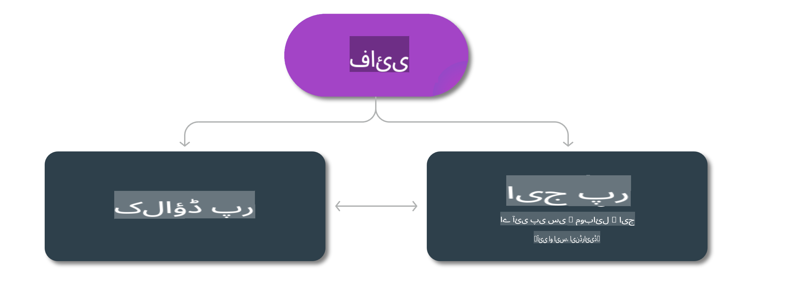

# فی ماڈلز اور مختلف پلیٹ فارمز پر دستیابی

## ایج اور کلاؤڈ کے منظرنامے

## ماڈلز کی دستیابی اور وسائل

| | | | | | | | | |
|-|-|-|-|-|-|-|-|-|
|ماڈل|ان پٹ|مواد کی لمبائی|Azure AI (MaaS)|Azure ML (MaaP)|ONNX|Hugging Face|Ollama|Nvidia NIM|
|Phi-3-vision-128k-instruct|ٹیکسٹ + تصویر|128k|[پلے گراؤنڈ اور ڈپلائمنٹ](https://ai.azure.com/explore/models/Phi-3-vision-128k-instruct/version/2/registry/azureml)|[پلے گراؤنڈ، ڈپلائمنٹ اور فائن ٹیوننگ](https://ml.azure.com/registries/azureml/models/Phi-3-vision-128k-instruct/version/2)|[CUDA](https://huggingface.co/microsoft/Phi-3-vision-128k-instruct-onnx-cuda/tree/main)،[CPU](https://huggingface.co/microsoft/Phi-3-vision-128k-instruct-onnx-cpu/tree/main)، [DirectML](https://huggingface.co/microsoft/Phi-3-vision-128k-instruct-onnx-directml/tree/main)|[ڈاؤن لوڈ کریں](https://huggingface.co/microsoft/Phi-3-vision-128k-instruct)|-NA-|[NIM APIs](https://build.nvidia.com/microsoft/phi-3-vision-128k-instruct)|
|Phi-3-mini-4k-instruct|ٹیکسٹ|4k|[پلے گراؤنڈ اور ڈپلائمنٹ](https://aka.ms/phi3-mini-4k-azure-ml)|[پلے گراؤنڈ، ڈپلائمنٹ](https://aka.ms/phi3-mini-4k-azure-ml) اور فائن ٹیوننگ|[CUDA](https://huggingface.co/microsoft/Phi-3-mini-4k-instruct-onnx)، [ویب](https://huggingface.co/microsoft/Phi-3-mini-4k-instruct-onnx)|[پلے گراؤنڈ اور ڈاؤن لوڈ کریں](https://huggingface.co/chat/models/microsoft/Phi-3-mini-4k-instruct)|[GGUF](https://huggingface.co/microsoft/Phi-3-mini-4k-instruct-gguf)|[NIM APIs](https://build.nvidia.com/microsoft/phi-3-mini-4k)|
|Phi-3-mini-128k-instruct|ٹیکسٹ|128k|[پلے گراؤنڈ اور ڈپلائمنٹ](https://ai.azure.com/explore/models/Phi-3-mini-128k-instruct/version/9/registry/azureml)|[پلے گراؤنڈ، ڈپلائمنٹ](https://ai.azure.com/explore/models/Phi-3-mini-128k-instruct/version/9/registry/azureml) اور فائن ٹیوننگ|[CUDA](https://huggingface.co/microsoft/Phi-3-mini-128k-instruct-onnx)|[ڈاؤن لوڈ کریں](https://huggingface.co/microsoft/Phi-3-mini-128k-instruct-onnx)|-NA-|[NIM APIs](https://build.nvidia.com/microsoft/phi-3-mini)|
|Phi-3-small-8k-instruct|ٹیکسٹ|8k|[پلے گراؤنڈ اور ڈپلائمنٹ](https://ml.azure.com/registries/azureml/models/Phi-3-small-8k-instruct/version/2)|[پلے گراؤنڈ، ڈپلائمنٹ](https://ai.azure.com/explore/models/Phi-3-small-8k-instruct/version/2/registry/azureml) اور فائن ٹیوننگ|[CUDA](https://huggingface.co/microsoft/Phi-3-small-8k-instruct-onnx-cuda)|[ڈاؤن لوڈ کریں](https://huggingface.co/microsoft/Phi-3-small-8k-instruct-onnx-cuda)|-NA-|[NIM APIs](https://build.nvidia.com/microsoft/phi-3-small-8k-instruct?docker=false)|
|Phi-3-small-128k-instruct|ٹیکسٹ|128k|[پلے گراؤنڈ اور ڈپلائمنٹ](https://ai.azure.com/explore/models/Phi-3-small-128k-instruct/version/2/registry/azureml)|[پلے گراؤنڈ، ڈپلائمنٹ](https://ml.azure.com/registries/azureml/models/Phi-3-small-128k-instruct/version/2) اور فائن ٹیوننگ|[CUDA](https://huggingface.co/microsoft/Phi-3-medium-128k-instruct-onnx-cuda)|[ڈاؤن لوڈ کریں](https://huggingface.co/microsoft/Phi-3-small-128k-instruct)|-NA-|[NIM APIs](https://build.nvidia.com/microsoft/phi-3-small-128k-instruct?docker=false)|
|Phi-3-medium-4k-instruct|متن|4k|[پلے گراؤنڈ اور ڈیپلائمنٹ](https://huggingface.co/microsoft/Phi-3-medium-4k-instruct)|[پلے گراؤنڈ، ڈیپلائمنٹ](https://ml.azure.com/registries/azureml/models/Phi-3-medium-4k-instruct/version/2) اور فائن ٹیوننگ|[CUDA](https://huggingface.co/microsoft/Phi-3-medium-4k-instruct-onnx-cuda/tree/main)، [CPU](https://huggingface.co/microsoft/Phi-3-medium-4k-instruct-onnx-cpu/tree/main)، [DirectML](https://huggingface.co/microsoft/Phi-3-medium-4k-instruct-onnx-directml/tree/main)|[ڈاؤنلوڈ کریں](https://huggingface.co/microsoft/Phi-3-medium-4k-instruct)|-NA-|[NIM APIs](https://build.nvidia.com/microsoft/phi-3-medium-4k-instruct?docker=false)|
|Phi-3-medium-128k-instruct|متن|128k|[پلے گراؤنڈ اور ڈیپلائمنٹ](https://ai.azure.com/explore/models/Phi-3-medium-128k-instruct/version/2)|[پلے گراؤنڈ، ڈیپلائمنٹ](https://ml.azure.com/registries/azureml/models/Phi-3-medium-128k-instruct/version/2) اور فائن ٹیوننگ|[CUDA](https://huggingface.co/microsoft/Phi-3-medium-128k-instruct-onnx-cuda/tree/main)، [CPU](https://huggingface.co/microsoft/Phi-3-medium-128k-instruct-onnx-cpu/tree/main)، [DirectML](https://huggingface.co/microsoft/Phi-3-medium-128k-instruct-onnx-directml/tree/main)|[ڈاؤنلوڈ کریں](https://huggingface.co/microsoft/Phi-3-medium-128k-instruct)|-NA-|-NA-|

**ڈسکلیمر**:  
یہ دستاویز مشین پر مبنی AI ترجمہ خدمات کا استعمال کرتے ہوئے ترجمہ کی گئی ہے۔ اگرچہ ہم درستگی کے لیے کوشش کرتے ہیں، براہ کرم آگاہ رہیں کہ خودکار ترجمے میں غلطیاں یا خامیاں ہو سکتی ہیں۔ اصل دستاویز، جو اس کی مقامی زبان میں ہے، کو مستند ذریعہ سمجھا جانا چاہیے۔ اہم معلومات کے لیے، پیشہ ورانہ انسانی ترجمہ کی سفارش کی جاتی ہے۔ ہم اس ترجمے کے استعمال سے پیدا ہونے والی کسی بھی غلط فہمی یا غلط تشریح کے ذمہ دار نہیں ہیں۔