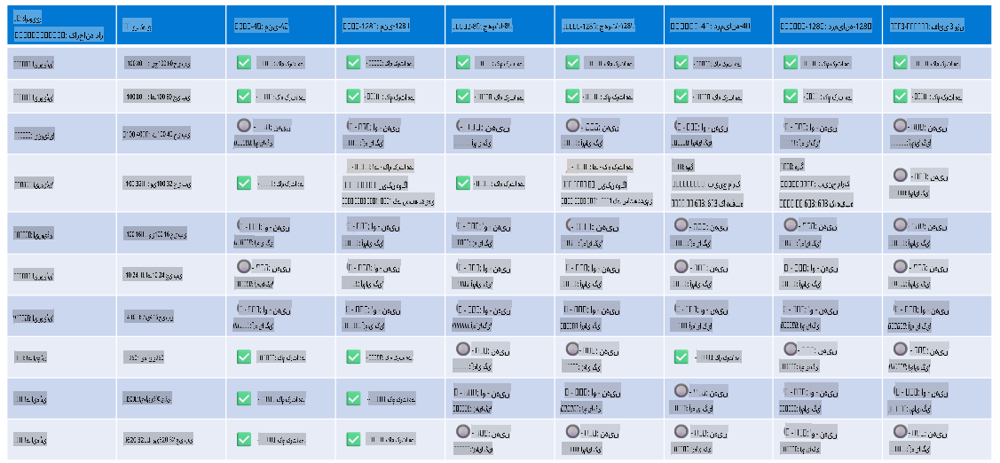

# Phi ہارڈویئر سپورٹ

Microsoft Phi کو ONNX Runtime کے لیے بہتر بنایا گیا ہے اور یہ Windows DirectML کو سپورٹ کرتا ہے۔ یہ مختلف ہارڈویئر اقسام پر بہترین کام کرتا ہے، جیسے GPUs، CPUs، اور یہاں تک کہ موبائل ڈیوائسز۔

## ڈیوائس ہارڈویئر  
خاص طور پر، درج ذیل ہارڈویئر سپورٹڈ ہیں:

- GPU SKU: RTX 4090 (DirectML)  
- GPU SKU: 1 A100 80GB (CUDA)  
- CPU SKU: Standard F64s v2 (64 vCPUs, 128 GiB میموری)  

## موبائل SKU  

- اینڈرائیڈ - Samsung Galaxy S21  
- ایپل iPhone 14 یا اس سے جدید A16/A17 پروسیسر  

## Phi ہارڈویئر اسپیسفکیشن  

- کم از کم مطلوبہ کنفیگریشن:  
- ونڈوز: DirectX 12-قابل GPU اور کم از کم 4GB مشترکہ RAM  

CUDA: NVIDIA GPU جس کی Compute Capability >= 7.02 ہو  

  

## متعدد GPUs پر onnxruntime چلانا  

فی الحال دستیاب Phi ONNX ماڈلز صرف 1 GPU کے لیے ہیں۔ Phi ماڈل کے لیے ملٹی-GPU سپورٹ ممکن ہے، لیکن 2 GPUs کے ساتھ ORT یہ ضمانت نہیں دیتا کہ یہ 2 ORT انسٹینسز کے مقابلے میں زیادہ تھروپٹ فراہم کرے گا۔ تازہ ترین اپ ڈیٹس کے لیے براہ کرم [ONNX Runtime](https://onnxruntime.ai/) دیکھیں۔

[Build 2024 the GenAI ONNX Team](https://youtu.be/WLW4SE8M9i8?si=EtG04UwDvcjunyfC) پر اعلان کیا گیا کہ انہوں نے Phi ماڈلز کے لیے ملٹی-GPU کی بجائے ملٹی انسٹینس کو فعال کر دیا ہے۔

اس وقت، آپ CUDA_VISIBLE_DEVICES انوائرمنٹ ویری ایبل کے ساتھ ایک onnxruntime یا onnxruntime-genai انسٹینس اس طرح چلا سکتے ہیں۔

```Python
CUDA_VISIBLE_DEVICES=0 python infer.py
CUDA_VISIBLE_DEVICES=1 python infer.py
```  

مزید جاننے کے لیے [Azure AI Foundry](https://ai.azure.com) میں Phi کو دریافت کریں۔  

**ڈسکلیمر**:  
یہ دستاویز مشین پر مبنی AI ترجمہ خدمات کا استعمال کرتے ہوئے ترجمہ کی گئی ہے۔ اگرچہ ہم درستگی کے لیے پوری کوشش کرتے ہیں، براہ کرم آگاہ رہیں کہ خودکار ترجمے میں غلطیاں یا عدم درستگی ہو سکتی ہیں۔ اصل دستاویز کو اس کی مقامی زبان میں مستند ماخذ سمجھا جانا چاہیے۔ اہم معلومات کے لیے، پیشہ ور انسانی ترجمے کی سفارش کی جاتی ہے۔ اس ترجمے کے استعمال سے پیدا ہونے والی کسی بھی غلط فہمی یا غلط تشریح کے لیے ہم ذمہ دار نہیں ہیں۔