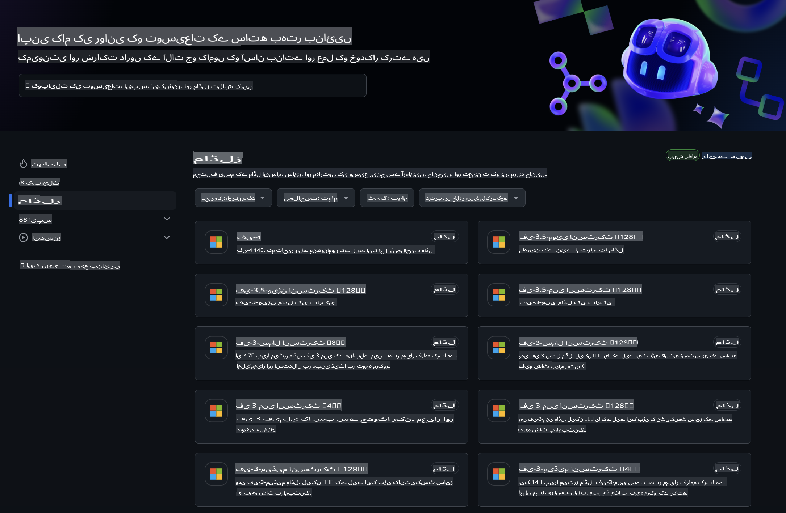
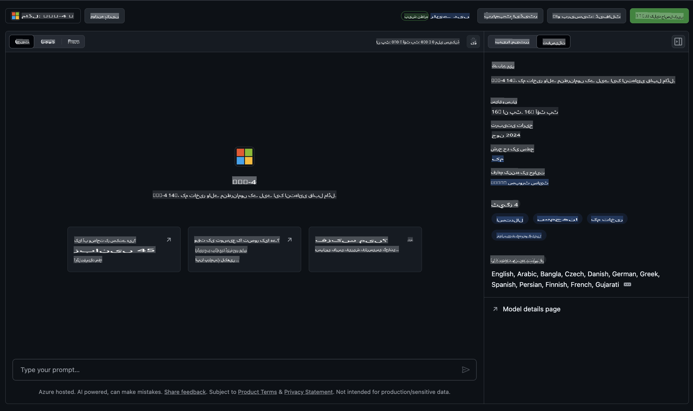
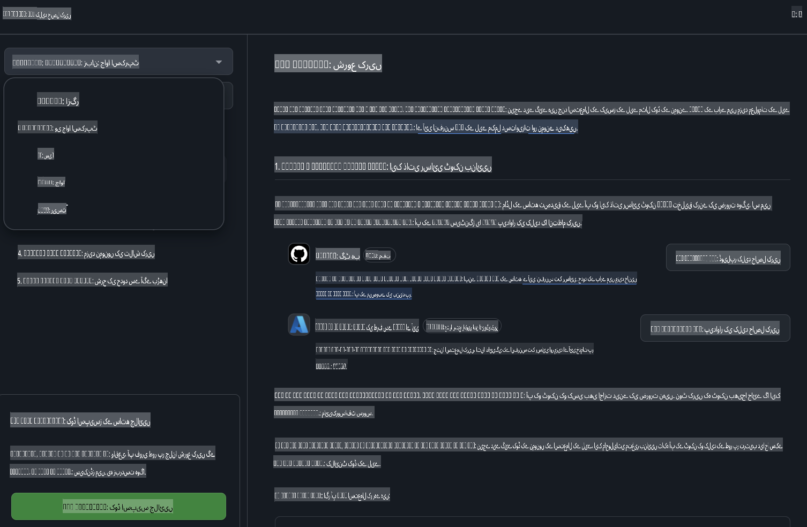
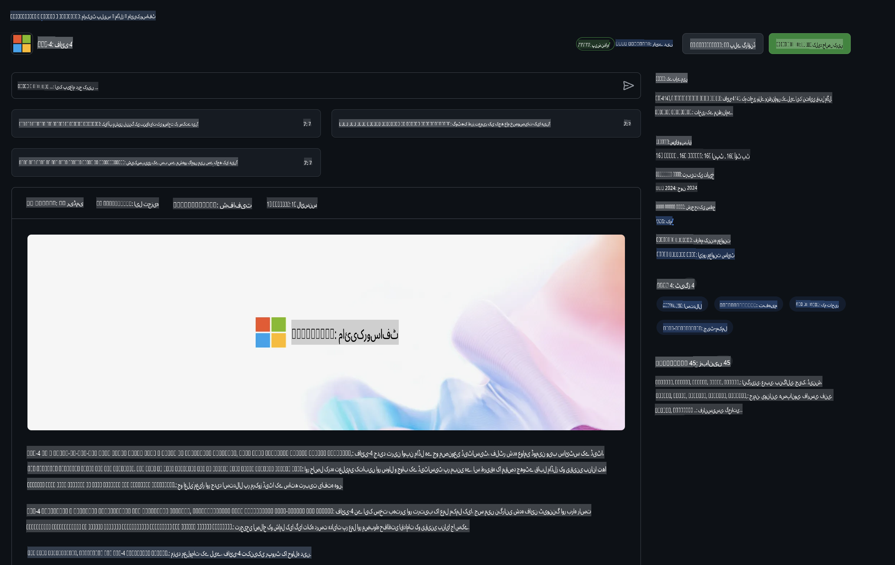

## گِٹ ہب ماڈلز میں فی فیملی

[گِٹ ہب ماڈلز](https://github.com/marketplace/models) میں خوش آمدید! ہم نے سب کچھ تیار کر رکھا ہے تاکہ آپ Azure AI پر ہوسٹ کیے گئے AI ماڈلز کو ایکسپلور کر سکیں۔



گِٹ ہب ماڈلز پر دستیاب ماڈلز کے بارے میں مزید معلومات کے لیے، [گِٹ ہب ماڈل مارکیٹ پلیس](https://github.com/marketplace/models) دیکھیں۔

## دستیاب ماڈلز

ہر ماڈل کے لیے ایک مخصوص پلے گراؤنڈ اور نمونہ کوڈ دستیاب ہے۔



### گِٹ ہب ماڈل کیٹلاگ میں فی فیملی

- [Phi-4](https://github.com/marketplace/models/azureml/Phi-4)

- [Phi-3.5-MoE instruct (128k)](https://github.com/marketplace/models/azureml/Phi-3-5-MoE-instruct)

- [Phi-3.5-vision instruct (128k)](https://github.com/marketplace/models/azureml/Phi-3-5-vision-instruct)

- [Phi-3.5-mini instruct (128k)](https://github.com/marketplace/models/azureml/Phi-3-5-mini-instruct)

- [Phi-3-Medium-128k-Instruct](https://github.com/marketplace/models/azureml/Phi-3-medium-128k-instruct)

- [Phi-3-medium-4k-instruct](https://github.com/marketplace/models/azureml/Phi-3-medium-4k-instruct)

- [Phi-3-mini-128k-instruct](https://github.com/marketplace/models/azureml/Phi-3-mini-128k-instruct)

- [Phi-3-mini-4k-instruct](https://github.com/marketplace/models/azureml/Phi-3-mini-4k-instruct)

- [Phi-3-small-128k-instruct](https://github.com/marketplace/models/azureml/Phi-3-small-128k-instruct)

- [Phi-3-small-8k-instruct](https://github.com/marketplace/models/azureml/Phi-3-small-8k-instruct)

## شروعات

چند بنیادی مثالیں تیار ہیں جنہیں آپ فوراً چلا سکتے ہیں۔ آپ انہیں سیمپلز ڈائریکٹری میں تلاش کر سکتے ہیں۔ اگر آپ فوراً اپنی پسندیدہ زبان پر جانا چاہتے ہیں، تو آپ درج ذیل زبانوں میں مثالیں دیکھ سکتے ہیں:

- Python  
- JavaScript  
- C#  
- Java  
- cURL  

نمونوں اور ماڈلز چلانے کے لیے ایک خاص Codespaces ماحول بھی دستیاب ہے۔



## نمونہ کوڈ

ذیل میں چند استعمال کے کیسز کے لیے مثال کوڈ دیا گیا ہے۔ Azure AI Inference SDK کے بارے میں مزید معلومات کے لیے مکمل دستاویزات اور نمونے دیکھیں۔

## سیٹ اپ

1. ایک پرسنل ایکسیس ٹوکن بنائیں  
آپ کو ٹوکن کے لیے کسی اجازت کی ضرورت نہیں۔ نوٹ کریں کہ یہ ٹوکن مائیکروسافٹ سروس کو بھیجا جائے گا۔

نیچے دیے گئے کوڈ کے نمونوں کو استعمال کرنے کے لیے، ایک انوائرمنٹ ویری ایبل بنائیں تاکہ آپ اپنے ٹوکن کو کلائنٹ کوڈ کے لیے کلید کے طور پر سیٹ کر سکیں۔

اگر آپ bash استعمال کر رہے ہیں:  
```
export GITHUB_TOKEN="<your-github-token-goes-here>"
```  
اگر آپ پاور شیل میں ہیں:  

```
$Env:GITHUB_TOKEN="<your-github-token-goes-here>"
```  

اگر آپ ونڈوز کمانڈ پرامپٹ استعمال کر رہے ہیں:  

```
set GITHUB_TOKEN=<your-github-token-goes-here>
```  

## Python کا نمونہ

### ضروریات انسٹال کریں  
pip کے ذریعے Azure AI Inference SDK انسٹال کریں (ضروری ہے: Python >=3.8):  

```
pip install azure-ai-inference
```  

### ایک بنیادی کوڈ نمونہ چلائیں

یہ نمونہ چیٹ کمپلیشن API کو کال کرنے کا ایک بنیادی طریقہ دکھاتا ہے۔ یہ GitHub AI ماڈل انفرنس اینڈ پوائنٹ اور آپ کے GitHub ٹوکن کا استعمال کر رہا ہے۔ یہ کال ہم وقت ہے۔

```python
import os
from azure.ai.inference import ChatCompletionsClient
from azure.ai.inference.models import SystemMessage, UserMessage
from azure.core.credentials import AzureKeyCredential

endpoint = "https://models.inference.ai.azure.com"
model_name = "Phi-4"
token = os.environ["GITHUB_TOKEN"]

client = ChatCompletionsClient(
    endpoint=endpoint,
    credential=AzureKeyCredential(token),
)

response = client.complete(
    messages=[
        UserMessage(content="I have $20,000 in my savings account, where I receive a 4% profit per year and payments twice a year. Can you please tell me how long it will take for me to become a millionaire? Also, can you please explain the math step by step as if you were explaining it to an uneducated person?"),
    ],
    temperature=0.4,
    top_p=1.0,
    max_tokens=2048,
    model=model_name
)

print(response.choices[0].message.content)
```  

### ایک کثیر موڑ کی گفتگو چلائیں

یہ نمونہ چیٹ کمپلیشن API کے ساتھ کثیر موڑ کی گفتگو کا مظاہرہ کرتا ہے۔ جب آپ ماڈل کو چیٹ ایپلیکیشن کے لیے استعمال کرتے ہیں، تو آپ کو اس گفتگو کی ہسٹری کو مینیج کرنا ہوگا اور تازہ ترین پیغامات ماڈل کو بھیجنے ہوں گے۔

```
import os
from azure.ai.inference import ChatCompletionsClient
from azure.ai.inference.models import AssistantMessage, SystemMessage, UserMessage
from azure.core.credentials import AzureKeyCredential

token = os.environ["GITHUB_TOKEN"]
endpoint = "https://models.inference.ai.azure.com"
# Replace Model_Name
model_name = "Phi-4"

client = ChatCompletionsClient(
    endpoint=endpoint,
    credential=AzureKeyCredential(token),
)

messages = [
    SystemMessage(content="You are a helpful assistant."),
    UserMessage(content="What is the capital of France?"),
    AssistantMessage(content="The capital of France is Paris."),
    UserMessage(content="What about Spain?"),
]

response = client.complete(messages=messages, model=model_name)

print(response.choices[0].message.content)
```  

### آؤٹ پٹ کو اسٹریم کریں

بہتر یوزر تجربے کے لیے، آپ ماڈل کے رسپانس کو اسٹریم کرنا چاہیں گے تاکہ پہلا ٹوکن جلدی ظاہر ہو اور آپ طویل جوابات کا انتظار کرنے سے بچ سکیں۔

```
import os
from azure.ai.inference import ChatCompletionsClient
from azure.ai.inference.models import SystemMessage, UserMessage
from azure.core.credentials import AzureKeyCredential

token = os.environ["GITHUB_TOKEN"]
endpoint = "https://models.inference.ai.azure.com"
# Replace Model_Name
model_name = "Phi-4"

client = ChatCompletionsClient(
    endpoint=endpoint,
    credential=AzureKeyCredential(token),
)

response = client.complete(
    stream=True,
    messages=[
        SystemMessage(content="You are a helpful assistant."),
        UserMessage(content="Give me 5 good reasons why I should exercise every day."),
    ],
    model=model_name,
)

for update in response:
    if update.choices:
        print(update.choices[0].delta.content or "", end="")

client.close()
```  

## گِٹ ہب ماڈلز کے لیے مفت استعمال اور ریٹ کی حدود



[پلے گراؤنڈ اور مفت API استعمال کے لیے ریٹ کی حدود](https://docs.github.com/en/github-models/prototyping-with-ai-models#rate-limits) آپ کو ماڈلز کے ساتھ تجربہ کرنے اور اپنی AI ایپلیکیشن کو پروٹوٹائپ کرنے میں مدد دینے کے لیے بنائی گئی ہیں۔ ان حدود سے آگے کے استعمال کے لیے، اور اپنی ایپلیکیشن کو اسکیل پر لانے کے لیے، آپ کو Azure اکاؤنٹ سے وسائل فراہم کرنے ہوں گے اور وہاں سے تصدیق کرنی ہوگی بجائے اس کے کہ آپ اپنے GitHub پرسنل ایکسیس ٹوکن استعمال کریں۔ آپ کو اپنے کوڈ میں کچھ اور تبدیل کرنے کی ضرورت نہیں ہوگی۔ Azure AI میں مفت درجے کی حدود سے آگے جانے کے طریقے دریافت کرنے کے لیے اس لنک کو استعمال کریں۔

### انکشافات

یاد رکھیں کہ ماڈل کے ساتھ تعامل کرتے وقت آپ AI کے ساتھ تجربہ کر رہے ہیں، اس لیے مواد میں غلطیاں ممکن ہیں۔

یہ فیچر مختلف حدود (جیسے درخواستیں فی منٹ، درخواستیں فی دن، درخواست کے ٹوکنز، اور متوازی درخواستیں) کے تابع ہے اور پروڈکشن استعمال کے کیسز کے لیے ڈیزائن نہیں کیا گیا۔

گِٹ ہب ماڈلز Azure AI Content Safety استعمال کرتا ہے۔ یہ فلٹرز گِٹ ہب ماڈلز کے تجربے کے حصے کے طور پر بند نہیں کیے جا سکتے۔ اگر آپ ماڈلز کو ایک ادائیگی شدہ سروس کے ذریعے استعمال کرنے کا فیصلہ کرتے ہیں، تو براہ کرم اپنے مواد کے فلٹرز اپنی ضروریات کے مطابق ترتیب دیں۔

یہ سروس گِٹ ہب کے پری ریلیز شرائط کے تحت ہے۔

**ڈسکلیمر**:  
یہ دستاویز مشین پر مبنی AI ترجمہ خدمات کا استعمال کرتے ہوئے ترجمہ کی گئی ہے۔ اگرچہ ہم درستگی کی کوشش کرتے ہیں، براہ کرم آگاہ رہیں کہ خودکار ترجمے میں غلطیاں یا خامیاں ہو سکتی ہیں۔ اصل دستاویز، جو اس کی اصل زبان میں ہے، کو مستند ذریعہ سمجھا جانا چاہیے۔ اہم معلومات کے لیے، پیشہ ور انسانی ترجمہ کی سفارش کی جاتی ہے۔ اس ترجمے کے استعمال سے پیدا ہونے والی کسی بھی غلط فہمی یا غلط تشریح کے لیے ہم ذمہ دار نہیں ہیں۔