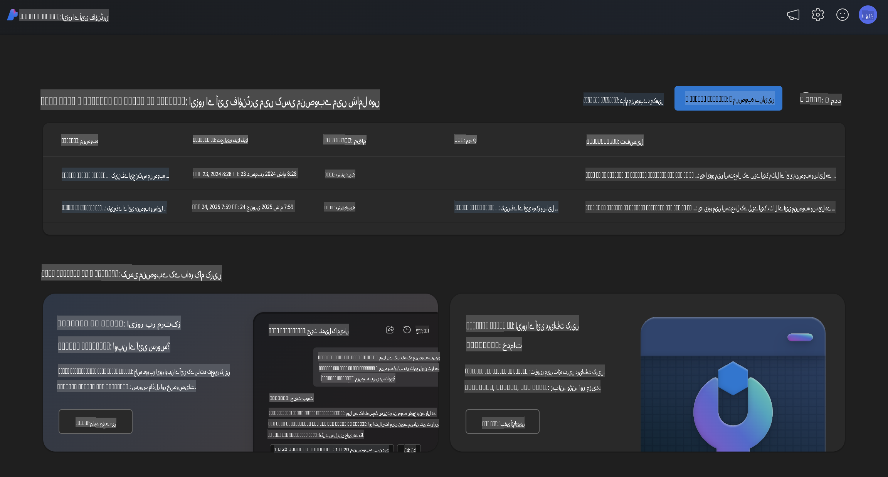
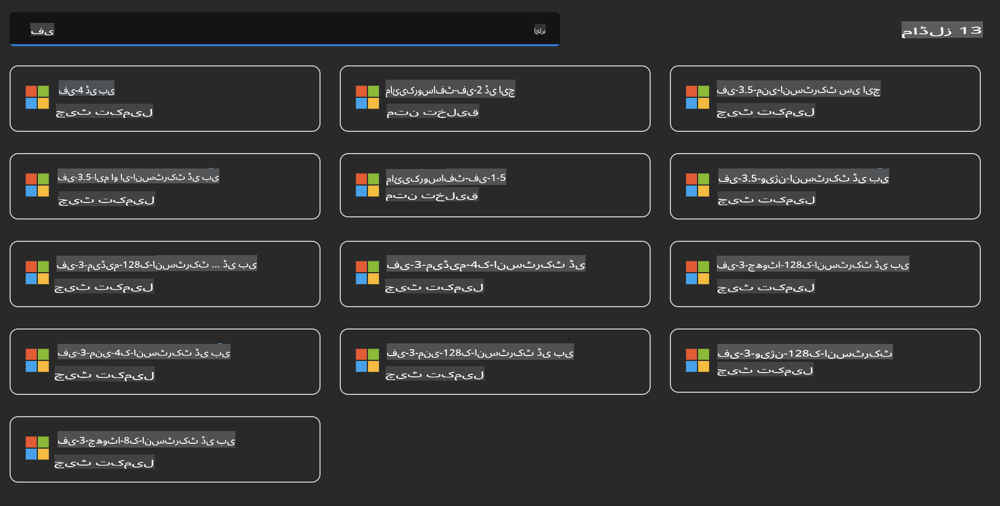
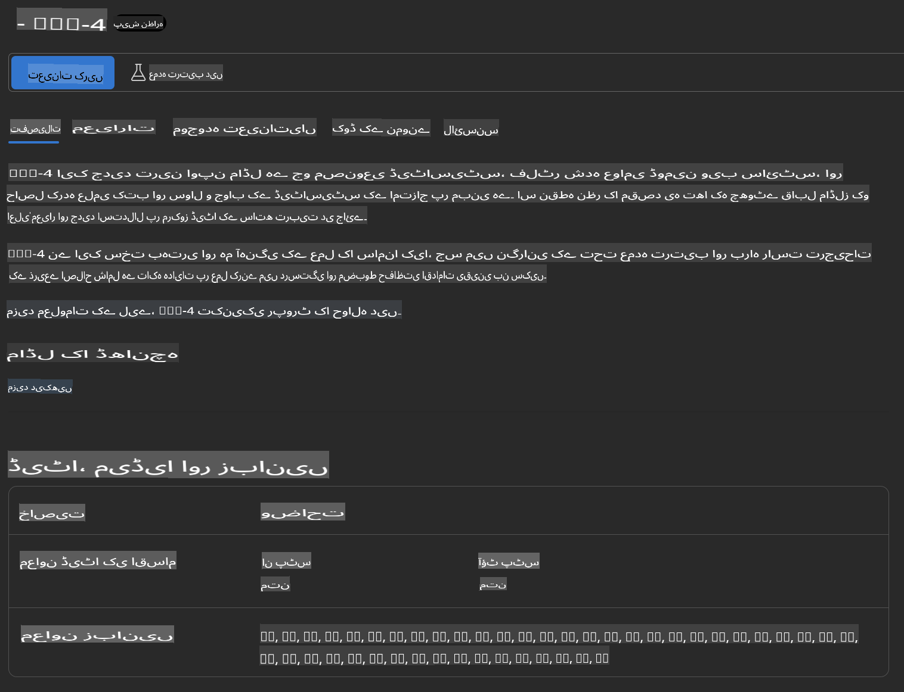
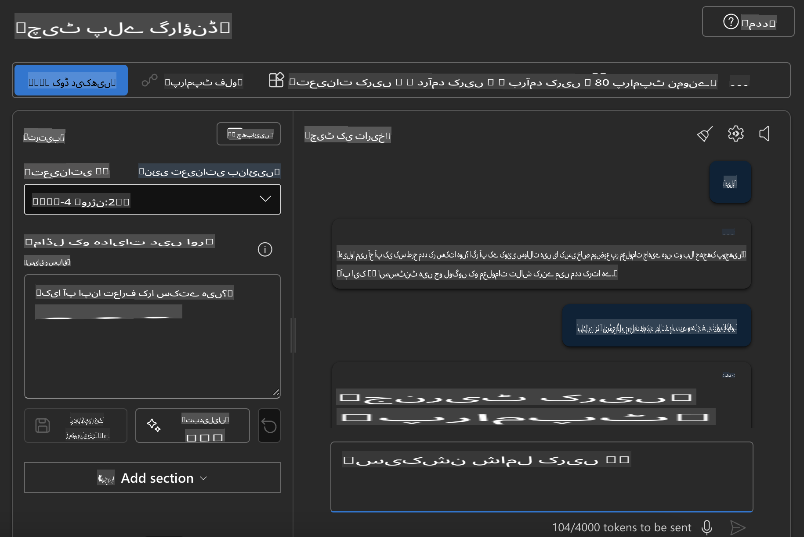

## Azure AI Foundry میں Phi فیملی

[Azure AI Foundry](https://ai.azure.com) ایک قابل اعتماد پلیٹ فارم ہے جو ڈویلپرز کو محفوظ، محفوظ اور ذمہ دار طریقے سے AI کے ذریعے جدت اور مستقبل کی تشکیل کے قابل بناتا ہے۔

[Azure AI Foundry](https://ai.azure.com) خاص طور پر ڈویلپرز کے لیے ڈیزائن کیا گیا ہے تاکہ وہ:

- ایک انٹرپرائز گریڈ پلیٹ فارم پر جنریٹیو AI ایپلیکیشنز تیار کر سکیں۔
- جدید AI ٹولز اور ML ماڈلز کے ساتھ ایپلیکیشنز کو دریافت کریں، بنائیں، ٹیسٹ کریں، اور ڈپلائے کریں، جو ذمہ دار AI پریکٹسز پر مبنی ہوں۔
- ایپلیکیشن ڈیولپمنٹ کے مکمل لائف سائیکل میں ٹیم کے ساتھ تعاون کریں۔

Azure AI Foundry کے ساتھ، آپ مختلف ماڈلز، سروسز اور صلاحیتوں کو دریافت کر سکتے ہیں اور ایسی AI ایپلیکیشنز تیار کر سکتے ہیں جو آپ کے مقاصد کے مطابق ہوں۔ Azure AI Foundry پلیٹ فارم ثبوت کے تصور کو مکمل پروڈکشن ایپلیکیشنز میں تبدیل کرنے کے لیے آسانی سے اسکیل ایبلٹی فراہم کرتا ہے۔ مسلسل نگرانی اور بہتری طویل مدتی کامیابی کو یقینی بناتی ہے۔



Azure AI Foundry میں Azure AOAI سروس استعمال کرنے کے علاوہ، آپ Azure AI Foundry ماڈل کیٹلاگ میں تھرڈ پارٹی ماڈلز بھی استعمال کر سکتے ہیں۔ یہ ایک اچھا انتخاب ہے اگر آپ Azure AI Foundry کو اپنی AI حل پلیٹ فارم کے طور پر استعمال کرنا چاہتے ہیں۔

ہم Azure AI Foundry کے ماڈل کیٹلاگ کے ذریعے Phi فیملی ماڈلز کو تیزی سے ڈپلائے کر سکتے ہیں۔



### **Azure AI Foundry میں Phi-4 کو ڈپلائے کریں**



### **Azure AI Foundry پلیگراؤنڈ میں Phi-4 کا ٹیسٹ کریں**



### **Azure AI Foundry Phi-4 کو کال کرنے کے لیے Python کوڈ چلانا**

```python

import os  
import base64
from openai import AzureOpenAI  
from azure.identity import DefaultAzureCredential, get_bearer_token_provider  
        
endpoint = os.getenv("ENDPOINT_URL", "Your Azure AOAI Service Endpoint")  
deployment = os.getenv("DEPLOYMENT_NAME", "Phi-4")  
      
token_provider = get_bearer_token_provider(  
    DefaultAzureCredential(),  
    "https://cognitiveservices.azure.com/.default"  
)  
  
client = AzureOpenAI(  
    azure_endpoint=endpoint,  
    azure_ad_token_provider=token_provider,  
    api_version="2024-05-01-preview",  
)  
  

chat_prompt = [
    {
        "role": "system",
        "content": "You are an AI assistant that helps people find information."
    },
    {
        "role": "user",
        "content": "can you introduce yourself"
    }
] 
    
# Include speech result if speech is enabled  
messages = chat_prompt 

completion = client.chat.completions.create(  
    model=deployment,  
    messages=messages,
    max_tokens=800,  
    temperature=0.7,  
    top_p=0.95,  
    frequency_penalty=0,  
    presence_penalty=0,
    stop=None,  
    stream=False  
)  
  
print(completion.to_json())  

```

**ڈسکلیمر**:  
یہ دستاویز مشین پر مبنی اے آئی ترجمہ خدمات کا استعمال کرتے ہوئے ترجمہ کی گئی ہے۔ ہم درستگی کے لیے پوری کوشش کرتے ہیں، لیکن براہ کرم آگاہ رہیں کہ خودکار ترجمے میں غلطیاں یا خامیاں ہو سکتی ہیں۔ اصل دستاویز کو اس کی اصل زبان میں مستند ماخذ سمجھا جانا چاہیے۔ اہم معلومات کے لیے، پیشہ ور انسانی ترجمہ تجویز کیا جاتا ہے۔ اس ترجمے کے استعمال سے پیدا ہونے والی کسی بھی غلط فہمی یا غلط تشریح کے لیے ہم ذمہ دار نہیں ہیں۔