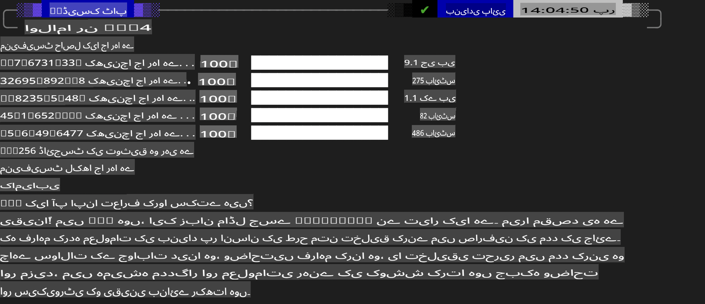
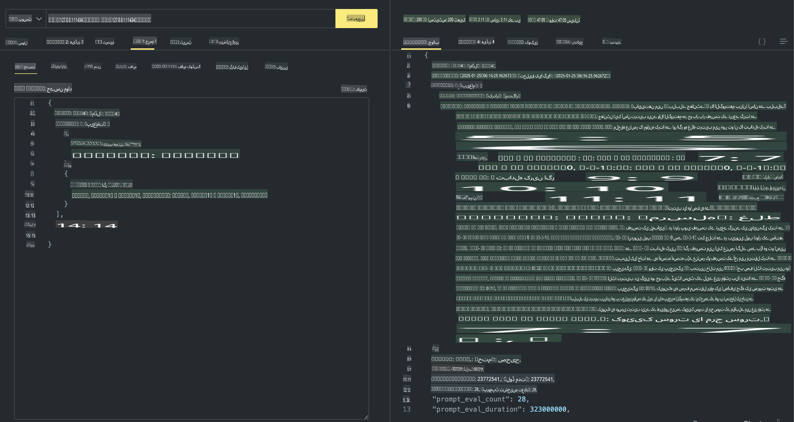

## فی فیملی ان اولاما

[اولاما](https://ollama.com) زیادہ لوگوں کو آسان اسکرپٹس کے ذریعے اوپن سورس LLM یا SLM کو براہ راست ڈپلائے کرنے کی سہولت فراہم کرتا ہے، اور APIs بنانے کی بھی اجازت دیتا ہے تاکہ لوکل کوپائلٹ ایپلیکیشن کے منظرناموں میں مدد مل سکے۔

## **1. انسٹالیشن**

اولاما ونڈوز، میک او ایس، اور لینکس پر چلنے کی حمایت کرتا ہے۔ آپ اولاما کو اس لنک کے ذریعے انسٹال کر سکتے ہیں ([https://ollama.com/download](https://ollama.com/download))۔ کامیاب انسٹالیشن کے بعد، آپ ٹرمینل ونڈو کے ذریعے اولاما اسکرپٹ کا استعمال کرتے ہوئے Phi-3 کو براہ راست کال کر سکتے ہیں۔ آپ اولاما میں موجود تمام [دستیاب لائبریریز دیکھ سکتے ہیں](https://ollama.com/library)۔ اگر آپ اس ریپوزٹری کو کوڈ اسپیس میں کھولتے ہیں، تو اس میں پہلے سے ہی اولاما انسٹال ہوگا۔

```bash

ollama run phi4

```

> [!NOTE]
> پہلی بار چلانے پر ماڈل پہلے ڈاؤن لوڈ ہوگا۔ ظاہر ہے، آپ پہلے سے ڈاؤن لوڈ کیے گئے Phi-4 ماڈل کو بھی براہ راست منتخب کر سکتے ہیں۔ ہم کمانڈ چلانے کے لیے WSL کو ایک مثال کے طور پر لیتے ہیں۔ ماڈل کامیابی سے ڈاؤن لوڈ ہونے کے بعد، آپ ٹرمینل پر براہ راست انٹریکٹ کر سکتے ہیں۔



## **2. اولاما سے phi-4 API کال کریں**

اگر آپ اولاما کے ذریعے تیار کردہ Phi-4 API کو کال کرنا چاہتے ہیں، تو آپ ٹرمینل میں اس کمانڈ کا استعمال کرکے اولاما سرور شروع کر سکتے ہیں۔

```bash

ollama serve

```

> [!NOTE]
> اگر آپ میک او ایس یا لینکس چلا رہے ہیں، تو براہ کرم نوٹ کریں کہ آپ کو یہ خرابی پیش آ سکتی ہے **"Error: listen tcp 127.0.0.1:11434: bind: address already in use"**۔ یہ خرابی کمانڈ چلانے پر ظاہر ہو سکتی ہے۔ آپ یا تو اس خرابی کو نظرانداز کر سکتے ہیں، کیونکہ یہ عام طور پر ظاہر کرتا ہے کہ سرور پہلے ہی چل رہا ہے، یا آپ اولاما کو روک کر دوبارہ شروع کر سکتے ہیں:

**میک او ایس**

```bash

brew services restart ollama

```

**لینکس**

```bash

sudo systemctl stop ollama

```

اولاما دو API کو سپورٹ کرتا ہے: generate اور chat۔ آپ اپنی ضروریات کے مطابق اولاما کے فراہم کردہ ماڈل API کو کال کر سکتے ہیں، جو پورٹ 11434 پر چلنے والی لوکل سروس کو درخواست بھیج کر کیا جا سکتا ہے۔

**چیٹ**

```bash

curl http://127.0.0.1:11434/api/chat -d '{
  "model": "phi3",
  "messages": [
    {
      "role": "system",
      "content": "Your are a python developer."
    },
    {
      "role": "user",
      "content": "Help me generate a bubble algorithm"
    }
  ],
  "stream": false
  
}'

This is the result in Postman



## Additional Resources

Check the list of available models in Ollama in [their library](https://ollama.com/library).

Pull your model from the Ollama server using this command

```bash
ollama pull phi4
```

Run the model using this command

```bash
ollama run phi4
```

***Note:*** Visit this link [https://github.com/ollama/ollama/blob/main/docs/api.md](https://github.com/ollama/ollama/blob/main/docs/api.md) to learn more

## Calling Ollama from Python

You can use `requests` or `urllib3` to make requests to the local server endpoints used above. However, a popular way to use Ollama in Python is via the [openai](https://pypi.org/project/openai/) SDK, since Ollama provides OpenAI-compatible server endpoints as well.

Here is an example for phi3-mini:

```python
import openai

client = openai.OpenAI(
    base_url="http://localhost:11434/v1",
    api_key="nokeyneeded",
)

response = client.chat.completions.create(
    model="phi4",
    temperature=0.7,
    n=1,
    messages=[
        {"role": "system", "content": "You are a helpful assistant."},
        {"role": "user", "content": "Write a haiku about a hungry cat"},
    ],
)

print("Response:")
print(response.choices[0].message.content)
```

## Calling Ollama from JavaScript 

```javascript
// Phi-4 کے ساتھ فائل کا خلاصہ کرنے کی مثال
script({
    model: "ollama:phi4",
    title: "Summarize with Phi-4",
    system: ["system"],
})

// خلاصہ کی مثال
const file = def("FILE", env.files)
$`Summarize ${file} in a single paragraph.`
```

## Calling Ollama from C#

Create a new C# Console application and add the following NuGet package:

```bash
dotnet add package Microsoft.SemanticKernel --version 1.34.0
```

Then replace this code in the `Program.cs` file

```csharp
using Microsoft.SemanticKernel;
using Microsoft.SemanticKernel.ChatCompletion;

// لوکل اولاما سرور اینڈ پوائنٹ کا استعمال کرتے ہوئے چیٹ کمپلیشن سروس شامل کریں
#pragma warning disable SKEXP0001, SKEXP0003, SKEXP0010, SKEXP0011, SKEXP0050, SKEXP0052
builder.AddOpenAIChatCompletion(
    modelId: "phi4",
    endpoint: new Uri("http://localhost:11434/"),
    apiKey: "non required");

// چیٹ سروس کو ایک سادہ پرامپٹ کال کریں
string prompt = "Write a joke about kittens";
var response = await kernel.InvokePromptAsync(prompt);
Console.WriteLine(response.GetValue<string>());
```

Run the app with the command:

```bash
dotnet run

**اعلانِ لاتعلقی**:  
یہ دستاویز مشین پر مبنی AI ترجمہ خدمات کا استعمال کرتے ہوئے ترجمہ کی گئی ہے۔ اگرچہ ہم درستگی کے لیے کوشش کرتے ہیں، براہ کرم آگاہ رہیں کہ خودکار ترجمے میں غلطیاں یا خامیاں ہو سکتی ہیں۔ اصل دستاویز کو اس کی اصل زبان میں مستند ذریعہ سمجھا جانا چاہیے۔ اہم معلومات کے لیے، پیشہ ور انسانی ترجمہ تجویز کیا جاتا ہے۔ ہم اس ترجمے کے استعمال سے پیدا ہونے والی کسی بھی غلط فہمی یا غلط تشریح کے ذمہ دار نہیں ہیں۔