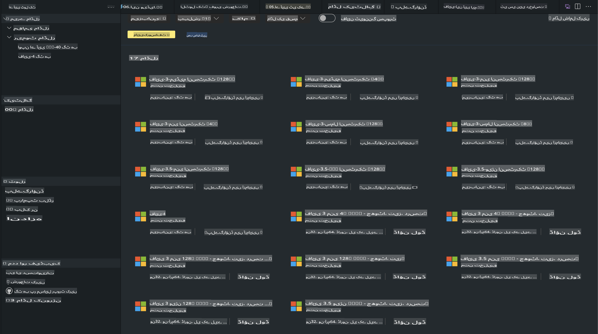
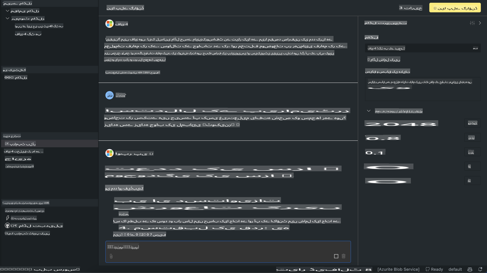

# اے آئی ٹی کے میں فی فیملی  

[وی ایس کوڈ کے لیے اے آئی ٹول کٹ](https://marketplace.visualstudio.com/items?itemName=ms-windows-ai-studio.windows-ai-studio) جنریٹو اے آئی ایپ ڈیولپمنٹ کو آسان بناتا ہے، جو جدید ترین اے آئی ڈیولپمنٹ ٹولز اور ماڈلز کو Azure AI Foundry Catalog اور دیگر کیٹلاگز جیسے کہ Hugging Face کے ساتھ یکجا کرتا ہے۔ آپ GitHub Models اور Azure AI Foundry Model Catalogs کے ذریعے چلنے والے اے آئی ماڈلز کیٹلاگ کو براؤز کر سکتے ہیں، انہیں لوکل یا ریموٹ ڈاؤنلوڈ کر سکتے ہیں، فائن ٹیون کر سکتے ہیں، ٹیسٹ کر سکتے ہیں اور اپنی ایپلیکیشن میں استعمال کر سکتے ہیں۔  

اے آئی ٹول کٹ پری ویو لوکل طور پر چلے گا۔ لوکل انفرنس یا فائن ٹیون، منتخب کردہ ماڈل پر منحصر ہے، آپ کو NVIDIA CUDA GPU جیسا GPU رکھنے کی ضرورت ہو سکتی ہے۔ آپ GitHub Models کو براہ راست AITK کے ساتھ بھی چلا سکتے ہیں۔  

## شروعات کریں  

[ونڈوز سب سسٹم فار لینکس انسٹال کرنے کے بارے میں مزید جانیں](https://learn.microsoft.com/windows/wsl/install?WT.mc_id=aiml-137032-kinfeylo)  

اور [ڈیفالٹ ڈسٹریبیوشن تبدیل کریں](https://learn.microsoft.com/windows/wsl/install#change-the-default-linux-distribution-installed)۔  

[اے آئی ٹول کٹ GitHub ریپو](https://github.com/microsoft/vscode-ai-toolkit/)  

- ونڈوز، لینکس، میک او ایس  

- ونڈوز اور لینکس دونوں پر فائن ٹیوننگ کے لیے، آپ کو ایک Nvidia GPU کی ضرورت ہوگی۔ اس کے علاوہ، **ونڈوز** کے لیے لینکس کے ساتھ سب سسٹم کی ضرورت ہوگی، جس میں Ubuntu ڈسٹریبیوشن 18.4 یا اس سے زیادہ ہو۔ [ونڈوز سب سسٹم فار لینکس انسٹال کرنے کے بارے میں مزید جانیں](https://learn.microsoft.com/windows/wsl/install) اور [ڈیفالٹ ڈسٹریبیوشن تبدیل کریں](https://learn.microsoft.com/windows/wsl/install#change-the-default-linux-distribution-installed)۔  

### اے آئی ٹول کٹ انسٹال کریں  

اے آئی ٹول کٹ ایک [ویژول اسٹوڈیو کوڈ ایکسٹینشن](https://code.visualstudio.com/docs/setup/additional-components#_vs-code-extensions) کے طور پر فراہم کیا جاتا ہے، لہذا آپ کو پہلے [وی ایس کوڈ](https://code.visualstudio.com/docs/setup/windows?WT.mc_id=aiml-137032-kinfeylo) انسٹال کرنا ہوگا، اور اے آئی ٹول کٹ کو [وی ایس مارکیٹ پلیس](https://marketplace.visualstudio.com/items?itemName=ms-windows-ai-studio.windows-ai-studio) سے ڈاؤنلوڈ کرنا ہوگا۔  
[اے آئی ٹول کٹ ویژول اسٹوڈیو مارکیٹ پلیس میں دستیاب ہے](https://marketplace.visualstudio.com/items?itemName=ms-windows-ai-studio.windows-ai-studio) اور کسی دوسرے وی ایس کوڈ ایکسٹینشن کی طرح انسٹال کیا جا سکتا ہے۔  

اگر آپ وی ایس کوڈ ایکسٹینشنز انسٹال کرنے سے ناواقف ہیں، تو ان اقدامات پر عمل کریں:  

### سائن ان کریں  

1. وی ایس کوڈ میں ایکٹیویٹی بار میں **ایکسٹینشنز** منتخب کریں  
2. ایکسٹینشنز سرچ بار میں "AI Toolkit" ٹائپ کریں  
3. "AI Toolkit for Visual Studio code" منتخب کریں  
4. **انسٹال** منتخب کریں  

اب، آپ ایکسٹینشن استعمال کرنے کے لیے تیار ہیں!  

آپ کو GitHub میں سائن ان کرنے کا کہا جائے گا، براہ کرم جاری رکھنے کے لیے "Allow" پر کلک کریں۔ آپ کو GitHub سائننگ پیج پر ری ڈائریکٹ کیا جائے گا۔  

براہ کرم سائن ان کریں اور عمل کے مراحل پر عمل کریں۔ کامیاب تکمیل کے بعد، آپ کو وی ایس کوڈ پر ری ڈائریکٹ کر دیا جائے گا۔  

ایک بار ایکسٹینشن انسٹال ہو جانے کے بعد، آپ کو اپنی ایکٹیویٹی بار میں اے آئی ٹول کٹ کا آئیکن نظر آئے گا۔  

آئیے دستیاب ایکشنز کو دریافت کریں!  

### دستیاب ایکشنز  

اے آئی ٹول کٹ کا پرائمری سائیڈبار درج ذیل میں منظم ہے  

- **ماڈلز**  
- **ریسورسز**  
- **پلے گراؤنڈ**  
- **فائن ٹیوننگ**  
- **ایویلیوایشن**  

ریسورسز سیکشن میں دستیاب ہیں۔ شروعات کے لیے **ماڈل کیٹلاگ** منتخب کریں۔  

### کیٹلاگ سے ماڈل ڈاؤنلوڈ کریں  

وی ایس کوڈ سائیڈ بار سے اے آئی ٹول کٹ لانچ کرنے پر، آپ درج ذیل آپشنز میں سے انتخاب کر سکتے ہیں:  

  

- **ماڈل کیٹلاگ** سے سپورٹڈ ماڈل تلاش کریں اور لوکل ڈاؤنلوڈ کریں  
- **ماڈل پلے گراؤنڈ** میں ماڈل انفرنس ٹیسٹ کریں  
- **ماڈل فائن ٹیوننگ** میں لوکل یا ریموٹ ماڈل فائن ٹیون کریں  
- کمانڈ پیلیٹ کے ذریعے فائن ٹیونڈ ماڈلز کو کلاؤڈ پر ڈیپلائے کریں  
- ماڈلز کا ایویلیوایشن کریں  

> [!NOTE]  
>  
> **GPU بمقابلہ CPU**  
>  
> آپ نوٹ کریں گے کہ ماڈل کارڈز ماڈل سائز، پلیٹ فارم اور ایکسیلیریٹر ٹائپ (CPU, GPU) دکھاتے ہیں۔ **ونڈوز ڈیوائسز جن میں کم از کم ایک GPU ہے** پر بہتر پرفارمنس کے لیے، ماڈل ورژنز منتخب کریں جو صرف ونڈوز کو ٹارگٹ کرتے ہیں۔  
>  
> یہ یقینی بناتا ہے کہ آپ کے پاس DirectML ایکسیلیریٹر کے لیے بہتر ماڈل ہے۔  
>  
> ماڈل کے نام درج ذیل فارمیٹ میں ہیں  
>  
> - `{model_name}-{accelerator}-{quantization}-{format}`۔  
>  
> یہ چیک کرنے کے لیے کہ آیا آپ کے ونڈوز ڈیوائس پر GPU ہے، **ٹاسک مینیجر** کھولیں اور پھر **پرفارمنس** ٹیب منتخب کریں۔ اگر آپ کے پاس GPU(s) ہیں، تو وہ "GPU 0" یا "GPU 1" جیسے ناموں کے تحت درج ہوں گے۔  

### ماڈل کو پلے گراؤنڈ میں چلائیں  

تمام پیرامیٹرز سیٹ ہونے کے بعد، **پروجیکٹ جنریٹ کریں** پر کلک کریں۔  

ایک بار جب آپ کا ماڈل ڈاؤنلوڈ ہو جائے، تو کیٹلاگ میں ماڈل کارڈ پر **پلے گراؤنڈ میں لوڈ کریں** منتخب کریں:  

- ماڈل ڈاؤنلوڈ کا آغاز کریں  
- تمام ضروریات اور ڈیپینڈنسیز انسٹال کریں  
- وی ایس کوڈ ورک اسپیس بنائیں  

  

### اپنی ایپلیکیشن میں REST API استعمال کریں  

اے آئی ٹول کٹ ایک لوکل REST API ویب سرور **پورٹ 5272** پر فراہم کرتا ہے جو [OpenAI چیٹ کمپلیشنز فارمیٹ](https://platform.openai.com/docs/api-reference/chat/create) استعمال کرتا ہے۔  

یہ آپ کو اپنی ایپلیکیشن کو لوکل طور پر ٹیسٹ کرنے کی اجازت دیتا ہے بغیر کلاؤڈ اے آئی ماڈل سروس پر انحصار کیے۔ مثال کے طور پر، درج ذیل JSON فائل دکھاتی ہے کہ درخواست کے باڈی کو کیسے کنفیگر کریں:  

```json
{
    "model": "Phi-4",
    "messages": [
        {
            "role": "user",
            "content": "what is the golden ratio?"
        }
    ],
    "temperature": 0.7,
    "top_p": 1,
    "top_k": 10,
    "max_tokens": 100,
    "stream": true
}
```  

آپ REST API کو (مثلاً) [Postman](https://www.postman.com/) یا CURL (کلائنٹ یو آر ایل) یوٹیلیٹی کا استعمال کرتے ہوئے ٹیسٹ کر سکتے ہیں:  

```bash
curl -vX POST http://127.0.0.1:5272/v1/chat/completions -H 'Content-Type: application/json' -d @body.json
```  

### Python کے لیے OpenAI کلائنٹ لائبریری کا استعمال  

```python
from openai import OpenAI

client = OpenAI(
    base_url="http://127.0.0.1:5272/v1/", 
    api_key="x" # required for the API but not used
)

chat_completion = client.chat.completions.create(
    messages=[
        {
            "role": "user",
            "content": "what is the golden ratio?",
        }
    ],
    model="Phi-4",
)

print(chat_completion.choices[0].message.content)
```  

### .NET کے لیے Azure OpenAI کلائنٹ لائبریری کا استعمال  

NuGet کا استعمال کرتے ہوئے اپنے پروجیکٹ میں [Azure OpenAI کلائنٹ لائبریری فار .NET](https://www.nuget.org/packages/Azure.AI.OpenAI/) شامل کریں:  

```bash
dotnet add {project_name} package Azure.AI.OpenAI --version 1.0.0-beta.17
```  

اپنے پروجیکٹ میں **OverridePolicy.cs** نامی ایک C# فائل شامل کریں اور درج ذیل کوڈ چسپاں کریں:  

```csharp
// OverridePolicy.cs
using Azure.Core.Pipeline;
using Azure.Core;

internal partial class OverrideRequestUriPolicy(Uri overrideUri)
    : HttpPipelineSynchronousPolicy
{
    private readonly Uri _overrideUri = overrideUri;

    public override void OnSendingRequest(HttpMessage message)
    {
        message.Request.Uri.Reset(_overrideUri);
    }
}
```  

اس کے بعد، درج ذیل کوڈ اپنے **Program.cs** فائل میں چسپاں کریں:  

```csharp
// Program.cs
using Azure.AI.OpenAI;

Uri localhostUri = new("http://localhost:5272/v1/chat/completions");

OpenAIClientOptions clientOptions = new();
clientOptions.AddPolicy(
    new OverrideRequestUriPolicy(localhostUri),
    Azure.Core.HttpPipelinePosition.BeforeTransport);
OpenAIClient client = new(openAIApiKey: "unused", clientOptions);

ChatCompletionsOptions options = new()
{
    DeploymentName = "Phi-4",
    Messages =
    {
        new ChatRequestSystemMessage("You are a helpful assistant. Be brief and succinct."),
        new ChatRequestUserMessage("What is the golden ratio?"),
    }
};

StreamingResponse<StreamingChatCompletionsUpdate> streamingChatResponse
    = await client.GetChatCompletionsStreamingAsync(options);

await foreach (StreamingChatCompletionsUpdate chatChunk in streamingChatResponse)
{
    Console.Write(chatChunk.ContentUpdate);
}
```  

## اے آئی ٹول کٹ کے ساتھ فائن ٹیوننگ  

- ماڈل ڈسکوری اور پلے گراؤنڈ کے ساتھ شروعات کریں۔  
- لوکل کمپیوٹنگ وسائل کا استعمال کرتے ہوئے ماڈل فائن ٹیوننگ اور انفرنس۔  
- Azure وسائل کا استعمال کرتے ہوئے ریموٹ فائن ٹیوننگ اور انفرنس۔  

[اے آئی ٹول کٹ کے ساتھ فائن ٹیوننگ](../../03.FineTuning/Finetuning_VSCodeaitoolkit.md)  

## اے آئی ٹول کٹ سوالات اور جوابات کے وسائل  

براہ کرم ہمارے [سوالات اور جوابات کے صفحے](https://github.com/microsoft/vscode-ai-toolkit/blob/main/archive/QA.md) کا حوالہ دیں جو عام مسائل اور ان کے حل پر مشتمل ہے۔  

**اعلانِ لاتعلقی**:  
یہ دستاویز مشین پر مبنی AI ترجمہ خدمات کا استعمال کرتے ہوئے ترجمہ کی گئی ہے۔ اگرچہ ہم درستگی کے لیے کوشش کرتے ہیں، براہ کرم آگاہ رہیں کہ خودکار ترجمے میں غلطیاں یا خامیاں ہو سکتی ہیں۔ اصل دستاویز، جو اپنی اصل زبان میں ہے، کو مستند ذریعہ سمجھا جانا چاہیے۔ اہم معلومات کے لیے، پیشہ ورانہ انسانی ترجمہ کی سفارش کی جاتی ہے۔ اس ترجمے کے استعمال سے پیدا ہونے والی کسی بھی غلط فہمی یا غلط تشریح کے لیے ہم ذمہ دار نہیں ہیں۔