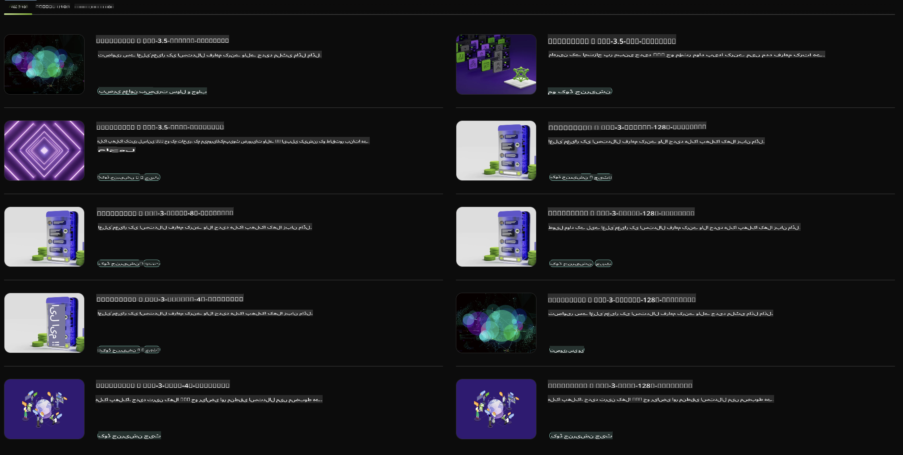

## NVIDIA NIM میں فی فیملی

NVIDIA NIM ایک آسان استعمال مائیکروسروسز کا مجموعہ ہے جو کلاؤڈ، ڈیٹا سینٹر، اور ورک سٹیشنز پر جنریٹیو AI ماڈلز کی تعیناتی کو تیز کرنے کے لیے ڈیزائن کیا گیا ہے۔ NIM ماڈل فیملی اور فی ماڈل کی بنیاد پر تقسیم کیے گئے ہیں۔ مثال کے طور پر، بڑے لینگویج ماڈلز (LLMs) کے لیے NVIDIA NIM انٹرپرائز ایپلیکیشنز میں جدید ترین LLMs کی طاقت لاتا ہے، جو بے مثال قدرتی زبان پروسیسنگ اور سمجھنے کی صلاحیت فراہم کرتا ہے۔

NIM IT اور DevOps ٹیموں کے لیے یہ آسان بناتا ہے کہ وہ اپنے مینیجڈ ماحول میں بڑے لینگویج ماڈلز (LLMs) کی خود میزبان کریں، جبکہ ڈویلپرز کو انڈسٹری اسٹینڈرڈ APIs فراہم کرتا ہے تاکہ وہ طاقتور کوپائلٹس، چیٹ بوٹس، اور AI اسسٹنٹس بنا سکیں جو ان کے کاروبار کو تبدیل کر سکتے ہیں۔ NVIDIA کے جدید GPU ایکسیلریشن اور اسکیل ایبل ڈیپلائمنٹ کا فائدہ اٹھاتے ہوئے، NIM بے مثال کارکردگی کے ساتھ انفیرنس کے لیے تیز ترین راستہ فراہم کرتا ہے۔

آپ NVIDIA NIM کا استعمال فی فیملی ماڈلز کے انفیرنس کے لیے کر سکتے ہیں۔



### **نمونے - NVIDIA NIM میں Phi-3-Vision**

فرض کریں آپ کے پاس ایک تصویر ہے (`demo.png`) اور آپ اس تصویر کو پروسیس کرنے اور اس کا نیا ورژن محفوظ کرنے کے لیے Python کوڈ جنریٹ کرنا چاہتے ہیں (`phi-3-vision.jpg`)۔

اوپر دیا گیا کوڈ اس عمل کو خودکار بناتا ہے:

1. ماحول اور ضروری کنفیگریشنز سیٹ اپ کرتا ہے۔
2. ایسا پرامپٹ بناتا ہے جو ماڈل کو مطلوبہ Python کوڈ جنریٹ کرنے کی ہدایت دیتا ہے۔
3. پرامپٹ ماڈل کو بھیجتا ہے اور جنریٹ کیا گیا کوڈ جمع کرتا ہے۔
4. جنریٹ کیے گئے کوڈ کو نکالتا اور چلاتا ہے۔
5. اصل اور پروسیس کی گئی تصاویر کو ظاہر کرتا ہے۔

یہ طریقہ AI کی طاقت کا فائدہ اٹھاتے ہوئے تصویری پروسیسنگ کے کاموں کو خودکار بناتا ہے، جس سے آپ کے اہداف حاصل کرنا آسان اور تیز تر ہو جاتا ہے۔

[نمونہ کوڈ حل](../../../../../code/06.E2E/E2E_Nvidia_NIM_Phi3_Vision.ipynb)

آئیے پورے کوڈ کو مرحلہ وار تفصیل سے دیکھتے ہیں:

1. **ضروری پیکیج انسٹال کریں**:
    ```python
    !pip install langchain_nvidia_ai_endpoints -U
    ```
    یہ کمانڈ `langchain_nvidia_ai_endpoints` پیکیج کو انسٹال کرتی ہے، یہ یقینی بناتے ہوئے کہ یہ تازہ ترین ورژن ہے۔

2. **ضروری ماڈیولز امپورٹ کریں**:
    ```python
    from langchain_nvidia_ai_endpoints import ChatNVIDIA
    import getpass
    import os
    import base64
    ```
    یہ امپورٹس NVIDIA AI اینڈپوائنٹس کے ساتھ تعامل کرنے، پاس ورڈز کو محفوظ طریقے سے ہینڈل کرنے، آپریٹنگ سسٹم کے ساتھ تعامل کرنے، اور بیس64 فارمیٹ میں ڈیٹا کو انکوڈ/ڈیکوڈ کرنے کے لیے ضروری ماڈیولز لاتے ہیں۔

3. **API کی کی سیٹ اپ کریں**:
    ```python
    if not os.getenv("NVIDIA_API_KEY"):
        os.environ["NVIDIA_API_KEY"] = getpass.getpass("Enter your NVIDIA API key: ")
    ```
    یہ کوڈ چیک کرتا ہے کہ آیا `NVIDIA_API_KEY` ماحول متغیر سیٹ ہے۔ اگر نہیں، تو یہ صارف کو ان کی API کی محفوظ طریقے سے درج کرنے کا مطالبہ کرتا ہے۔

4. **ماڈل اور تصویر کا راستہ متعین کریں**:
    ```python
    model = 'microsoft/phi-3-vision-128k-instruct'
    chat = ChatNVIDIA(model=model)
    img_path = './imgs/demo.png'
    ```
    یہ استعمال کیے جانے والے ماڈل کو سیٹ کرتا ہے، مخصوص ماڈل کے ساتھ `ChatNVIDIA` کا ایک انسٹینس بناتا ہے، اور تصویر فائل کے راستے کو متعین کرتا ہے۔

5. **ٹیکسٹ پرامپٹ بنائیں**:
    ```python
    text = "Please create Python code for image, and use plt to save the new picture under imgs/ and name it phi-3-vision.jpg."
    ```
    یہ ایک ٹیکسٹ پرامپٹ متعین کرتا ہے جو ماڈل کو تصویر پروسیس کرنے کے لیے Python کوڈ جنریٹ کرنے کی ہدایت دیتا ہے۔

6. **تصویر کو بیس64 میں انکوڈ کریں**:
    ```python
    with open(img_path, "rb") as f:
        image_b64 = base64.b64encode(f.read()).decode()
    image = f''
    ```
    یہ کوڈ تصویر فائل کو پڑھتا ہے، اسے بیس64 میں انکوڈ کرتا ہے، اور انکوڈ شدہ ڈیٹا کے ساتھ ایک HTML تصویر ٹیگ بناتا ہے۔

7. **ٹیکسٹ اور تصویر کو پرامپٹ میں شامل کریں**:
    ```python
    prompt = f"{text} {image}"
    ```
    یہ ٹیکسٹ پرامپٹ اور HTML تصویر ٹیگ کو ایک سنگل سٹرنگ میں شامل کرتا ہے۔

8. **ChatNVIDIA کا استعمال کرتے ہوئے کوڈ جنریٹ کریں**:
    ```python
    code = ""
    for chunk in chat.stream(prompt):
        print(chunk.content, end="")
        code += chunk.content
    ```
    یہ کوڈ پرامپٹ کو `ChatNVIDIA` model and collects the generated code in chunks, printing and appending each chunk to the `code` سٹرنگ کے طور پر ماڈل کو بھیجتا ہے۔

9. **جنریٹڈ مواد سے Python کوڈ نکالیں**:
    ```python
    begin = code.index('```python') + 9
    code = code[begin:]
    end = code.index('```')
    code = code[:end]
    ```
    یہ جنریٹ کیے گئے مواد سے اصل Python کوڈ کو نکالتا ہے، مارک ڈاؤن فارمیٹنگ کو ہٹا کر۔

10. **جنریٹڈ کوڈ چلائیں**:
    ```python
    import subprocess
    result = subprocess.run(["python", "-c", code], capture_output=True)
    ```
    یہ نکالا ہوا Python کوڈ سب پروسیس کے طور پر چلاتا ہے اور اس کا آؤٹ پٹ کیپچر کرتا ہے۔

11. **تصاویر ظاہر کریں**:
    ```python
    from IPython.display import Image, display
    display(Image(filename='./imgs/phi-3-vision.jpg'))
    display(Image(filename='./imgs/demo.png'))
    ```
    یہ لائنیں `IPython.display` ماڈیول کا استعمال کرتے ہوئے تصاویر کو ظاہر کرتی ہیں۔

**ڈسکلیمر**:  
یہ دستاویز مشین پر مبنی اے آئی ترجمہ خدمات کا استعمال کرتے ہوئے ترجمہ کی گئی ہے۔ اگرچہ ہم درستگی کے لیے کوشش کرتے ہیں، براہ کرم نوٹ کریں کہ خودکار ترجمے میں غلطیاں یا خامیاں ہوسکتی ہیں۔ اصل دستاویز، جو اپنی مقامی زبان میں ہے، کو مستند ذریعہ سمجھا جانا چاہیے۔ اہم معلومات کے لیے، پیشہ ور انسانی ترجمہ کی سفارش کی جاتی ہے۔ اس ترجمے کے استعمال سے پیدا ہونے والی کسی بھی غلط فہمی یا غلط تشریح کے لیے ہم ذمہ دار نہیں ہیں۔