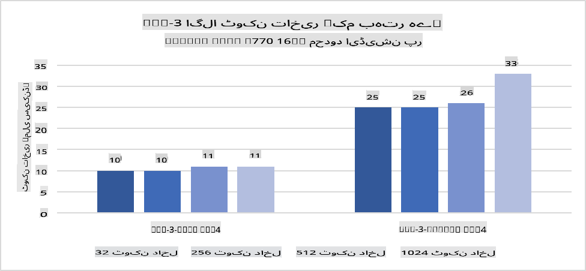
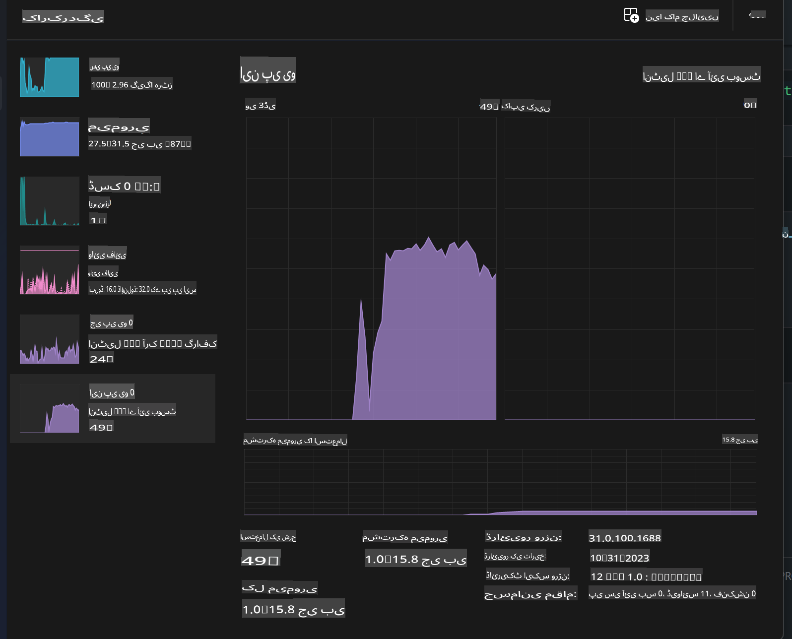
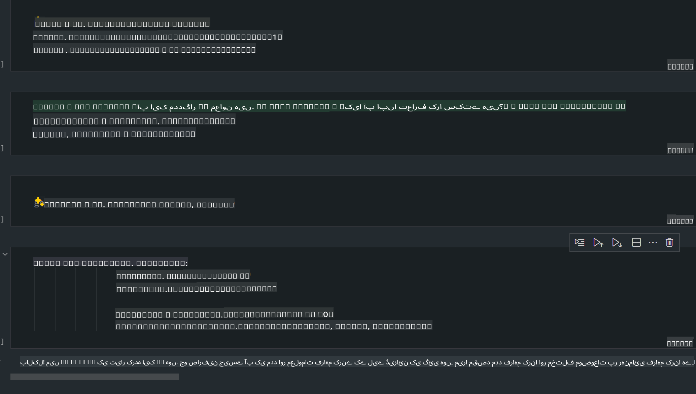
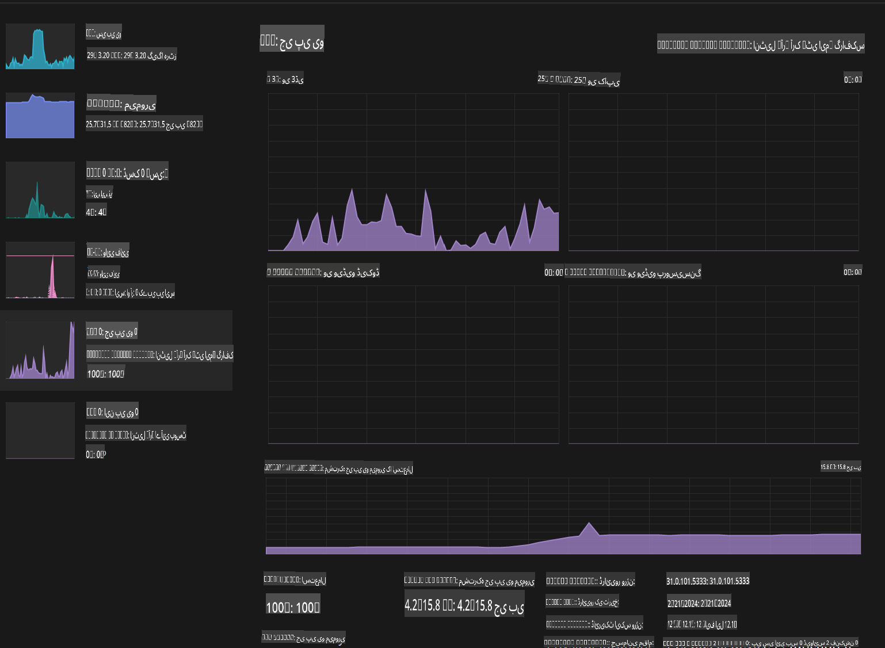

# **ای آئی پی سی میں فائی-3 کا انفرنس**

جنریٹیو ای آئی کے ترقی یافتہ ماڈلز اور ایج ڈیوائسز کی ہارڈویئر صلاحیتوں میں بہتری کے ساتھ، اب زیادہ سے زیادہ جنریٹیو ای آئی ماڈلز کو صارفین کے "اپنا ڈیوائس لائیں" (BYOD) ڈیوائسز میں ضم کیا جا سکتا ہے۔ ای آئی پی سی ان ماڈلز میں شامل ہیں۔ 2024 سے، انٹیل، اے ایم ڈی، اور کوالکوم نے پی سی مینوفیکچررز کے ساتھ مل کر ایسے ای آئی پی سی متعارف کرائے ہیں جو ہارڈویئر میں ترمیم کے ذریعے لوکلائزڈ جنریٹیو ای آئی ماڈلز کی تعیناتی کو ممکن بناتے ہیں۔ اس گفتگو میں، ہم انٹیل ای آئی پی سی پر توجہ مرکوز کریں گے اور دیکھیں گے کہ انٹیل ای آئی پی سی پر فائی-3 کیسے تعینات کیا جا سکتا ہے۔

### این پی یو کیا ہے؟

این پی یو (نیورل پروسیسنگ یونٹ) ایک مخصوص پروسیسر یا پروسیسنگ یونٹ ہے جو بڑے سسٹم آن چپ (SoC) پر خاص طور پر نیورل نیٹ ورک آپریشنز اور ای آئی ٹاسکس کو تیز کرنے کے لیے ڈیزائن کیا گیا ہے۔ عام سی پی یوز اور جی پی یوز کے برعکس، این پی یوز ڈیٹا پر مبنی متوازی کمپیوٹنگ کے لیے بہتر ہوتے ہیں، جس کی وجہ سے یہ ویڈیوز اور تصاویر جیسے بڑے ملٹی میڈیا ڈیٹا کو پروسیس کرنے اور نیورل نیٹ ورک کے لیے ڈیٹا پروسیس کرنے میں انتہائی موثر ہوتے ہیں۔ یہ خاص طور پر ای آئی سے متعلقہ کاموں جیسے تقریر کی شناخت، ویڈیو کالز میں بیک گراؤنڈ بلرنگ، اور آبجیکٹ ڈیٹیکشن جیسے فوٹو یا ویڈیو ایڈیٹنگ پروسیسز میں مہارت رکھتے ہیں۔

## این پی یو بمقابلہ جی پی یو

اگرچہ کئی ای آئی اور مشین لرننگ کے ورک لوڈز جی پی یوز پر چلتے ہیں، جی پی یوز اور این پی یوز کے درمیان ایک اہم فرق ہے۔  
جی پی یوز اپنی متوازی کمپیوٹنگ کی صلاحیتوں کے لیے مشہور ہیں، لیکن تمام جی پی یوز گرافکس پروسیسنگ سے آگے اتنے موثر نہیں ہوتے۔ این پی یوز، اس کے برعکس، نیورل نیٹ ورک آپریشنز میں شامل پیچیدہ حسابات کے لیے خاص طور پر بنائے گئے ہیں، جو انہیں ای آئی کے کاموں کے لیے انتہائی موثر بناتے ہیں۔

خلاصہ یہ ہے کہ این پی یوز وہ ریاضی کے ماہر ہیں جو ای آئی کی کمپیوٹیشنز کو تیز کرتے ہیں اور ای آئی پی سی کے ابھرتے ہوئے دور میں ایک اہم کردار ادا کرتے ہیں!

***یہ مثال انٹیل کے جدید ترین انٹیل کور الٹرا پروسیسر پر مبنی ہے۔***

## **1. فائی-3 ماڈل کو این پی یو کے ذریعے چلائیں**

انٹیل® این پی یو ڈیوائس ایک ای آئی انفرنس ایکسیلریٹر ہے جو انٹیل کلائنٹ سی پی یوز کے ساتھ انضمام کیا گیا ہے، جو انٹیل® کور™ الٹرا سی پی یوز (پہلے میٹیور لیک کے نام سے جانا جاتا تھا) کی نسل سے شروع ہو رہا ہے۔ یہ مصنوعی نیورل نیٹ ورک ٹاسکس کو انرجی ایفیشینٹ طریقے سے انجام دینے کے قابل بناتا ہے۔




**انٹیل این پی یو ایکسیلریشن لائبریری**

انٹیل این پی یو ایکسیلریشن لائبریری [https://github.com/intel/intel-npu-acceleration-library](https://github.com/intel/intel-npu-acceleration-library) ایک پائتھون لائبریری ہے جو انٹیل نیورل پروسیسنگ یونٹ (این پی یو) کی طاقت کا فائدہ اٹھا کر آپ کی ایپلیکیشنز کی کارکردگی کو بہتر بنانے کے لیے ڈیزائن کی گئی ہے تاکہ مطابقت پذیر ہارڈویئر پر تیز رفتار حسابات انجام دیے جا سکیں۔

انٹیل® کور™ الٹرا پروسیسرز سے چلنے والے ای آئی پی سی پر فائی-3-منی کی مثال۔


پائتھون لائبریری کو پِپ کے ذریعے انسٹال کریں

```bash

   pip install intel-npu-acceleration-library

```

***نوٹ*** یہ پروجیکٹ ابھی ترقی کے مراحل میں ہے، لیکن ریفرنس ماڈل پہلے ہی کافی مکمل ہے۔

### **انٹیل این پی یو ایکسیلریشن لائبریری کے ساتھ فائی-3 چلانا**

انٹیل این پی یو ایکسیلریشن کا استعمال کرتے ہوئے، یہ لائبریری روایتی انکوڈنگ پروسیس کو متاثر نہیں کرتی۔ آپ کو صرف اس لائبریری کا استعمال کرتے ہوئے اصل فائی-3 ماڈل کو کوانٹائز کرنا ہوگا، جیسے FP16، INT8، INT4۔

```python
from transformers import AutoTokenizer, pipeline,TextStreamer
from intel_npu_acceleration_library import NPUModelForCausalLM, int4
from intel_npu_acceleration_library.compiler import CompilerConfig
import warnings

model_id = "microsoft/Phi-3-mini-4k-instruct"

compiler_conf = CompilerConfig(dtype=int4)
model = NPUModelForCausalLM.from_pretrained(
    model_id, use_cache=True, config=compiler_conf, attn_implementation="sdpa"
).eval()

tokenizer = AutoTokenizer.from_pretrained(model_id)

text_streamer = TextStreamer(tokenizer, skip_prompt=True)
```

کوانٹائزیشن کامیاب ہونے کے بعد، فائی-3 ماڈل کو چلانے کے لیے این پی یو کو کال کرنے کے عمل کو جاری رکھیں۔

```python
generation_args = {
   "max_new_tokens": 1024,
   "return_full_text": False,
   "temperature": 0.3,
   "do_sample": False,
   "streamer": text_streamer,
}

pipe = pipeline(
   "text-generation",
   model=model,
   tokenizer=tokenizer,
)

query = "<|system|>You are a helpful AI assistant.<|end|><|user|>Can you introduce yourself?<|end|><|assistant|>"

with warnings.catch_warnings():
    warnings.simplefilter("ignore")
    pipe(query, **generation_args)
```

کوڈ کو چلانے کے دوران، ہم ٹاسک مینیجر کے ذریعے این پی یو کی چلنے کی حالت دیکھ سکتے ہیں۔



***نمونے*** : [AIPC_NPU_DEMO.ipynb](../../../../../code/03.Inference/AIPC/AIPC_NPU_DEMO.ipynb)

## **2. فائی-3 ماڈل کو DirectML + ONNX Runtime کے ذریعے چلائیں**

### **DirectML کیا ہے**

[DirectML](https://github.com/microsoft/DirectML) ایک ہائی پرفارمنس، ہارڈویئر ایکسیلریٹڈ DirectX 12 لائبریری ہے جو مشین لرننگ کے لیے بنائی گئی ہے۔ DirectML عام مشین لرننگ کے کاموں کے لیے جی پی یو ایکسیلریشن فراہم کرتا ہے، جو وسیع ہارڈویئر اور ڈرائیورز کے ساتھ مطابقت رکھتا ہے، جن میں AMD، انٹیل، NVIDIA، اور Qualcomm کے تمام DirectX 12-قابل جی پی یوز شامل ہیں۔

جب اکیلے استعمال کیا جائے، DirectML API ایک لو لیول DirectX 12 لائبریری ہے اور ہائی پرفارمنس، لو لیٹینسی ایپلیکیشنز جیسے فریم ورکس، گیمز، اور دیگر ریئل ٹائم ایپلیکیشنز کے لیے موزوں ہے۔ DirectML کی Direct3D 12 کے ساتھ ہموار انٹرآپریبلٹی، اس کی کم اوور ہیڈ، اور ہارڈویئر پر یکسانیت، اسے مشین لرننگ کو تیز کرنے کے لیے مثالی بناتی ہے، خاص طور پر جب اعلی کارکردگی اور ہارڈویئر پر نتائج کی پیش گوئی ضروری ہو۔

***نوٹ*** : جدید DirectML پہلے ہی NPU کو سپورٹ کرتا ہے (https://devblogs.microsoft.com/directx/introducing-neural-processor-unit-npu-support-in-directml-developer-preview/)

###  DirectML اور CUDA کی صلاحیتوں اور کارکردگی کے لحاظ سے موازنہ:

**DirectML** مائیکروسافٹ کی تیار کردہ مشین لرننگ لائبریری ہے۔ یہ ونڈوز ڈیوائسز، جیسے ڈیسک ٹاپس، لیپ ٹاپس، اور ایج ڈیوائسز پر مشین لرننگ ورک لوڈز کو تیز کرنے کے لیے ڈیزائن کی گئی ہے۔
- DX12-Based: DirectML DirectX 12 (DX12) پر بنایا گیا ہے، جو GPUs کے وسیع رینج کو سپورٹ فراہم کرتا ہے، جن میں NVIDIA اور AMD دونوں شامل ہیں۔
- وسیع سپورٹ: DX12 کا فائدہ اٹھانے کی وجہ سے، DirectML کسی بھی GPU کے ساتھ کام کر سکتا ہے جو DX12 کو سپورٹ کرتا ہے، یہاں تک کہ Integrated GPUs کے ساتھ بھی۔
- امیج پروسیسنگ: DirectML تصاویر اور دیگر ڈیٹا کو نیورل نیٹ ورکس کے ذریعے پروسیس کرتا ہے، جس سے یہ امیج ریکگنیشن، آبجیکٹ ڈیٹیکشن، اور دیگر کاموں کے لیے موزوں ہے۔
- سیٹ اپ میں آسانی: DirectML کو سیٹ اپ کرنا آسان ہے، اور اس کے لیے GPU مینوفیکچررز سے مخصوص SDKs یا لائبریریوں کی ضرورت نہیں ہے۔
- کارکردگی: کچھ صورتوں میں، DirectML اچھی کارکردگی پیش کرتا ہے اور کچھ ورک لوڈز کے لیے CUDA سے تیز ہو سکتا ہے۔
- حدود: تاہم، ایسے حالات بھی ہوتے ہیں جہاں DirectML سست ہو سکتا ہے، خاص طور پر float16 بڑے بیچ سائزز کے لیے۔

**CUDA** NVIDIA کا متوازی کمپیوٹنگ پلیٹ فارم اور پروگرامنگ ماڈل ہے۔ یہ ڈویلپرز کو NVIDIA GPUs کی طاقت کو عام مقصدی کمپیوٹنگ، مشین لرننگ، اور سائنسی سیمولیشنز کے لیے استعمال کرنے کی اجازت دیتا ہے۔
- NVIDIA-Specific: CUDA NVIDIA GPUs کے ساتھ مضبوطی سے انٹیگریٹڈ ہے اور خاص طور پر ان کے لیے ڈیزائن کیا گیا ہے۔
- انتہائی بہتر: یہ GPU-ایکسلیریٹڈ ٹاسکس کے لیے بہترین کارکردگی فراہم کرتا ہے، خاص طور پر NVIDIA GPUs کے ساتھ۔
- وسیع پیمانے پر استعمال شدہ: بہت سے مشین لرننگ فریم ورکس اور لائبریریاں (جیسے TensorFlow اور PyTorch) CUDA کو سپورٹ کرتی ہیں۔
- حسب ضرورت: ڈویلپرز مخصوص ٹاسکس کے لیے CUDA سیٹنگز کو بہتر بنا سکتے ہیں، جو بہترین کارکردگی کا باعث بن سکتا ہے۔
- حدود: تاہم، CUDA کا NVIDIA ہارڈویئر پر انحصار دوسرے GPUs کے ساتھ وسیع مطابقت کے خواہشمند صارفین کے لیے محدود ہو سکتا ہے۔

### DirectML اور CUDA کے درمیان انتخاب

DirectML اور CUDA کے درمیان انتخاب آپ کے مخصوص استعمال کے کیس، دستیاب ہارڈویئر، اور ترجیحات پر منحصر ہے۔  
اگر آپ وسیع مطابقت اور سیٹ اپ میں آسانی چاہتے ہیں، تو DirectML ایک اچھا انتخاب ہو سکتا ہے۔ تاہم، اگر آپ کے پاس NVIDIA GPUs ہیں اور آپ کو انتہائی بہتر کارکردگی کی ضرورت ہے، تو CUDA ایک مضبوط آپشن ہے۔ خلاصہ یہ ہے کہ DirectML اور CUDA دونوں کے اپنے فوائد اور نقصانات ہیں، لہذا فیصلہ کرتے وقت اپنے تقاضوں اور دستیاب ہارڈویئر کو مدنظر رکھیں۔

### **ONNX Runtime کے ساتھ جنریٹیو ای آئی**

ای آئی کے دور میں، ای آئی ماڈلز کی پورٹیبلٹی بہت اہم ہے۔ ONNX Runtime تربیت یافتہ ماڈلز کو مختلف ڈیوائسز پر آسانی سے تعینات کر سکتا ہے۔ ڈویلپرز کو انفرنس فریم ورک پر توجہ دینے کی ضرورت نہیں ہے اور ایک متحد API کا استعمال کرتے ہوئے ماڈل انفرنس مکمل کر سکتے ہیں۔ جنریٹیو ای آئی کے دور میں، ONNX Runtime نے بھی کوڈ آپٹیمائزیشن کی ہے (https://onnxruntime.ai/docs/genai/)۔  
آپٹیمائزڈ ONNX Runtime کے ذریعے، کوانٹائزڈ جنریٹیو ای آئی ماڈل کو مختلف ٹرمینلز پر انفرنس کیا جا سکتا ہے۔ ONNX Runtime کے ساتھ جنریٹیو ای آئی میں، آپ Python، C#، C / C++ کے ذریعے ای آئی ماڈل API کو انفرنس کر سکتے ہیں۔  
ظاہر ہے، آئی فون پر ڈپلائمنٹ C++ کے ONNX Runtime API کا فائدہ اٹھا سکتا ہے۔

[نمونہ کوڈ](https://github.com/Azure-Samples/Phi-3MiniSamples/tree/main/onnx)

***ONNX Runtime لائبریری کے ساتھ جنریٹیو ای آئی کو مرتب کریں***

```bash

winget install --id=Kitware.CMake  -e

git clone https://github.com/microsoft/onnxruntime.git

cd .\onnxruntime\

./build.bat --build_shared_lib --skip_tests --parallel --use_dml --config Release

cd ../

git clone https://github.com/microsoft/onnxruntime-genai.git

cd .\onnxruntime-genai\

mkdir ort

cd ort

mkdir include

mkdir lib

copy ..\onnxruntime\include\onnxruntime\core\providers\dml\dml_provider_factory.h ort\include

copy ..\onnxruntime\include\onnxruntime\core\session\onnxruntime_c_api.h ort\include

copy ..\onnxruntime\build\Windows\Release\Release\*.dll ort\lib

copy ..\onnxruntime\build\Windows\Release\Release\onnxruntime.lib ort\lib

python build.py --use_dml


```

**لائبریری انسٹال کریں**

```bash

pip install .\onnxruntime_genai_directml-0.3.0.dev0-cp310-cp310-win_amd64.whl

```

یہ چلنے کا نتیجہ ہے



***نمونے*** : [AIPC_DirectML_DEMO.ipynb](../../../../../code/03.Inference/AIPC/AIPC_DirectML_DEMO.ipynb)

## **3. انٹیل OpenVINO کے ذریعے فائی-3 ماڈل کو چلائیں**

### **OpenVINO کیا ہے**

[OpenVINO](https://github.com/openvinotoolkit/openvino) ایک اوپن سورس ٹول کٹ ہے جو ڈیپ لرننگ ماڈلز کو بہتر بنانے اور تعینات کرنے کے لیے ڈیزائن کیا گیا ہے۔ یہ TensorFlow، PyTorch، اور دیگر مشہور فریم ورکس سے ویژن، آڈیو، اور لینگویج ماڈلز کے لیے بہتر ڈیپ لرننگ کارکردگی فراہم کرتا ہے۔ OpenVINO کے ساتھ شروع کریں۔ OpenVINO کو CPU اور GPU کے ساتھ مل کر بھی فائی-3 ماڈل کو چلانے کے لیے استعمال کیا جا سکتا ہے۔

***نوٹ***: فی الحال، OpenVINO این پی یو کو سپورٹ نہیں کرتا۔

### **OpenVINO لائبریری انسٹال کریں**

```bash

 pip install git+https://github.com/huggingface/optimum-intel.git

 pip install git+https://github.com/openvinotoolkit/nncf.git

 pip install openvino-nightly

```

### **OpenVINO کے ساتھ فائی-3 چلانا**

این پی یو کی طرح، OpenVINO کوانٹائزڈ ماڈلز چلا کر جنریٹیو ای آئی ماڈلز کو کال کرتا ہے۔ ہمیں پہلے فائی-3 ماڈل کو کوانٹائز کرنا ہوگا اور کمانڈ لائن کے ذریعے optimum-cli پر ماڈل کوانٹائزیشن مکمل کرنی ہوگی۔

**INT4**

```bash

optimum-cli export openvino --model "microsoft/Phi-3-mini-4k-instruct" --task text-generation-with-past --weight-format int4 --group-size 128 --ratio 0.6  --sym  --trust-remote-code ./openvinomodel/phi3/int4

```

**FP16**

```bash

optimum-cli export openvino --model "microsoft/Phi-3-mini-4k-instruct" --task text-generation-with-past --weight-format fp16 --trust-remote-code ./openvinomodel/phi3/fp16

```

کنورٹڈ فارمیٹ اس طرح ہوگا


ماڈل پاتھز (model_dir)، متعلقہ کنفیگریشنز (ov_config = {"PERFORMANCE_HINT": "LATENCY", "NUM_STREAMS": "1", "CACHE_DIR": ""})، اور ہارڈویئر ایکسیلریٹڈ ڈیوائسز (GPU.0) کو OVModelForCausalLM کے ذریعے لوڈ کریں۔

```python

ov_model = OVModelForCausalLM.from_pretrained(
     model_dir,
     device='GPU.0',
     ov_config=ov_config,
     config=AutoConfig.from_pretrained(model_dir, trust_remote_code=True),
     trust_remote_code=True,
)

```

کوڈ کو چلانے کے دوران، ہم ٹاسک مینیجر کے ذریعے جی پی یو کی چلنے کی حالت دیکھ سکتے ہیں۔



***نمونے*** : [AIPC_OpenVino_Demo.ipynb](../../../../../code/03.Inference/AIPC/AIPC_OpenVino_Demo.ipynb)

### ***نوٹ*** : اوپر دیے گئے تینوں طریقوں کے اپنے اپنے فوائد ہیں، لیکن ای آئی پی سی انفرنس کے لیے این پی یو ایکسیلریشن استعمال کرنے کی سفارش کی جاتی ہے۔

**ڈسکلیمر**:  
یہ دستاویز مشین پر مبنی AI ترجمہ سروسز کا استعمال کرتے ہوئے ترجمہ کی گئی ہے۔ ہم درستگی کے لیے کوشش کرتے ہیں، لیکن براہ کرم آگاہ رہیں کہ خودکار ترجمے میں غلطیاں یا خامیاں ہو سکتی ہیں۔ اصل دستاویز کو اس کی مقامی زبان میں مستند ذریعہ سمجھا جانا چاہیے۔ اہم معلومات کے لیے، پیشہ ور انسانی ترجمہ کی سفارش کی جاتی ہے۔ اس ترجمے کے استعمال سے پیدا ہونے والی کسی بھی غلط فہمی یا غلط تشریح کے لیے ہم ذمہ دار نہیں ہیں۔