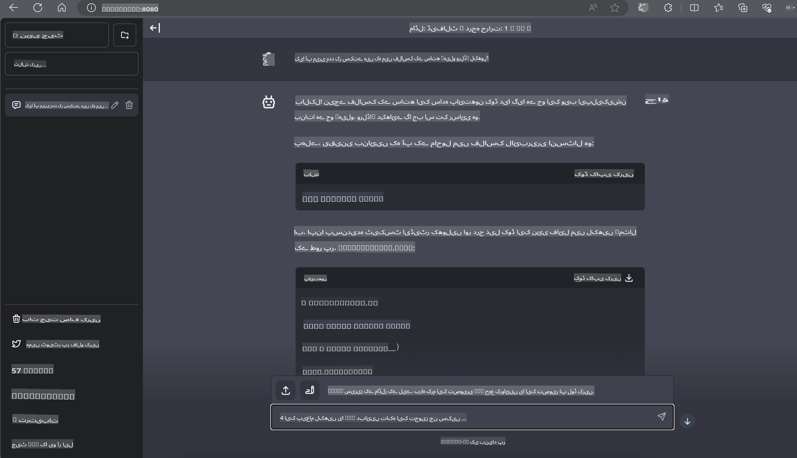

# **انویڈیا جیٹسن میں انفرنس فائی-3**

انویڈیا جیٹسن انویڈیا کی طرف سے ایمبیڈڈ کمپیوٹنگ بورڈز کی ایک سیریز ہے۔ جیٹسن TK1، TX1 اور TX2 ماڈلز میں انویڈیا کا ٹیگرا پروسیسر (یا SoC) شامل ہے جو ARM آرکیٹیکچر پر مبنی سینٹرل پروسیسنگ یونٹ (CPU) کو انٹیگریٹ کرتا ہے۔ جیٹسن ایک کم توانائی خرچ کرنے والا سسٹم ہے اور مشین لرننگ ایپلی کیشنز کو تیز کرنے کے لیے ڈیزائن کیا گیا ہے۔ انویڈیا جیٹسن پیشہ ور ڈویلپرز کے ذریعے تمام صنعتوں میں شاندار AI پروڈکٹس بنانے کے لیے استعمال کیا جاتا ہے، اور طلباء و شوقین افراد کے لیے AI سیکھنے اور حیرت انگیز منصوبے بنانے کا ذریعہ ہے۔ SLM کو جیٹسن جیسے ایج ڈیوائسز میں نافذ کیا جاتا ہے، جو صنعتی جنریٹو AI ایپلیکیشن سیناریوز کے بہتر نفاذ کو ممکن بناتا ہے۔

## NVIDIA جیٹسن پر تعیناتی:
خود مختار روبوٹکس اور ایمبیڈڈ ڈیوائسز پر کام کرنے والے ڈویلپرز فائی-3 مینی کا فائدہ اٹھا سکتے ہیں۔ فائی-3 کا نسبتا چھوٹا سائز اسے ایج ڈپلائمنٹ کے لیے مثالی بناتا ہے۔ تربیت کے دوران پیرامیٹرز کو انتہائی باریکی سے ترتیب دیا گیا ہے، جو جوابات میں اعلیٰ درستگی کو یقینی بناتے ہیں۔

### TensorRT-LLM آپٹیمائزیشن:
NVIDIA کی [TensorRT-LLM لائبریری](https://github.com/NVIDIA/TensorRT-LLM?WT.mc_id=aiml-138114-kinfeylo) بڑے زبان ماڈلز کی انفرنس کو بہتر بناتی ہے۔ یہ فائی-3 مینی کی طویل کانٹیکسٹ ونڈو کو سپورٹ کرتی ہے، جس سے تھروپٹ اور لیٹنسی دونوں میں بہتری آتی ہے۔ آپٹیمائزیشن میں تکنیکیں شامل ہیں جیسے LongRoPE، FP8، اور inflight batching۔

### دستیابی اور تعیناتی:
ڈویلپرز فائی-3 مینی کو 128K کانٹیکسٹ ونڈو کے ساتھ [NVIDIA's AI](https://www.nvidia.com/en-us/ai-data-science/generative-ai/) پر ایکسپلور کر سکتے ہیں۔ یہ ایک NVIDIA NIM کے طور پر پیک کیا گیا ہے، جو ایک مائیکرو سروس ہے جس میں ایک معیاری API ہے جو کہیں بھی تعینات کی جا سکتی ہے۔ مزید برآں، [GitHub پر TensorRT-LLM implementations](https://github.com/NVIDIA/TensorRT-LLM) بھی دستیاب ہیں۔

## **1. تیاری**

a. جیٹسن اورن NX / جیٹسن NX

b. جیٹ پیک 5.1.2+

c. Cuda 11.8

d. Python 3.8+

## **2. جیٹسن میں فائی-3 چلانا**

ہم [Ollama](https://ollama.com) یا [LlamaEdge](https://llamaedge.com) کا انتخاب کر سکتے ہیں۔

اگر آپ gguf کو کلاؤڈ اور ایج ڈیوائسز پر ایک ہی وقت میں استعمال کرنا چاہتے ہیں تو LlamaEdge کو WasmEdge کے طور پر سمجھا جا سکتا ہے (WasmEdge ایک ہلکا پھلکا، اعلی کارکردگی والا، اسکیل ایبل WebAssembly رن ٹائم ہے جو کلاؤڈ نیٹیو، ایج اور غیر مرکزیت ایپلیکیشنز کے لیے موزوں ہے۔ یہ سرور لیس ایپلیکیشنز، ایمبیڈڈ فنکشنز، مائیکرو سروسز، سمارٹ کانٹریکٹس اور IoT ڈیوائسز کو سپورٹ کرتا ہے۔ آپ LlamaEdge کے ذریعے gguf کے مقداری ماڈل کو ایج ڈیوائسز اور کلاؤڈ پر تعینات کر سکتے ہیں۔)


یہاں استعمال کے مراحل ہیں:

1. متعلقہ لائبریریوں اور فائلوں کو انسٹال اور ڈاؤن لوڈ کریں

```bash

curl -sSf https://raw.githubusercontent.com/WasmEdge/WasmEdge/master/utils/install.sh | bash -s -- --plugin wasi_nn-ggml

curl -LO https://github.com/LlamaEdge/LlamaEdge/releases/latest/download/llama-api-server.wasm

curl -LO https://github.com/LlamaEdge/chatbot-ui/releases/latest/download/chatbot-ui.tar.gz

tar xzf chatbot-ui.tar.gz

```

**نوٹ**: llama-api-server.wasm اور chatbot-ui کو ایک ہی ڈائریکٹری میں ہونا چاہیے۔

2. ٹرمینل میں اسکرپٹس چلائیں

```bash

wasmedge --dir .:. --nn-preload default:GGML:AUTO:{Your gguf path} llama-api-server.wasm -p phi-3-chat

```

یہ ہے چلانے کا نتیجہ:



***نمونہ کوڈ*** [فائی-3 مینی WASM نوٹ بک نمونہ](https://github.com/Azure-Samples/Phi-3MiniSamples/tree/main/wasm)

خلاصہ یہ ہے کہ فائی-3 مینی زبان ماڈلنگ میں ایک اہم پیش رفت کی نمائندگی کرتا ہے، جو کارکردگی، کانٹیکسٹ کی آگاہی، اور NVIDIA کی آپٹیمائزیشن مہارت کو یکجا کرتا ہے۔ چاہے آپ روبوٹ بنا رہے ہوں یا ایج ایپلیکیشنز، فائی-3 مینی ایک طاقتور ٹول ہے جس سے واقف ہونا ضروری ہے۔

**اعلانِ لاتعلقی**:  
یہ دستاویز مشین پر مبنی اے آئی ترجمہ خدمات کا استعمال کرتے ہوئے ترجمہ کی گئی ہے۔ اگرچہ ہم درستگی کی پوری کوشش کرتے ہیں، براہ کرم آگاہ رہیں کہ خودکار ترجمے میں غلطیاں یا نقصانات ہو سکتے ہیں۔ اصل دستاویز، جو اس کی اصل زبان میں ہے، کو مستند ذریعہ سمجھا جانا چاہیے۔ اہم معلومات کے لیے، پیشہ ور انسانی ترجمہ کی سفارش کی جاتی ہے۔ اس ترجمے کے استعمال سے پیدا ہونے والی کسی بھی غلط فہمی یا غلط تشریح کے لیے ہم ذمہ دار نہیں ہیں۔