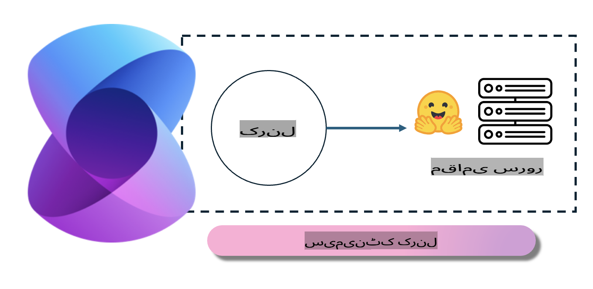
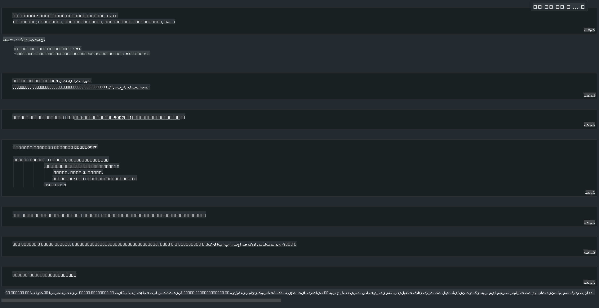

# **لوکل سرور پر Phi-3 چلانا**

ہم Phi-3 کو لوکل سرور پر ڈیپلوئے کر سکتے ہیں۔ صارفین [Ollama](https://ollama.com) یا [LM Studio](https://llamaedge.com) کے حل منتخب کر سکتے ہیں، یا اپنی کوڈنگ لکھ سکتے ہیں۔ آپ [Semantic Kernel](https://github.com/microsoft/semantic-kernel?WT.mc_id=aiml-138114-kinfeylo) یا [Langchain](https://www.langchain.com/) کے ذریعے Phi-3 کی لوکل سروسز سے کنیکٹ ہو کر کوپائلٹ ایپلیکیشنز بنا سکتے ہیں۔  

## **Phi-3-mini تک رسائی کے لیے Semantic Kernel کا استعمال**

کوپائلٹ ایپلیکیشن میں، ہم Semantic Kernel یا LangChain کے ذریعے ایپلیکیشنز بناتے ہیں۔ اس قسم کا ایپلیکیشن فریم ورک عام طور پر Azure OpenAI Service / OpenAI ماڈلز کے ساتھ مطابقت رکھتا ہے، اور Hugging Face اور لوکل ماڈلز جیسے اوپن سورس ماڈلز کو بھی سپورٹ کر سکتا ہے۔ اگر ہم Semantic Kernel کا استعمال کرتے ہوئے Phi-3-mini تک رسائی حاصل کرنا چاہیں تو ہمیں کیا کرنا چاہیے؟ .NET کو مثال کے طور پر لیتے ہوئے، ہم Semantic Kernel میں Hugging Face Connector کے ساتھ اسے جوڑ سکتے ہیں۔ ڈیفالٹ کے طور پر، یہ Hugging Face پر ماڈل آئی ڈی سے مطابقت رکھتا ہے (پہلی بار استعمال کرنے پر، ماڈل Hugging Face سے ڈاؤن لوڈ ہوگا، جس میں کافی وقت لگ سکتا ہے)۔ آپ اسے خود سے بنائی گئی لوکل سروس سے بھی کنیکٹ کر سکتے ہیں۔ دونوں کے موازنہ میں، ہم دوسرے آپشن کو ترجیح دیتے ہیں کیونکہ اس میں زیادہ خود مختاری ہوتی ہے، خاص طور پر انٹرپرائز ایپلیکیشنز میں۔

اوپر دی گئی تصویر میں دکھایا گیا ہے کہ Semantic Kernel کے ذریعے لوکل سروسز تک رسائی سے ہم آسانی سے خود سے بنائے گئے Phi-3-mini ماڈل سرور سے کنیکٹ ہو سکتے ہیں۔ نیچے چلانے کے نتائج دیکھیں۔

***نمونہ کوڈ*** https://github.com/kinfey/Phi3MiniSamples/tree/main/semantickernel

**ڈسکلیمر**:  
یہ دستاویز مشین پر مبنی AI ترجمہ خدمات کا استعمال کرتے ہوئے ترجمہ کی گئی ہے۔ ہم درستگی کی پوری کوشش کرتے ہیں، لیکن براہ کرم آگاہ رہیں کہ خودکار ترجمے میں غلطیاں یا نقائص ہو سکتے ہیں۔ اصل دستاویز، جو اس کی اصل زبان میں ہے، کو مستند ماخذ سمجھا جانا چاہیے۔ اہم معلومات کے لیے، پیشہ ور انسانی ترجمہ کی سفارش کی جاتی ہے۔ ہم اس ترجمے کے استعمال سے پیدا ہونے والی کسی بھی غلط فہمی یا غلط تشریح کے ذمہ دار نہیں ہیں۔