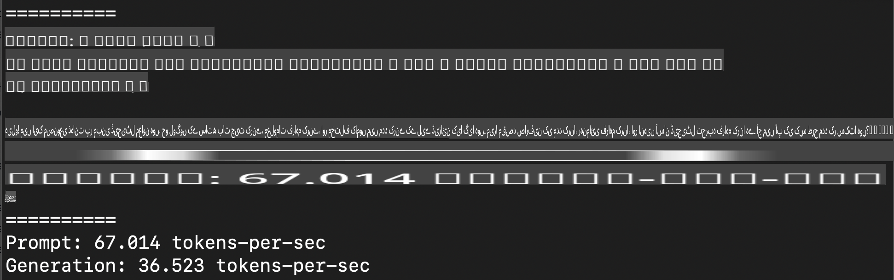
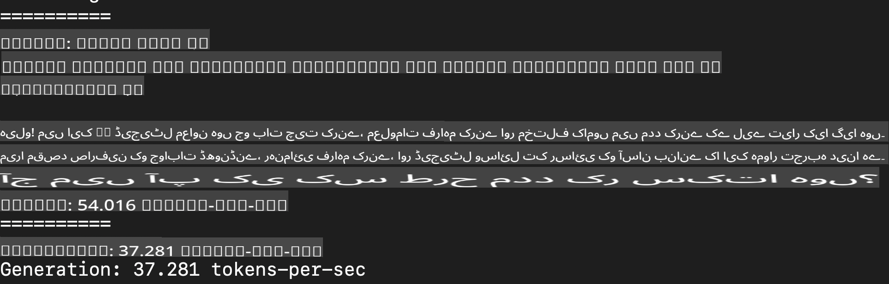
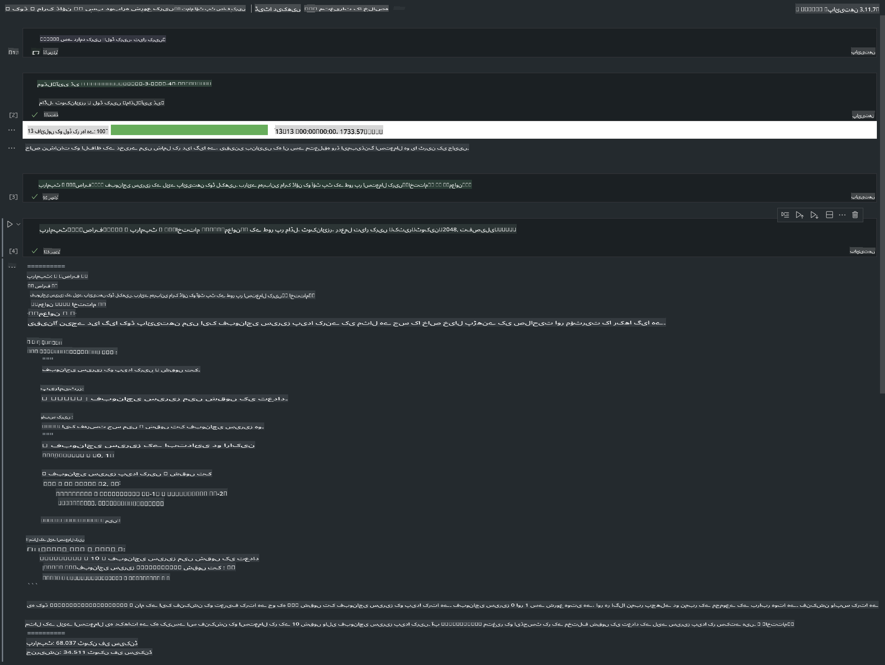

# **ایپل MLX فریم ورک کے ساتھ Phi-3 کا انفیرنس**

## **MLX فریم ورک کیا ہے؟**

MLX ایپل سلیکون پر مشین لرننگ ریسرچ کے لیے ایک فریم ورک ہے، جو ایپل مشین لرننگ ریسرچ کی جانب سے پیش کیا گیا ہے۔

MLX خاص طور پر مشین لرننگ ریسرچرز کے لیے ڈیزائن کیا گیا ہے۔ یہ فریم ورک یوزر فرینڈلی ہونے کے ساتھ ساتھ ماڈلز کی ٹریننگ اور ڈیپلائمنٹ کے لیے مؤثر بھی ہے۔ اس کا ڈیزائن خود بھی تصوراتی طور پر سادہ ہے۔ ہمارا مقصد ہے کہ ریسرچرز کو آسانی سے MLX کو بڑھانے اور بہتر بنانے کا موقع فراہم کریں تاکہ وہ نئی آئیڈیاز کو تیزی سے ایکسپلور کر سکیں۔

LLMs کو ایپل سلیکون ڈیوائسز پر MLX کے ذریعے تیز کیا جا سکتا ہے، اور ماڈلز کو لوکل طور پر بہت آسانی سے چلایا جا سکتا ہے۔

## **MLX کے ذریعے Phi-3-mini کا انفیرنس کرنا**

### **1. اپنے MLX ماحول کو سیٹ اپ کریں**

1. Python 3.11.x انسٹال کریں  
2. MLX لائبریری انسٹال کریں  

```bash

pip install mlx-lm

```

### **2. MLX کے ذریعے ٹرمینل میں Phi-3-mini چلائیں**

```bash

python -m mlx_lm.generate --model microsoft/Phi-3-mini-4k-instruct --max-token 2048 --prompt  "<|user|>\nCan you introduce yourself<|end|>\n<|assistant|>"

```

نتیجہ (میرا ماحول Apple M1 Max, 64GB ہے) یہ ہے:



### **3. ٹرمینل میں MLX کے ذریعے Phi-3-mini کو کوانٹائز کرنا**

```bash

python -m mlx_lm.convert --hf-path microsoft/Phi-3-mini-4k-instruct

```

***نوٹ:*** ماڈل کو mlx_lm.convert کے ذریعے کوانٹائز کیا جا سکتا ہے، اور ڈیفالٹ کوانٹائزیشن INT4 ہے۔ اس مثال میں Phi-3-mini کو INT4 میں کوانٹائز کیا گیا ہے۔

ماڈل کو mlx_lm.convert کے ذریعے کوانٹائز کیا جا سکتا ہے، اور ڈیفالٹ کوانٹائزیشن INT4 ہے۔ اس مثال میں Phi-3-mini کو INT4 میں کوانٹائز کیا گیا ہے۔ کوانٹائزیشن کے بعد، یہ ڈیفالٹ ڈائریکٹری ./mlx_model میں اسٹور ہوگا۔

ہم ٹرمینل سے MLX کے ساتھ کوانٹائزڈ ماڈل کو ٹیسٹ کر سکتے ہیں:

```bash

python -m mlx_lm.generate --model ./mlx_model/ --max-token 2048 --prompt  "<|user|>\nCan you introduce yourself<|end|>\n<|assistant|>"

```

نتیجہ یہ ہے:



### **4. Jupyter Notebook میں MLX کے ساتھ Phi-3-mini چلانا**



***نوٹ:*** براہ کرم یہ نمونہ پڑھیں [اس لنک پر کلک کریں](../../../../../code/03.Inference/MLX/MLX_DEMO.ipynb)

## **وسائل**

1. ایپل MLX فریم ورک کے بارے میں جانیں [https://ml-explore.github.io](https://ml-explore.github.io/mlx/build/html/index.html)

2. ایپل MLX GitHub ریپو [https://github.com/ml-explore](https://github.com/ml-explore)

**ڈسکلیمر**:  
یہ دستاویز مشین پر مبنی AI ترجمہ خدمات کا استعمال کرتے ہوئے ترجمہ کی گئی ہے۔ ہم درستگی کی بھرپور کوشش کرتے ہیں، لیکن براہ کرم آگاہ رہیں کہ خودکار ترجمے میں غلطیاں یا نقائص ہو سکتے ہیں۔ اصل دستاویز کو اس کی مقامی زبان میں مستند ذریعہ سمجھا جانا چاہیے۔ اہم معلومات کے لیے، پیشہ ور انسانی ترجمہ تجویز کیا جاتا ہے۔ اس ترجمے کے استعمال سے پیدا ہونے والی کسی بھی غلط فہمی یا غلط تشریح کے لیے ہم ذمہ دار نہیں ہیں۔