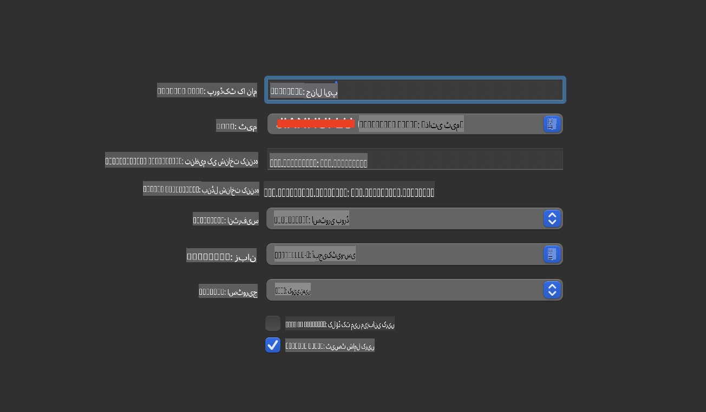
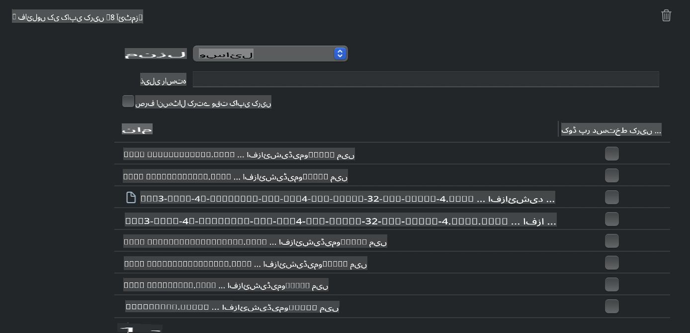
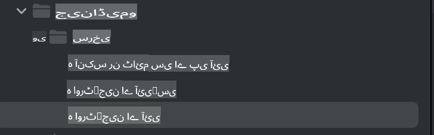
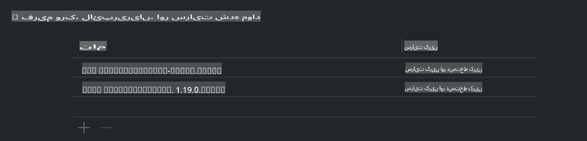
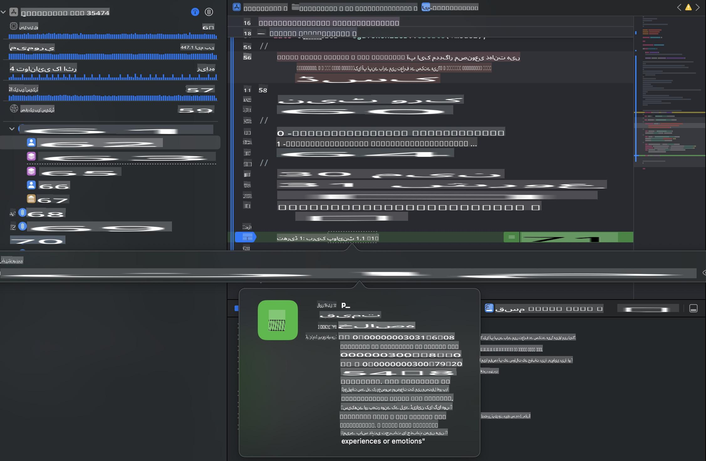

# **iOS میں Phi-3 کا انفرنس**

Phi-3-mini مائیکروسافٹ کی ایک نئی ماڈل سیریز ہے جو بڑے لینگویج ماڈلز (LLMs) کو ایج ڈیوائسز اور IoT ڈیوائسز پر چلانے کی سہولت فراہم کرتی ہے۔ Phi-3-mini iOS، اینڈرائیڈ، اور ایج ڈیوائسز پر ڈپلائمنٹ کے لیے دستیاب ہے، جس سے جنریٹو AI کو BYOD ماحول میں تعینات کرنا ممکن ہو جاتا ہے۔ ذیل میں ایک مثال دکھائی گئی ہے کہ Phi-3-mini کو iOS پر کیسے ڈپلائے کیا جا سکتا ہے۔

## **1. تیاری**

- **ا۔** macOS 14 یا اس سے جدید
- **ب۔** Xcode 15 یا اس سے جدید
- **ج۔** iOS SDK 17.x (iPhone 14 A16 یا جدید)
- **د۔** Python 3.10 یا اس سے جدید انسٹال کریں (Conda تجویز کی جاتی ہے)
- **ر۔** Python لائبریری انسٹال کریں: `python-flatbuffers`
- **س۔** CMake انسٹال کریں

### Semantic Kernel اور انفرنس

Semantic Kernel ایک ایپلیکیشن فریم ورک ہے جو آپ کو Azure OpenAI Service، OpenAI ماڈلز، اور لوکل ماڈلز کے ساتھ مطابقت رکھنے والی ایپلیکیشنز بنانے کی اجازت دیتا ہے۔ Semantic Kernel کے ذریعے لوکل سروسز تک رسائی حاصل کرنا آپ کے خود میزبان Phi-3-mini ماڈل سرور کے ساتھ آسان انضمام فراہم کرتا ہے۔

### Quantized ماڈلز کو Ollama یا LlamaEdge کے ساتھ کال کرنا

بہت سے صارفین لوکل طور پر ماڈلز چلانے کے لیے Quantized ماڈلز کو ترجیح دیتے ہیں۔ [Ollama](https://ollama.com) اور [LlamaEdge](https://llamaedge.com) صارفین کو مختلف Quantized ماڈلز کال کرنے کی سہولت فراہم کرتے ہیں:

#### **Ollama**

آپ `ollama run phi3` کو براہ راست چلا سکتے ہیں یا اسے آف لائن کنفیگر کر سکتے ہیں۔ ایک Modelfile بنائیں جس میں آپ کے `gguf` فائل کا راستہ ہو۔ Phi-3-mini Quantized ماڈل چلانے کے لیے نمونہ کوڈ:

```gguf
FROM {Add your gguf file path}
TEMPLATE \"\"\"<|user|> .Prompt<|end|> <|assistant|>\"\"\"
PARAMETER stop <|end|>
PARAMETER num_ctx 4096
```

#### **LlamaEdge**

اگر آپ `gguf` کو کلاؤڈ اور ایج ڈیوائسز دونوں پر بیک وقت استعمال کرنا چاہتے ہیں، تو LlamaEdge ایک بہترین انتخاب ہے۔

## **2. iOS کے لیے ONNX Runtime کو کمپائل کرنا**

```bash

git clone https://github.com/microsoft/onnxruntime.git

cd onnxruntime

./build.sh --build_shared_lib --ios --skip_tests --parallel --build_dir ./build_ios --ios --apple_sysroot iphoneos --osx_arch arm64 --apple_deploy_target 17.5 --cmake_generator Xcode --config Release

cd ../

```

### **نوٹس**

- **ا۔** کمپائل کرنے سے پہلے، یقینی بنائیں کہ Xcode صحیح طریقے سے کنفیگر ہے اور اسے ٹرمینل میں ایکٹیو ڈیولپر ڈائریکٹری کے طور پر سیٹ کریں:

    ```bash
    sudo xcode-select -switch /Applications/Xcode.app/Contents/Developer
    ```

- **ب۔** ONNX Runtime کو مختلف پلیٹ فارمز کے لیے کمپائل کرنے کی ضرورت ہے۔ iOS کے لیے، آپ `arm64` or `x86_64` کے لیے کمپائل کر سکتے ہیں۔

- **ج۔** کمپائل کرنے کے لیے جدید ترین iOS SDK استعمال کرنے کی سفارش کی جاتی ہے۔ تاہم، اگر آپ کو پچھلے SDKs کے ساتھ مطابقت کی ضرورت ہو تو آپ پرانے ورژن بھی استعمال کر سکتے ہیں۔

## **3. iOS کے لیے ONNX Runtime کے ساتھ جنریٹو AI کو کمپائل کرنا**

> **نوٹ:** چونکہ ONNX Runtime کے ساتھ جنریٹو AI ابھی پریویو میں ہے، براہ کرم ممکنہ تبدیلیوں سے آگاہ رہیں۔

```bash

git clone https://github.com/microsoft/onnxruntime-genai
 
cd onnxruntime-genai
 
mkdir ort
 
cd ort
 
mkdir include
 
mkdir lib
 
cd ../
 
cp ../onnxruntime/include/onnxruntime/core/session/onnxruntime_c_api.h ort/include
 
cp ../onnxruntime/build_ios/Release/Release-iphoneos/libonnxruntime*.dylib* ort/lib
 
export OPENCV_SKIP_XCODEBUILD_FORCE_TRYCOMPILE_DEBUG=1
 
python3 build.py --parallel --build_dir ./build_ios --ios --ios_sysroot iphoneos --ios_arch arm64 --ios_deployment_target 17.5 --cmake_generator Xcode --cmake_extra_defines CMAKE_XCODE_ATTRIBUTE_CODE_SIGNING_ALLOWED=NO

```

## **4. Xcode میں ایک App ایپلیکیشن بنائیں**

میں نے Objective-C کو ایپ ڈویلپمنٹ کے طریقے کے طور پر منتخب کیا کیونکہ ONNX Runtime C++ API کے ساتھ جنریٹو AI کا استعمال کرتے ہوئے، Objective-C زیادہ مطابقت رکھتا ہے۔ یقیناً، آپ Swift bridging کے ذریعے متعلقہ کالز بھی مکمل کر سکتے ہیں۔



## **5. ONNX Quantized INT4 ماڈل کو App ایپلیکیشن پروجیکٹ میں کاپی کریں**

ہمیں ONNX فارمیٹ میں INT4 Quantization ماڈل درآمد کرنے کی ضرورت ہے، جسے پہلے ڈاؤن لوڈ کرنا ہوگا۔


ڈاؤن لوڈ کرنے کے بعد، آپ کو اسے Xcode میں پروجیکٹ کی Resources ڈائریکٹری میں شامل کرنا ہوگا۔



## **6. ViewControllers میں C++ API شامل کریں**

> **نوٹس:**

- **ا۔** پروجیکٹ میں متعلقہ C++ ہیڈر فائلز شامل کریں۔

  

- **ب۔** `onnxruntime-genai` dynamic library in Xcode.

  

- **c.** Use the C Samples code for testing. You can also add additional features like ChatUI for more functionality.

- **d.** Since you need to use C++ in your project, rename `ViewController.m` to `ViewController.mm` کو شامل کریں تاکہ Objective-C++ سپورٹ فعال ہو۔

```objc

    NSString *llmPath = [[NSBundle mainBundle] resourcePath];
    char const *modelPath = llmPath.cString;

    auto model =  OgaModel::Create(modelPath);

    auto tokenizer = OgaTokenizer::Create(*model);

    const char* prompt = "<|system|>You are a helpful AI assistant.<|end|><|user|>Can you introduce yourself?<|end|><|assistant|>";

    auto sequences = OgaSequences::Create();
    tokenizer->Encode(prompt, *sequences);

    auto params = OgaGeneratorParams::Create(*model);
    params->SetSearchOption("max_length", 100);
    params->SetInputSequences(*sequences);

    auto output_sequences = model->Generate(*params);
    const auto output_sequence_length = output_sequences->SequenceCount(0);
    const auto* output_sequence_data = output_sequences->SequenceData(0);
    auto out_string = tokenizer->Decode(output_sequence_data, output_sequence_length);
    
    auto tmp = out_string;

```

## **7. ایپلیکیشن چلانا**

ایک بار سیٹ اپ مکمل ہو جانے کے بعد، آپ ایپلیکیشن کو چلا کر Phi-3-mini ماڈل انفرنس کے نتائج دیکھ سکتے ہیں۔



مزید نمونہ کوڈ اور تفصیلی ہدایات کے لیے، [Phi-3 Mini Samples repository](https://github.com/Azure-Samples/Phi-3MiniSamples/tree/main/ios) دیکھیں۔

**ڈسکلیمر**:  
یہ دستاویز مشین پر مبنی اے آئی ترجمہ خدمات کا استعمال کرتے ہوئے ترجمہ کی گئی ہے۔ اگرچہ ہم درستگی کے لیے کوشش کرتے ہیں، براہ کرم آگاہ رہیں کہ خودکار ترجمے میں غلطیاں یا خامیاں ہو سکتی ہیں۔ اصل دستاویز، جو اس کی اصل زبان میں ہے، کو مستند ذریعہ سمجھا جانا چاہیے۔ اہم معلومات کے لیے، پیشہ ور انسانی ترجمہ کی سفارش کی جاتی ہے۔ ہم اس ترجمے کے استعمال سے پیدا ہونے والی کسی بھی غلط فہمی یا غلط تشریح کے ذمہ دار نہیں ہیں۔