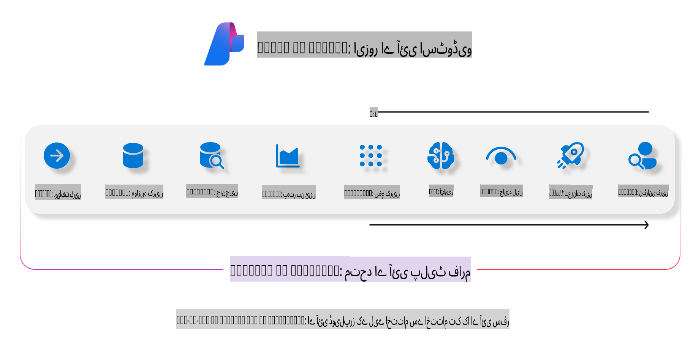
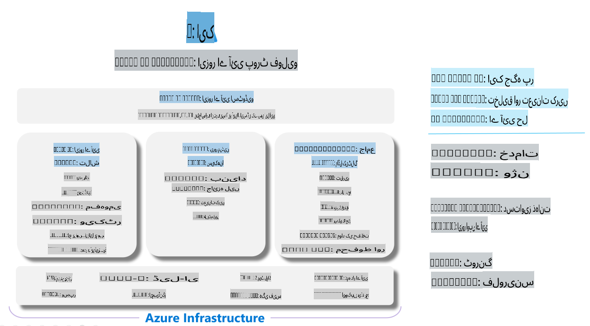

# **Azure AI Foundry کے ذریعے تجزیہ کرنا**

[Azure AI Foundry](https://ai.azure.com?WT.mc_id=aiml-138114-kinfeylo) کا استعمال کرتے ہوئے اپنی جنریٹیو AI ایپلیکیشن کا تجزیہ کیسے کریں۔ چاہے آپ سنگل ٹرن یا ملٹی ٹرن مکالمات کا جائزہ لے رہے ہوں، Azure AI Foundry ماڈل کی کارکردگی اور حفاظت کے تجزیے کے لیے ٹولز فراہم کرتا ہے۔

## Azure AI Foundry کے ساتھ جنریٹیو AI ایپس کا تجزیہ کیسے کریں
مزید تفصیلی ہدایات کے لیے [Azure AI Foundry Documentation](https://learn.microsoft.com/azure/ai-studio/how-to/evaluate-generative-ai-app?WT.mc_id=aiml-138114-kinfeylo) ملاحظہ کریں۔

یہاں آغاز کے لیے اقدامات دیے گئے ہیں:

## Azure AI Foundry میں جنریٹیو AI ماڈلز کا تجزیہ کرنا

**ضروریات**

- ایک ٹیسٹ ڈیٹاسیٹ جو CSV یا JSON فارمیٹ میں ہو۔
- ایک ڈپلائڈ جنریٹیو AI ماڈل (جیسے Phi-3, GPT 3.5, GPT 4، یا Davinci ماڈلز)۔
- تجزیہ چلانے کے لیے ایک رن ٹائم کے ساتھ کمپیوٹ انسٹینس۔

## بلٹ ان تجزیاتی میٹرکس

Azure AI Foundry آپ کو سنگل ٹرن اور پیچیدہ، ملٹی ٹرن مکالمات دونوں کا تجزیہ کرنے کی اجازت دیتا ہے۔  
Retrieval Augmented Generation (RAG) منظرناموں کے لیے، جہاں ماڈل مخصوص ڈیٹا پر مبنی ہوتا ہے، آپ کارکردگی کا تجزیہ بلٹ ان میٹرکس کے ذریعے کر سکتے ہیں۔  
اس کے علاوہ، آپ عمومی سنگل ٹرن سوال جواب کے منظرناموں (غیر-RAG) کا بھی تجزیہ کر سکتے ہیں۔

## تجزیاتی رن بنانا

Azure AI Foundry کے یوزر انٹرفیس سے Evaluate پیج یا Prompt Flow پیج پر جائیں۔  
تجزیاتی رن سیٹ اپ کرنے کے لیے تجزیاتی تخلیق وزرڈ کو فالو کریں۔ اپنے تجزیے کے لیے اختیاری نام فراہم کریں۔  
ایسا منظرنامہ منتخب کریں جو آپ کی ایپلیکیشن کے مقاصد سے ہم آہنگ ہو۔  
ماڈل کے آؤٹ پٹ کا جائزہ لینے کے لیے ایک یا زیادہ تجزیاتی میٹرکس منتخب کریں۔

## کسٹم تجزیاتی فلو (اختیاری)

زیادہ لچک کے لیے، آپ ایک کسٹم تجزیاتی فلو قائم کر سکتے ہیں۔ اپنے مخصوص تقاضوں کی بنیاد پر تجزیاتی عمل کو حسب ضرورت بنائیں۔

## نتائج دیکھنا

تجزیہ چلانے کے بعد، Azure AI Foundry میں تفصیلی تجزیاتی میٹرکس کو لاگ کریں، دیکھیں اور تجزیہ کریں۔  
اپنی ایپلیکیشن کی صلاحیتوں اور حدود کے بارے میں بصیرت حاصل کریں۔

**نوٹ** Azure AI Foundry فی الحال پبلک پریویو میں ہے، لہذا اسے تجربات اور ترقیاتی مقاصد کے لیے استعمال کریں۔ پروڈکشن ورک لوڈز کے لیے دیگر آپشنز پر غور کریں۔ مزید تفصیلات اور مرحلہ وار ہدایات کے لیے آفیشل [AI Foundry Documentation](https://learn.microsoft.com/azure/ai-studio/?WT.mc_id=aiml-138114-kinfeylo) کو ایکسپلور کریں۔

**ڈسکلیمر**:  
یہ دستاویز مشین پر مبنی اے آئی ترجمہ خدمات کا استعمال کرتے ہوئے ترجمہ کی گئی ہے۔ ہم درستگی کی بھرپور کوشش کرتے ہیں، لیکن براہ کرم آگاہ رہیں کہ خودکار ترجمے میں غلطیاں یا نقصانات ہوسکتے ہیں۔ اصل دستاویز کو اس کی اصل زبان میں مستند ذریعہ سمجھا جانا چاہیے۔ اہم معلومات کے لیے، پیشہ ور انسانی ترجمے کی سفارش کی جاتی ہے۔ ہم اس ترجمے کے استعمال سے پیدا ہونے والی کسی بھی غلط فہمی یا غلط تشریح کے ذمہ دار نہیں ہیں۔