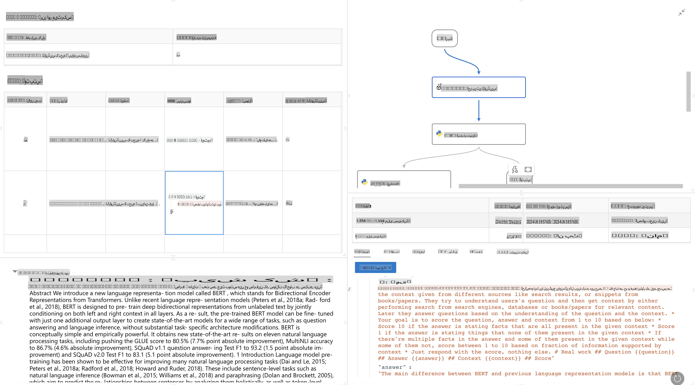

# **پرومپٹ فلو کا تعارف**

[Microsoft Prompt Flow](https://microsoft.github.io/promptflow/index.html?WT.mc_id=aiml-138114-kinfeylo) ایک بصری ورک فلو آٹومیشن ٹول ہے جو صارفین کو پہلے سے تیار کردہ ٹیمپلیٹس اور کسٹم کنیکٹرز کا استعمال کرتے ہوئے خودکار ورک فلو بنانے کی سہولت دیتا ہے۔ یہ ڈویلپرز اور بزنس اینالسٹس کو ڈیٹا مینجمنٹ، تعاون، اور پروسیس آپٹیمائزیشن جیسے کاموں کے لیے تیزی سے خودکار پروسیس بنانے میں مدد فراہم کرنے کے لیے ڈیزائن کیا گیا ہے۔ پرومپٹ فلو کے ذریعے، صارفین مختلف سروسز، ایپلیکیشنز، اور سسٹمز کو آسانی سے جوڑ سکتے ہیں اور پیچیدہ کاروباری عمل کو خودکار بنا سکتے ہیں۔

Microsoft Prompt Flow خاص طور پر بڑے زبان ماڈلز (LLMs) سے چلنے والی AI ایپلیکیشنز کے اختتام سے اختتام تک کے ترقیاتی سائیکل کو آسان بنانے کے لیے ڈیزائن کیا گیا ہے۔ چاہے آپ آئیڈیاز پر کام کر رہے ہوں، پروٹوٹائپ بنا رہے ہوں، ٹیسٹنگ کر رہے ہوں، تشخیص کر رہے ہوں، یا LLM ایپلیکیشنز کو ڈیپلائی کر رہے ہوں، پرومپٹ فلو اس عمل کو آسان بناتا ہے اور آپ کو پروڈکشن معیار کے ساتھ LLM ایپس بنانے کے قابل بناتا ہے۔

## Microsoft Prompt Flow استعمال کرنے کے اہم خصوصیات اور فوائد:

**انٹرایکٹو آتھرنگ کا تجربہ**

پرومپٹ فلو آپ کے فلو کی ساخت کی بصری نمائندگی فراہم کرتا ہے، جو آپ کے پروجیکٹس کو سمجھنے اور نیویگیٹ کرنے میں آسانی پیدا کرتا ہے۔
یہ ایک نوٹ بک جیسا کوڈنگ تجربہ فراہم کرتا ہے تاکہ فلو ڈیولپمنٹ اور ڈیبگنگ کو مؤثر بنایا جا سکے۔

**پرومپٹ ویریئنٹس اور ٹیوننگ**

متعدد پرومپٹ ویریئنٹس بنائیں اور ان کا موازنہ کریں تاکہ ایک تکراری بہتری کے عمل کو سہولت دی جا سکے۔ مختلف پرومپٹس کی کارکردگی کا جائزہ لیں اور سب سے مؤثر کا انتخاب کریں۔

**بلٹ ان ایویلیوایشن فلو**

بلٹ ان ایویلیوایشن ٹولز کا استعمال کرتے ہوئے اپنے پرومپٹس اور فلو کی کوالٹی اور افادیت کا جائزہ لیں۔
سمجھیں کہ آپ کی LLM بیسڈ ایپلیکیشنز کتنی مؤثر طریقے سے کام کر رہی ہیں۔

**جامع وسائل**

پرومپٹ فلو ایک بلٹ ان ٹولز، سیمپلز، اور ٹیمپلیٹس کی لائبریری شامل کرتا ہے۔ یہ وسائل ترقی کے لیے نقطہ آغاز فراہم کرتے ہیں، تخلیقی صلاحیت کو تحریک دیتے ہیں، اور عمل کو تیز کرتے ہیں۔

**تعاون اور انٹرپرائز ریڈی نیس**

ٹیم تعاون کو سپورٹ کریں، تاکہ متعدد صارفین پرومپٹ انجینئرنگ پروجیکٹس پر ایک ساتھ کام کر سکیں۔
ورژن کنٹرول کو برقرار رکھیں اور مؤثر طریقے سے علم کا اشتراک کریں۔ پورے پرومپٹ انجینئرنگ عمل کو ہموار کریں، ترقی اور تشخیص سے لے کر ڈیپلائمنٹ اور مانیٹرنگ تک۔

## پرومپٹ فلو میں ایویلیوایشن 

Microsoft Prompt Flow میں، ایویلیوایشن یہ جانچنے میں اہم کردار ادا کرتی ہے کہ آپ کے AI ماڈلز کتنے اچھے کام کر رہے ہیں۔ آئیے دیکھتے ہیں کہ آپ پرومپٹ فلو میں ایویلیوایشن فلو اور میٹرکس کو کس طرح اپنی مرضی کے مطابق بنا سکتے ہیں:

**پرومپٹ فلو میں ایویلیوایشن کو سمجھنا**

پرومپٹ فلو میں، ایک فلو ان پٹ کو پروسیس کرنے اور آؤٹ پٹ پیدا کرنے والے نوڈز کے ایک ترتیب کی نمائندگی کرتا ہے۔ ایویلیوایشن فلو خاص قسم کے فلو ہوتے ہیں جو مخصوص معیار اور اہداف کی بنیاد پر ایک رن کی کارکردگی کا جائزہ لینے کے لیے ڈیزائن کیے گئے ہیں۔

**ایویلیوایشن فلو کی اہم خصوصیات**

یہ عام طور پر ٹیسٹ کیے جانے والے فلو کے بعد چلتے ہیں، اور اس کے آؤٹ پٹ استعمال کرتے ہیں۔ یہ کارکردگی کو ماپنے کے لیے اسکور یا میٹرکس کا حساب لگاتے ہیں۔ میٹرکس میں ایکوریسی، ریلیونس اسکور، یا دیگر متعلقہ پیمائشیں شامل ہو سکتی ہیں۔

### ایویلیوایشن فلو کو اپنی مرضی کے مطابق بنانا

**ان پٹ کی تعریف**

ایویلیوایشن فلو کو ٹیسٹ کیے جانے والے رن کے آؤٹ پٹ لینے کی ضرورت ہوتی ہے۔ ان پٹ کو عام فلو کی طرح ہی ڈیفائن کریں۔
مثال کے طور پر، اگر آپ QnA فلو کا جائزہ لے رہے ہیں، تو ایک ان پٹ کو "جواب" کے طور پر نام دیں۔ اگر کسی کلاسیفیکیشن فلو کا جائزہ لے رہے ہیں، تو ایک ان پٹ کو "زمرہ" کے طور پر نام دیں۔ گراؤنڈ ٹروتھ ان پٹ (مثلاً، اصل لیبلز) کی بھی ضرورت ہو سکتی ہے۔

**آؤٹ پٹ اور میٹرکس**

ایویلیوایشن فلو ایسے نتائج پیدا کرتے ہیں جو ٹیسٹ کیے گئے فلو کی کارکردگی کو ماپتے ہیں۔ میٹرکس Python یا LLM (بڑے زبان ماڈلز) کا استعمال کرتے ہوئے حساب لگائے جا سکتے ہیں۔ متعلقہ میٹرکس کو لاگ کرنے کے لیے log_metric() فنکشن استعمال کریں۔

**اپنے مرضی کے مطابق ایویلیوایشن فلو کا استعمال**

اپنے خاص کاموں اور مقاصد کے مطابق اپنا ایویلیوایشن فلو تیار کریں۔ اپنے ایویلیوایشن اہداف کی بنیاد پر میٹرکس کو اپنی مرضی کے مطابق بنائیں۔
بڑے پیمانے پر ٹیسٹنگ کے لیے بیچ رنز پر اس اپنی مرضی کے مطابق ایویلیوایشن فلو کا اطلاق کریں۔

## بلٹ ان ایویلیوایشن طریقے

پرومپٹ فلو بلٹ ان ایویلیوایشن طریقے بھی فراہم کرتا ہے۔
آپ بیچ رنز سبمٹ کر سکتے ہیں اور ان طریقوں کا استعمال کرتے ہوئے دیکھ سکتے ہیں کہ آپ کا فلو بڑے ڈیٹاسیٹس کے ساتھ کتنا اچھا کام کرتا ہے۔
ایویلیوایشن کے نتائج دیکھیں، میٹرکس کا موازنہ کریں، اور ضرورت کے مطابق بہتری کریں۔
یاد رکھیں، ایویلیوایشن یہ یقینی بنانے کے لیے ضروری ہے کہ آپ کے AI ماڈلز مطلوبہ معیار اور اہداف پر پورا اترتے ہیں۔ Microsoft Prompt Flow میں ایویلیوایشن فلو تیار کرنے اور استعمال کرنے کے لیے تفصیلی ہدایات کے لیے آفیشل ڈاکیومنٹیشن کو دریافت کریں۔

خلاصہ یہ کہ Microsoft Prompt Flow ڈویلپرز کو پرومپٹ انجینئرنگ کو آسان بنا کر اور ایک مضبوط ترقیاتی ماحول فراہم کر کے اعلی معیار کی LLM ایپلیکیشنز بنانے کا اختیار دیتا ہے۔ اگر آپ LLMs کے ساتھ کام کر رہے ہیں، تو پرومپٹ فلو ایک قیمتی ٹول ہے جسے دریافت کیا جا سکتا ہے۔ Microsoft Prompt Flow میں ایویلیوایشن فلو تیار کرنے اور استعمال کرنے کے لیے تفصیلی ہدایات کے لیے [Prompt Flow Evaluation Documents](https://learn.microsoft.com/azure/machine-learning/prompt-flow/how-to-develop-an-evaluation-flow?view=azureml-api-2?WT.mc_id=aiml-138114-kinfeylo) کو دریافت کریں۔

**ڈسکلیمر**:  
یہ دستاویز مشین پر مبنی اے آئی ترجمہ سروسز کا استعمال کرتے ہوئے ترجمہ کی گئی ہے۔ اگرچہ ہم درستگی کے لیے کوشاں ہیں، لیکن براہ کرم نوٹ کریں کہ خودکار ترجمے میں غلطیاں یا عدم درستگی ہو سکتی ہیں۔ اصل دستاویز، جو اس کی مقامی زبان میں ہے، کو مستند ذریعہ سمجھا جانا چاہیے۔ اہم معلومات کے لیے، پیشہ ور انسانی ترجمہ کی سفارش کی جاتی ہے۔ ہم اس ترجمے کے استعمال سے پیدا ہونے والی کسی بھی غلط فہمی یا غلط تشریح کے ذمہ دار نہیں ہیں۔