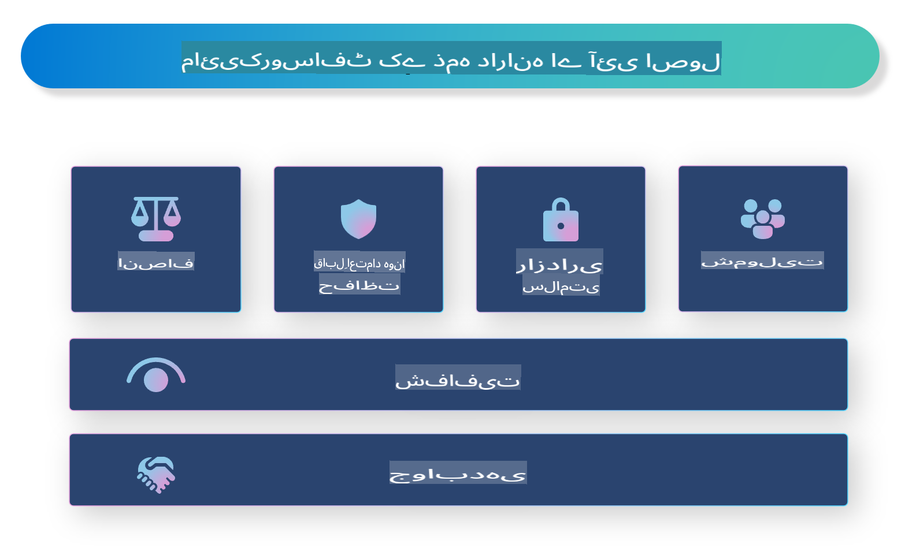

# **ذمہ دارانہ مصنوعی ذہانت کا تعارف**

[Microsoft Responsible AI](https://www.microsoft.com/ai/responsible-ai?WT.mc_id=aiml-138114-kinfeylo) ایک ایسا اقدام ہے جس کا مقصد ڈویلپرز اور تنظیموں کو ایسے AI سسٹمز بنانے میں مدد دینا ہے جو شفاف، قابل اعتماد، اور جوابدہ ہوں۔ یہ اقدام اخلاقی اصولوں جیسے پرائیویسی، انصاف، اور شفافیت کے ساتھ ہم آہنگ ذمہ دارانہ AI حل تیار کرنے کے لیے رہنمائی اور وسائل فراہم کرتا ہے۔ ہم ان چیلنجز اور بہترین طریقوں پر بھی بات کریں گے جو ذمہ دارانہ AI سسٹمز بنانے کے ساتھ جڑے ہوتے ہیں۔

## Microsoft Responsible AI کا جائزہ 

**اخلاقی اصول** 

Microsoft Responsible AI اخلاقی اصولوں جیسے پرائیویسی، انصاف، شفافیت، جوابدہی، اور تحفظ کی بنیاد پر کام کرتا ہے۔ یہ اصول اس بات کو یقینی بنانے کے لیے بنائے گئے ہیں کہ AI سسٹمز کو اخلاقی اور ذمہ دارانہ طریقے سے تیار کیا جائے۔

**شفاف AI**

Microsoft Responsible AI AI سسٹمز میں شفافیت کی اہمیت پر زور دیتا ہے۔ اس میں AI ماڈلز کے کام کرنے کے طریقے کی واضح وضاحت فراہم کرنا شامل ہے، اور ساتھ ہی ڈیٹا کے ذرائع اور الگورتھمز کو عوامی طور پر دستیاب بنانا بھی شامل ہے۔

**جوابدہ AI** 

[Microsoft Responsible AI](https://www.microsoft.com/ai/responsible-ai?WT.mc_id=aiml-138114-kinfeylo) ایسے جوابدہ AI سسٹمز کی ترقی کو فروغ دیتا ہے جو یہ بصیرت فراہم کر سکیں کہ AI ماڈلز کیسے فیصلے کرتے ہیں۔ اس سے صارفین کو AI سسٹمز کے نتائج کو سمجھنے اور ان پر اعتماد کرنے میں مدد مل سکتی ہے۔

**شمولیت** 

AI سسٹمز کو اس طرح ڈیزائن کیا جانا چاہیے کہ وہ سب کے لیے فائدہ مند ہوں۔ Microsoft کا مقصد ایسا شامل کرنے والا AI بنانا ہے جو مختلف نقطہ نظر کو مدنظر رکھے اور تعصب یا امتیاز سے گریز کرے۔

**قابل اعتماد اور محفوظ AI**

AI سسٹمز کا قابل اعتماد اور محفوظ ہونا ضروری ہے۔ Microsoft مضبوط ماڈلز بنانے پر توجہ دیتا ہے جو مستقل کارکردگی کا مظاہرہ کریں اور نقصان دہ نتائج سے بچیں۔

**AI میں انصاف** 

Microsoft Responsible AI اس حقیقت کو تسلیم کرتا ہے کہ اگر AI سسٹمز کو متعصب ڈیٹا یا الگورتھمز پر تربیت دی جائے تو وہ تعصبات کو بڑھا سکتے ہیں۔ یہ اقدام ایسے منصفانہ AI سسٹمز تیار کرنے کے لیے رہنمائی فراہم کرتا ہے جو نسل، جنس، یا عمر جیسے عوامل کی بنیاد پر امتیاز نہ کریں۔

**پرائیویسی اور سیکیورٹی** 

Microsoft Responsible AI AI سسٹمز میں صارف کی پرائیویسی اور ڈیٹا کی سیکیورٹی کے تحفظ کی اہمیت پر زور دیتا ہے۔ اس میں مضبوط ڈیٹا انکرپشن اور رسائی کنٹرولز کو نافذ کرنا، اور AI سسٹمز کو باقاعدگی سے خطرات کے لیے جانچنا شامل ہے۔

**جوابدہی اور ذمہ داری** 

Microsoft Responsible AI AI کی ترقی اور تعیناتی میں جوابدہی اور ذمہ داری کو فروغ دیتا ہے۔ اس میں یہ یقینی بنانا شامل ہے کہ ڈویلپرز اور تنظیمیں AI سسٹمز سے وابستہ ممکنہ خطرات سے آگاہ ہوں اور ان خطرات کو کم کرنے کے اقدامات کریں۔

## ذمہ دارانہ AI سسٹمز بنانے کے لیے بہترین طریقے

**متنوع ڈیٹا سیٹس کا استعمال کرتے ہوئے AI ماڈلز تیار کریں** 

AI سسٹمز میں تعصب سے بچنے کے لیے، یہ ضروری ہے کہ ایسے متنوع ڈیٹا سیٹس استعمال کیے جائیں جو مختلف نقطہ نظر اور تجربات کی نمائندگی کریں۔

**قابل وضاحت AI تکنیک استعمال کریں** 

قابل وضاحت AI تکنیک صارفین کو یہ سمجھنے میں مدد دے سکتی ہیں کہ AI ماڈلز کیسے فیصلے کرتے ہیں، جو نظام پر اعتماد بڑھا سکتی ہیں۔

**AI سسٹمز کو باقاعدگی سے خطرات کے لیے جانچیں** 

AI سسٹمز کی باقاعدہ جانچ ممکنہ خطرات اور کمزوریوں کی نشاندہی کرنے میں مدد دے سکتی ہے جنہیں حل کرنے کی ضرورت ہو۔

**مضبوط ڈیٹا انکرپشن اور رسائی کنٹرولز کو نافذ کریں** 

ڈیٹا انکرپشن اور رسائی کنٹرولز AI سسٹمز میں صارف کی پرائیویسی اور سیکیورٹی کے تحفظ میں مدد کر سکتے ہیں۔

**AI کی ترقی میں اخلاقی اصولوں کی پیروی کریں** 

انصاف، شفافیت، اور جوابدہی جیسے اخلاقی اصولوں کی پیروی AI سسٹمز میں اعتماد پیدا کرنے اور انہیں ذمہ دارانہ طریقے سے تیار کرنے میں مدد دے سکتی ہے۔

## ذمہ دارانہ AI کے لیے AI Foundry کا استعمال 

[Azure AI Foundry](https://ai.azure.com?WT.mc_id=aiml-138114-kinfeylo) ایک طاقتور پلیٹ فارم ہے جو ڈویلپرز اور تنظیموں کو تیزی سے ذہین، جدید، مارکیٹ کے لیے تیار، اور ذمہ دار ایپلیکیشنز بنانے کی اجازت دیتا ہے۔ Azure AI Foundry کی کچھ اہم خصوصیات اور صلاحیتیں درج ذیل ہیں:

**آؤٹ آف دی باکس APIs اور ماڈلز** 

Azure AI Foundry پہلے سے تیار شدہ اور حسب ضرورت APIs اور ماڈلز فراہم کرتا ہے۔ یہ AI کے کئی کاموں کا احاطہ کرتے ہیں، جن میں تخلیقی AI، گفتگو کے لیے قدرتی زبان کی پروسیسنگ، تلاش، نگرانی، ترجمہ، تقریر، بصارت، اور فیصلہ سازی شامل ہیں۔

**پرومپٹ فلو** 

Azure AI Foundry میں پرومپٹ فلو آپ کو گفتگو پر مبنی AI تجربات تخلیق کرنے کی اجازت دیتا ہے۔ یہ گفتگو کے بہاؤ کو ڈیزائن اور منظم کرنا آسان بناتا ہے، جس سے چیٹ بوٹس، ورچوئل اسسٹنٹس، اور دیگر انٹرایکٹو ایپلیکیشنز بنانا آسان ہو جاتا ہے۔

**ریٹریول آگمینٹڈ جنریشن (RAG)** 

RAG ایک تکنیک ہے جو ریٹریول پر مبنی اور جنریٹو پر مبنی طریقوں کو یکجا کرتی ہے۔ یہ پہلے سے موجود علم (ریٹریول) اور تخلیقی جنریشن (جنریشن) دونوں کا فائدہ اٹھا کر پیدا کردہ جوابات کے معیار کو بہتر بناتی ہے۔

**جنریٹو AI کے لیے جائزہ اور نگرانی کے میٹرکس** 

Azure AI Foundry جنریٹو AI ماڈلز کا جائزہ لینے اور ان کی نگرانی کے لیے ٹولز فراہم کرتا ہے۔ آپ ان کی کارکردگی، انصاف، اور دیگر اہم میٹرکس کا جائزہ لے سکتے ہیں تاکہ ذمہ دارانہ تعیناتی کو یقینی بنایا جا سکے۔ مزید برآں، اگر آپ نے ایک ڈیش بورڈ بنایا ہے، تو آپ Azure Machine Learning Studio میں بغیر کوڈ کے UI کا استعمال کرتے ہوئے ایک Responsible AI ڈیش بورڈ اور اس سے متعلقہ اسکور کارڈ کو اپنی مرضی کے مطابق بنا سکتے ہیں اور تیار کر سکتے ہیں، جو [Responsible AI Toolbox](https://responsibleaitoolbox.ai/?WT.mc_id=aiml-138114-kinfeylo) Python Libraries پر مبنی ہے۔ یہ اسکور کارڈ انصاف، فیچر کی اہمیت، اور دیگر ذمہ دارانہ تعیناتی کے تحفظات سے متعلق اہم بصیرتیں تکنیکی اور غیر تکنیکی اسٹیک ہولڈرز کے ساتھ شیئر کرنے میں مدد کرتا ہے۔

ذمہ دارانہ AI کے ساتھ AI Foundry استعمال کرنے کے لیے آپ ان بہترین طریقوں پر عمل کر سکتے ہیں:

**اپنے AI سسٹم کا مسئلہ اور مقاصد واضح کریں** 

ترقیاتی عمل شروع کرنے سے پہلے، یہ واضح طور پر بیان کرنا ضروری ہے کہ آپ کا AI سسٹم کون سا مسئلہ حل کرنا چاہتا ہے یا کون سا مقصد حاصل کرنا چاہتا ہے۔ یہ آپ کو مؤثر ماڈل بنانے کے لیے درکار ڈیٹا، الگورتھمز، اور وسائل کی نشاندہی کرنے میں مدد دے گا۔

**متعلقہ ڈیٹا جمع کریں اور اس کی تیاری کریں** 

AI سسٹم کی کارکردگی پر تربیتی ڈیٹا کے معیار اور مقدار کا نمایاں اثر ہو سکتا ہے۔ اس لیے متعلقہ ڈیٹا جمع کرنا، اسے صاف کرنا، اس کی تیاری کرنا، اور یہ یقینی بنانا ضروری ہے کہ یہ اس آبادی یا مسئلے کی نمائندگی کرتا ہو جسے آپ حل کرنا چاہتے ہیں۔

**مناسب جائزہ الگورتھم کا انتخاب کریں** 

مختلف جائزہ الگورتھمز دستیاب ہیں۔ یہ ضروری ہے کہ آپ اپنے ڈیٹا اور مسئلے کی بنیاد پر سب سے مناسب الگورتھم کا انتخاب کریں۔

**ماڈل کا جائزہ لیں اور اس کی وضاحت کریں** 

ایک بار جب آپ نے AI ماڈل بنا لیا، تو اس کی کارکردگی کو مناسب میٹرکس کے ذریعے جانچنا اور نتائج کو شفاف طریقے سے بیان کرنا ضروری ہے۔ یہ آپ کو ماڈل میں موجود کسی بھی تعصب یا حدود کی نشاندہی کرنے اور جہاں ضرورت ہو وہاں بہتری کرنے میں مدد دے گا۔

**شفافیت اور وضاحت کو یقینی بنائیں** 

AI سسٹمز کو شفاف اور قابل وضاحت ہونا چاہیے تاکہ صارفین یہ سمجھ سکیں کہ وہ کیسے کام کرتے ہیں اور فیصلے کیسے کیے جاتے ہیں۔ یہ خاص طور پر ان ایپلیکیشنز کے لیے اہم ہے جن کا انسانی زندگیوں پر نمایاں اثر پڑتا ہے، جیسے صحت، مالیات، اور قانونی نظام۔

**ماڈل کی نگرانی کریں اور اسے اپ ڈیٹ کریں** 

AI سسٹمز کو وقت کے ساتھ درست اور مؤثر رہنے کو یقینی بنانے کے لیے مسلسل نگرانی اور اپ ڈیٹ کیا جانا چاہیے۔ اس کے لیے ماڈل کی جاری دیکھ بھال، جانچ، اور دوبارہ تربیت کی ضرورت ہوتی ہے۔

آخر میں، Microsoft Responsible AI ایک ایسا اقدام ہے جس کا مقصد ڈویلپرز اور تنظیموں کو شفاف، قابل اعتماد، اور جوابدہ AI سسٹمز بنانے میں مدد دینا ہے۔ یاد رکھیں کہ ذمہ دارانہ AI کا نفاذ بہت اہم ہے، اور Azure AI Foundry تنظیموں کے لیے اسے عملی بنانے کا مقصد رکھتا ہے۔ اخلاقی اصولوں اور بہترین طریقوں پر عمل کرتے ہوئے، ہم یہ یقینی بنا سکتے ہیں کہ AI سسٹمز ذمہ دارانہ طریقے سے تیار اور تعینات کیے جائیں جو مجموعی طور پر معاشرے کے لیے فائدہ مند ہوں۔

**ڈسکلیمر**:  
یہ دستاویز مشین پر مبنی AI ترجمہ خدمات کا استعمال کرتے ہوئے ترجمہ کی گئی ہے۔ اگرچہ ہم درستگی کے لیے کوشاں ہیں، براہ کرم آگاہ رہیں کہ خودکار ترجمے میں غلطیاں یا نقائص ہو سکتے ہیں۔ اصل دستاویز کو اس کی اصل زبان میں مستند ذریعہ سمجھا جانا چاہیے۔ اہم معلومات کے لیے، پیشہ ور انسانی ترجمہ تجویز کیا جاتا ہے۔ ہم اس ترجمے کے استعمال سے پیدا ہونے والی کسی بھی غلط فہمی یا غلط تشریح کے ذمہ دار نہیں ہیں۔