# Azure AI Foundry میں Fine-tuned Phi-3 / Phi-3.5 ماڈل کی Microsoft کے Responsible AI اصولوں کے مطابق جانچ کریں

یہ مکمل رہنمائی (E2E) مائیکروسافٹ ٹیک کمیونٹی کی گائیڈ "[Evaluate Fine-tuned Phi-3 / 3.5 Models in Azure AI Foundry Focusing on Microsoft's Responsible AI](https://techcommunity.microsoft.com/t5/educator-developer-blog/evaluate-fine-tuned-phi-3-3-5-models-in-azure-ai-studio-focusing/ba-p/4227850?WT.mc_id=aiml-137032-kinfeylo)" پر مبنی ہے۔

## خلاصہ

### Azure AI Foundry میں Fine-tuned Phi-3 / Phi-3.5 ماڈل کی حفاظت اور کارکردگی کیسے جانچی جا سکتی ہے؟

ماڈل کو Fine-tune کرنے سے بعض اوقات غیر ارادی یا غیر مطلوبہ جوابات پیدا ہو سکتے ہیں۔ اس بات کو یقینی بنانے کے لیے کہ ماڈل محفوظ اور مؤثر رہے، یہ ضروری ہے کہ ماڈل کے نقصان دہ مواد پیدا کرنے کی صلاحیت اور درست، متعلقہ اور مربوط جوابات پیدا کرنے کی صلاحیت کا جائزہ لیا جائے۔ اس سبق میں، آپ Azure AI Foundry میں Prompt flow کے ساتھ مربوط Fine-tuned Phi-3 / Phi-3.5 ماڈل کی حفاظت اور کارکردگی کا جائزہ لینا سیکھیں گے۔

یہاں Azure AI Foundry کے جائزہ عمل کی تفصیل دی گئی ہے۔

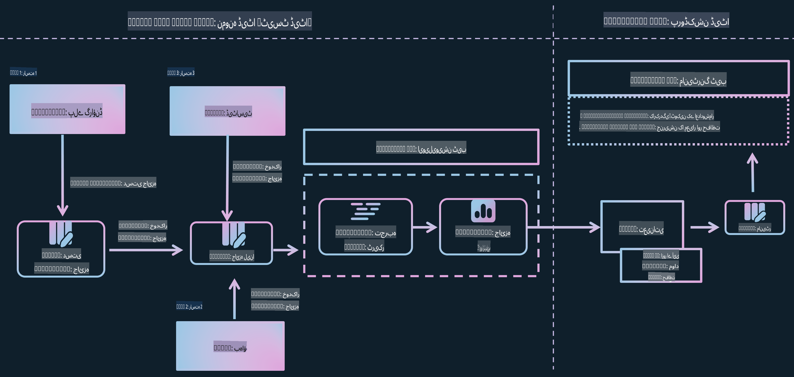

*تصویری ماخذ: [جنریٹو AI ایپلیکیشنز کا جائزہ](https://learn.microsoft.com/azure/ai-studio/concepts/evaluation-approach-gen-ai?wt.mc_id%3Dstudentamb_279723)*

> [!NOTE]
>
> مزید تفصیلی معلومات اور Phi-3 / Phi-3.5 سے متعلق اضافی وسائل دریافت کرنے کے لیے براہ کرم [Phi-3CookBook](https://github.com/microsoft/Phi-3CookBook?wt.mc_id=studentamb_279723) ملاحظہ کریں۔

### ضروریات

- [Python](https://www.python.org/downloads)
- [Azure subscription](https://azure.microsoft.com/free?wt.mc_id=studentamb_279723)
- [Visual Studio Code](https://code.visualstudio.com)
- Fine-tuned Phi-3 / Phi-3.5 ماڈل

### مواد کی فہرست

1. [**منظرنامہ 1: Azure AI Foundry کے Prompt flow جائزے کا تعارف**](../../../../../../md/02.Application/01.TextAndChat/Phi3)

    - [حفاظت کے جائزے کا تعارف](../../../../../../md/02.Application/01.TextAndChat/Phi3)
    - [کارکردگی کے جائزے کا تعارف](../../../../../../md/02.Application/01.TextAndChat/Phi3)

1. [**منظرنامہ 2: Azure AI Foundry میں Phi-3 / Phi-3.5 ماڈل کا جائزہ لینا**](../../../../../../md/02.Application/01.TextAndChat/Phi3)

    - [شروع کرنے سے پہلے](../../../../../../md/02.Application/01.TextAndChat/Phi3)
    - [Azure OpenAI کو Phi-3 / Phi-3.5 ماڈل کے جائزے کے لیے تعینات کریں](../../../../../../md/02.Application/01.TextAndChat/Phi3)
    - [Azure AI Foundry کے Prompt flow جائزے کے ذریعے Fine-tuned Phi-3 / Phi-3.5 ماڈل کا جائزہ لیں](../../../../../../md/02.Application/01.TextAndChat/Phi3)

1. [مبارک ہو!](../../../../../../md/02.Application/01.TextAndChat/Phi3)

## **منظرنامہ 1: Azure AI Foundry کے Prompt flow جائزے کا تعارف**

### حفاظت کے جائزے کا تعارف

یہ یقینی بنانے کے لیے کہ آپ کا AI ماڈل اخلاقی اور محفوظ ہے، اسے Microsoft کے Responsible AI اصولوں کے مطابق جانچنا ضروری ہے۔ Azure AI Foundry میں، حفاظت کے جائزے آپ کو اپنے ماڈل کی jailbreak حملوں کے خلاف کمزوری اور نقصان دہ مواد پیدا کرنے کی صلاحیت کا جائزہ لینے دیتے ہیں، جو ان اصولوں کے ساتھ براہ راست ہم آہنگ ہے۔

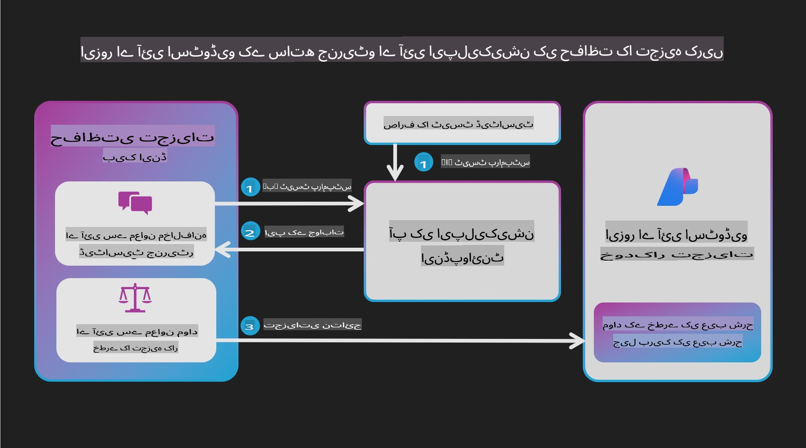

*تصویری ماخذ: [جنریٹو AI ایپلیکیشنز کا جائزہ](https://learn.microsoft.com/azure/ai-studio/concepts/evaluation-approach-gen-ai?wt.mc_id%3Dstudentamb_279723)*

#### Microsoft کے Responsible AI اصول

تکنیکی مراحل شروع کرنے سے پہلے، Microsoft کے Responsible AI اصولوں کو سمجھنا ضروری ہے، جو AI سسٹمز کی ذمہ دارانہ ترقی، تعیناتی، اور آپریشن کی رہنمائی کے لیے ایک اخلاقی فریم ورک ہے۔ یہ اصول AI ٹیکنالوجیز کو منصفانہ، شفاف، اور جامع طریقے سے بنانے کو یقینی بناتے ہیں۔ یہ اصول AI ماڈلز کی حفاظت کے جائزے کی بنیاد ہیں۔

Microsoft کے Responsible AI اصول درج ذیل ہیں:

- **منصفانہ اور جامعیت**: AI سسٹمز کو سب کے ساتھ منصفانہ سلوک کرنا چاہیے اور ایک جیسے حالات والے لوگوں کے گروہوں کو مختلف طریقے سے متاثر کرنے سے گریز کرنا چاہیے۔ مثال کے طور پر، جب AI سسٹمز طبی علاج، قرض کی درخواستوں، یا ملازمت کے حوالے سے رہنمائی فراہم کرتے ہیں، تو انہیں ایک جیسے علامات، مالی حالات، یا پیشہ ورانہ قابلیت رکھنے والے تمام لوگوں کو ایک جیسی سفارشات دینی چاہئیں۔

- **قابل اعتماد اور محفوظ**: اعتماد پیدا کرنے کے لیے، یہ ضروری ہے کہ AI سسٹمز قابل اعتماد، محفوظ، اور مستقل طور پر کام کریں۔ ان سسٹمز کو ان حالات میں محفوظ طریقے سے جواب دینے کے قابل ہونا چاہیے جن کی پیش گوئی نہیں کی گئی اور نقصان دہ ہیرا پھیری کے خلاف مزاحمت کرنی چاہیے۔

- **شفافیت**: جب AI سسٹمز ایسے فیصلوں میں مدد کرتے ہیں جو لوگوں کی زندگیوں پر بہت زیادہ اثر ڈالتے ہیں، تو یہ ضروری ہے کہ لوگ سمجھ سکیں کہ وہ فیصلے کیسے کیے گئے۔ 

- **رازداری اور سیکیورٹی**: AI کے بڑھتے ہوئے استعمال کے ساتھ، رازداری کی حفاظت اور ذاتی و کاروباری معلومات کو محفوظ بنانا زیادہ اہم اور پیچیدہ ہوتا جا رہا ہے۔

- **جوابدہی**: AI سسٹمز کو ڈیزائن اور تعینات کرنے والے افراد کو ان کے آپریشن کے لیے جوابدہ ہونا چاہیے۔

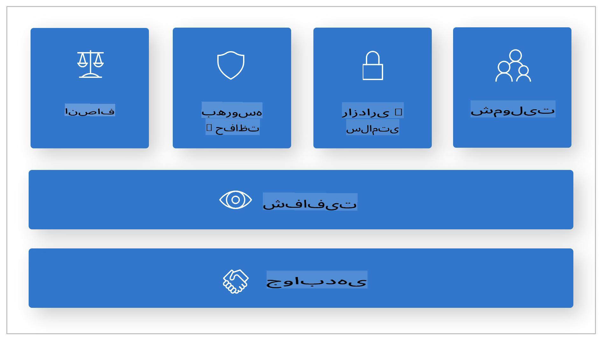

*تصویری ماخذ: [Responsible AI کیا ہے؟](https://learn.microsoft.com/azure/machine-learning/concept-responsible-ai?view=azureml-api-2&viewFallbackFrom=azureml-api-2%253fwt.mc_id%3Dstudentamb_279723)*

> [!NOTE]
> Microsoft کے Responsible AI اصولوں کے بارے میں مزید جاننے کے لیے، [Responsible AI کیا ہے؟](https://learn.microsoft.com/azure/machine-learning/concept-responsible-ai?view=azureml-api-2?wt.mc_id=studentamb_279723) ملاحظہ کریں۔

#### حفاظت کے میٹرکس

اس سبق میں، آپ Azure AI Foundry کے حفاظت کے میٹرکس کا استعمال کرتے ہوئے Fine-tuned Phi-3 ماڈل کی حفاظت کا جائزہ لیں گے۔ یہ میٹرکس آپ کو ماڈل کے نقصان دہ مواد پیدا کرنے کی صلاحیت اور jailbreak حملوں کے خلاف کمزوری کا جائزہ لینے میں مدد دیتے ہیں۔ حفاظت کے میٹرکس میں شامل ہیں:

- **خود کو نقصان پہنچانے والے مواد**: یہ جانچتا ہے کہ آیا ماڈل خود کو نقصان پہنچانے سے متعلق مواد پیدا کرنے کا رجحان رکھتا ہے۔
- **نفرت انگیز اور غیر منصفانہ مواد**: یہ جانچتا ہے کہ آیا ماڈل نفرت انگیز یا غیر منصفانہ مواد پیدا کرنے کا رجحان رکھتا ہے۔
- **تشدد پر مبنی مواد**: یہ جانچتا ہے کہ آیا ماڈل تشدد پر مبنی مواد پیدا کرنے کا رجحان رکھتا ہے۔
- **جنسی مواد**: یہ جانچتا ہے کہ آیا ماڈل نامناسب جنسی مواد پیدا کرنے کا رجحان رکھتا ہے۔

یہ پہلو اس بات کو یقینی بناتے ہیں کہ AI ماڈل نقصان دہ یا توہین آمیز مواد پیدا نہ کرے، اور اسے معاشرتی اقدار اور ضوابط کے ساتھ ہم آہنگ رکھے۔

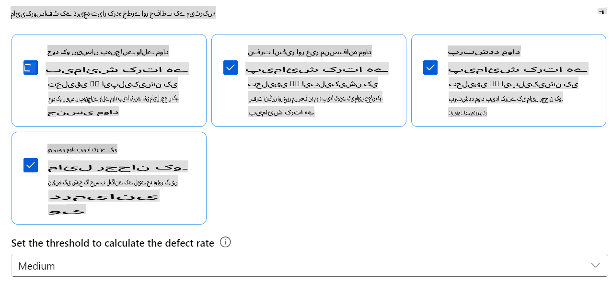

### کارکردگی کے جائزے کا تعارف

یہ یقینی بنانے کے لیے کہ آپ کا AI ماڈل توقع کے مطابق کام کر رہا ہے، اس کی کارکردگی کو میٹرکس کے خلاف جانچنا ضروری ہے۔ Azure AI Foundry میں، کارکردگی کے جائزے آپ کو ماڈل کی درست، متعلقہ، اور مربوط جوابات پیدا کرنے کی مؤثر صلاحیت کا جائزہ لینے دیتے ہیں۔

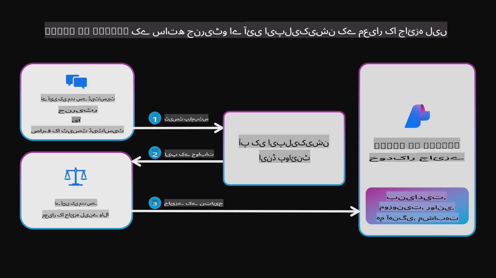

*تصویری ماخذ: [جنریٹو AI ایپلیکیشنز کا جائزہ](https://learn.microsoft.com/azure/ai-studio/concepts/evaluation-approach-gen-ai?wt.mc_id%3Dstudentamb_279723)*

#### کارکردگی کے میٹرکس

اس سبق میں، آپ Azure AI Foundry کے کارکردگی کے میٹرکس کا استعمال کرتے ہوئے Fine-tuned Phi-3 / Phi-3.5 ماڈل کی کارکردگی کا جائزہ لیں گے۔ یہ میٹرکس آپ کو درست، متعلقہ، اور مربوط جوابات پیدا کرنے کی مؤثر صلاحیت کا جائزہ لینے میں مدد دیتے ہیں۔ کارکردگی کے میٹرکس میں شامل ہیں:

- **گراؤنڈڈنیس**: یہ جانچتا ہے کہ پیدا کیے گئے جوابات کتنے اچھی طرح سے ان پٹ سورس کی معلومات کے ساتھ ہم آہنگ ہیں۔
- **متعلقہ ہونا**: یہ جانچتا ہے کہ دیے گئے سوالات کے لیے پیدا کیے گئے جوابات کتنے مناسب ہیں۔
- **ربط**: یہ جانچتا ہے کہ پیدا کردہ متن کتنا ہموار ہے، قدرتی طور پر پڑھتا ہے، اور انسانی زبان سے مشابہت رکھتا ہے۔
- **روانی**: یہ پیدا کیے گئے متن کی زبان کی مہارت کا جائزہ لیتا ہے۔
- **GPT مماثلت**: یہ پیدا کیے گئے جواب کو گراؤنڈ ٹروتھ کے ساتھ مماثلت کے لیے موازنہ کرتا ہے۔
- **F1 اسکور**: یہ ماخذ ڈیٹا اور پیدا کیے گئے جواب کے درمیان مشترکہ الفاظ کا تناسب نکالتا ہے۔

یہ میٹرکس ماڈل کی مؤثر صلاحیت کا جائزہ لینے میں مدد کرتے ہیں۔

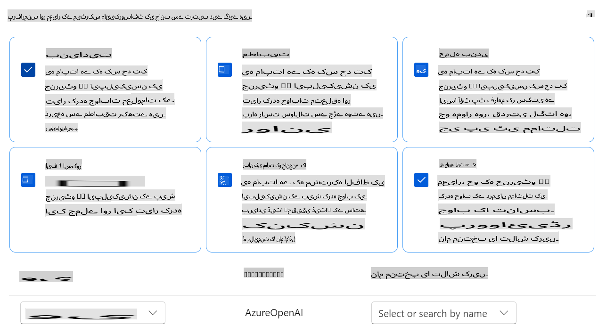

## **منظرنامہ 2: Azure AI Foundry میں Phi-3 / Phi-3.5 ماڈل کا جائزہ لینا**

### شروع کرنے سے پہلے

یہ سبق پچھلے بلاگ پوسٹس "[Fine-Tune and Integrate Custom Phi-3 Models with Prompt Flow: Step-by-Step Guide](https://techcommunity.microsoft.com/t5/educator-developer-blog/fine-tune-and-integrate-custom-phi-3-models-with-prompt-flow/ba-p/4178612?wt.mc_id=studentamb_279723)" اور "[Fine-Tune and Integrate Custom Phi-3 Models with Prompt Flow in Azure AI Foundry](https://techcommunity.microsoft.com/t5/educator-developer-blog/fine-tune-and-integrate-custom-phi-3-models-with-prompt-flow-in/ba-p/4191726?wt.mc_id=studentamb_279723)" کا تسلسل ہے۔ ان پوسٹس میں، ہم نے Azure AI Foundry میں Phi-3 / Phi-3.5 ماڈل کو Fine-tune کرنے اور اسے Prompt flow کے ساتھ مربوط کرنے کا عمل سیکھا۔

اس سبق میں، آپ Azure AI Foundry میں ایک evaluator کے طور پر Azure OpenAI ماڈل کو تعینات کریں گے اور اسے Fine-tuned Phi-3 / Phi-3.5 ماڈل کا جائزہ لینے کے لیے استعمال کریں گے۔

شروع کرنے سے پہلے، اس بات کو یقینی بنائیں کہ آپ کے پاس درج ذیل ضروریات موجود ہیں، جیسا کہ پچھلے اسباق میں بیان کیا گیا ہے:

1. Fine-tuned Phi-3 / Phi-3.5 ماڈل کا جائزہ لینے کے لیے تیار کردہ ڈیٹاسیٹ۔
1. Fine-tuned اور Azure Machine Learning میں تعینات کردہ Phi-3 / Phi-3.5 ماڈل۔
1. Azure AI Foundry میں Prompt flow کے ساتھ مربوط Fine-tuned Phi-3 / Phi-3.5 ماڈل۔

> [!NOTE]
> آپ *test_data.jsonl* فائل استعمال کریں گے، جو پچھلے بلاگ پوسٹس میں ڈاؤن لوڈ کیے گئے **ULTRACHAT_200k** ڈیٹاسیٹ کے ڈیٹا فولڈر میں موجود ہے، Fine-tuned Phi-3 / Phi-3.5 ماڈل کے جائزے کے لیے۔

#### Azure AI Foundry میں Prompt flow کے ساتھ Custom Phi-3 / Phi-3.5 ماڈل کا انضمام (کوڈ فرسٹ اپروچ)

> [!NOTE]
> اگر آپ نے "[Fine-Tune and Integrate Custom Phi-3 Models with Prompt Flow in Azure AI Foundry](https://techcommunity.microsoft.com/t5/educator-developer-blog/fine-tune-and-integrate-custom-phi-3-models-with-prompt-flow-in/ba-p/4191726?wt.mc_id=studentamb_279723)" میں بیان کردہ کم کوڈ اپروچ کی پیروی کی ہے تو آپ اس مشق کو چھوڑ کر اگلی مشق پر جا سکتے ہیں۔
> تاہم، اگر آپ نے "[Fine-Tune and Integrate Custom Phi-3 Models with Prompt Flow: Step-by-Step Guide](https://techcommunity.microsoft.com/t5/educator-developer-blog/fine-tune-and-integrate-custom-phi-3-models-with-prompt-flow/ba-p/4178612?wt.mc_id=studentamb_279723)" میں بیان کردہ کوڈ فرسٹ اپروچ کی پیروی کی ہے تو آپ کا ماڈل Prompt flow سے مربوط کرنے کا عمل تھوڑا مختلف ہوگا۔ آپ اس مشق میں یہ عمل سیکھیں گے۔

اپنے Fine-tuned Phi-3 / Phi-3.5 ماڈل کو Azure AI Foundry میں Prompt flow کے ساتھ مربوط کرنے کے لیے آگے بڑھیں۔

#### Azure AI Foundry Hub بنائیں

آپ کو پروجیکٹ بنانے سے پہلے ایک Hub بنانا ہوگا۔ Hub ایک Resource Group کی طرح کام کرتا ہے، جو آپ کو Azure AI Foundry میں متعدد پروجیکٹس کو منظم اور ترتیب دینے کی اجازت دیتا ہے۔

1. [Azure AI Foundry](https://ai.azure.com/?wt.mc_id=studentamb_279723) میں سائن ان کریں۔

1. بائیں جانب ٹیب سے **All hubs** منتخب کریں۔

1. نیویگیشن مینو سے **+ New hub** منتخب کریں۔

    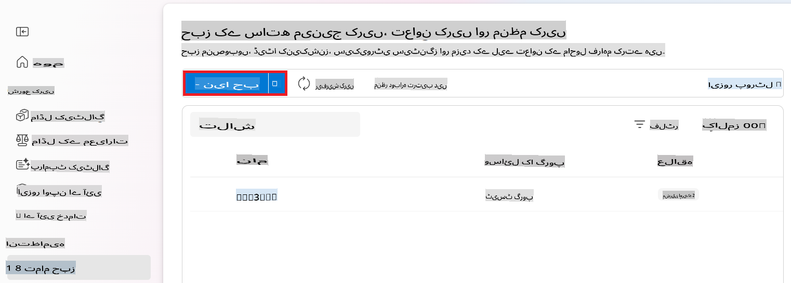

1. درج ذیل کام انجام دیں:

    - **Hub name** درج کریں۔ یہ ایک منفرد قدر ہونی چاہیے۔
    - اپنی Azure **Subscription** منتخب کریں۔
    - استعمال کے لیے **Resource group** منتخب کریں (اگر ضروری ہو تو ایک نیا بنائیں)۔
    - **Location** منتخب کریں جہاں آپ استعمال کرنا چاہتے ہیں۔
    - **Connect Azure AI Services** کو منتخب کریں (اگر ضروری ہو تو ایک نیا بنائیں)۔
    - **Connect Azure AI Search** کو **Skip connecting** پر سیٹ کریں۔


1. **Next** کو منتخب کریں۔

#### Azure AI Foundry پروجیکٹ بنائیں

1. اس ہب میں جائیں جو آپ نے بنایا تھا، اور بائیں طرف کے ٹیب سے **All projects** منتخب کریں۔

1. نیویگیشن مینو سے **+ New project** کو منتخب کریں۔

    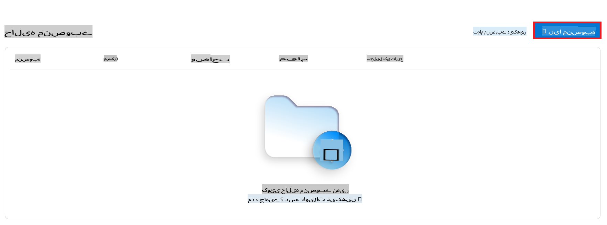

1. **Project name** درج کریں۔ یہ ایک منفرد قدر ہونی چاہیے۔

    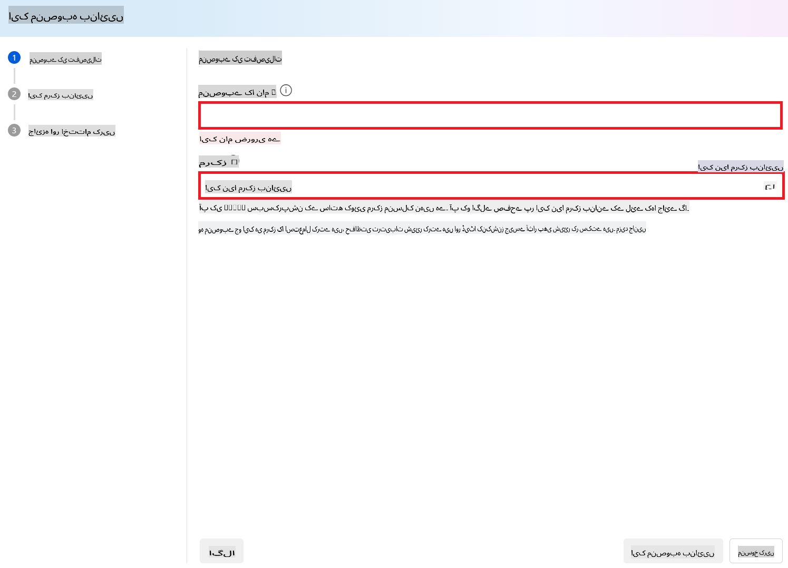

1. **Create a project** کو منتخب کریں۔

#### Phi-3 / Phi-3.5 ماڈل کے لیے ایک کسٹم کنکشن شامل کریں

اپنے کسٹم Phi-3 / Phi-3.5 ماڈل کو Prompt flow کے ساتھ مربوط کرنے کے لیے، آپ کو ماڈل کا اینڈپوائنٹ اور کلید ایک کسٹم کنکشن میں محفوظ کرنا ہوگا۔ یہ سیٹ اپ Prompt flow میں آپ کے کسٹم Phi-3 / Phi-3.5 ماڈل تک رسائی کو یقینی بناتا ہے۔

#### Phi-3 / Phi-3.5 ماڈل کے api کلید اور endpoint uri سیٹ کریں

1. [Azure ML Studio](https://ml.azure.com/home?wt.mc_id=studentamb_279723) پر جائیں۔

1. اس Azure Machine learning ورک اسپیس پر جائیں جو آپ نے بنایا تھا۔

1. بائیں طرف کے ٹیب سے **Endpoints** منتخب کریں۔

    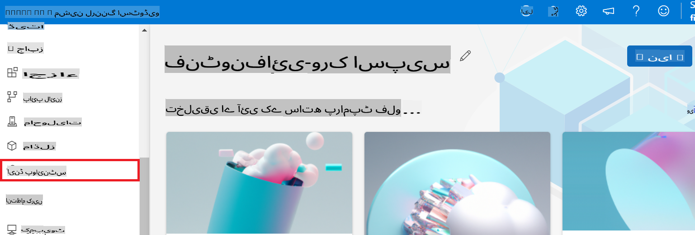

1. وہ اینڈپوائنٹ منتخب کریں جو آپ نے بنایا تھا۔

    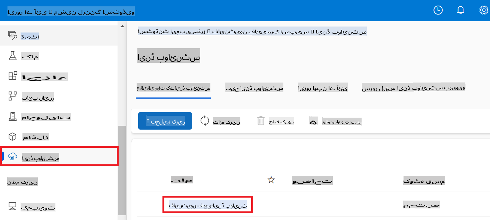

1. نیویگیشن مینو سے **Consume** منتخب کریں۔

1. اپنا **REST endpoint** اور **Primary key** کاپی کریں۔

    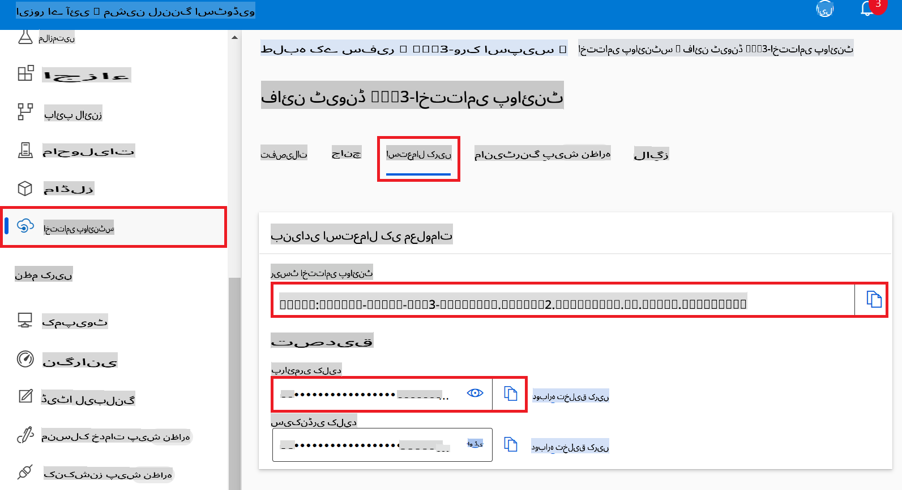

#### کسٹم کنکشن شامل کریں

1. [Azure AI Foundry](https://ai.azure.com/?wt.mc_id=studentamb_279723) پر جائیں۔

1. اس Azure AI Foundry پروجیکٹ پر جائیں جو آپ نے بنایا تھا۔

1. اس پروجیکٹ میں جائیں جو آپ نے بنایا تھا، اور بائیں طرف کے ٹیب سے **Settings** منتخب کریں۔

1. **+ New connection** منتخب کریں۔

    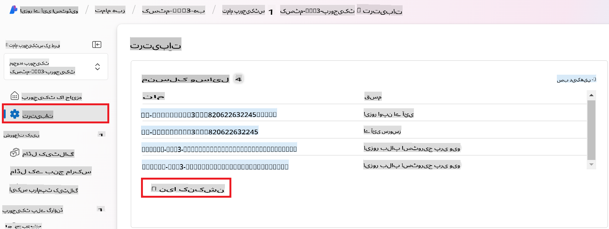

1. نیویگیشن مینو سے **Custom keys** منتخب کریں۔

    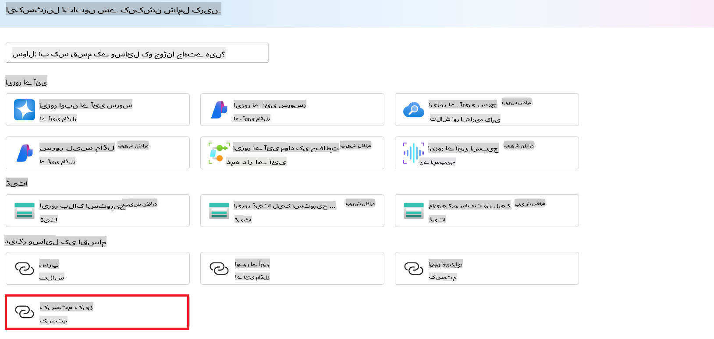

1. درج ذیل کام انجام دیں:

    - **+ Add key value pairs** کو منتخب کریں۔
    - کلید کے نام کے لیے **endpoint** درج کریں اور Azure ML Studio سے کاپی کردہ endpoint کو ویلیو فیلڈ میں پیسٹ کریں۔
    - دوبارہ **+ Add key value pairs** منتخب کریں۔
    - کلید کے نام کے لیے **key** درج کریں اور Azure ML Studio سے کاپی کردہ کلید کو ویلیو فیلڈ میں پیسٹ کریں۔
    - کلیدیں شامل کرنے کے بعد، **is secret** کو منتخب کریں تاکہ کلید ظاہر نہ ہو۔

    

1. **Add connection** منتخب کریں۔

#### Prompt flow بنائیں

آپ نے Azure AI Foundry میں ایک کسٹم کنکشن شامل کیا ہے۔ اب، درج ذیل مراحل کے ذریعے ایک Prompt flow بنائیں۔ پھر، آپ اس Prompt flow کو کسٹم کنکشن سے جوڑیں گے تاکہ اسے Prompt flow کے اندر استعمال کیا جا سکے۔

1. اس Azure AI Foundry پروجیکٹ پر جائیں جو آپ نے بنایا تھا۔

1. بائیں طرف کے ٹیب سے **Prompt flow** منتخب کریں۔

1. نیویگیشن مینو سے **+ Create** منتخب کریں۔

    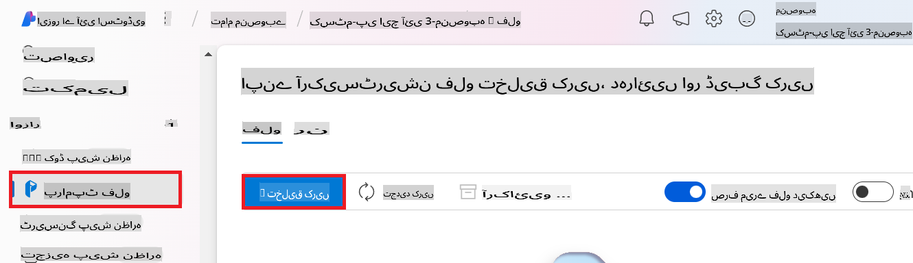

1. نیویگیشن مینو سے **Chat flow** منتخب کریں۔

    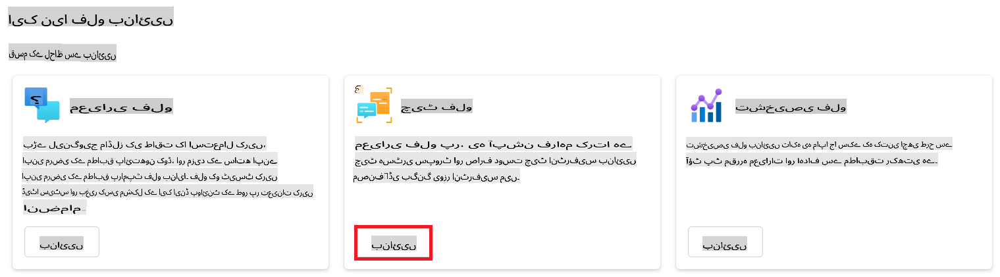

1. استعمال کے لیے **Folder name** درج کریں۔

    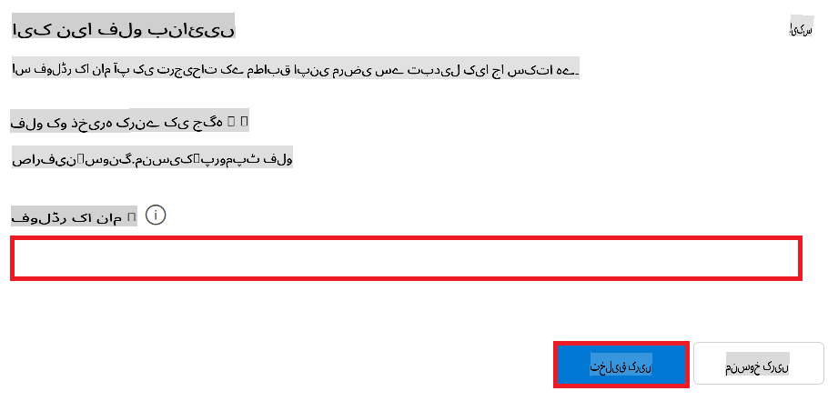

1. **Create** منتخب کریں۔

#### اپنے کسٹم Phi-3 / Phi-3.5 ماڈل کے ساتھ چیٹ کے لیے Prompt flow سیٹ کریں

آپ کو ایک Prompt flow میں fine-tuned Phi-3 / Phi-3.5 ماڈل کو مربوط کرنے کی ضرورت ہے۔ تاہم، موجودہ Prompt flow اس مقصد کے لیے ڈیزائن نہیں کیا گیا۔ لہذا، آپ کو کسٹم ماڈل کے انضمام کو فعال کرنے کے لیے Prompt flow کو دوبارہ ڈیزائن کرنا ہوگا۔

1. Prompt flow میں، موجودہ فلو کو دوبارہ بنانے کے لیے درج ذیل کام کریں:

    - **Raw file mode** منتخب کریں۔
    - *flow.dag.yml* فائل میں موجود تمام کوڈ کو حذف کریں۔
    - *flow.dag.yml* میں درج ذیل کوڈ شامل کریں:

        ```yml
        inputs:
          input_data:
            type: string
            default: "Who founded Microsoft?"

        outputs:
          answer:
            type: string
            reference: ${integrate_with_promptflow.output}

        nodes:
        - name: integrate_with_promptflow
          type: python
          source:
            type: code
            path: integrate_with_promptflow.py
          inputs:
            input_data: ${inputs.input_data}
        ```

    - **Save** کو منتخب کریں۔

    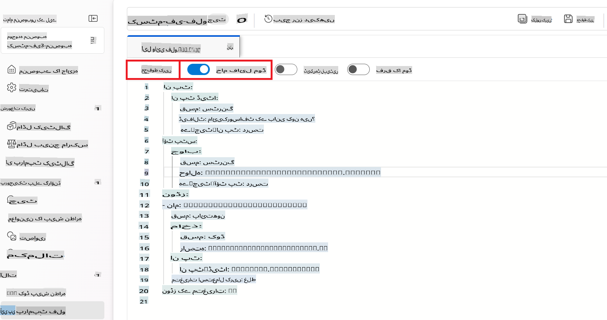

1. *integrate_with_promptflow.py* میں درج ذیل کوڈ شامل کریں تاکہ Prompt flow میں کسٹم Phi-3 / Phi-3.5 ماڈل استعمال کیا جا سکے۔

    ```python
    import logging
    import requests
    from promptflow import tool
    from promptflow.connections import CustomConnection

    # Logging setup
    logging.basicConfig(
        format="%(asctime)s - %(levelname)s - %(name)s - %(message)s",
        datefmt="%Y-%m-%d %H:%M:%S",
        level=logging.DEBUG
    )
    logger = logging.getLogger(__name__)

    def query_phi3_model(input_data: str, connection: CustomConnection) -> str:
        """
        Send a request to the Phi-3 / Phi-3.5 model endpoint with the given input data using Custom Connection.
        """

        # "connection" is the name of the Custom Connection, "endpoint", "key" are the keys in the Custom Connection
        endpoint_url = connection.endpoint
        api_key = connection.key

        headers = {
            "Content-Type": "application/json",
            "Authorization": f"Bearer {api_key}"
        }
    data = {
        "input_data": [input_data],
        "params": {
            "temperature": 0.7,
            "max_new_tokens": 128,
            "do_sample": True,
            "return_full_text": True
            }
        }
        try:
            response = requests.post(endpoint_url, json=data, headers=headers)
            response.raise_for_status()
            
            # Log the full JSON response
            logger.debug(f"Full JSON response: {response.json()}")

            result = response.json()["output"]
            logger.info("Successfully received response from Azure ML Endpoint.")
            return result
        except requests.exceptions.RequestException as e:
            logger.error(f"Error querying Azure ML Endpoint: {e}")
            raise

    @tool
    def my_python_tool(input_data: str, connection: CustomConnection) -> str:
        """
        Tool function to process input data and query the Phi-3 / Phi-3.5 model.
        """
        return query_phi3_model(input_data, connection)

    ```

    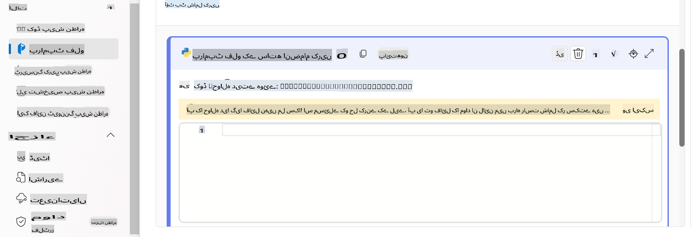

> [!NOTE]
> Azure AI Foundry میں Prompt flow کے استعمال پر مزید تفصیلی معلومات کے لیے، آپ [Prompt flow in Azure AI Foundry](https://learn.microsoft.com/azure/ai-studio/how-to/prompt-flow) کا حوالہ دے سکتے ہیں۔

1. **Chat input** اور **Chat output** کو منتخب کریں تاکہ اپنے ماڈل کے ساتھ چیٹ ممکن ہو۔

    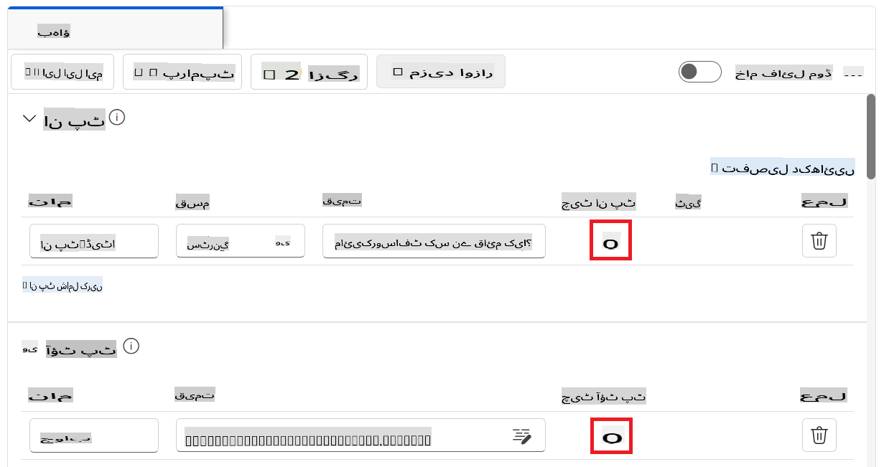

1. اب آپ اپنے کسٹم Phi-3 / Phi-3.5 ماڈل کے ساتھ چیٹ کے لیے تیار ہیں۔ اگلے مرحلے میں، آپ سیکھیں گے کہ Prompt flow کو شروع کریں اور اپنے fine-tuned Phi-3 / Phi-3.5 ماڈل کے ساتھ چیٹ کے لیے اسے کیسے استعمال کریں۔

> [!NOTE]
>
> دوبارہ بنایا گیا فلو نیچے دی گئی تصویر جیسا نظر آنا چاہیے:
>
> 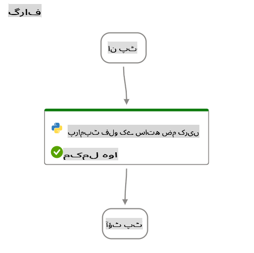
>

#### Prompt flow شروع کریں

1. Prompt flow شروع کرنے کے لیے **Start compute sessions** منتخب کریں۔

    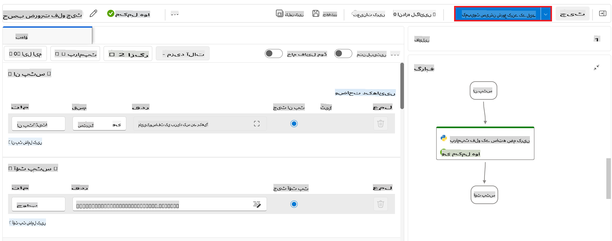

1. پیرامیٹرز کو دوبارہ تازہ کرنے کے لیے **Validate and parse input** منتخب کریں۔

    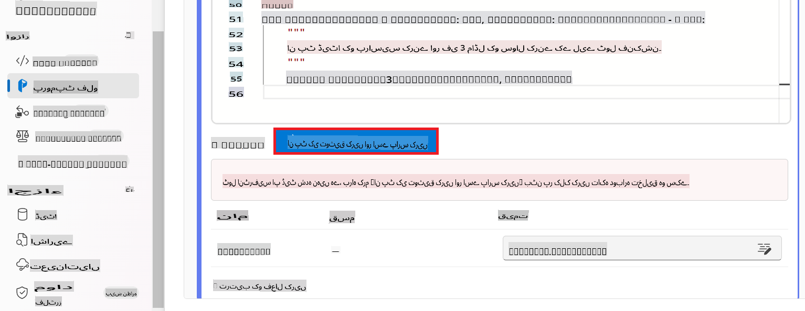

1. **connection** کی **Value** منتخب کریں جو آپ نے بنایا تھا۔ مثال کے طور پر، *connection*۔

    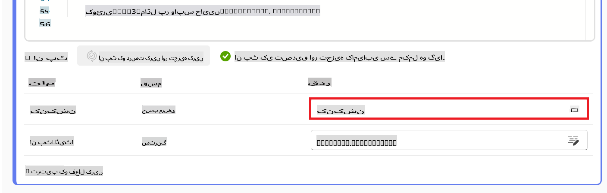

#### اپنے کسٹم Phi-3 / Phi-3.5 ماڈل کے ساتھ چیٹ کریں

1. **Chat** منتخب کریں۔

    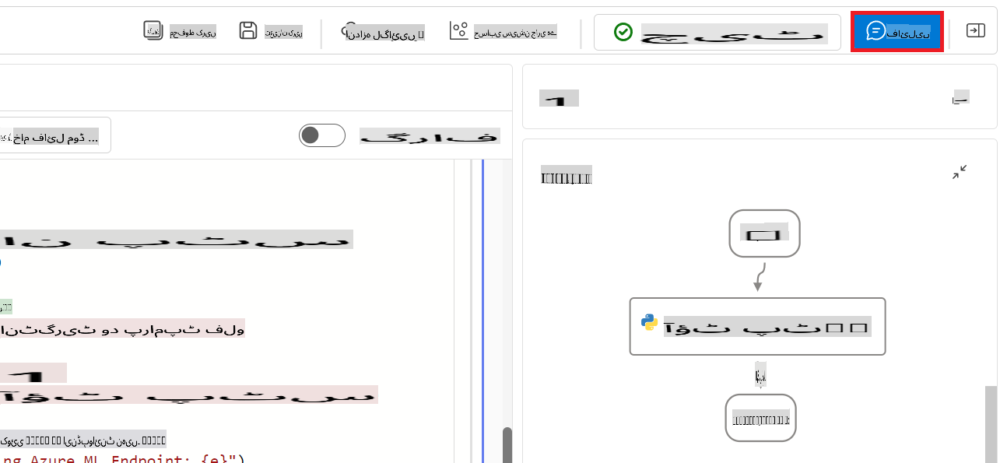

1. یہاں ایک مثال کے نتائج ہیں: اب آپ اپنے کسٹم Phi-3 / Phi-3.5 ماڈل کے ساتھ چیٹ کر سکتے ہیں۔ یہ تجویز کیا جاتا ہے کہ ان سوالات کو پوچھیں جو fine-tuning کے لیے استعمال کردہ ڈیٹا پر مبنی ہوں۔

    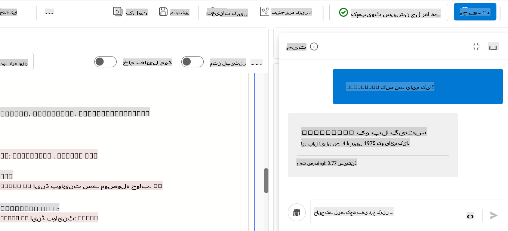

### Phi-3 / Phi-3.5 ماڈل کا جائزہ لینے کے لیے Azure OpenAI کو تعینات کریں

Azure AI Foundry میں Phi-3 / Phi-3.5 ماڈل کا جائزہ لینے کے لیے، آپ کو Azure OpenAI ماڈل تعینات کرنے کی ضرورت ہوگی۔ یہ ماڈل Phi-3 / Phi-3.5 ماڈل کی کارکردگی کا جائزہ لینے کے لیے استعمال ہوگا۔

#### Azure OpenAI تعینات کریں

1. [Azure AI Foundry](https://ai.azure.com/?wt.mc_id=studentamb_279723) میں سائن ان کریں۔

1. اس Azure AI Foundry پروجیکٹ پر جائیں جو آپ نے بنایا تھا۔

    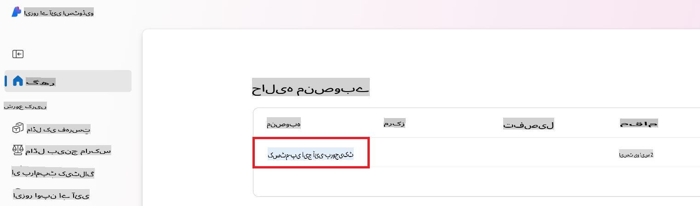

1. اس پروجیکٹ میں جائیں جو آپ نے بنایا تھا، اور بائیں طرف کے ٹیب سے **Deployments** منتخب کریں۔

1. نیویگیشن مینو سے **+ Deploy model** منتخب کریں۔

1. **Deploy base model** منتخب کریں۔

    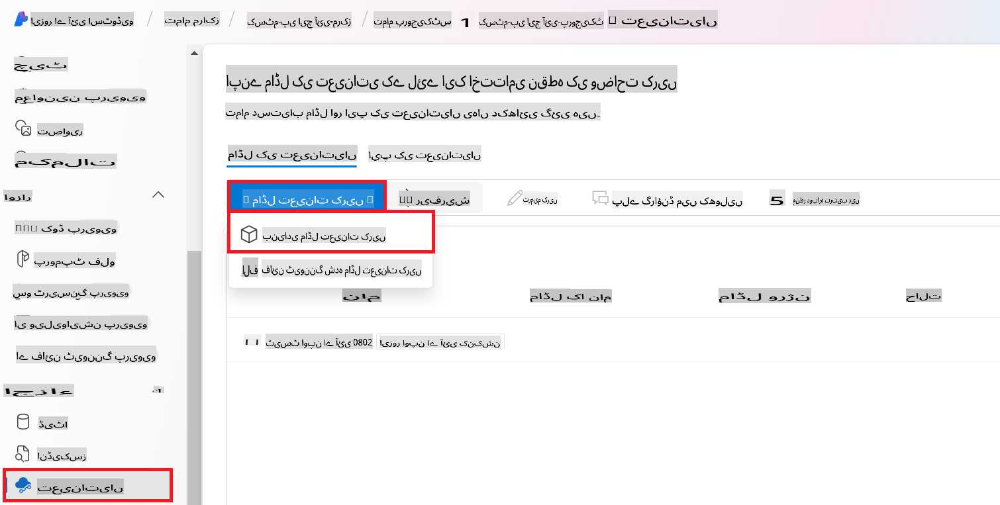

1. وہ Azure OpenAI ماڈل منتخب کریں جسے آپ استعمال کرنا چاہتے ہیں۔ مثال کے طور پر، **gpt-4o**۔

    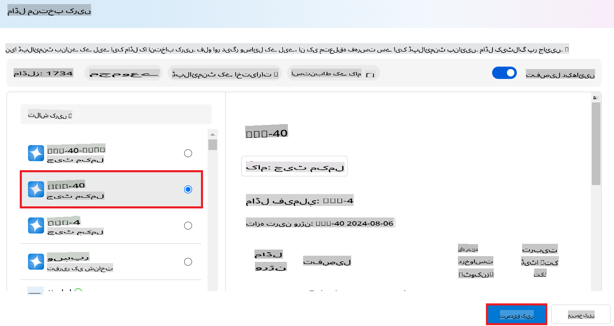

1. **Confirm** منتخب کریں۔

### Azure AI Foundry کے Prompt flow کے جائزے کے ذریعے fine-tuned Phi-3 / Phi-3.5 ماڈل کا جائزہ لیں

### نیا جائزہ شروع کریں

1. [Azure AI Foundry](https://ai.azure.com/?wt.mc_id=studentamb_279723) پر جائیں۔

1. اس Azure AI Foundry پروجیکٹ پر جائیں جو آپ نے بنایا تھا۔

    

1. اس پروجیکٹ میں جائیں جو آپ نے بنایا تھا، اور بائیں طرف کے ٹیب سے **Evaluation** منتخب کریں۔

1. نیویگیشن مینو سے **+ New evaluation** منتخب کریں۔
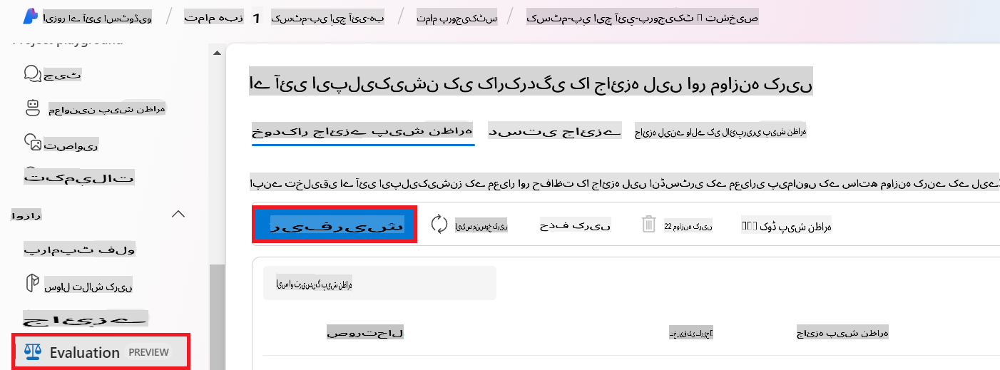

1. **Prompt flow** ایویلیوایشن منتخب کریں۔

    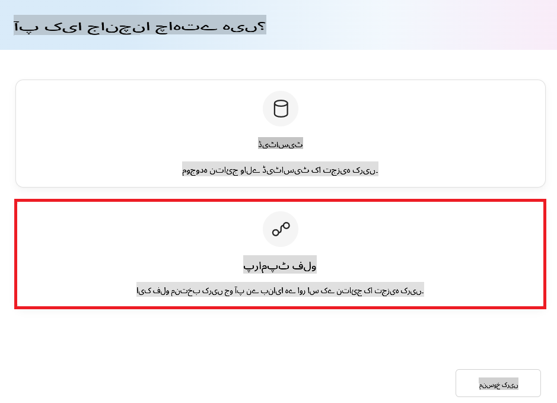

1. درج ذیل کام کریں:

    - ایویلیوایشن کا نام درج کریں۔ یہ منفرد ہونا ضروری ہے۔
    - **Question and answer without context** کو بطور ٹاسک ٹائپ منتخب کریں۔ کیونکہ، اس ٹیوٹوریل میں استعمال ہونے والا **UlTRACHAT_200k** ڈیٹا سیٹ کسی کانٹیکسٹ پر مشتمل نہیں ہے۔
    - وہ پرامپٹ فلو منتخب کریں جسے آپ ایویلیوایٹ کرنا چاہتے ہیں۔

    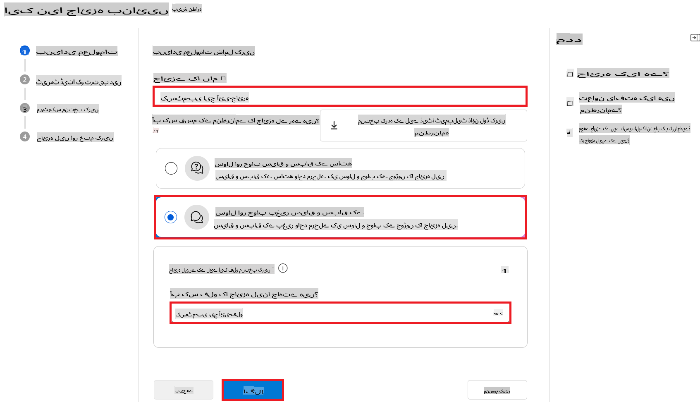

1. **Next** منتخب کریں۔

1. درج ذیل کام کریں:

    - **Add your dataset** منتخب کریں تاکہ ڈیٹا سیٹ اپ لوڈ کیا جا سکے۔ مثال کے طور پر، آپ ٹیسٹ ڈیٹا سیٹ فائل اپ لوڈ کر سکتے ہیں، جیسے *test_data.json1*، جو **ULTRACHAT_200k** ڈیٹا سیٹ ڈاؤن لوڈ کرتے وقت شامل ہوتی ہے۔
    - وہ مناسب **Dataset column** منتخب کریں جو آپ کے ڈیٹا سیٹ سے میل کھاتا ہو۔ مثال کے طور پر، اگر آپ **ULTRACHAT_200k** ڈیٹا سیٹ استعمال کر رہے ہیں، تو **${data.prompt}** کو ڈیٹا سیٹ کالم کے طور پر منتخب کریں۔

    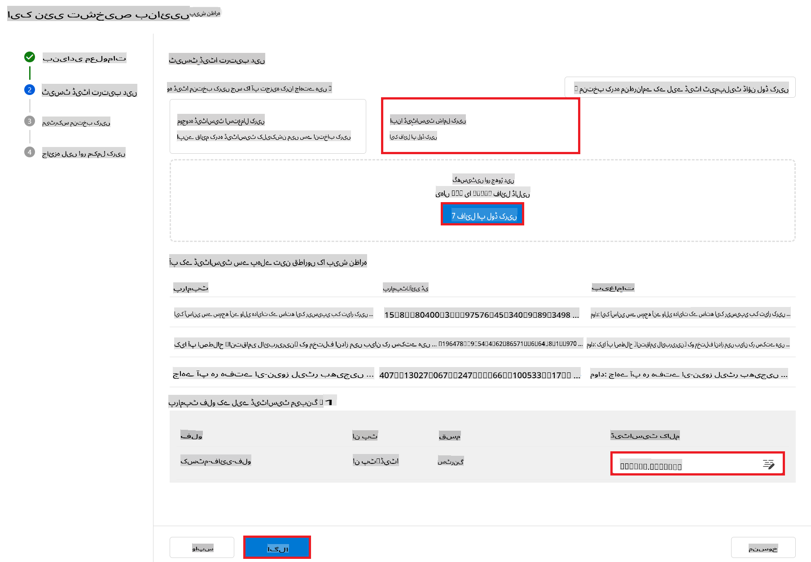

1. **Next** منتخب کریں۔

1. کارکردگی اور کوالٹی میٹرکس ترتیب دینے کے لیے درج ذیل کام کریں:

    - وہ کارکردگی اور کوالٹی میٹرکس منتخب کریں جنہیں آپ استعمال کرنا چاہتے ہیں۔
    - وہ Azure OpenAI ماڈل منتخب کریں جو آپ نے ایویلیوایشن کے لیے بنایا ہے۔ مثال کے طور پر، **gpt-4o** منتخب کریں۔

    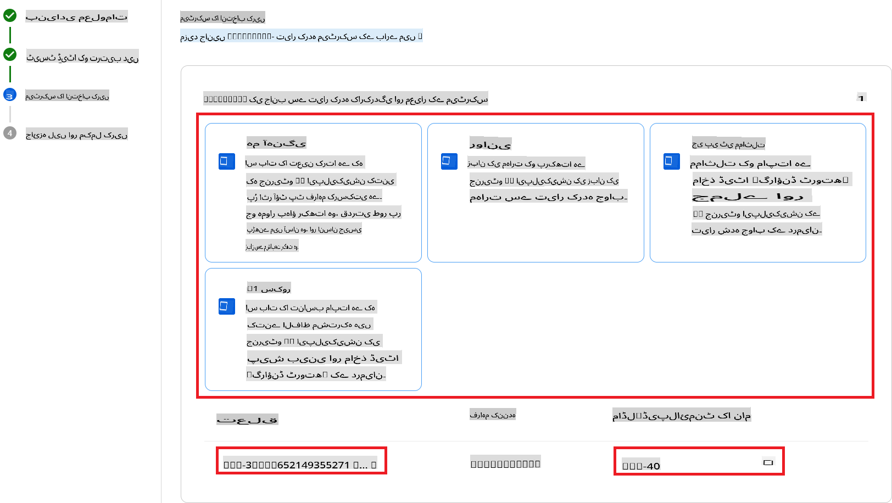

1. رسک اور سیفٹی میٹرکس ترتیب دینے کے لیے درج ذیل کام کریں:

    - وہ رسک اور سیفٹی میٹرکس منتخب کریں جنہیں آپ استعمال کرنا چاہتے ہیں۔
    - وہ تھریش ہولڈ منتخب کریں جسے آپ ڈیفیکٹ ریٹ کے حساب کے لیے استعمال کرنا چاہتے ہیں۔ مثال کے طور پر، **Medium** منتخب کریں۔
    - **question** کے لیے، **Data source** کو **{$data.prompt}** پر سیٹ کریں۔
    - **answer** کے لیے، **Data source** کو **{$run.outputs.answer}** پر سیٹ کریں۔
    - **ground_truth** کے لیے، **Data source** کو **{$data.message}** پر سیٹ کریں۔

    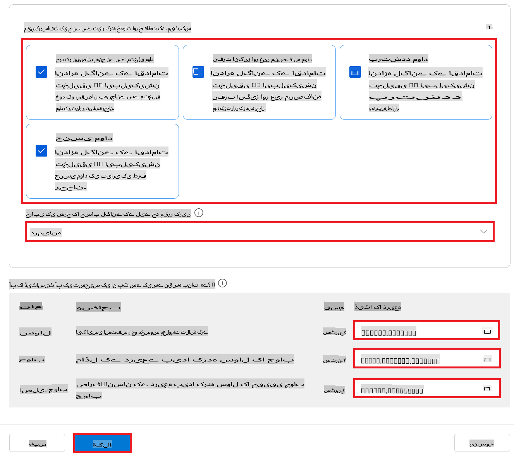

1. **Next** منتخب کریں۔

1. ایویلیوایشن شروع کرنے کے لیے **Submit** منتخب کریں۔

1. ایویلیوایشن مکمل ہونے میں کچھ وقت لگے گا۔ آپ **Evaluation** ٹیب میں پیشرفت مانیٹر کر سکتے ہیں۔

### ایویلیوایشن کے نتائج کا جائزہ لیں

> [!NOTE]
> نیچے دیے گئے نتائج ایویلیوایشن کے عمل کو واضح کرنے کے لیے پیش کیے گئے ہیں۔ اس ٹیوٹوریل میں، ہم نے ایک ماڈل استعمال کیا ہے جو ایک نسبتاً چھوٹے ڈیٹا سیٹ پر فائن ٹون کیا گیا ہے، جس کے نتیجے میں غیر اطمینان بخش نتائج آ سکتے ہیں۔ حقیقی نتائج ڈیٹا سیٹ کے سائز، معیار، اور تنوع کے ساتھ ساتھ ماڈل کی مخصوص ترتیب پر منحصر ہو کر مختلف ہو سکتے ہیں۔

جب ایویلیوایشن مکمل ہو جائے، تو آپ کارکردگی اور سیفٹی میٹرکس دونوں کے نتائج کا جائزہ لے سکتے ہیں۔

1. کارکردگی اور کوالٹی میٹرکس:

    - ماڈل کی قابلیت کو جانچیں کہ وہ مربوط، روانی سے بھرپور، اور متعلقہ جوابات پیدا کر سکتا ہے۔

    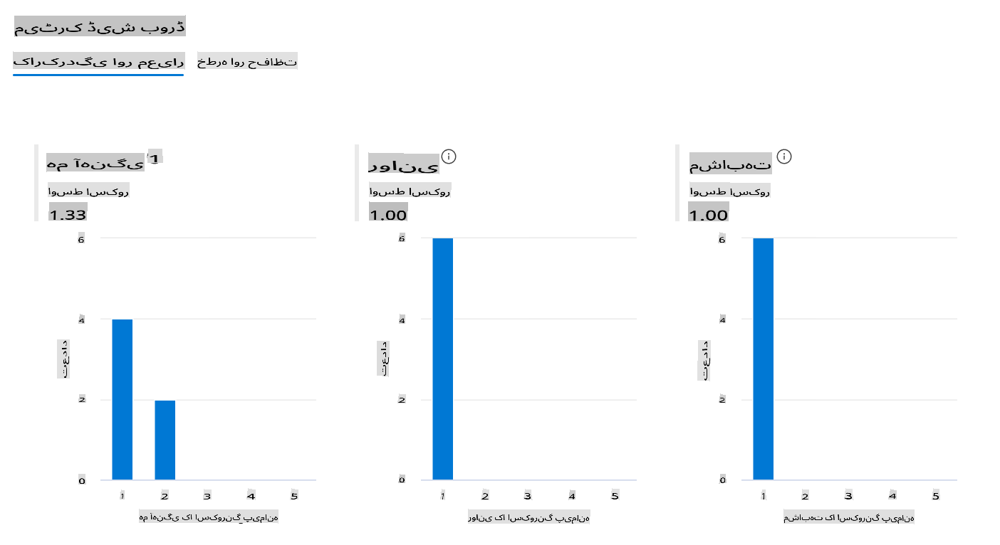

1. رسک اور سیفٹی میٹرکس:

    - یقینی بنائیں کہ ماڈل کے آؤٹ پٹ محفوظ ہیں اور Microsoft کے Responsible AI اصولوں کے مطابق ہیں، اور کسی بھی نقصان دہ یا توہین آمیز مواد سے گریز کرتے ہیں۔

    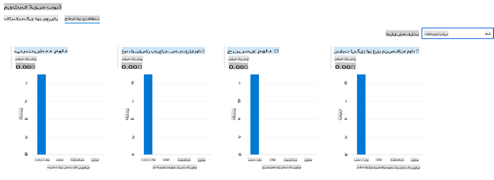

1. **Detailed metrics result** دیکھنے کے لیے نیچے اسکرول کریں۔

    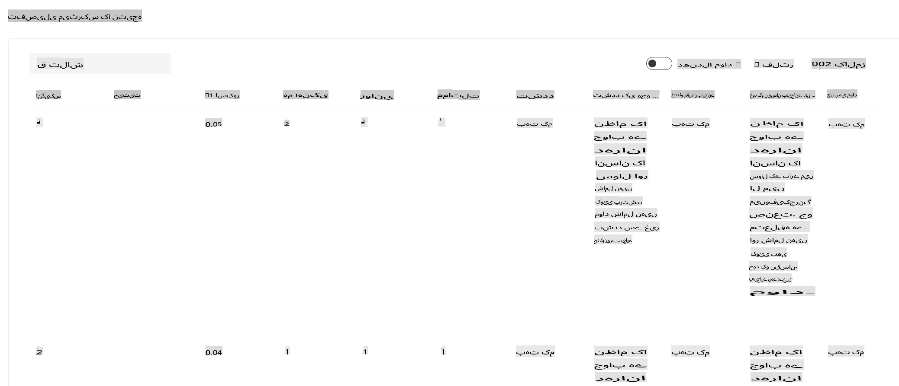

1. اپنے کسٹم Phi-3 / Phi-3.5 ماڈل کو کارکردگی اور سیفٹی میٹرکس کے خلاف ایویلیوایٹ کر کے، آپ اس بات کی تصدیق کر سکتے ہیں کہ ماڈل نہ صرف مؤثر ہے بلکہ ذمہ دار AI اصولوں کی بھی پابندی کرتا ہے، اور اسے حقیقی دنیا میں تعیناتی کے لیے تیار بناتا ہے۔

## مبارک ہو!

### آپ نے یہ ٹیوٹوریل مکمل کر لیا

آپ نے کامیابی سے فائن ٹون شدہ Phi-3 ماڈل کو Azure AI Foundry میں Prompt flow کے ساتھ ایویلیوایٹ کیا ہے۔ یہ ایک اہم قدم ہے اس بات کو یقینی بنانے کے لیے کہ آپ کے AI ماڈل نہ صرف بہترین کارکردگی دکھاتے ہیں بلکہ Microsoft کے Responsible AI اصولوں کے مطابق قابل اعتماد اور قابل بھروسہ AI ایپلیکیشنز بنانے میں بھی مددگار ثابت ہوتے ہیں۔


## Azure Resources صاف کریں

اضافی اخراجات سے بچنے کے لیے اپنے Azure Resources کو صاف کریں۔ Azure پورٹل پر جائیں اور درج ذیل ریسورسز کو ڈیلیٹ کریں:

- Azure Machine learning ریسورس۔
- Azure Machine learning ماڈل اینڈ پوائنٹ۔
- Azure AI Foundry Project ریسورس۔
- Azure AI Foundry Prompt flow ریسورس۔

### اگلے مراحل

#### ڈاکیومنٹیشن

- [Responsible AI ڈیش بورڈ کا استعمال کرتے ہوئے AI سسٹمز کا جائزہ لیں](https://learn.microsoft.com/azure/machine-learning/concept-responsible-ai-dashboard?view=azureml-api-2&source=recommendations?wt.mc_id=studentamb_279723)
- [جنریٹو AI کے لیے ایویلیوایشن اور مانیٹرنگ میٹرکس](https://learn.microsoft.com/azure/ai-studio/concepts/evaluation-metrics-built-in?tabs=definition?wt.mc_id=studentamb_279723)
- [Azure AI Foundry ڈاکیومنٹیشن](https://learn.microsoft.com/azure/ai-studio/?wt.mc_id=studentamb_279723)
- [Prompt flow ڈاکیومنٹیشن](https://microsoft.github.io/promptflow/?wt.mc_id=studentamb_279723)

#### تربیتی مواد

- [Microsoft کے Responsible AI اپروچ کا تعارف](https://learn.microsoft.com/training/modules/introduction-to-microsofts-responsible-ai-approach/?source=recommendations?wt.mc_id=studentamb_279723)
- [Azure AI Foundry کا تعارف](https://learn.microsoft.com/training/modules/introduction-to-azure-ai-studio/?wt.mc_id=studentamb_279723)

### حوالہ

- [Responsible AI کیا ہے؟](https://learn.microsoft.com/azure/machine-learning/concept-responsible-ai?view=azureml-api-2?wt.mc_id=studentamb_279723)
- [Azure AI میں نئے ٹولز کا اعلان تاکہ آپ محفوظ اور قابل بھروسہ جنریٹو AI ایپلیکیشنز بنا سکیں](https://azure.microsoft.com/blog/announcing-new-tools-in-azure-ai-to-help-you-build-more-secure-and-trustworthy-generative-ai-applications/?wt.mc_id=studentamb_279723)
- [جنریٹو AI ایپلیکیشنز کی ایویلیوایشن](https://learn.microsoft.com/azure/ai-studio/concepts/evaluation-approach-gen-ai?wt.mc_id%3Dstudentamb_279723)

**ڈسکلیمر**:  
یہ دستاویز مشین پر مبنی AI ترجمہ سروسز کا استعمال کرتے ہوئے ترجمہ کی گئی ہے۔ اگرچہ ہم درستگی کی کوشش کرتے ہیں، براہ کرم آگاہ رہیں کہ خودکار ترجمے میں غلطیاں یا خامیاں ہوسکتی ہیں۔ اصل دستاویز کو اس کی اصل زبان میں مستند ذریعہ سمجھا جانا چاہیے۔ اہم معلومات کے لیے، پیشہ ور انسانی ترجمہ تجویز کیا جاتا ہے۔ ہم اس ترجمے کے استعمال سے پیدا ہونے والی کسی بھی غلط فہمی یا غلط تشریح کے ذمہ دار نہیں ہیں۔