# اپنی مرضی کے Phi-3 ماڈلز کو فائن ٹیون اور Prompt Flow کے ساتھ ضم کریں

یہ اینڈ ٹو اینڈ (E2E) نمونہ Microsoft Tech Community کے گائیڈ "[Fine-Tune and Integrate Custom Phi-3 Models with Prompt Flow: Step-by-Step Guide](https://techcommunity.microsoft.com/t5/educator-developer-blog/fine-tune-and-integrate-custom-phi-3-models-with-prompt-flow/ba-p/4178612?WT.mc_id=aiml-137032-kinfeylo)" پر مبنی ہے۔ یہ گائیڈ Phi-3 ماڈلز کو فائن ٹیون کرنے، ڈپلائی کرنے اور Prompt Flow کے ساتھ ضم کرنے کے عمل کو متعارف کراتی ہے۔

## جائزہ

اس E2E نمونے میں، آپ سیکھیں گے کہ Phi-3 ماڈل کو کیسے فائن ٹیون کیا جائے اور اسے Prompt Flow کے ساتھ کیسے ضم کیا جائے۔ Azure Machine Learning اور Prompt Flow کا استعمال کرتے ہوئے، آپ ایک ورک فلو قائم کریں گے تاکہ اپنی مرضی کے AI ماڈلز کو ڈپلائی اور استعمال کیا جا سکے۔ یہ E2E نمونہ تین منظرناموں میں تقسیم ہے:

**منظرنامہ 1: Azure وسائل ترتیب دیں اور فائن ٹیوننگ کے لیے تیاری کریں**

**منظرنامہ 2: Phi-3 ماڈل کو فائن ٹیون کریں اور Azure Machine Learning Studio میں ڈپلائی کریں**

**منظرنامہ 3: Prompt Flow کے ساتھ ضم کریں اور اپنے مرضی کے ماڈل سے چیٹ کریں**

یہاں اس E2E نمونے کا ایک جائزہ ہے۔

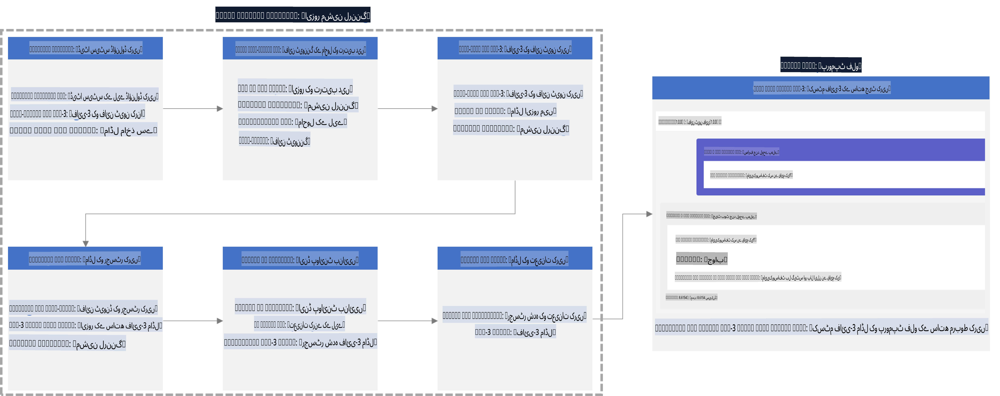

### مواد کی فہرست

1. **[منظرنامہ 1: Azure وسائل ترتیب دیں اور فائن ٹیوننگ کے لیے تیاری کریں](../../../../../../md/02.Application/01.TextAndChat/Phi3)**
    - [Azure Machine Learning Workspace بنائیں](../../../../../../md/02.Application/01.TextAndChat/Phi3)
    - [Azure Subscription میں GPU کوٹا کی درخواست کریں](../../../../../../md/02.Application/01.TextAndChat/Phi3)
    - [رول اسائنمنٹ شامل کریں](../../../../../../md/02.Application/01.TextAndChat/Phi3)
    - [پروجیکٹ ترتیب دیں](../../../../../../md/02.Application/01.TextAndChat/Phi3)
    - [فائن ٹیوننگ کے لیے ڈیٹا سیٹ تیار کریں](../../../../../../md/02.Application/01.TextAndChat/Phi3)

1. **[منظرنامہ 2: Phi-3 ماڈل کو فائن ٹیون کریں اور Azure Machine Learning Studio میں ڈپلائی کریں](../../../../../../md/02.Application/01.TextAndChat/Phi3)**
    - [Azure CLI ترتیب دیں](../../../../../../md/02.Application/01.TextAndChat/Phi3)
    - [Phi-3 ماڈل کو فائن ٹیون کریں](../../../../../../md/02.Application/01.TextAndChat/Phi3)
    - [فائن ٹیونڈ ماڈل ڈپلائی کریں](../../../../../../md/02.Application/01.TextAndChat/Phi3)

1. **[منظرنامہ 3: Prompt Flow کے ساتھ ضم کریں اور اپنے مرضی کے ماڈل سے چیٹ کریں](../../../../../../md/02.Application/01.TextAndChat/Phi3)**
    - [Prompt Flow کے ساتھ اپنی مرضی کے Phi-3 ماڈل کو ضم کریں](../../../../../../md/02.Application/01.TextAndChat/Phi3)
    - [اپنے مرضی کے ماڈل سے چیٹ کریں](../../../../../../md/02.Application/01.TextAndChat/Phi3)

## منظرنامہ 1: Azure وسائل ترتیب دیں اور فائن ٹیوننگ کے لیے تیاری کریں

### Azure Machine Learning Workspace بنائیں

1. **پورٹل صفحے** کے اوپر سرچ بار میں *azure machine learning* ٹائپ کریں اور ظاہر ہونے والے اختیارات میں سے **Azure Machine Learning** منتخب کریں۔

    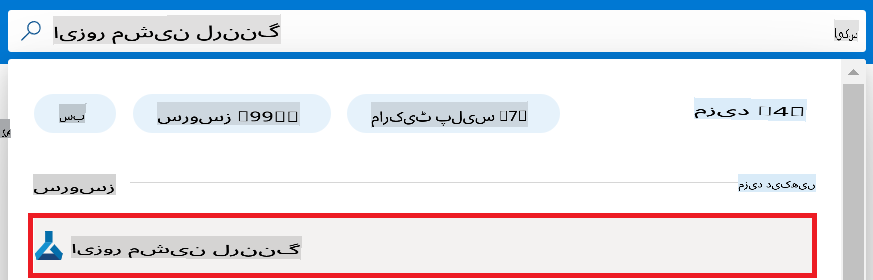

1. نیویگیشن مینو سے **+ Create** منتخب کریں۔

1. نیویگیشن مینو سے **New workspace** منتخب کریں۔

    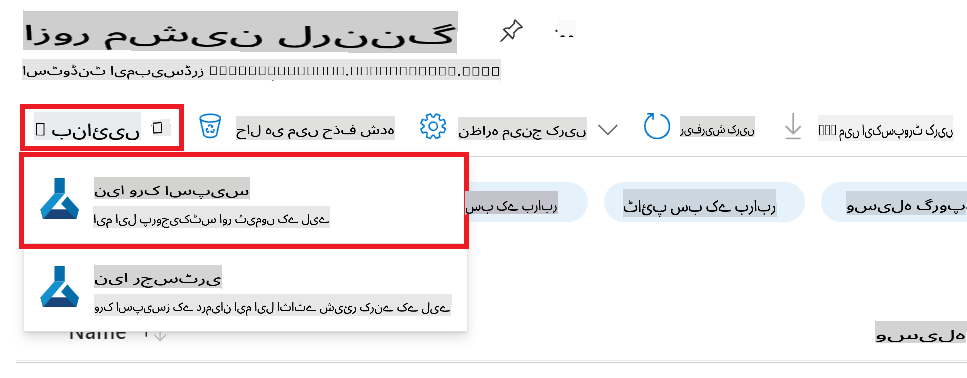

1. درج ذیل کام انجام دیں:

    - اپنی Azure **Subscription** منتخب کریں۔
    - استعمال کے لیے **Resource group** منتخب کریں (ضرورت پڑنے پر نیا بنائیں)۔
    - **Workspace Name** درج کریں۔ یہ ایک منفرد قدر ہونی چاہیے۔
    - وہ **Region** منتخب کریں جسے آپ استعمال کرنا چاہتے ہیں۔
    - استعمال کے لیے **Storage account** منتخب کریں (ضرورت پڑنے پر نیا بنائیں)۔
    - استعمال کے لیے **Key vault** منتخب کریں (ضرورت پڑنے پر نیا بنائیں)۔
    - استعمال کے لیے **Application insights** منتخب کریں (ضرورت پڑنے پر نیا بنائیں)۔
    - استعمال کے لیے **Container registry** منتخب کریں (ضرورت پڑنے پر نیا بنائیں)۔

    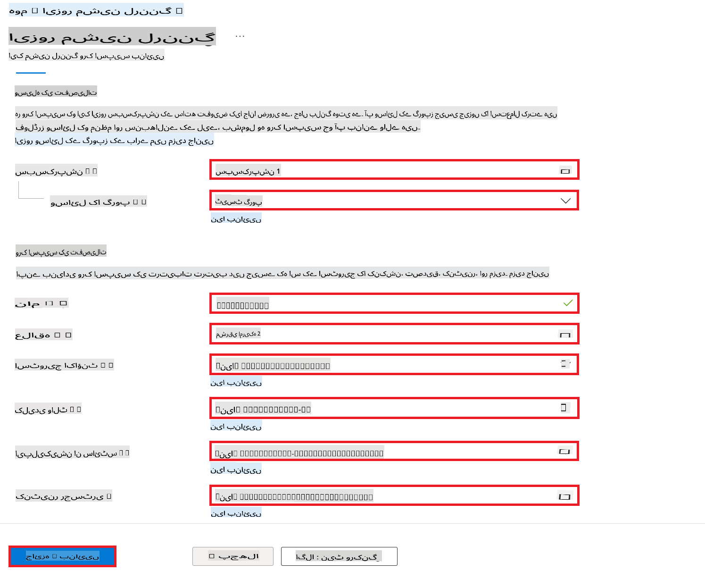

1. **Review + Create** منتخب کریں۔

1. **Create** منتخب کریں۔

### Azure Subscription میں GPU کوٹا کی درخواست کریں

اس E2E نمونے میں، آپ *Standard_NC24ads_A100_v4 GPU* فائن ٹیوننگ کے لیے استعمال کریں گے، جس کے لیے کوٹا درخواست درکار ہے، اور *Standard_E4s_v3* CPU ڈپلائیمنٹ کے لیے استعمال کریں گے، جس کے لیے کوٹا درخواست درکار نہیں۔

> [!NOTE]
>
> صرف Pay-As-You-Go سبسکرپشنز (معیاری سبسکرپشن کی قسم) GPU الاٹمنٹ کے لیے اہل ہیں؛ بینیفٹ سبسکرپشنز فی الحال معاون نہیں ہیں۔
>
> بینیفٹ سبسکرپشنز استعمال کرنے والے یا فائن ٹیوننگ اور ڈپلائیمنٹ کے عمل کو تیزی سے جانچنے کے خواہشمند افراد کے لیے، یہ ٹیوٹوریل ایک کم سے کم ڈیٹا سیٹ کے ساتھ CPU پر فائن ٹیوننگ کے لیے رہنمائی بھی فراہم کرتا ہے۔ تاہم، یہ نوٹ کرنا ضروری ہے کہ فائن ٹیوننگ کے نتائج بڑے ڈیٹا سیٹس کے ساتھ GPU استعمال کرنے پر نمایاں طور پر بہتر ہوتے ہیں۔

1. [Azure ML Studio](https://ml.azure.com/home?wt.mc_id=studentamb_279723) پر جائیں۔

1. *Standard NCADSA100v4 Family* کوٹا کی درخواست کرنے کے لیے درج ذیل کام کریں:

    - بائیں جانب کے ٹیب سے **Quota** منتخب کریں۔
    - استعمال کے لیے **Virtual machine family** منتخب کریں۔ مثال کے طور پر، **Standard NCADSA100v4 Family Cluster Dedicated vCPUs** منتخب کریں، جس میں *Standard_NC24ads_A100_v4* GPU شامل ہے۔
    - نیویگیشن مینو سے **Request quota** منتخب کریں۔

        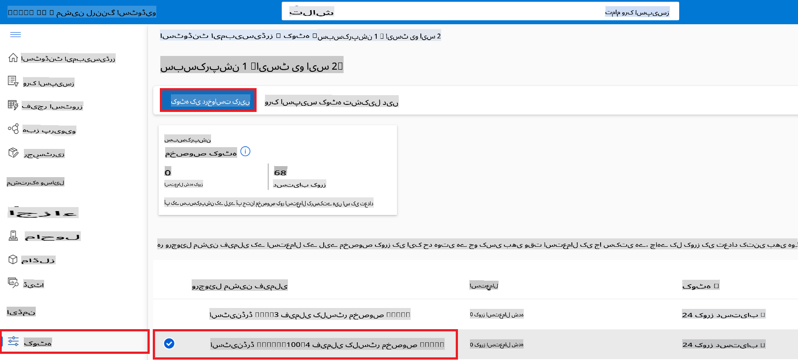

    - Request quota صفحے کے اندر، وہ **New cores limit** درج کریں جو آپ استعمال کرنا چاہتے ہیں۔ مثال کے طور پر، 24۔
    - Request quota صفحے کے اندر، GPU کوٹا کی درخواست کرنے کے لیے **Submit** منتخب کریں۔

> [!NOTE]
> آپ اپنے ضرورت کے مطابق مناسب GPU یا CPU کا انتخاب [Sizes for Virtual Machines in Azure](https://learn.microsoft.com/azure/virtual-machines/sizes/overview?tabs=breakdownseries%2Cgeneralsizelist%2Ccomputesizelist%2Cmemorysizelist%2Cstoragesizelist%2Cgpusizelist%2Cfpgasizelist%2Chpcsizelist) دستاویز کا حوالہ دے کر کر سکتے ہیں۔

### رول اسائنمنٹ شامل کریں

اپنے ماڈلز کو فائن ٹیون اور ڈپلائی کرنے کے لیے، آپ کو پہلے ایک User Assigned Managed Identity (UAI) بنانی ہوگی اور اسے مناسب اجازتیں تفویض کرنی ہوں گی۔ یہ UAI ڈپلائیمنٹ کے دوران توثیق کے لیے استعمال ہوگی۔

#### User Assigned Managed Identity (UAI) بنائیں

1. **پورٹل صفحے** کے اوپر سرچ بار میں *managed identities* ٹائپ کریں اور ظاہر ہونے والے اختیارات میں سے **Managed Identities** منتخب کریں۔

    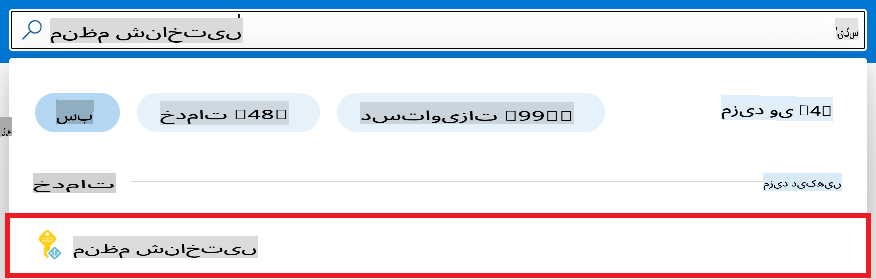

1. **+ Create** منتخب کریں۔

    

1. درج ذیل کام انجام دیں:

    - اپنی Azure **Subscription** منتخب کریں۔
    - استعمال کے لیے **Resource group** منتخب کریں (ضرورت پڑنے پر نیا بنائیں)۔
    - وہ **Region** منتخب کریں جسے آپ استعمال کرنا چاہتے ہیں۔
    - **Name** درج کریں۔ یہ ایک منفرد قدر ہونی چاہیے۔

1. **Review + create** منتخب کریں۔

1. **+ Create** منتخب کریں۔

#### Managed Identity کو Contributor رول اسائنمنٹ شامل کریں

1. اس Managed Identity ریسورس پر جائیں جو آپ نے بنایا ہے۔

1. بائیں جانب کے ٹیب سے **Azure role assignments** منتخب کریں۔

1. نیویگیشن مینو سے **+Add role assignment** منتخب کریں۔

1. Add role assignment صفحے کے اندر، درج ذیل کام انجام دیں:
    - **Scope** کو **Resource group** پر سیٹ کریں۔
    - اپنی Azure **Subscription** منتخب کریں۔
    - استعمال کے لیے **Resource group** منتخب کریں۔
    - **Role** کو **Contributor** پر سیٹ کریں۔

    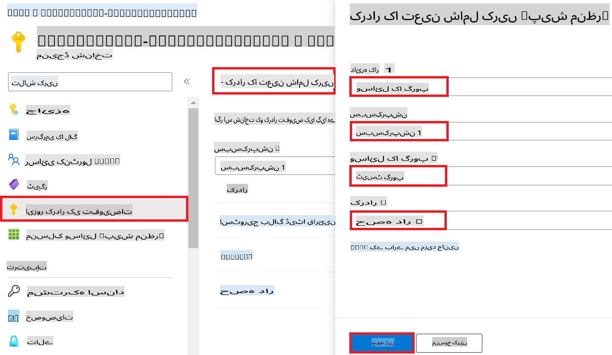

1. **Save** منتخب کریں۔

#### Managed Identity کو Storage Blob Data Reader رول اسائنمنٹ شامل کریں

1. **پورٹل صفحے** کے اوپر سرچ بار میں *storage accounts* ٹائپ کریں اور ظاہر ہونے والے اختیارات میں سے **Storage accounts** منتخب کریں۔

    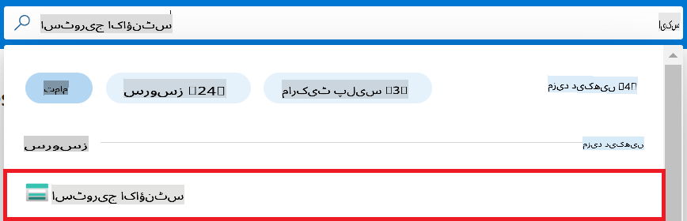

1. اس اسٹوریج اکاؤنٹ کو منتخب کریں جو آپ کے بنائے گئے Azure Machine Learning ورک اسپیس سے وابستہ ہے۔ مثال کے طور پر، *finetunephistorage*۔

1. Add role assignment صفحے پر جانے کے لیے درج ذیل کام کریں:

    - اس Azure Storage اکاؤنٹ پر جائیں جو آپ نے بنایا ہے۔
    - بائیں جانب کے ٹیب سے **Access Control (IAM)** منتخب کریں۔
    - نیویگیشن مینو سے **+ Add** منتخب کریں۔
    - نیویگیشن مینو سے **Add role assignment** منتخب کریں۔

    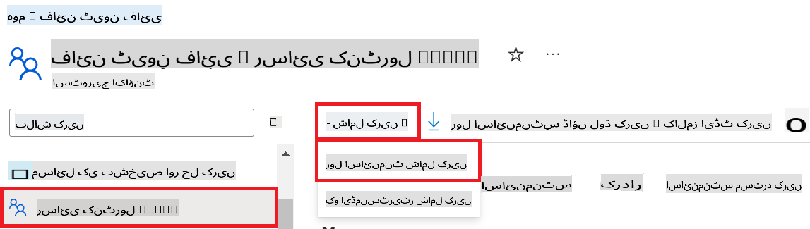

1. Add role assignment صفحے کے اندر، درج ذیل کام انجام دیں:

    - Role صفحے کے اندر، **Storage Blob Data Reader** کو سرچ بار میں ٹائپ کریں اور ظاہر ہونے والے اختیارات میں سے **Storage Blob Data Reader** منتخب کریں۔
    - Role صفحے کے اندر، **Next** منتخب کریں۔
    - Members صفحے کے اندر، **Assign access to** کو **Managed identity** پر سیٹ کریں۔
    - Members صفحے کے اندر، **+ Select members** منتخب کریں۔
    - Select managed identities صفحے کے اندر، اپنی Azure **Subscription** منتخب کریں۔
    - Select managed identities صفحے کے اندر، **Managed identity** کو **Manage Identity** پر سیٹ کریں۔
    - Select managed identities صفحے کے اندر، وہ Managed Identity منتخب کریں جو آپ نے بنایا ہے۔ مثال کے طور پر، *finetunephi-managedidentity*۔
    - Select managed identities صفحے کے اندر، **Select** منتخب کریں۔

    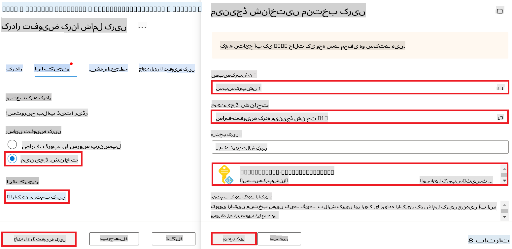

1. **Review + assign** منتخب کریں۔

#### Managed Identity کو AcrPull رول اسائنمنٹ شامل کریں

1. **پورٹل صفحے** کے اوپر سرچ بار میں *container registries* ٹائپ کریں اور ظاہر ہونے والے اختیارات میں سے **Container registries** منتخب کریں۔

    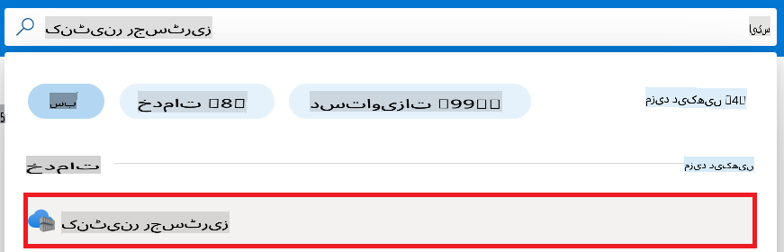

1. اس کنٹینر رجسٹری کو منتخب کریں جو Azure Machine Learning ورک اسپیس سے وابستہ ہے۔ مثال کے طور پر، *finetunephicontainerregistries*

1. Add role assignment صفحے پر جانے کے لیے درج ذیل کام کریں:

    - بائیں جانب کے ٹیب سے **Access Control (IAM)** منتخب کریں۔
    - نیویگیشن مینو سے **+ Add** منتخب کریں۔
    - نیویگیشن مینو سے **Add role assignment** منتخب کریں۔

1. Add role assignment صفحے کے اندر، درج ذیل کام انجام دیں:

    - Role صفحے کے اندر، **AcrPull** کو سرچ بار میں ٹائپ کریں اور ظاہر ہونے والے اختیارات میں سے **AcrPull** منتخب کریں۔
    - Role صفحے کے اندر، **Next** منتخب کریں۔
    - Members صفحے کے اندر، **Assign access to** کو **Managed identity** پر سیٹ کریں۔
    - Members صفحے کے اندر، **+ Select members** منتخب کریں۔
    - Select managed identities صفحے کے اندر، اپنی Azure **Subscription** منتخب کریں۔
    - Select managed identities صفحے کے اندر، **Managed identity** کو **Manage Identity** پر سیٹ کریں۔
    - Select managed identities صفحے کے اندر، وہ Managed Identity منتخب کریں جو آپ نے بنایا ہے۔ مثال کے طور پر، *finetunephi-managedidentity*۔
    - Select managed identities صفحے کے اندر، **Select** منتخب کریں۔
    - **Review + assign** منتخب کریں۔

### پروجیکٹ ترتیب دیں

اب، آپ ایک فولڈر بنائیں گے جس میں کام کرنا ہے اور ایک ورچوئل ماحول ترتیب دیں گے تاکہ ایسا پروگرام تیار کیا جا سکے جو صارفین کے ساتھ تعامل کرے اور Azure Cosmos DB سے محفوظ چیٹ ہسٹری کو اپنی جوابات میں استعمال کرے۔

#### فولڈر بنائیں تاکہ اس میں کام کیا جا سکے

1. ایک ٹرمینل ونڈو کھولیں اور درج ذیل کمانڈ ٹائپ کریں تاکہ *finetune-phi* نامی فولڈر ڈیفالٹ پاتھ میں بنایا جا سکے۔

    ```console
    mkdir finetune-phi
    ```

1. ٹرمینل میں درج ذیل کمانڈ ٹائپ کریں تاکہ آپ نے بنایا ہوا *finetune-phi* فولڈر کھولا جا سکے۔

    ```console
    cd finetune-phi
    ```

#### ورچوئل ماحول بنائیں

1. ٹرمینل میں درج ذیل کمانڈ ٹائپ کریں تاکہ *.venv* نامی ورچوئل ماحول بنایا جا سکے۔

    ```console
    python -m venv .venv
    ```

1. ٹرمینل میں درج ذیل کمانڈ ٹائپ کریں تاکہ ورچوئل ماحول کو ایکٹیویٹ کیا جا سکے۔

    ```console
    .venv\Scripts\activate.bat
    ```

> [!NOTE]
>
> اگر یہ کام کر گیا، تو آپ کو کمانڈ پرامپٹ کے سامنے *(.venv)* نظر آنا چاہیے۔

#### مطلوبہ پیکجز انسٹال کریں

1. ٹرمینل میں درج ذیل کمانڈز ٹائپ کریں تاکہ مطلوبہ پیکجز انسٹال کیے جا سکیں۔

    ```console
    pip install datasets==2.19.1
    pip install transformers==4.41.1
    pip install azure-ai-ml==1.16.0
    pip install torch==2.3.1
    pip install trl==0.9.4
    pip install promptflow==1.12.0
    ```

#### پروجیکٹ فائلز بنائیں

اس مشق میں، آپ اپنے پروجیکٹ کے لیے ضروری فائلز بنائیں گے۔ ان فائلز میں ڈیٹا سیٹ ڈاؤن لوڈ کرنے، Azure Machine Learning ماحول ترتیب دینے، Phi-3 ماڈل کو فائن ٹیون کرنے، اور فائن ٹیونڈ ماڈل کو ڈپلائی کرنے کے اسکرپٹس شامل ہوں گے۔ آپ ایک *conda.yml* فائل بھی بنائیں گے تاکہ فائن ٹیوننگ ماحول ترتیب دیا جا سکے۔

اس مشق میں، آپ درج ذیل کریں گے:

- *download_dataset.py* فائل بنائیں تاکہ ڈیٹا سیٹ ڈاؤن لوڈ کیا جا سکے۔
- *setup_ml.py* فائل بنائیں تاکہ Azure Machine Learning ماحول ترتیب دیا جا سکے۔
- *finetuning_dir* فولڈر میں *fine_tune.py* فائل بنائیں تاکہ ڈیٹا سیٹ کا استعمال کرتے ہوئے Phi-3 ماڈل کو فائن ٹیون کیا جا سکے۔
- *conda.yml* فائل بنائیں تاکہ فائن ٹیوننگ ماحول ترتیب دیا جا سکے۔
- *deploy_model.py* فائل بنائیں تاکہ فائن ٹیونڈ ماڈل کو ڈپلائی کیا جا سکے۔
- *integrate_with_promptflow.py* فائل بنائیں تاکہ فائن ٹیونڈ ماڈل کو ضم کیا جا سکے اور Prompt Flow کا استعمال کرتے ہوئے ماڈل کو چلایا جا سکے۔
- *flow.dag.yml* فائل بنائیں تاکہ Prompt Flow کے لیے ورک فلو اسٹرکچر ترتیب دیا جا سکے۔
- *config.py* فائل بنائیں تاکہ Azure معلومات درج کی جا سکے۔

> [!NOTE]
>
> مکمل فولڈر اسٹرکچر:
>
> ```text
> └── YourUserName
> .    └── finetune-phi
> .        ├── finetuning_dir
> .        │      └── fine_tune.py
> .        ├── conda.yml
> .        ├── config.py
> .        ├── deploy_model.py
> .        ├── download_dataset.py
> .        ├── flow.dag.yml
> .        ├── integrate_with_promptflow.py
> .        └── setup_ml.py
> ```

1. **Visual Studio Code** کھولیں۔

1. مینو بار سے **File** منتخب کریں۔

1. **Open Folder** منتخب کریں۔

1. وہ *finetune-phi* فولڈر منتخب کریں جو آپ نے بنایا ہے، جو *C:\Users\yourUserName\finetune-phi* پر واقع ہے۔

    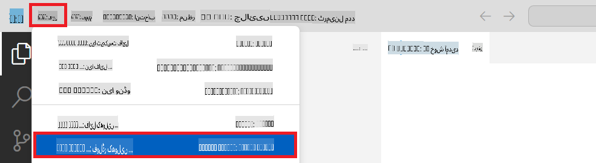

1. Visual Studio Code کے بائیں پین میں، دائیں کلک کریں اور **New File** منتخب کریں تاکہ *download_dataset.py* نامی نئی فائل بنائی جا سکے۔

1. Visual Studio Code کے بائیں پین میں، دائیں کلک کریں اور **New File** منتخب کریں تاکہ *setup_ml.py* نامی نئی فائل بنائی جا سکے۔

1. Visual Studio Code کے بائیں پین میں، دائیں کلک کریں اور **New File** منتخب کریں تاکہ *deploy_model.py* نامی نئی فائل بنائی جا سکے۔

    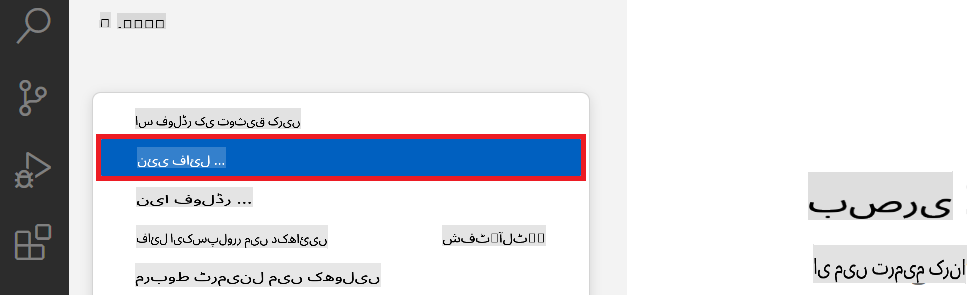

1. Visual Studio Code کے بائیں پ
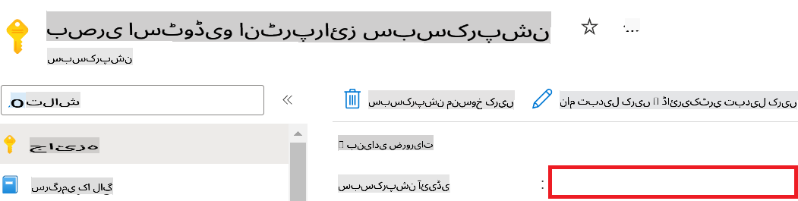

1. Azure Workspace Name شامل کرنے کے لیے درج ذیل کام کریں:

    - اس Azure Machine Learning ریسورس پر جائیں جو آپ نے بنایا ہے۔
    - اپنے اکاؤنٹ کا نام کاپی کریں اور *config.py* فائل میں پیسٹ کریں۔

    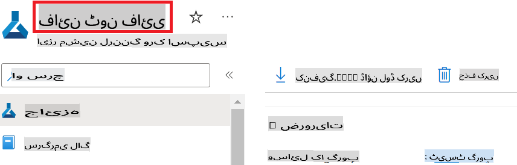

1. Azure Resource Group Name شامل کرنے کے لیے درج ذیل کام کریں:

    - اس Azure Machine Learning ریسورس پر جائیں جو آپ نے بنایا ہے۔
    - اپنے Azure Resource Group Name کو کاپی کریں اور *config.py* فائل میں پیسٹ کریں۔

    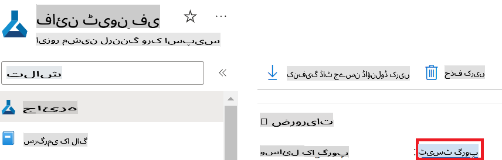

2. Azure Managed Identity نام شامل کرنے کے لیے درج ذیل کام کریں:

    - اس Managed Identities ریسورس پر جائیں جو آپ نے بنایا ہے۔
    - اپنے Azure Managed Identity نام کو کاپی کریں اور *config.py* فائل میں پیسٹ کریں۔

    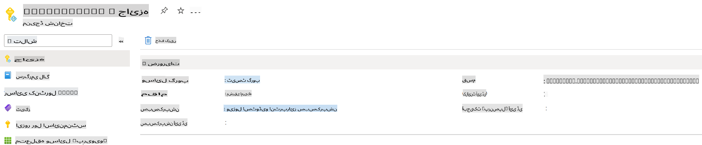

### فائن ٹیوننگ کے لیے ڈیٹاسیٹ تیار کریں

اس مشق میں، آپ *download_dataset.py* فائل چلا کر *ULTRACHAT_200k* ڈیٹاسیٹس کو اپنے لوکل ماحول میں ڈاؤنلوڈ کریں گے۔ اس کے بعد آپ ان ڈیٹاسیٹس کو Azure Machine Learning میں Phi-3 ماڈل کو فائن ٹیون کرنے کے لیے استعمال کریں گے۔

#### *download_dataset.py* کا استعمال کرتے ہوئے اپنا ڈیٹاسیٹ ڈاؤنلوڈ کریں

1. Visual Studio Code میں *download_dataset.py* فائل کھولیں۔

1. درج ذیل کوڈ کو *download_dataset.py* میں شامل کریں۔

    ```python
    import json
    import os
    from datasets import load_dataset
    from config import (
        TRAIN_DATA_PATH,
        TEST_DATA_PATH)

    def load_and_split_dataset(dataset_name, config_name, split_ratio):
        """
        Load and split a dataset.
        """
        # Load the dataset with the specified name, configuration, and split ratio
        dataset = load_dataset(dataset_name, config_name, split=split_ratio)
        print(f"Original dataset size: {len(dataset)}")
        
        # Split the dataset into train and test sets (80% train, 20% test)
        split_dataset = dataset.train_test_split(test_size=0.2)
        print(f"Train dataset size: {len(split_dataset['train'])}")
        print(f"Test dataset size: {len(split_dataset['test'])}")
        
        return split_dataset

    def save_dataset_to_jsonl(dataset, filepath):
        """
        Save a dataset to a JSONL file.
        """
        # Create the directory if it does not exist
        os.makedirs(os.path.dirname(filepath), exist_ok=True)
        
        # Open the file in write mode
        with open(filepath, 'w', encoding='utf-8') as f:
            # Iterate over each record in the dataset
            for record in dataset:
                # Dump the record as a JSON object and write it to the file
                json.dump(record, f)
                # Write a newline character to separate records
                f.write('\n')
        
        print(f"Dataset saved to {filepath}")

    def main():
        """
        Main function to load, split, and save the dataset.
        """
        # Load and split the ULTRACHAT_200k dataset with a specific configuration and split ratio
        dataset = load_and_split_dataset("HuggingFaceH4/ultrachat_200k", 'default', 'train_sft[:1%]')
        
        # Extract the train and test datasets from the split
        train_dataset = dataset['train']
        test_dataset = dataset['test']

        # Save the train dataset to a JSONL file
        save_dataset_to_jsonl(train_dataset, TRAIN_DATA_PATH)
        
        # Save the test dataset to a separate JSONL file
        save_dataset_to_jsonl(test_dataset, TEST_DATA_PATH)

    if __name__ == "__main__":
        main()

    ```

> [!TIP]
>
> **کم از کم ڈیٹاسیٹ کے ساتھ فائن ٹیوننگ کے لیے رہنمائی (CPU کے ساتھ)**
>
> اگر آپ فائن ٹیوننگ کے لیے CPU استعمال کرنا چاہتے ہیں، تو یہ طریقہ ان لوگوں کے لیے بہترین ہے جو سبسکرپشن کے فوائد (جیسے Visual Studio Enterprise Subscription) رکھتے ہیں یا فائن ٹیوننگ اور ڈپلائمنٹ کے عمل کو تیزی سے آزمانا چاہتے ہیں۔
>
> `dataset = load_and_split_dataset("HuggingFaceH4/ultrachat_200k", 'default', 'train_sft[:1%]')` with `dataset = load_and_split_dataset("HuggingFaceH4/ultrachat_200k", 'default', 'train_sft[:10]')` کو تبدیل کریں۔
>

1. اسکرپٹ کو چلانے اور ڈیٹاسیٹ کو اپنے لوکل ماحول میں ڈاؤنلوڈ کرنے کے لیے درج ذیل کمانڈ اپنے ٹرمینل میں ٹائپ کریں:

    ```console
    python download_data.py
    ```

1. تصدیق کریں کہ ڈیٹاسیٹس کامیابی کے ساتھ آپ کے لوکل *finetune-phi/data* ڈائریکٹری میں محفوظ ہو چکے ہیں۔

> [!NOTE]
>
> **ڈیٹاسیٹ کا سائز اور فائن ٹیوننگ کا وقت**
>
> اس E2E نمونے میں، آپ صرف ڈیٹاسیٹ کا 1% (`train_sft[:1%]`) استعمال کرتے ہیں۔ یہ ڈیٹا کی مقدار کو نمایاں طور پر کم کرتا ہے، اپلوڈ اور فائن ٹیوننگ کے عمل کو تیز بناتا ہے۔ آپ تربیتی وقت اور ماڈل کی کارکردگی کے درمیان صحیح توازن تلاش کرنے کے لیے فیصد کو ایڈجسٹ کر سکتے ہیں۔ ڈیٹاسیٹ کے ایک چھوٹے حصے کا استعمال فائن ٹیوننگ کے لیے درکار وقت کو کم کرتا ہے، جس سے یہ عمل ایک E2E نمونے کے لیے زیادہ قابل انتظام ہو جاتا ہے۔

## منظرنامہ 2: Phi-3 ماڈل کو فائن ٹیون کریں اور Azure Machine Learning Studio میں ڈپلائے کریں

### Azure CLI سیٹ اپ کریں

آپ کو اپنے ماحول کو تصدیق کرنے کے لیے Azure CLI سیٹ اپ کرنے کی ضرورت ہے۔ Azure CLI آپ کو کمانڈ لائن سے براہ راست Azure ریسورسز کا نظم کرنے اور Azure Machine Learning کو ان ریسورسز تک رسائی کے لیے ضروری اسناد فراہم کرنے کی اجازت دیتا ہے۔ شروع کرنے کے لیے [Azure CLI انسٹال کریں](https://learn.microsoft.com/cli/azure/install-azure-cli)

1. ایک ٹرمینل ونڈو کھولیں اور اپنے Azure اکاؤنٹ میں لاگ ان کرنے کے لیے درج ذیل کمانڈ ٹائپ کریں:

    ```console
    az login
    ```

1. اپنے استعمال کے لیے Azure اکاؤنٹ منتخب کریں۔

1. اپنے استعمال کے لیے Azure سبسکرپشن منتخب کریں۔

    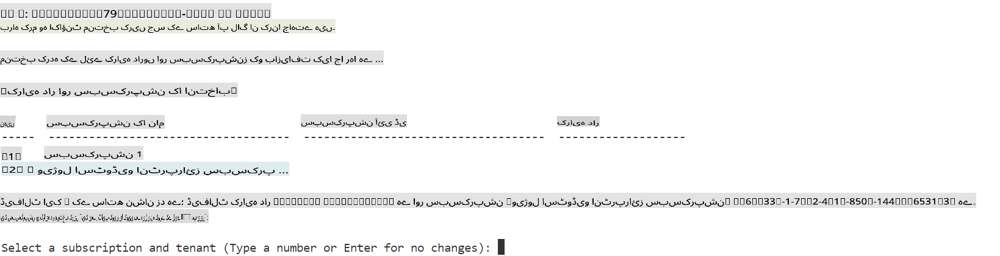

> [!TIP]
>
> اگر آپ کو Azure میں سائن ان کرنے میں دشواری ہو رہی ہے، تو ڈیوائس کوڈ استعمال کرنے کی کوشش کریں۔ ایک ٹرمینل ونڈو کھولیں اور اپنے Azure اکاؤنٹ میں سائن ان کرنے کے لیے درج ذیل کمانڈ ٹائپ کریں:
>
> ```console
> az login --use-device-code
> ```
>

### Phi-3 ماڈل کو فائن ٹیون کریں

اس مشق میں، آپ فراہم کردہ ڈیٹاسیٹ کا استعمال کرتے ہوئے Phi-3 ماڈل کو فائن ٹیون کریں گے۔ سب سے پہلے، آپ *fine_tune.py* فائل میں فائن ٹیوننگ کا عمل متعین کریں گے۔ پھر، آپ Azure Machine Learning ماحول کو ترتیب دیں گے اور *setup_ml.py* فائل چلا کر فائن ٹیوننگ کا عمل شروع کریں گے۔ یہ اسکرپٹ یقینی بناتا ہے کہ فائن ٹیوننگ Azure Machine Learning ماحول کے اندر ہوتی ہے۔

*setup_ml.py* کو چلا کر، آپ Azure Machine Learning ماحول میں فائن ٹیوننگ کے عمل کو چلائیں گے۔

#### *fine_tune.py* فائل میں کوڈ شامل کریں

1. *finetuning_dir* فولڈر پر جائیں اور Visual Studio Code میں *fine_tune.py* فائل کھولیں۔

1. درج ذیل کوڈ کو *fine_tune.py* میں شامل کریں۔

    ```python
    import argparse
    import sys
    import logging
    import os
    from datasets import load_dataset
    import torch
    import mlflow
    from transformers import AutoModelForCausalLM, AutoTokenizer, TrainingArguments
    from trl import SFTTrainer

    # To avoid the INVALID_PARAMETER_VALUE error in MLflow, disable MLflow integration
    os.environ["DISABLE_MLFLOW_INTEGRATION"] = "True"

    # Logging setup
    logging.basicConfig(
        format="%(asctime)s - %(levelname)s - %(name)s - %(message)s",
        datefmt="%Y-%m-%d %H:%M:%S",
        handlers=[logging.StreamHandler(sys.stdout)],
        level=logging.WARNING
    )
    logger = logging.getLogger(__name__)

    def initialize_model_and_tokenizer(model_name, model_kwargs):
        """
        Initialize the model and tokenizer with the given pretrained model name and arguments.
        """
        model = AutoModelForCausalLM.from_pretrained(model_name, **model_kwargs)
        tokenizer = AutoTokenizer.from_pretrained(model_name)
        tokenizer.model_max_length = 2048
        tokenizer.pad_token = tokenizer.unk_token
        tokenizer.pad_token_id = tokenizer.convert_tokens_to_ids(tokenizer.pad_token)
        tokenizer.padding_side = 'right'
        return model, tokenizer

    def apply_chat_template(example, tokenizer):
        """
        Apply a chat template to tokenize messages in the example.
        """
        messages = example["messages"]
        if messages[0]["role"] != "system":
            messages.insert(0, {"role": "system", "content": ""})
        example["text"] = tokenizer.apply_chat_template(
            messages, tokenize=False, add_generation_prompt=False
        )
        return example

    def load_and_preprocess_data(train_filepath, test_filepath, tokenizer):
        """
        Load and preprocess the dataset.
        """
        train_dataset = load_dataset('json', data_files=train_filepath, split='train')
        test_dataset = load_dataset('json', data_files=test_filepath, split='train')
        column_names = list(train_dataset.features)

        train_dataset = train_dataset.map(
            apply_chat_template,
            fn_kwargs={"tokenizer": tokenizer},
            num_proc=10,
            remove_columns=column_names,
            desc="Applying chat template to train dataset",
        )

        test_dataset = test_dataset.map(
            apply_chat_template,
            fn_kwargs={"tokenizer": tokenizer},
            num_proc=10,
            remove_columns=column_names,
            desc="Applying chat template to test dataset",
        )

        return train_dataset, test_dataset

    def train_and_evaluate_model(train_dataset, test_dataset, model, tokenizer, output_dir):
        """
        Train and evaluate the model.
        """
        training_args = TrainingArguments(
            bf16=True,
            do_eval=True,
            output_dir=output_dir,
            eval_strategy="epoch",
            learning_rate=5.0e-06,
            logging_steps=20,
            lr_scheduler_type="cosine",
            num_train_epochs=3,
            overwrite_output_dir=True,
            per_device_eval_batch_size=4,
            per_device_train_batch_size=4,
            remove_unused_columns=True,
            save_steps=500,
            seed=0,
            gradient_checkpointing=True,
            gradient_accumulation_steps=1,
            warmup_ratio=0.2,
        )

        trainer = SFTTrainer(
            model=model,
            args=training_args,
            train_dataset=train_dataset,
            eval_dataset=test_dataset,
            max_seq_length=2048,
            dataset_text_field="text",
            tokenizer=tokenizer,
            packing=True
        )

        train_result = trainer.train()
        trainer.log_metrics("train", train_result.metrics)

        mlflow.transformers.log_model(
            transformers_model={"model": trainer.model, "tokenizer": tokenizer},
            artifact_path=output_dir,
        )

        tokenizer.padding_side = 'left'
        eval_metrics = trainer.evaluate()
        eval_metrics["eval_samples"] = len(test_dataset)
        trainer.log_metrics("eval", eval_metrics)

    def main(train_file, eval_file, model_output_dir):
        """
        Main function to fine-tune the model.
        """
        model_kwargs = {
            "use_cache": False,
            "trust_remote_code": True,
            "torch_dtype": torch.bfloat16,
            "device_map": None,
            "attn_implementation": "eager"
        }

        # pretrained_model_name = "microsoft/Phi-3-mini-4k-instruct"
        pretrained_model_name = "microsoft/Phi-3.5-mini-instruct"

        with mlflow.start_run():
            model, tokenizer = initialize_model_and_tokenizer(pretrained_model_name, model_kwargs)
            train_dataset, test_dataset = load_and_preprocess_data(train_file, eval_file, tokenizer)
            train_and_evaluate_model(train_dataset, test_dataset, model, tokenizer, model_output_dir)

    if __name__ == "__main__":
        parser = argparse.ArgumentParser()
        parser.add_argument("--train-file", type=str, required=True, help="Path to the training data")
        parser.add_argument("--eval-file", type=str, required=True, help="Path to the evaluation data")
        parser.add_argument("--model_output_dir", type=str, required=True, help="Directory to save the fine-tuned model")
        args = parser.parse_args()
        main(args.train_file, args.eval_file, args.model_output_dir)

    ```

1. *fine_tune.py* فائل کو محفوظ کریں اور بند کریں۔

> [!TIP]
> **آپ Phi-3.5 ماڈل کو فائن ٹیون کر سکتے ہیں**
>
> *fine_tune.py* فائل میں، آپ اسکرپٹ میں `pretrained_model_name` from `"microsoft/Phi-3-mini-4k-instruct"` to any model you want to fine-tune. For example, if you change it to `"microsoft/Phi-3.5-mini-instruct"`, you'll be using the Phi-3.5-mini-instruct model for fine-tuning. To find and use the model name you prefer, visit [Hugging Face](https://huggingface.co/), search for the model you're interested in, and then copy and paste its name into the `pretrained_model_name` فیلڈ کو تبدیل کر سکتے ہیں۔
>
> :::image type="content" source="../../imgs/03/FineTuning-PromptFlow/finetunephi3.5.png" alt-text="Phi-3.5 کو فائن ٹیون کریں۔":::
>

#### *setup_ml.py* فائل میں کوڈ شامل کریں

1. Visual Studio Code میں *setup_ml.py* فائل کھولیں۔

1. درج ذیل کوڈ کو *setup_ml.py* میں شامل کریں۔

    ```python
    import logging
    from azure.ai.ml import MLClient, command, Input
    from azure.ai.ml.entities import Environment, AmlCompute
    from azure.identity import AzureCliCredential
    from config import (
        AZURE_SUBSCRIPTION_ID,
        AZURE_RESOURCE_GROUP_NAME,
        AZURE_ML_WORKSPACE_NAME,
        TRAIN_DATA_PATH,
        TEST_DATA_PATH
    )

    # Constants

    # Uncomment the following lines to use a CPU instance for training
    # COMPUTE_INSTANCE_TYPE = "Standard_E16s_v3" # cpu
    # COMPUTE_NAME = "cpu-e16s-v3"
    # DOCKER_IMAGE_NAME = "mcr.microsoft.com/azureml/openmpi4.1.0-ubuntu20.04:latest"

    # Uncomment the following lines to use a GPU instance for training
    COMPUTE_INSTANCE_TYPE = "Standard_NC24ads_A100_v4"
    COMPUTE_NAME = "gpu-nc24s-a100-v4"
    DOCKER_IMAGE_NAME = "mcr.microsoft.com/azureml/curated/acft-hf-nlp-gpu:59"

    CONDA_FILE = "conda.yml"
    LOCATION = "eastus2" # Replace with the location of your compute cluster
    FINETUNING_DIR = "./finetuning_dir" # Path to the fine-tuning script
    TRAINING_ENV_NAME = "phi-3-training-environment" # Name of the training environment
    MODEL_OUTPUT_DIR = "./model_output" # Path to the model output directory in azure ml

    # Logging setup to track the process
    logger = logging.getLogger(__name__)
    logging.basicConfig(
        format="%(asctime)s - %(levelname)s - %(name)s - %(message)s",
        datefmt="%Y-%m-%d %H:%M:%S",
        level=logging.WARNING
    )

    def get_ml_client():
        """
        Initialize the ML Client using Azure CLI credentials.
        """
        credential = AzureCliCredential()
        return MLClient(credential, AZURE_SUBSCRIPTION_ID, AZURE_RESOURCE_GROUP_NAME, AZURE_ML_WORKSPACE_NAME)

    def create_or_get_environment(ml_client):
        """
        Create or update the training environment in Azure ML.
        """
        env = Environment(
            image=DOCKER_IMAGE_NAME,  # Docker image for the environment
            conda_file=CONDA_FILE,  # Conda environment file
            name=TRAINING_ENV_NAME,  # Name of the environment
        )
        return ml_client.environments.create_or_update(env)

    def create_or_get_compute_cluster(ml_client, compute_name, COMPUTE_INSTANCE_TYPE, location):
        """
        Create or update the compute cluster in Azure ML.
        """
        try:
            compute_cluster = ml_client.compute.get(compute_name)
            logger.info(f"Compute cluster '{compute_name}' already exists. Reusing it for the current run.")
        except Exception:
            logger.info(f"Compute cluster '{compute_name}' does not exist. Creating a new one with size {COMPUTE_INSTANCE_TYPE}.")
            compute_cluster = AmlCompute(
                name=compute_name,
                size=COMPUTE_INSTANCE_TYPE,
                location=location,
                tier="Dedicated",  # Tier of the compute cluster
                min_instances=0,  # Minimum number of instances
                max_instances=1  # Maximum number of instances
            )
            ml_client.compute.begin_create_or_update(compute_cluster).wait()  # Wait for the cluster to be created
        return compute_cluster

    def create_fine_tuning_job(env, compute_name):
        """
        Set up the fine-tuning job in Azure ML.
        """
        return command(
            code=FINETUNING_DIR,  # Path to fine_tune.py
            command=(
                "python fine_tune.py "
                "--train-file ${{inputs.train_file}} "
                "--eval-file ${{inputs.eval_file}} "
                "--model_output_dir ${{inputs.model_output}}"
            ),
            environment=env,  # Training environment
            compute=compute_name,  # Compute cluster to use
            inputs={
                "train_file": Input(type="uri_file", path=TRAIN_DATA_PATH),  # Path to the training data file
                "eval_file": Input(type="uri_file", path=TEST_DATA_PATH),  # Path to the evaluation data file
                "model_output": MODEL_OUTPUT_DIR
            }
        )

    def main():
        """
        Main function to set up and run the fine-tuning job in Azure ML.
        """
        # Initialize ML Client
        ml_client = get_ml_client()

        # Create Environment
        env = create_or_get_environment(ml_client)
        
        # Create or get existing compute cluster
        create_or_get_compute_cluster(ml_client, COMPUTE_NAME, COMPUTE_INSTANCE_TYPE, LOCATION)

        # Create and Submit Fine-Tuning Job
        job = create_fine_tuning_job(env, COMPUTE_NAME)
        returned_job = ml_client.jobs.create_or_update(job)  # Submit the job
        ml_client.jobs.stream(returned_job.name)  # Stream the job logs
        
        # Capture the job name
        job_name = returned_job.name
        print(f"Job name: {job_name}")

    if __name__ == "__main__":
        main()

    ```

1. `COMPUTE_INSTANCE_TYPE`, `COMPUTE_NAME`, and `LOCATION` کو اپنی مخصوص تفصیلات کے ساتھ تبدیل کریں۔

    ```python
   # Uncomment the following lines to use a GPU instance for training
    COMPUTE_INSTANCE_TYPE = "Standard_NC24ads_A100_v4"
    COMPUTE_NAME = "gpu-nc24s-a100-v4"
    ...
    LOCATION = "eastus2" # Replace with the location of your compute cluster
    ```

> [!TIP]
>
> **کم از کم ڈیٹاسیٹ کے ساتھ فائن ٹیوننگ کے لیے رہنمائی (CPU کے ساتھ)**
>
> اگر آپ فائن ٹیوننگ کے لیے CPU استعمال کرنا چاہتے ہیں، تو یہ طریقہ ان لوگوں کے لیے بہترین ہے جو سبسکرپشن کے فوائد (جیسے Visual Studio Enterprise Subscription) رکھتے ہیں یا فائن ٹیوننگ اور ڈپلائمنٹ کے عمل کو تیزی سے آزمانا چاہتے ہیں۔
>
> 1. *setup_ml* فائل کھولیں۔
> 1. `COMPUTE_INSTANCE_TYPE`, `COMPUTE_NAME`, and `DOCKER_IMAGE_NAME` with the following. If you do not have access to *Standard_E16s_v3*, you can use an equivalent CPU instance or request a new quota.
> 1. Replace `LOCATION` کو اپنی مخصوص تفصیلات کے ساتھ تبدیل کریں۔
>
>    ```python
>    # Uncomment the following lines to use a CPU instance for training
>    COMPUTE_INSTANCE_TYPE = "Standard_E16s_v3" # cpu
>    COMPUTE_NAME = "cpu-e16s-v3"
>    DOCKER_IMAGE_NAME = "mcr.microsoft.com/azureml/openmpi4.1.0-ubuntu20.04:latest"
>    LOCATION = "eastus2" # Replace with the location of your compute cluster
>    ```
>

1. Azure Machine Learning میں فائن ٹیوننگ کے عمل کو شروع کرنے کے لیے *setup_ml.py* اسکرپٹ چلانے کے لیے درج ذیل کمانڈ ٹائپ کریں:

    ```python
    python setup_ml.py
    ```

1. اس مشق میں، آپ نے کامیابی کے ساتھ Azure Machine Learning کا استعمال کرتے ہوئے Phi-3 ماڈل کو فائن ٹیون کیا۔ *setup_ml.py* اسکرپٹ چلا کر، آپ نے Azure Machine Learning ماحول کو ترتیب دیا اور *fine_tune.py* فائل میں بیان کردہ فائن ٹیوننگ کے عمل کو شروع کیا۔ براہ کرم نوٹ کریں کہ فائن ٹیوننگ کا عمل کافی وقت لے سکتا ہے۔ `python setup_ml.py` command, you need to wait for the process to complete. You can monitor the status of the fine-tuning job by following the link provided in the terminal to the Azure Machine Learning portal.

    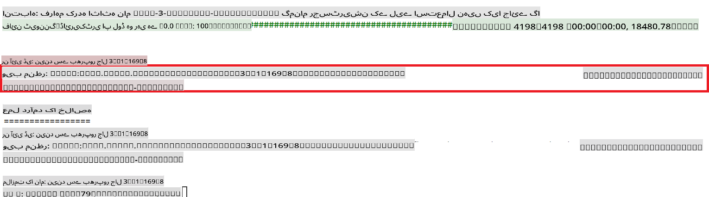

### Deploy the fine-tuned model

To integrate the fine-tuned Phi-3 model with Prompt Flow, you need to deploy the model to make it accessible for real-time inference. This process involves registering the model, creating an online endpoint, and deploying the model.

#### Set the model name, endpoint name, and deployment name for deployment

1. Open *config.py* file.

1. Replace `AZURE_MODEL_NAME = "your_fine_tuned_model_name"` with the desired name for your model.

1. Replace `AZURE_ENDPOINT_NAME = "your_fine_tuned_model_endpoint_name"` with the desired name for your endpoint.

1. Replace `AZURE_DEPLOYMENT_NAME = "your_fine_tuned_model_deployment_name"` مطلوبہ نام کے ساتھ چلائیں۔

#### *deploy_model.py* فائل میں کوڈ شامل کریں

*deploy_model.py* فائل کو چلانے سے پورا ڈپلائمنٹ عمل خودکار ہو جاتا ہے۔ یہ ماڈل کو رجسٹر کرتا ہے، ایک اینڈ پوائنٹ بناتا ہے، اور *config.py* فائل میں بیان کردہ سیٹنگز کی بنیاد پر ڈپلائمنٹ انجام دیتا ہے، جس میں ماڈل کا نام، اینڈ پوائنٹ کا نام، اور ڈپلائمنٹ کا نام شامل ہیں۔

1. Visual Studio Code میں *deploy_model.py* فائل کھولیں۔

1. درج ذیل کوڈ کو *deploy_model.py* میں شامل کریں۔

    ```python
    import logging
    from azure.identity import AzureCliCredential
    from azure.ai.ml import MLClient
    from azure.ai.ml.entities import Model, ProbeSettings, ManagedOnlineEndpoint, ManagedOnlineDeployment, IdentityConfiguration, ManagedIdentityConfiguration, OnlineRequestSettings
    from azure.ai.ml.constants import AssetTypes

    # Configuration imports
    from config import (
        AZURE_SUBSCRIPTION_ID,
        AZURE_RESOURCE_GROUP_NAME,
        AZURE_ML_WORKSPACE_NAME,
        AZURE_MANAGED_IDENTITY_RESOURCE_ID,
        AZURE_MANAGED_IDENTITY_CLIENT_ID,
        AZURE_MODEL_NAME,
        AZURE_ENDPOINT_NAME,
        AZURE_DEPLOYMENT_NAME
    )

    # Constants
    JOB_NAME = "your-job-name"
    COMPUTE_INSTANCE_TYPE = "Standard_E4s_v3"

    deployment_env_vars = {
        "SUBSCRIPTION_ID": AZURE_SUBSCRIPTION_ID,
        "RESOURCE_GROUP_NAME": AZURE_RESOURCE_GROUP_NAME,
        "UAI_CLIENT_ID": AZURE_MANAGED_IDENTITY_CLIENT_ID,
    }

    # Logging setup
    logging.basicConfig(
        format="%(asctime)s - %(levelname)s - %(name)s - %(message)s",
        datefmt="%Y-%m-%d %H:%M:%S",
        level=logging.DEBUG
    )
    logger = logging.getLogger(__name__)

    def get_ml_client():
        """Initialize and return the ML Client."""
        credential = AzureCliCredential()
        return MLClient(credential, AZURE_SUBSCRIPTION_ID, AZURE_RESOURCE_GROUP_NAME, AZURE_ML_WORKSPACE_NAME)

    def register_model(ml_client, model_name, job_name):
        """Register a new model."""
        model_path = f"azureml://jobs/{job_name}/outputs/artifacts/paths/model_output"
        logger.info(f"Registering model {model_name} from job {job_name} at path {model_path}.")
        run_model = Model(
            path=model_path,
            name=model_name,
            description="Model created from run.",
            type=AssetTypes.MLFLOW_MODEL,
        )
        model = ml_client.models.create_or_update(run_model)
        logger.info(f"Registered model ID: {model.id}")
        return model

    def delete_existing_endpoint(ml_client, endpoint_name):
        """Delete existing endpoint if it exists."""
        try:
            endpoint_result = ml_client.online_endpoints.get(name=endpoint_name)
            logger.info(f"Deleting existing endpoint {endpoint_name}.")
            ml_client.online_endpoints.begin_delete(name=endpoint_name).result()
            logger.info(f"Deleted existing endpoint {endpoint_name}.")
        except Exception as e:
            logger.info(f"No existing endpoint {endpoint_name} found to delete: {e}")

    def create_or_update_endpoint(ml_client, endpoint_name, description=""):
        """Create or update an endpoint."""
        delete_existing_endpoint(ml_client, endpoint_name)
        logger.info(f"Creating new endpoint {endpoint_name}.")
        endpoint = ManagedOnlineEndpoint(
            name=endpoint_name,
            description=description,
            identity=IdentityConfiguration(
                type="user_assigned",
                user_assigned_identities=[ManagedIdentityConfiguration(resource_id=AZURE_MANAGED_IDENTITY_RESOURCE_ID)]
            )
        )
        endpoint_result = ml_client.online_endpoints.begin_create_or_update(endpoint).result()
        logger.info(f"Created new endpoint {endpoint_name}.")
        return endpoint_result

    def create_or_update_deployment(ml_client, endpoint_name, deployment_name, model):
        """Create or update a deployment."""

        logger.info(f"Creating deployment {deployment_name} for endpoint {endpoint_name}.")
        deployment = ManagedOnlineDeployment(
            name=deployment_name,
            endpoint_name=endpoint_name,
            model=model.id,
            instance_type=COMPUTE_INSTANCE_TYPE,
            instance_count=1,
            environment_variables=deployment_env_vars,
            request_settings=OnlineRequestSettings(
                max_concurrent_requests_per_instance=3,
                request_timeout_ms=180000,
                max_queue_wait_ms=120000
            ),
            liveness_probe=ProbeSettings(
                failure_threshold=30,
                success_threshold=1,
                period=100,
                initial_delay=500,
            ),
            readiness_probe=ProbeSettings(
                failure_threshold=30,
                success_threshold=1,
                period=100,
                initial_delay=500,
            ),
        )
        deployment_result = ml_client.online_deployments.begin_create_or_update(deployment).result()
        logger.info(f"Created deployment {deployment.name} for endpoint {endpoint_name}.")
        return deployment_result

    def set_traffic_to_deployment(ml_client, endpoint_name, deployment_name):
        """Set traffic to the specified deployment."""
        try:
            # Fetch the current endpoint details
            endpoint = ml_client.online_endpoints.get(name=endpoint_name)
            
            # Log the current traffic allocation for debugging
            logger.info(f"Current traffic allocation: {endpoint.traffic}")
            
            # Set the traffic allocation for the deployment
            endpoint.traffic = {deployment_name: 100}
            
            # Update the endpoint with the new traffic allocation
            endpoint_poller = ml_client.online_endpoints.begin_create_or_update(endpoint)
            updated_endpoint = endpoint_poller.result()
            
            # Log the updated traffic allocation for debugging
            logger.info(f"Updated traffic allocation: {updated_endpoint.traffic}")
            logger.info(f"Set traffic to deployment {deployment_name} at endpoint {endpoint_name}.")
            return updated_endpoint
        except Exception as e:
            # Log any errors that occur during the process
            logger.error(f"Failed to set traffic to deployment: {e}")
            raise


    def main():
        ml_client = get_ml_client()

        registered_model = register_model(ml_client, AZURE_MODEL_NAME, JOB_NAME)
        logger.info(f"Registered model ID: {registered_model.id}")

        endpoint = create_or_update_endpoint(ml_client, AZURE_ENDPOINT_NAME, "Endpoint for finetuned Phi-3 model")
        logger.info(f"Endpoint {AZURE_ENDPOINT_NAME} is ready.")

        try:
            deployment = create_or_update_deployment(ml_client, AZURE_ENDPOINT_NAME, AZURE_DEPLOYMENT_NAME, registered_model)
            logger.info(f"Deployment {AZURE_DEPLOYMENT_NAME} is created for endpoint {AZURE_ENDPOINT_NAME}.")

            set_traffic_to_deployment(ml_client, AZURE_ENDPOINT_NAME, AZURE_DEPLOYMENT_NAME)
            logger.info(f"Traffic is set to deployment {AZURE_DEPLOYMENT_NAME} at endpoint {AZURE_ENDPOINT_NAME}.")
        except Exception as e:
            logger.error(f"Failed to create or update deployment: {e}")

    if __name__ == "__main__":
        main()

    ```

1. `JOB_NAME`:

    - Navigate to Azure Machine Learning resource that you created.
    - Select **Studio web URL** to open the Azure Machine Learning workspace.
    - Select **Jobs** from the left side tab.
    - Select the experiment for fine-tuning. For example, *finetunephi*.
    - Select the job that you created.
    - Copy and paste your job Name into the `JOB_NAME = "your-job-name"` in *deploy_model.py* file.

1. Replace `COMPUTE_INSTANCE_TYPE` کے لیے اپنی مخصوص تفصیلات شامل کریں۔

1. Azure Machine Learning میں ڈپلائمنٹ کے عمل کو شروع کرنے کے لیے *deploy_model.py* اسکرپٹ چلانے کے لیے درج ذیل کمانڈ ٹائپ کریں:

    ```python
    python deploy_model.py
    ```

> [!WARNING]
> اپنے اکاؤنٹ پر اضافی چارجز سے بچنے کے لیے، یقینی بنائیں کہ Azure Machine Learning ورک اسپیس میں بنائے گئے اینڈ پوائنٹ کو حذف کر دیں۔
>

#### Azure Machine Learning ورک اسپیس میں ڈپلائمنٹ کی حیثیت چیک کریں

1. [Azure ML Studio](https://ml.azure.com/home?wt.mc_id=studentamb_279723) پر جائیں۔

1. Azure Machine Learning ورک اسپیس پر جائیں جو آپ نے بنایا ہے۔

1. **Studio web URL** منتخب کریں تاکہ Azure Machine Learning ورک اسپیس کھول سکیں۔

1. بائیں جانب کے ٹیب سے **Endpoints** کو منتخب کریں۔

    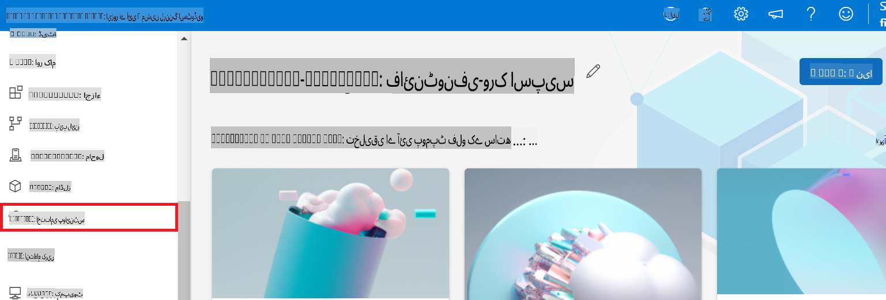

2. وہ اینڈ پوائنٹ منتخب کریں جو آپ نے بنایا ہے۔

    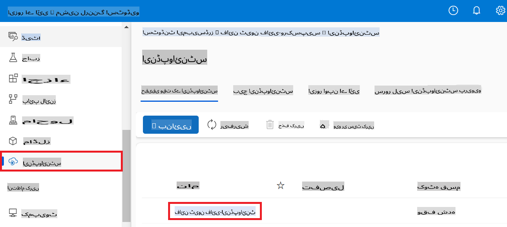

3. اس صفحے پر، آپ ڈپلائمنٹ عمل کے دوران بنائے گئے اینڈ پوائنٹس کو مینیج کر سکتے ہیں۔

## منظرنامہ 3: Prompt Flow کے ساتھ انضمام کریں اور اپنے کسٹم ماڈل سے چیٹ کریں

### کسٹم Phi-3 ماڈل کو Prompt Flow کے ساتھ انضمام کریں

اپنے فائن ٹیون کیے گئے ماڈل کو کامیابی سے ڈپلائے کرنے کے بعد، اب آپ اسے Prompt Flow کے ساتھ انضمام کر سکتے ہیں تاکہ اپنے ماڈل کو حقیقی وقت کی ایپلیکیشنز میں استعمال کر سکیں، جو آپ کے کسٹم Phi-3 ماڈل کے ساتھ مختلف انٹرایکٹو کاموں کو ممکن بناتا ہے۔

#### فائن ٹیون کیے گئے Phi-3 ماڈل کے API Key اور Endpoint URI سیٹ کریں

1. Azure Machine Learning ورک اسپیس پر جائیں جو آپ نے بنایا ہے۔
1. بائیں جانب کے ٹیب سے **Endpoints** منتخب کریں۔
1. وہ اینڈ پوائنٹ منتخب کریں جو آپ نے بنایا ہے۔
1. نیویگیشن مینو سے **Consume** منتخب کریں۔
1. اپنا **REST Endpoint** کاپی کریں اور *config.py* فائل میں پیسٹ کریں، `AZURE_ML_ENDPOINT = "your_fine_tuned_model_endpoint_uri"` with your **REST endpoint**.
1. Copy and paste your **Primary key** into the *config.py* file, replacing `AZURE_ML_API_KEY = "your_fine_tuned_model_api_key"` کو اپنے **Primary Key** کے ساتھ تبدیل کریں۔

    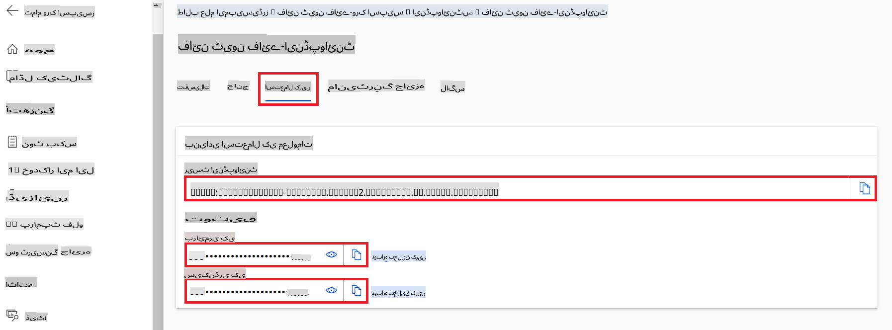

#### *flow.dag.yml* فائل میں کوڈ شامل کریں

1. Visual Studio Code میں *flow.dag.yml* فائل کھولیں۔

1. درج ذیل کوڈ کو *flow.dag.yml* میں شامل کریں۔

    ```yml
    inputs:
      input_data:
        type: string
        default: "Who founded Microsoft?"

    outputs:
      answer:
        type: string
        reference: ${integrate_with_promptflow.output}

    nodes:
    - name: integrate_with_promptflow
      type: python
      source:
        type: code
        path: integrate_with_promptflow.py
      inputs:
        input_data: ${inputs.input_data}
    ```

#### *integrate_with_promptflow.py* فائل میں کوڈ شامل کریں

1. Visual Studio Code میں *integrate_with_promptflow.py* فائل کھولیں۔

1. درج ذیل کوڈ کو *integrate_with_promptflow.py* میں شامل کریں۔

    ```python
    import logging
    import requests
    from promptflow.core import tool
    import asyncio
    import platform
    from config import (
        AZURE_ML_ENDPOINT,
        AZURE_ML_API_KEY
    )

    # Logging setup
    logging.basicConfig(
        format="%(asctime)s - %(levelname)s - %(name)s - %(message)s",
        datefmt="%Y-%m-%d %H:%M:%S",
        level=logging.DEBUG
    )
    logger = logging.getLogger(__name__)

    def query_azml_endpoint(input_data: list, endpoint_url: str, api_key: str) -> str:
        """
        Send a request to the Azure ML endpoint with the given input data.
        """
        headers = {
            "Content-Type": "application/json",
            "Authorization": f"Bearer {api_key}"
        }
        data = {
            "input_data": [input_data],
            "params": {
                "temperature": 0.7,
                "max_new_tokens": 128,
                "do_sample": True,
                "return_full_text": True
            }
        }
        try:
            response = requests.post(endpoint_url, json=data, headers=headers)
            response.raise_for_status()
            result = response.json()[0]
            logger.info("Successfully received response from Azure ML Endpoint.")
            return result
        except requests.exceptions.RequestException as e:
            logger.error(f"Error querying Azure ML Endpoint: {e}")
            raise

    def setup_asyncio_policy():
        """
        Setup asyncio event loop policy for Windows.
        """
        if platform.system() == 'Windows':
            asyncio.set_event_loop_policy(asyncio.WindowsSelectorEventLoopPolicy())
            logger.info("Set Windows asyncio event loop policy.")

    @tool
    def my_python_tool(input_data: str) -> str:
        """
        Tool function to process input data and query the Azure ML endpoint.
        """
        setup_asyncio_policy()
        return query_azml_endpoint(input_data, AZURE_ML_ENDPOINT, AZURE_ML_API_KEY)

    ```

### اپنے کسٹم ماڈل کے ساتھ چیٹ کریں

1. Azure Machine Learning میں ڈپلائمنٹ کے عمل کو شروع کرنے کے لیے *deploy_model.py* اسکرپٹ چلانے کے لیے درج ذیل کمانڈ ٹائپ کریں:

    ```python
    pf flow serve --source ./ --port 8080 --host localhost
    ```

1. یہاں ایک مثال ہے: اب آپ اپنے کسٹم Phi-3 ماڈل کے ساتھ چیٹ کر سکتے ہیں۔ یہ سفارش کی جاتی ہے کہ آپ فائن ٹیوننگ کے لیے استعمال ہونے والے ڈیٹا کی بنیاد پر سوالات پوچھیں۔

    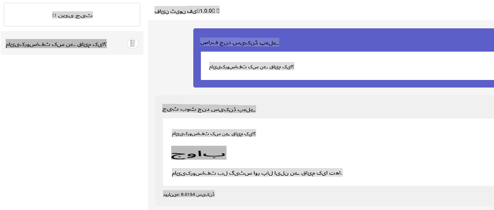

**ڈسکلیمر**:  
یہ دستاویز مشین پر مبنی AI ترجمہ خدمات کا استعمال کرتے ہوئے ترجمہ کی گئی ہے۔ اگرچہ ہم درستگی کے لیے کوشش کرتے ہیں، براہ کرم آگاہ رہیں کہ خودکار ترجمے میں غلطیاں یا غلط فہمیاں ہو سکتی ہیں۔ اصل دستاویز، جو اس کی اصل زبان میں ہے، کو مستند ذریعہ سمجھا جانا چاہیے۔ اہم معلومات کے لیے، پیشہ ور انسانی ترجمہ تجویز کیا جاتا ہے۔ ہم اس ترجمے کے استعمال سے پیدا ہونے والی کسی بھی غلط فہمی یا غلط تشریح کے ذمہ دار نہیں ہیں۔