# Azure AI Foundry میں Prompt Flow کے ساتھ اپنی مرضی کے Phi-3 ماڈلز کو بہتر بنائیں اور ضم کریں

یہ مکمل گائیڈ "[Fine-Tune and Integrate Custom Phi-3 Models with Prompt Flow in Azure AI Foundry](https://techcommunity.microsoft.com/t5/educator-developer-blog/fine-tune-and-integrate-custom-phi-3-models-with-prompt-flow-in/ba-p/4191726?WT.mc_id=aiml-137032-kinfeylo)" پر مبنی ہے، جو Microsoft Tech Community کی طرف سے فراہم کی گئی ہے۔ یہ گائیڈ Phi-3 ماڈلز کو بہتر بنانے، ڈیپلوئے کرنے، اور Azure AI Foundry میں Prompt Flow کے ساتھ ضم کرنے کے عمل کو متعارف کراتی ہے۔  
اس گائیڈ کے برعکس، "[Fine-Tune and Integrate Custom Phi-3 Models with Prompt Flow](./E2E_Phi-3-FineTuning_PromptFlow_Integration.md)"، جو مقامی طور پر کوڈ چلانے پر مرکوز تھی، یہ ٹیوٹوریل مکمل طور پر Azure AI/ML Studio کے اندر ماڈل کو بہتر بنانے اور ضم کرنے پر مرکوز ہے۔

## جائزہ

اس مکمل گائیڈ میں، آپ سیکھیں گے کہ Phi-3 ماڈل کو کیسے بہتر بنائیں اور اسے Azure AI Foundry میں Prompt Flow کے ساتھ ضم کریں۔ Azure AI/ML Studio کا استعمال کرتے ہوئے، آپ اپنی مرضی کے AI ماڈلز کو ڈیپلوئے اور استعمال کرنے کے لیے ایک ورک فلو قائم کریں گے۔ یہ گائیڈ تین منظرناموں میں تقسیم ہے:

**منظرنامہ 1: Azure وسائل سیٹ اپ کریں اور بہتر بنانے کے لیے تیاری کریں**

**منظرنامہ 2: Phi-3 ماڈل کو بہتر بنائیں اور Azure Machine Learning Studio میں ڈیپلوئے کریں**

**منظرنامہ 3: Prompt Flow کے ساتھ ضم کریں اور Azure AI Foundry میں اپنے ماڈل کے ساتھ چیٹ کریں**

یہاں اس گائیڈ کا ایک جائزہ دیا گیا ہے۔

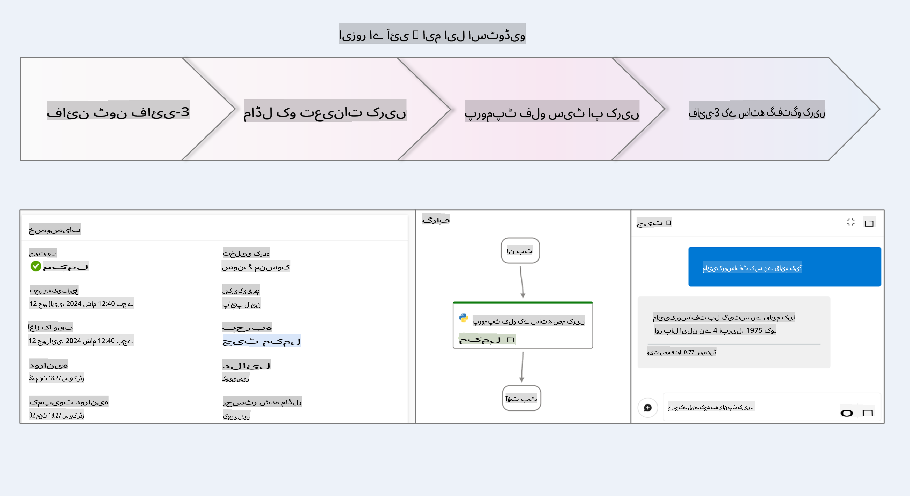

### مشمولات کی فہرست

1. **[منظرنامہ 1: Azure وسائل سیٹ اپ کریں اور بہتر بنانے کے لیے تیاری کریں](../../../../../../md/02.Application/01.TextAndChat/Phi3)**
    - [Azure Machine Learning Workspace بنائیں](../../../../../../md/02.Application/01.TextAndChat/Phi3)
    - [Azure سبسکرپشن میں GPU کوٹہ کی درخواست کریں](../../../../../../md/02.Application/01.TextAndChat/Phi3)
    - [رول اسائنمنٹ شامل کریں](../../../../../../md/02.Application/01.TextAndChat/Phi3)
    - [پروجیکٹ سیٹ اپ کریں](../../../../../../md/02.Application/01.TextAndChat/Phi3)
    - [بہتر بنانے کے لیے ڈیٹا سیٹ تیار کریں](../../../../../../md/02.Application/01.TextAndChat/Phi3)

1. **[منظرنامہ 2: Phi-3 ماڈل کو بہتر بنائیں اور Azure Machine Learning Studio میں ڈیپلوئے کریں](../../../../../../md/02.Application/01.TextAndChat/Phi3)**
    - [Phi-3 ماڈل کو بہتر بنائیں](../../../../../../md/02.Application/01.TextAndChat/Phi3)
    - [بہتر بنایا ہوا Phi-3 ماڈل ڈیپلوئے کریں](../../../../../../md/02.Application/01.TextAndChat/Phi3)

1. **[منظرنامہ 3: Prompt Flow کے ساتھ ضم کریں اور Azure AI Foundry میں اپنے ماڈل کے ساتھ چیٹ کریں](../../../../../../md/02.Application/01.TextAndChat/Phi3)**
    - [اپنے Phi-3 ماڈل کو Prompt Flow کے ساتھ ضم کریں](../../../../../../md/02.Application/01.TextAndChat/Phi3)
    - [اپنے Phi-3 ماڈل کے ساتھ چیٹ کریں](../../../../../../md/02.Application/01.TextAndChat/Phi3)

## منظرنامہ 1: Azure وسائل سیٹ اپ کریں اور بہتر بنانے کے لیے تیاری کریں

### Azure Machine Learning Workspace بنائیں

1. **پورٹل پیج** کے اوپر موجود **سرچ بار** میں *azure machine learning* ٹائپ کریں اور ظاہر ہونے والے آپشنز میں سے **Azure Machine Learning** منتخب کریں۔

    

2. نیویگیشن مینو سے **+ Create** منتخب کریں۔

3. نیویگیشن مینو سے **New workspace** منتخب کریں۔

    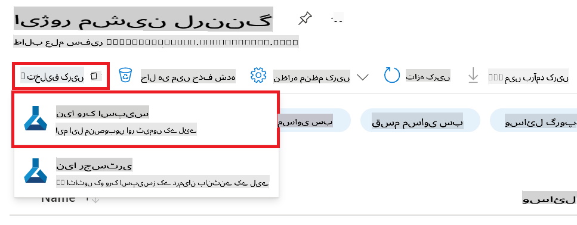

4. درج ذیل کام کریں:

    - اپنی Azure **سبسکرپشن** منتخب کریں۔
    - استعمال کرنے کے لیے **Resource group** منتخب کریں (ضرورت پڑنے پر نیا بنائیں)۔
    - **Workspace Name** درج کریں۔ یہ منفرد ہونا چاہیے۔
    - اپنی پسندیدہ **Region** منتخب کریں۔
    - استعمال کرنے کے لیے **Storage account** منتخب کریں (ضرورت پڑنے پر نیا بنائیں)۔
    - استعمال کرنے کے لیے **Key vault** منتخب کریں (ضرورت پڑنے پر نیا بنائیں)۔
    - استعمال کرنے کے لیے **Application insights** منتخب کریں (ضرورت پڑنے پر نیا بنائیں)۔
    - استعمال کرنے کے لیے **Container registry** منتخب کریں (ضرورت پڑنے پر نیا بنائیں)۔

    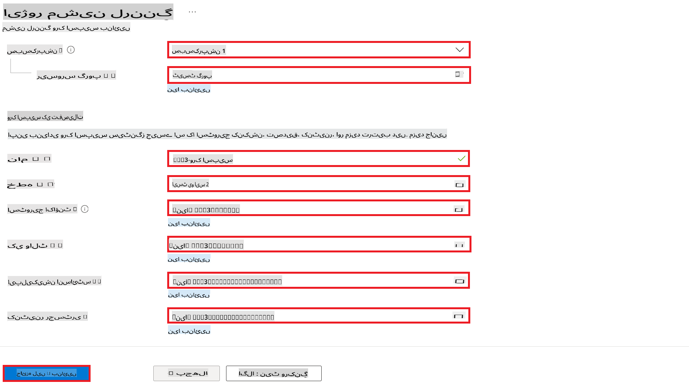

5. **Review + Create** منتخب کریں۔

6. **Create** منتخب کریں۔

### Azure سبسکرپشن میں GPU کوٹہ کی درخواست کریں

اس ٹیوٹوریل میں، آپ GPU کا استعمال کرتے ہوئے Phi-3 ماڈل کو بہتر بنائیں گے اور ڈیپلوئے کریں گے۔ بہتر بنانے کے لیے، آپ *Standard_NC24ads_A100_v4* GPU استعمال کریں گے، جو کوٹہ کی درخواست کا تقاضا کرتا ہے۔ ڈیپلوئے کرنے کے لیے، آپ *Standard_NC6s_v3* GPU استعمال کریں گے، جو کوٹہ کی درخواست کا بھی تقاضا کرتا ہے۔

> [!NOTE]
>
> صرف Pay-As-You-Go سبسکرپشنز (معیاری سبسکرپشن کی قسم) GPU الاٹمنٹ کے لیے اہل ہیں؛ فائدہ سبسکرپشنز فی الحال سپورٹ نہیں کی جاتیں۔
>

1. [Azure ML Studio](https://ml.azure.com/home?wt.mc_id=studentamb_279723) پر جائیں۔

1. *Standard NCADSA100v4 Family* کوٹہ کی درخواست کرنے کے لیے درج ذیل کام کریں:

    - بائیں جانب والے ٹیب سے **Quota** منتخب کریں۔
    - استعمال کرنے کے لیے **Virtual machine family** منتخب کریں۔ مثال کے طور پر، **Standard NCADSA100v4 Family Cluster Dedicated vCPUs** منتخب کریں، جس میں *Standard_NC24ads_A100_v4* GPU شامل ہے۔
    - نیویگیشن مینو سے **Request quota** منتخب کریں۔

        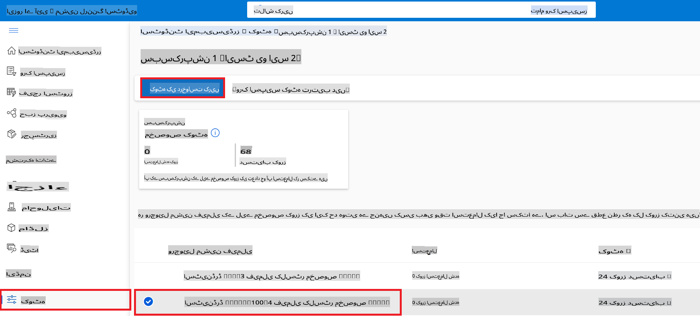

    - **Request quota** صفحہ میں، مطلوبہ **New cores limit** درج کریں۔ مثال کے طور پر، 24۔
    - **Request quota** صفحہ میں، GPU کوٹہ کی درخواست کرنے کے لیے **Submit** منتخب کریں۔

1. *Standard NCSv3 Family* کوٹہ کی درخواست کرنے کے لیے درج ذیل کام کریں:

    - بائیں جانب والے ٹیب سے **Quota** منتخب کریں۔
    - استعمال کرنے کے لیے **Virtual machine family** منتخب کریں۔ مثال کے طور پر، **Standard NCSv3 Family Cluster Dedicated vCPUs** منتخب کریں، جس میں *Standard_NC6s_v3* GPU شامل ہے۔
    - نیویگیشن مینو سے **Request quota** منتخب کریں۔
    - **Request quota** صفحہ میں، مطلوبہ **New cores limit** درج کریں۔ مثال کے طور پر، 24۔
    - **Request quota** صفحہ میں، GPU کوٹہ کی درخواست کرنے کے لیے **Submit** منتخب کریں۔

### رول اسائنمنٹ شامل کریں

اپنے ماڈلز کو بہتر بنانے اور ڈیپلوئے کرنے کے لیے، آپ کو پہلے ایک **User Assigned Managed Identity (UAI)** بنانا ہوگا اور اسے مناسب اجازتیں تفویض کرنی ہوں گی۔ یہ UAI ڈیپلوئےمنٹ کے دوران توثیق کے لیے استعمال ہوگی۔

#### User Assigned Managed Identity (UAI) بنائیں

1. **پورٹل پیج** کے اوپر موجود **سرچ بار** میں *managed identities* ٹائپ کریں اور ظاہر ہونے والے آپشنز میں سے **Managed Identities** منتخب کریں۔

    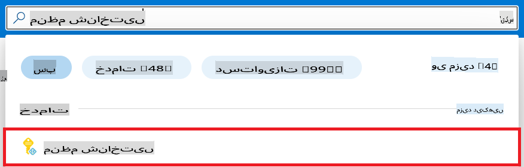

1. **+ Create** منتخب کریں۔

    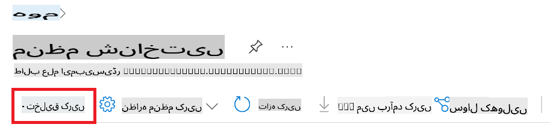

1. درج ذیل کام کریں:

    - اپنی Azure **سبسکرپشن** منتخب کریں۔
    - استعمال کرنے کے لیے **Resource group** منتخب کریں (ضرورت پڑنے پر نیا بنائیں)۔
    - اپنی پسندیدہ **Region** منتخب کریں۔
    - **Name** درج کریں۔ یہ منفرد ہونا چاہیے۔

    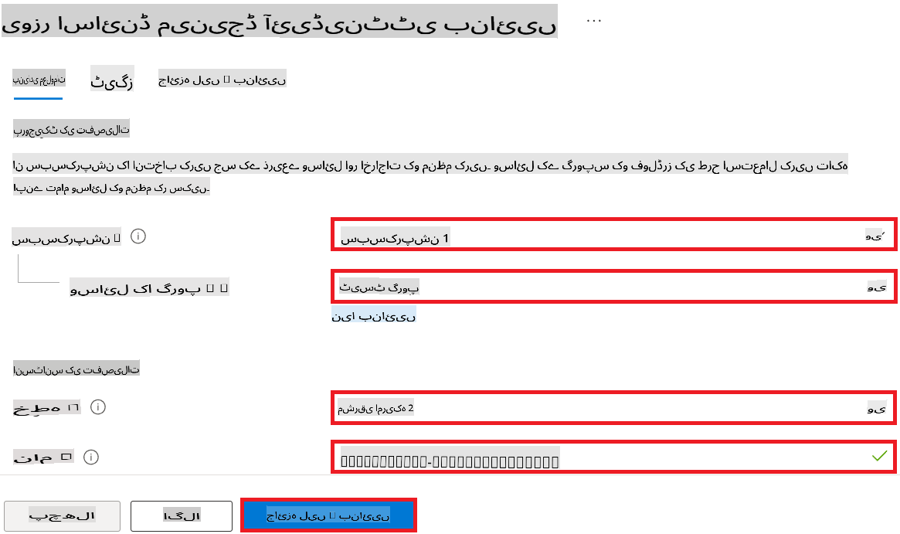

1. **Review + create** منتخب کریں۔

1. **+ Create** منتخب کریں۔

#### Managed Identity کو Contributor رول اسائنمنٹ شامل کریں

1. وہ Managed Identity ریسورس کھولیں جو آپ نے بنایا ہے۔

1. بائیں جانب والے ٹیب سے **Azure role assignments** منتخب کریں۔

1. نیویگیشن مینو سے **+Add role assignment** منتخب کریں۔

1. **Add role assignment** صفحہ میں، درج ذیل کام کریں:
    - **Scope** کو **Resource group** پر سیٹ کریں۔
    - اپنی Azure **سبسکرپشن** منتخب کریں۔
    - استعمال کرنے کے لیے **Resource group** منتخب کریں۔
    - **Role** کو **Contributor** پر سیٹ کریں۔

    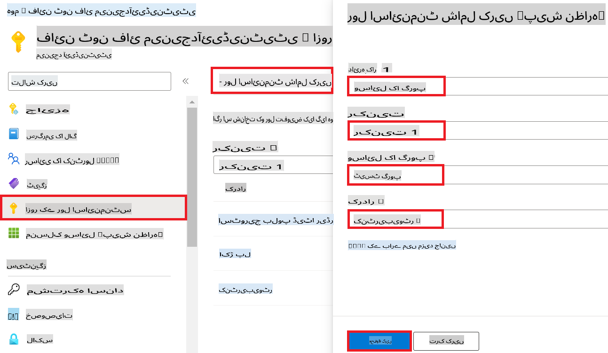

2. **Save** منتخب کریں۔

#### Managed Identity کو Storage Blob Data Reader رول اسائنمنٹ شامل کریں

1. **پورٹل پیج** کے اوپر موجود **سرچ بار** میں *storage accounts* ٹائپ کریں اور ظاہر ہونے والے آپشنز میں سے **Storage accounts** منتخب کریں۔

    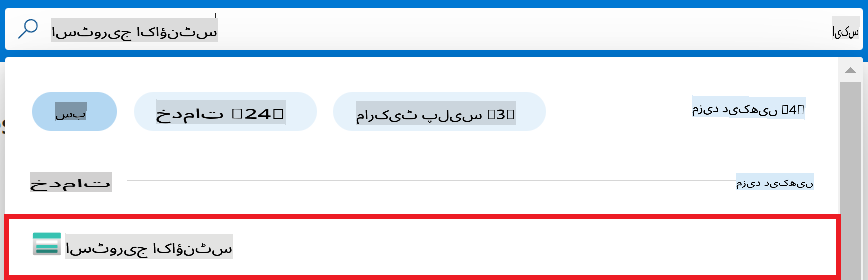

1. اس اسٹوریج اکاؤنٹ کو منتخب کریں جو آپ کے Azure Machine Learning ورک اسپیس کے ساتھ وابستہ ہے۔ مثال کے طور پر، *finetunephistorage*۔

1. **Add role assignment** صفحہ پر جانے کے لیے درج ذیل کام کریں:

    - اپنے بنائے گئے Azure Storage اکاؤنٹ پر جائیں۔
    - بائیں جانب والے ٹیب سے **Access Control (IAM)** منتخب کریں۔
    - نیویگیشن مینو سے **+ Add** منتخب کریں۔
    - نیویگیشن مینو سے **Add role assignment** منتخب کریں۔

    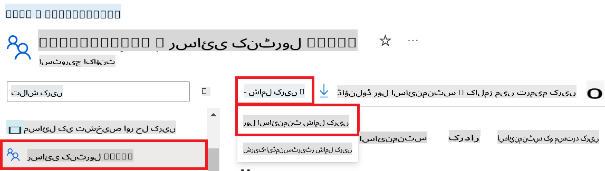

1. **Add role assignment** صفحہ میں، درج ذیل کام کریں:

    - **Role** صفحہ میں، **Storage Blob Data Reader** کو تلاش کریں اور منتخب کریں۔
    - **Role** صفحہ میں، **Next** منتخب کریں۔
    - **Members** صفحہ میں، **Assign access to** کو **Managed identity** پر سیٹ کریں۔
    - **Members** صفحہ میں، **+ Select members** منتخب کریں۔
    - **Select managed identities** صفحہ میں، اپنی Azure **سبسکرپشن** منتخب کریں۔
    - **Select managed identities** صفحہ میں، **Managed identity** منتخب کریں۔
    - **Select managed identities** صفحہ میں، وہ Managed Identity منتخب کریں جو آپ نے بنایا تھا۔ مثال کے طور پر، *finetunephi-managedidentity*۔
    - **Select managed identities** صفحہ میں، **Select** منتخب کریں۔

    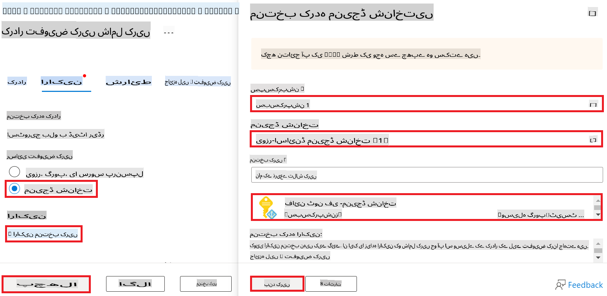

1. **Review + assign** منتخب کریں۔

#### Managed Identity کو AcrPull رول اسائنمنٹ شامل کریں

1. **پورٹل پیج** کے اوپر موجود **سرچ بار** میں *container registries* ٹائپ کریں اور ظاہر ہونے والے آپشنز میں سے **Container registries** منتخب کریں۔

    

1. اس کنٹینر رجسٹری کو منتخب کریں جو آپ کے Azure Machine Learning ورک اسپیس کے ساتھ وابستہ ہے۔ مثال کے طور پر، *finetunephicontainerregistry*۔

1. **Add role assignment** صفحہ پر جانے کے لیے درج ذیل کام کریں:

    - بائیں جانب والے ٹیب سے **Access Control (IAM)** منتخب کریں۔
    - نیویگیشن مینو سے **+ Add** منتخب کریں۔
    - نیویگیشن مینو سے **Add role assignment** منتخب کریں۔

1. **Add role assignment** صفحہ میں، درج ذیل کام کریں:

    - **Role** صفحہ میں، **AcrPull** کو تلاش کریں اور منتخب کریں۔
    - **Role** صفحہ میں، **Next** منتخب کریں۔
    - **Members** صفحہ میں، **Assign access to** کو **Managed identity** پر سیٹ کریں۔
    - **Members** صفحہ میں، **+ Select members** منتخب کریں۔
    - **Select managed identities** صفحہ میں، اپنی Azure **سبسکرپشن** منتخب کریں۔
    - **Select managed identities** صفحہ میں، **Managed identity** منتخب کریں۔
    - **Select managed identities** صفحہ میں، وہ Managed Identity منتخب کریں جو آپ نے بنایا تھا۔ مثال کے طور پر، *finetunephi-managedidentity*۔
    - **Select managed identities** صفحہ میں، **Select** منتخب کریں۔
    - **Review + assign** منتخب کریں۔

### پروجیکٹ سیٹ اپ کریں

ڈیٹا سیٹ ڈاؤن لوڈ کرنے کے لیے، آپ ایک مقامی ماحول سیٹ اپ کریں گے۔

اس مشق میں، آپ:

- کام کرنے کے لیے ایک فولڈر بنائیں گے۔
- ایک ورچوئل ماحول بنائیں گے۔
- مطلوبہ پیکجز انسٹال کریں گے۔
- ڈیٹا سیٹ ڈاؤن لوڈ کرنے کے لیے *download_dataset.py* فائل بنائیں گے۔

#### کام کرنے کے لیے ایک فولڈر بنائیں

1. ایک ٹرمینل ونڈو کھولیں اور *finetune-phi* نامی فولڈر بنانے کے لیے درج ذیل کمانڈ ٹائپ کریں۔

    ```console
    mkdir finetune-phi
    ```

2. ٹرمینل میں درج ذیل کمانڈ ٹائپ کریں تاکہ آپ بنائے گئے *finetune-phi* فولڈر میں جائیں۔

    ```console
    cd finetune-phi
    ```

#### ایک ورچوئل ماحول بنائیں

1. ٹرمینل میں درج ذیل کمانڈ ٹائپ کریں تاکہ *.venv* نامی ورچوئل ماحول بنایا جا سکے۔

    ```console
    python -m venv .venv
    ```

2. ورچوئل ماحول کو ایکٹیویٹ کرنے کے لیے ٹرمینل میں درج ذیل کمانڈ ٹائپ کریں۔

    ```console
    .venv\Scripts\activate.bat
    ```

> [!NOTE]
> اگر یہ کام کر گیا، تو آپ کو کمانڈ پرامپٹ کے سامنے *(.venv)* نظر آنا چاہیے۔

#### مطلوبہ پیکجز انسٹال کریں

1. درج ذیل کمانڈز ٹرمینل میں ٹائپ کریں تاکہ مطلوبہ پیکجز انسٹال کیے جا سکیں۔

    ```console
    pip install datasets==2.19.1
    ```

#### `download_dataset.py` بنائیں

> [!NOTE]
> مکمل فولڈر اسٹرکچر:
>
> ```text
> └── YourUserName
> .    └── finetune-phi
> .        └── download_dataset.py
> ```

1. **Visual Studio Code** کھولیں۔

1. مینو بار سے **File** منتخب کریں۔

1. **Open Folder** منتخب کریں۔

1. *finetune-phi* فولڈر منتخب کریں جو آپ نے بنایا تھا، جو *C:\Users\yourUserName\finetune-phi* پر واقع ہے۔

    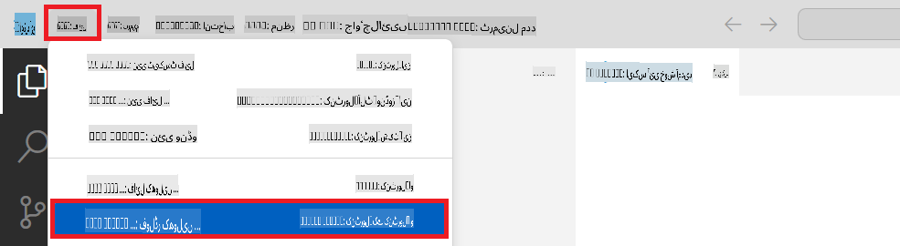

1. Visual Studio Code کے بائیں پین میں، دائیں کلک کریں اور **New File** منتخب کریں تاکہ *download_dataset.py* نامی نئی فائل بنائی جا سکے۔

    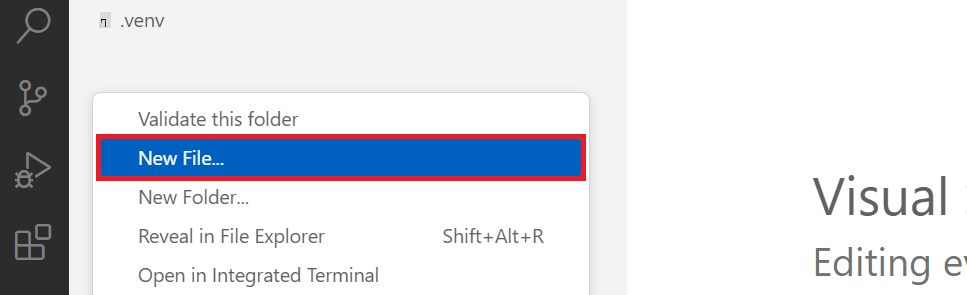

### بہتر بنانے کے لیے ڈیٹا سیٹ تیار کریں

اس مشق میں، آپ *download_dataset.py* فائل چلا کر *ultrachat_200k* ڈیٹا سیٹ کو اپنے مقامی ماحول میں ڈاؤن لوڈ کریں گے۔ آپ پھر اس ڈیٹا سیٹ کو Azure Machine Learning میں Phi-3 ماڈل کو بہتر بنانے کے لیے استعمال کریں گے۔

اس مشق میں، آپ:

- *download_dataset.py* فائل میں کوڈ شامل کریں تاکہ ڈیٹا سیٹ ڈاؤن لوڈ کیا جا سکے۔
- *download_dataset.py* فائل چلائیں تاکہ ڈیٹا سیٹ مقامی ماحول میں ڈاؤن لوڈ ہو جائے۔

#### *download_dataset.py* کا استعمال کرتے ہوئے اپنا ڈیٹا سیٹ ڈاؤن لوڈ کریں

1. Visual Studio Code میں *download_dataset.py* فائل کھولیں۔

1. درج ذیل کوڈ *download_dataset.py* فائل میں شامل کریں۔

    ```python
    import json
    import os
    from datasets import load_dataset

    def load_and_split_dataset(dataset_name, config_name, split_ratio):
        """
        Load and split a dataset.
        """
        # Load the dataset with the specified name, configuration, and split ratio
        dataset = load_dataset(dataset_name, config_name, split=split_ratio)
        print(f"Original dataset size: {len(dataset)}")
        
        # Split the dataset into train and test sets (80% train, 20% test)
        split_dataset = dataset.train_test_split(test_size=0.2)
        print(f"Train dataset size: {len(split_dataset['train'])}")
        print(f"Test dataset size: {len(split_dataset['test'])}")
        
        return split_dataset

    def save_dataset_to_jsonl(dataset, filepath):
        """
        Save a dataset to a JSONL file.
        """
        # Create the directory if it does not exist
        os.makedirs(os.path.dirname(filepath), exist_ok=True)
        
        # Open the file in write mode
        with open(filepath, 'w', encoding='utf-8') as f:
            # Iterate over each record in the dataset
            for record in dataset:
                # Dump the record as a JSON object and write it to the file
                json.dump(record, f)
                # Write a newline character to separate records
                f.write('\n')
        
        print(f"Dataset saved to {filepath}")

    def main():
        """
        Main function to load, split, and save the dataset.
        """
        # Load and split the ULTRACHAT_200k dataset with a specific configuration and split ratio
        dataset = load_and_split_dataset("HuggingFaceH4/ultrachat_200k", 'default', 'train_sft[:1%]')
        
        # Extract the train and test datasets from the split
        train_dataset = dataset['train']
        test_dataset = dataset['test']

        # Save the train dataset to a JSONL file
        save_dataset_to_jsonl(train_dataset, "data/train_data.jsonl")
        
        # Save the test dataset to a separate JSONL file
        save_dataset_to_jsonl(test_dataset, "data/test_data.jsonl")

    if __name__ == "__main__":
        main()

    ```

1. اسکرپٹ چلانے اور ڈیٹا سیٹ کو اپنے مقامی ماحول میں ڈاؤن لوڈ کرنے کے لیے ٹرمینل میں درج ذیل
1. [Azure ML Studio](https://ml.azure.com/home?wt.mc_id=studentamb_279723) پر جائیں۔

1. بائیں طرف والے ٹیب سے **Compute** منتخب کریں۔

1. نیویگیشن مینو سے **Compute clusters** منتخب کریں۔

1. **+ New** پر کلک کریں۔

    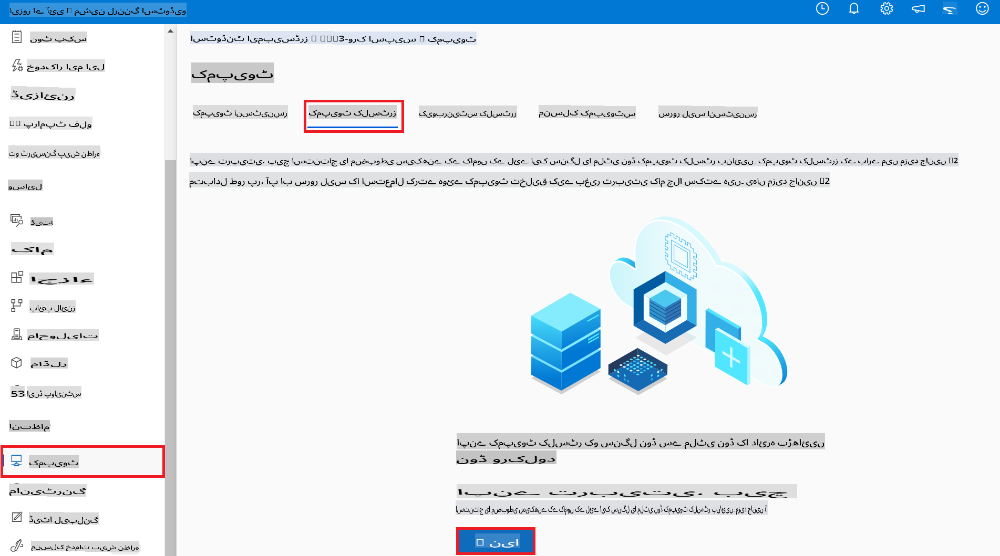

1. درج ذیل کام انجام دیں:

    - وہ **Region** منتخب کریں جسے آپ استعمال کرنا چاہتے ہیں۔
    - **Virtual machine tier** کو **Dedicated** پر سیٹ کریں۔
    - **Virtual machine type** کو **GPU** پر سیٹ کریں۔
    - **Virtual machine size** فلٹر کو **Select from all options** پر سیٹ کریں۔
    - **Virtual machine size** کو **Standard_NC24ads_A100_v4** پر منتخب کریں۔

    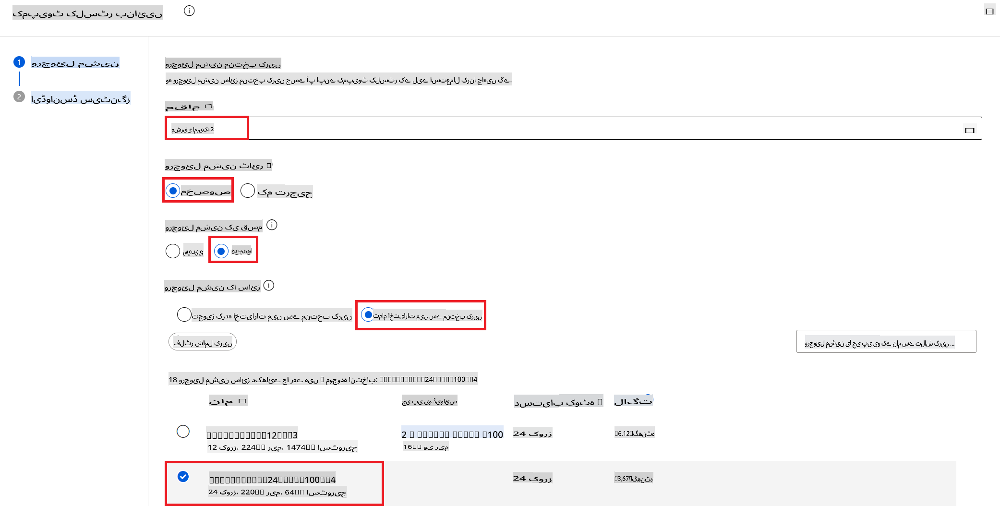

1. **Next** منتخب کریں۔

1. درج ذیل کام انجام دیں:

    - **Compute name** درج کریں۔ یہ منفرد ہونا چاہیے۔
    - **Minimum number of nodes** کو **0** پر سیٹ کریں۔
    - **Maximum number of nodes** کو **1** پر سیٹ کریں۔
    - **Idle seconds before scale down** کو **120** پر سیٹ کریں۔

    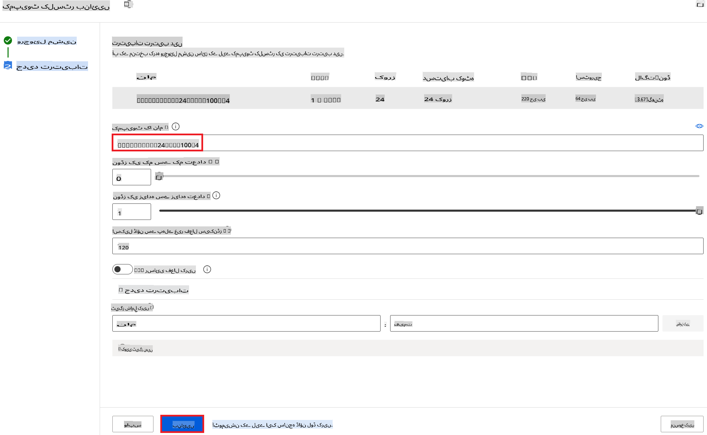

1. **Create** منتخب کریں۔

#### Phi-3 ماڈل کو فائن ٹون کریں

1. [Azure ML Studio](https://ml.azure.com/home?wt.mc_id=studentamb_279723) پر جائیں۔

1. وہ Azure Machine Learning ورک اسپیس منتخب کریں جو آپ نے بنائی تھی۔

    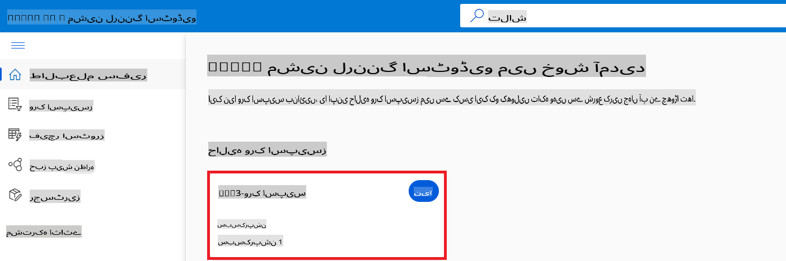

1. درج ذیل کام انجام دیں:

    - بائیں طرف والے ٹیب سے **Model catalog** منتخب کریں۔
    - **سرچ بار** میں *phi-3-mini-4k* ٹائپ کریں اور جو آپشنز آئیں ان میں سے **Phi-3-mini-4k-instruct** منتخب کریں۔

    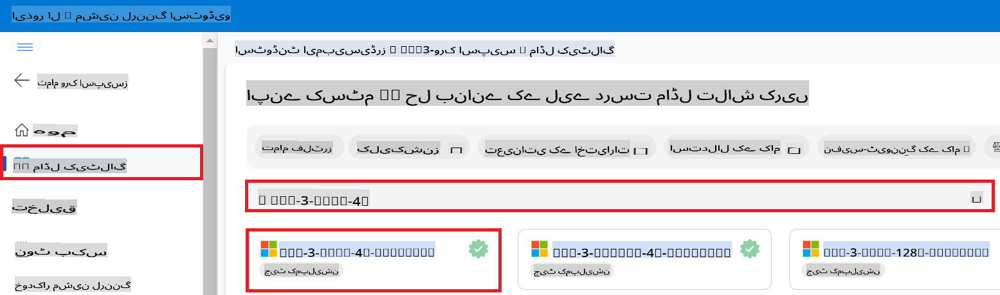

1. نیویگیشن مینو سے **Fine-tune** منتخب کریں۔

    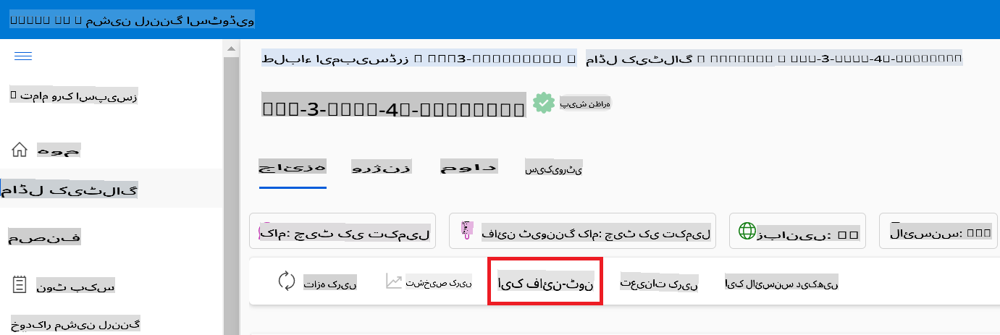

1. درج ذیل کام انجام دیں:

    - **Select task type** کو **Chat completion** پر سیٹ کریں۔
    - **+ Select data** منتخب کریں تاکہ **Training data** اپلوڈ کر سکیں۔
    - Validation data اپلوڈ کرنے کا طریقہ **Provide different validation data** پر سیٹ کریں۔
    - **+ Select data** منتخب کریں تاکہ **Validation data** اپلوڈ کر سکیں۔

    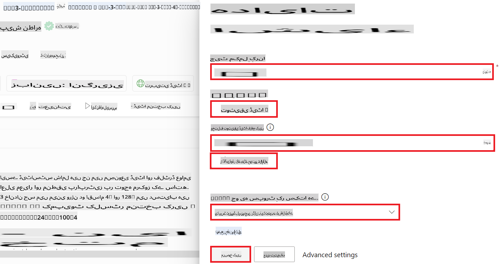

    > [!TIP]
    >
    > آپ **Advanced settings** منتخب کر کے کنفیگریشن جیسے **learning_rate** اور **lr_scheduler_type** کو اپنی ضروریات کے مطابق بہتر بنا سکتے ہیں۔

1. **Finish** منتخب کریں۔

1. اس مشق میں، آپ نے Azure Machine Learning کا استعمال کرتے ہوئے کامیابی سے Phi-3 ماڈل کو فائن ٹون کیا۔ براہ کرم نوٹ کریں کہ فائن ٹوننگ کا عمل کافی وقت لے سکتا ہے۔ فائن ٹوننگ جاب چلانے کے بعد، آپ کو اس کے مکمل ہونے کا انتظار کرنا ہوگا۔ آپ اپنی Azure Machine Learning ورک اسپیس کے بائیں طرف والے **Jobs** ٹیب پر جاکر فائن ٹوننگ جاب کی اسٹیٹس کو مانیٹر کر سکتے ہیں۔ اگلی سیریز میں، آپ فائن ٹون کیے گئے ماڈل کو ڈیپلوئے کریں گے اور اسے Prompt flow کے ساتھ انٹیگریٹ کریں گے۔

    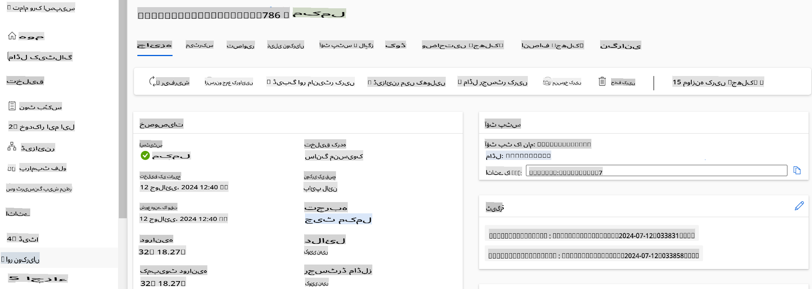

### فائن ٹون کیے گئے Phi-3 ماڈل کو ڈیپلوئے کریں

فائن ٹون کیے گئے Phi-3 ماڈل کو Prompt flow کے ساتھ انٹیگریٹ کرنے کے لیے، آپ کو ماڈل کو ریئل ٹائم انفرنس کے لیے قابل رسائی بنانے کے لیے ڈیپلوئے کرنا ہوگا۔ اس عمل میں ماڈل کو رجسٹر کرنا، ایک آن لائن اینڈ پوائنٹ بنانا، اور ماڈل کو ڈیپلوئے کرنا شامل ہے۔

اس مشق میں، آپ:

- Azure Machine Learning ورک اسپیس میں فائن ٹون کیے گئے ماڈل کو رجسٹر کریں گے۔
- ایک آن لائن اینڈ پوائنٹ بنائیں گے۔
- رجسٹرڈ فائن ٹون کیے گئے Phi-3 ماڈل کو ڈیپلوئے کریں گے۔

#### فائن ٹون کیے گئے ماڈل کو رجسٹر کریں

1. [Azure ML Studio](https://ml.azure.com/home?wt.mc_id=studentamb_279723) پر جائیں۔

1. وہ Azure Machine Learning ورک اسپیس منتخب کریں جو آپ نے بنائی تھی۔

    

1. بائیں طرف والے ٹیب سے **Models** منتخب کریں۔
1. **+ Register** منتخب کریں۔
1. **From a job output** منتخب کریں۔

    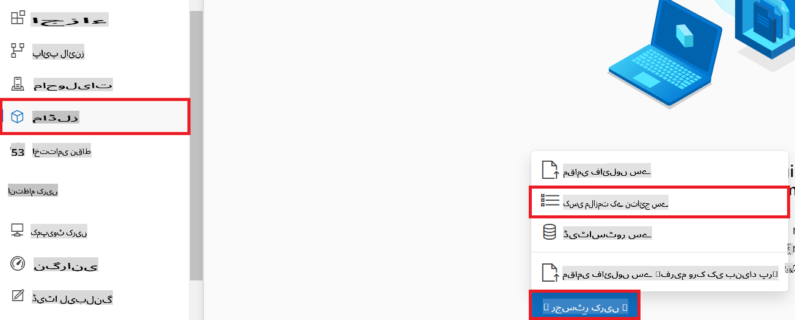

1. وہ جاب منتخب کریں جو آپ نے بنائی تھی۔

    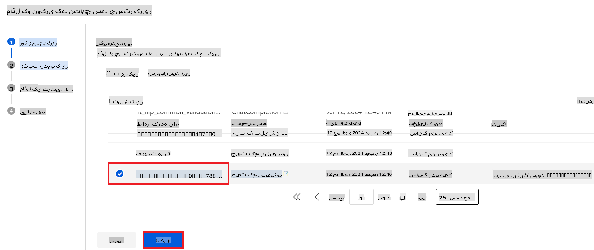

1. **Next** منتخب کریں۔

1. **Model type** کو **MLflow** پر سیٹ کریں۔

1. یقینی بنائیں کہ **Job output** منتخب ہے؛ یہ خودکار طور پر منتخب ہونا چاہیے۔

    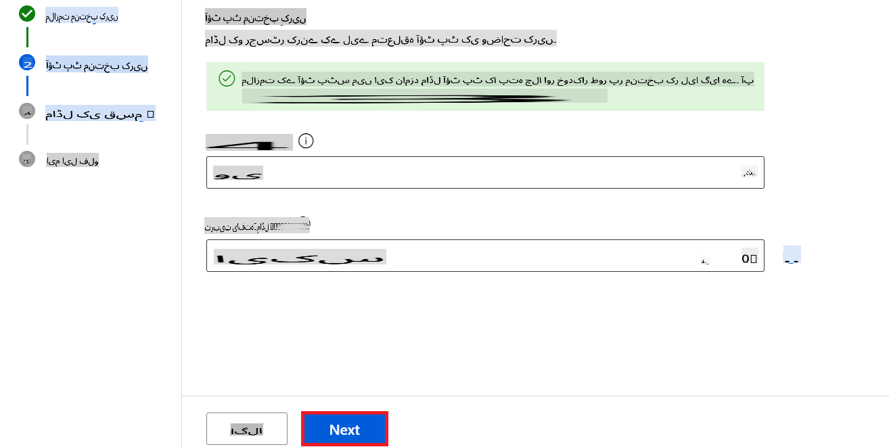

2. **Next** منتخب کریں۔

3. **Register** منتخب کریں۔

    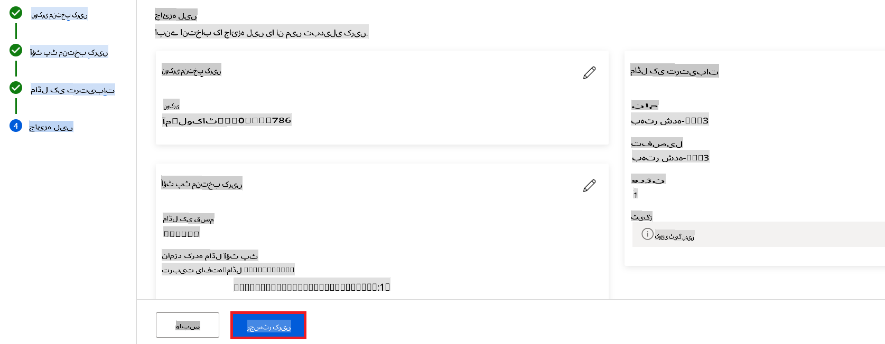

4. آپ اپنے رجسٹرڈ ماڈل کو بائیں طرف والے ٹیب سے **Models** مینو میں جاکر دیکھ سکتے ہیں۔

    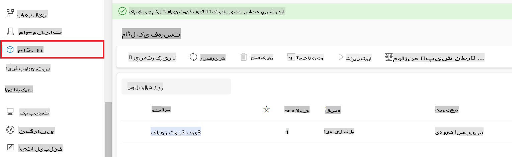

#### فائن ٹون کیے گئے ماڈل کو ڈیپلوئے کریں

1. اس Azure Machine Learning ورک اسپیس میں جائیں جو آپ نے بنائی تھی۔

1. بائیں طرف والے ٹیب سے **Endpoints** منتخب کریں۔

1. نیویگیشن مینو سے **Real-time endpoints** منتخب کریں۔

    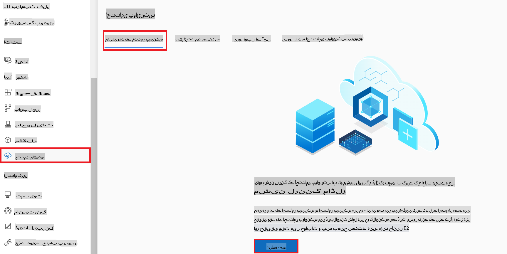

1. **Create** منتخب کریں۔

1. وہ رجسٹرڈ ماڈل منتخب کریں جو آپ نے بنایا تھا۔

    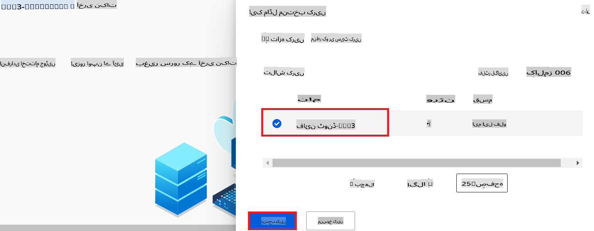

1. **Select** منتخب کریں۔

1. درج ذیل کام انجام دیں:

    - **Virtual machine** کو *Standard_NC6s_v3* پر منتخب کریں۔
    - وہ **Instance count** منتخب کریں جو آپ استعمال کرنا چاہتے ہیں۔ مثلاً، *1*۔
    - **Endpoint** کو **New** پر سیٹ کریں تاکہ ایک نیا اینڈ پوائنٹ بنایا جا سکے۔
    - **Endpoint name** درج کریں۔ یہ منفرد ہونا چاہیے۔
    - **Deployment name** درج کریں۔ یہ منفرد ہونا چاہیے۔

    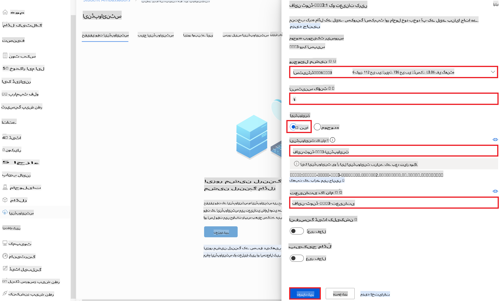

1. **Deploy** منتخب کریں۔

> [!WARNING]
> اپنے اکاؤنٹ پر اضافی چارجز سے بچنے کے لیے، Azure Machine Learning ورک اسپیس میں بنائے گئے اینڈ پوائنٹ کو حذف کرنا یقینی بنائیں۔
>

#### Azure Machine Learning ورک اسپیس میں ڈیپلوئےمنٹ اسٹیٹس چیک کریں

1. اس Azure Machine Learning ورک اسپیس میں جائیں جو آپ نے بنائی تھی۔

1. بائیں طرف والے ٹیب سے **Endpoints** منتخب کریں۔

1. وہ اینڈ پوائنٹ منتخب کریں جو آپ نے بنایا تھا۔

    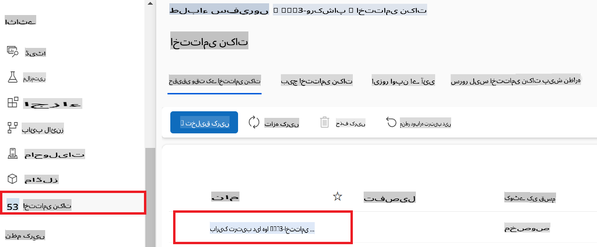

1. اس صفحے پر، آپ ڈیپلوئےمنٹ کے عمل کے دوران اینڈ پوائنٹس کو مینیج کر سکتے ہیں۔

> [!NOTE]
> ایک بار جب ڈیپلوئےمنٹ مکمل ہو جائے، تو یقینی بنائیں کہ **Live traffic** کو **100%** پر سیٹ کیا گیا ہے۔ اگر ایسا نہ ہو تو، **Update traffic** منتخب کریں تاکہ ٹریفک سیٹنگز کو ایڈجسٹ کیا جا سکے۔ نوٹ کریں کہ اگر ٹریفک 0% پر سیٹ ہو تو آپ ماڈل کو ٹیسٹ نہیں کر سکتے۔
>
> 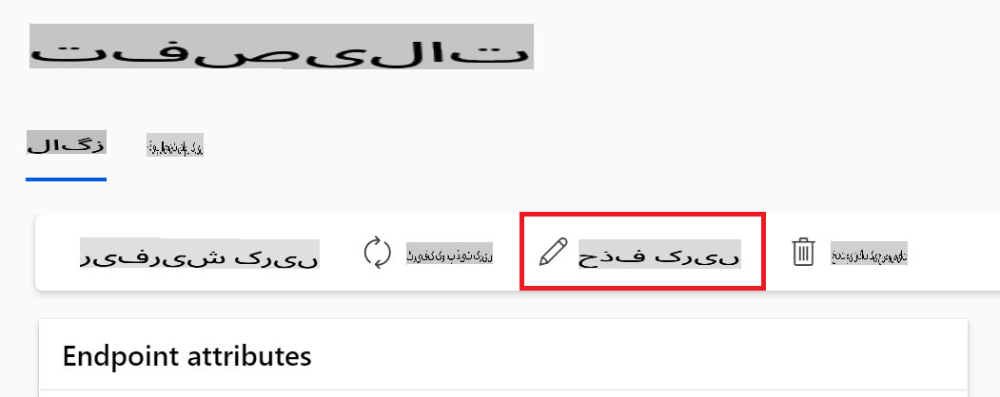
>
Translation for chunk 3 skipped due to timeout.

**ڈسکلیمر**:  
یہ دستاویز مشین پر مبنی AI ترجمہ سروسز کا استعمال کرتے ہوئے ترجمہ کی گئی ہے۔ اگرچہ ہم درستگی کے لیے کوشش کرتے ہیں، براہ کرم آگاہ رہیں کہ خودکار ترجمے میں غلطیاں یا عدم درستگیاں ہو سکتی ہیں۔ اصل دستاویز کو اس کی مقامی زبان میں مستند ذریعہ سمجھا جانا چاہیے۔ اہم معلومات کے لیے، پیشہ ور انسانی ترجمہ کی سفارش کی جاتی ہے۔ ہم اس ترجمے کے استعمال سے پیدا ہونے والی کسی بھی غلط فہمی یا غلط تشریح کے ذمہ دار نہیں ہیں۔