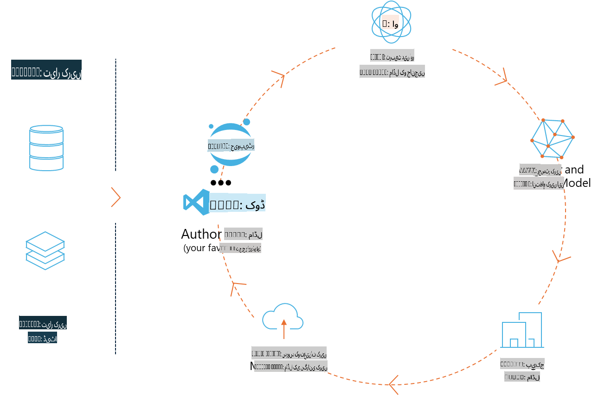
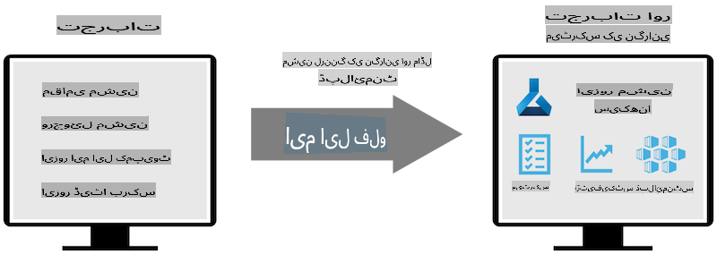
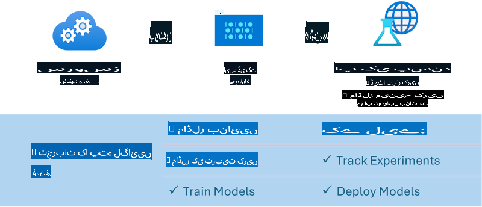

# ایم ایل فلو

[ایم ایل فلو](https://mlflow.org/) ایک اوپن سورس پلیٹ فارم ہے جو مشین لرننگ کے مکمل لائف سائیکل کو منظم کرنے کے لیے ڈیزائن کیا گیا ہے۔



ایم ایل فلو مشین لرننگ کے لائف سائیکل کو منظم کرنے کے لیے استعمال ہوتا ہے، جس میں تجربات، دوبارہ قابل عملیت، تعیناتی اور ایک مرکزی ماڈل رجسٹری شامل ہیں۔ ایم ایل فلو فی الحال چار اجزاء پیش کرتا ہے:

- **ایم ایل فلو ٹریکنگ:** تجربات، کوڈ، ڈیٹا کنفیگریشن اور نتائج کو ریکارڈ اور کوئری کریں۔
- **ایم ایل فلو پروجیکٹس:** ڈیٹا سائنس کے کوڈ کو ایک ایسے فارمیٹ میں پیک کریں جو کسی بھی پلیٹ فارم پر دوبارہ چلایا جا سکے۔
- **ایم ایل فلو ماڈلز:** مشین لرننگ ماڈلز کو مختلف سروسنگ ماحول میں تعینات کریں۔
- **ماڈل رجسٹری:** ماڈلز کو ایک مرکزی ذخیرے میں محفوظ کریں، ان پر تبصرے کریں اور ان کا انتظام کریں۔

یہ تجربات کو ٹریک کرنے، کوڈ کو دوبارہ قابل عمل رنز میں پیک کرنے، اور ماڈلز کو شیئر اور تعینات کرنے کی صلاحیت فراہم کرتا ہے۔ ایم ایل فلو ڈیٹا بریکس کے ساتھ مربوط ہے اور مختلف مشین لرننگ لائبریریز کو سپورٹ کرتا ہے، جس سے یہ لائبریری ایگناسٹک بن جاتا ہے۔ اسے کسی بھی مشین لرننگ لائبریری اور کسی بھی پروگرامنگ زبان کے ساتھ استعمال کیا جا سکتا ہے کیونکہ یہ سہولت کے لیے REST API اور CLI فراہم کرتا ہے۔



ایم ایل فلو کی اہم خصوصیات میں شامل ہیں:

- **ایکسپیریمنٹ ٹریکنگ:** پیرامیٹرز اور نتائج کو ریکارڈ کریں اور ان کا موازنہ کریں۔
- **ماڈل مینجمنٹ:** ماڈلز کو مختلف سروسنگ اور انفرنس پلیٹ فارمز پر تعینات کریں۔
- **ماڈل رجسٹری:** ایم ایل فلو ماڈلز کے لائف سائیکل کو ورژننگ اور تشریحات سمیت مشترکہ طور پر منظم کریں۔
- **پروجیکٹس:** مشین لرننگ کے کوڈ کو شیئرنگ یا پروڈکشن کے لیے پیک کریں۔

ایم ایل فلو ایم ایل اوپس لوپ کو بھی سپورٹ کرتا ہے، جس میں ڈیٹا کی تیاری، ماڈلز کو رجسٹر اور منظم کرنا، ماڈلز کو عمل درآمد کے لیے پیک کرنا، سروسز کو تعینات کرنا، اور ماڈلز کی نگرانی شامل ہے۔ اس کا مقصد پروٹوٹائپ سے پروڈکشن ورک فلو تک جانے کے عمل کو آسان بنانا ہے، خاص طور پر کلاؤڈ اور ایج ماحول میں۔

## اینڈ ٹو اینڈ منظرنامہ - ایک ریپر بنانا اور Phi-3 کو ایم ایل فلو ماڈل کے طور پر استعمال کرنا

اس اینڈ ٹو اینڈ مثال میں ہم دو مختلف طریقے دکھائیں گے کہ کس طرح Phi-3 کے چھوٹے زبان ماڈل (SLM) کے ارد گرد ایک ریپر بنایا جائے اور پھر اسے مقامی طور پر یا کلاؤڈ میں، مثلاً Azure مشین لرننگ ورک اسپیس میں، ایک ایم ایل فلو ماڈل کے طور پر چلایا جائے۔



| پروجیکٹ | وضاحت | مقام |
| ------------ | ----------- | -------- |
| ٹرانسفارمر پائپ لائن | ٹرانسفارمر پائپ لائن ایم ایل فلو کے تجرباتی ٹرانسفارمر فلیور کے ساتھ HuggingFace ماڈل استعمال کرنے کے لیے ریپر بنانے کا سب سے آسان آپشن ہے۔ | [**TransformerPipeline.ipynb**](../../../../../../code/06.E2E/E2E_Phi-3-MLflow_TransformerPipeline.ipynb) |
| کسٹم پائتھون ریپر | اس دستاویز کے وقت، ٹرانسفارمر پائپ لائن HuggingFace ماڈلز کے لیے ONNX فارمیٹ میں ایم ایل فلو ریپر جنریشن کو سپورٹ نہیں کرتی، حتیٰ کہ تجرباتی optimum پائتھون پیکج کے ساتھ بھی۔ اس طرح کے کیسز کے لیے، آپ ایم ایل فلو موڈ کے لیے ایک کسٹم پائتھون ریپر بنا سکتے ہیں۔ | [**CustomPythonWrapper.ipynb**](../../../../../../code/06.E2E/E2E_Phi-3-MLflow_CustomPythonWrapper.ipynb) |

## پروجیکٹ: ٹرانسفارمر پائپ لائن

1. آپ کو ایم ایل فلو اور HuggingFace کے متعلقہ پائتھون پیکجز کی ضرورت ہوگی:

    ``` Python
    import mlflow
    import transformers
    ```

2. اگلا، آپ کو HuggingFace رجسٹری میں موجود ہدف Phi-3 ماڈل کا حوالہ دے کر ایک ٹرانسفارمر پائپ لائن شروع کرنی ہوگی۔ جیسا کہ _Phi-3-mini-4k-instruct_ کے ماڈل کارڈ میں دکھایا گیا ہے، اس کا کام "ٹیکسٹ جنریشن" کی قسم کا ہے:

    ``` Python
    pipeline = transformers.pipeline(
        task = "text-generation",
        model = "microsoft/Phi-3-mini-4k-instruct"
    )
    ```

3. اب آپ اپنے Phi-3 ماڈل کی ٹرانسفارمر پائپ لائن کو ایم ایل فلو فارمیٹ میں محفوظ کر سکتے ہیں اور اضافی تفصیلات فراہم کر سکتے ہیں جیسے ہدف آرٹفیکٹس کا راستہ، مخصوص ماڈل کنفیگریشن سیٹنگز اور انفرنس API کی قسم:

    ``` Python
    model_info = mlflow.transformers.log_model(
        transformers_model = pipeline,
        artifact_path = "phi3-mlflow-model",
        model_config = model_config,
        task = "llm/v1/chat"
    )
    ```

## پروجیکٹ: کسٹم پائتھون ریپر

1. ہم یہاں مائیکروسافٹ کے [ONNX Runtime generate() API](https://github.com/microsoft/onnxruntime-genai) کو ONNX ماڈل کے انفرنس اور ٹوکنز کو انکوڈ/ڈیکوڈ کرنے کے لیے استعمال کر سکتے ہیں۔ آپ کو اپنے ہدف کمپیوٹ کے لیے _onnxruntime_genai_ پیکج کا انتخاب کرنا ہوگا، جیسا کہ نیچے دیے گئے مثال میں CPU کو ہدف بنایا گیا ہے:

    ``` Python
    import mlflow
    from mlflow.models import infer_signature
    import onnxruntime_genai as og
    ```

1. ہماری کسٹم کلاس دو طریقے نافذ کرتی ہے: _load_context()_ جو Phi-3 Mini 4K Instruct کے **ONNX ماڈل**، **جنریٹر پیرامیٹرز** اور **ٹوکنائزر** کو انیشیئلائز کرتا ہے؛ اور _predict()_ جو فراہم کردہ پرامپٹ کے لیے آؤٹ پٹ ٹوکنز تیار کرتا ہے:

    ``` Python
    class Phi3Model(mlflow.pyfunc.PythonModel):
        def load_context(self, context):
            # Retrieving model from the artifacts
            model_path = context.artifacts["phi3-mini-onnx"]
            model_options = {
                 "max_length": 300,
                 "temperature": 0.2,         
            }
        
            # Defining the model
            self.phi3_model = og.Model(model_path)
            self.params = og.GeneratorParams(self.phi3_model)
            self.params.set_search_options(**model_options)
            
            # Defining the tokenizer
            self.tokenizer = og.Tokenizer(self.phi3_model)
    
        def predict(self, context, model_input):
            # Retrieving prompt from the input
            prompt = model_input["prompt"][0]
            self.params.input_ids = self.tokenizer.encode(prompt)
    
            # Generating the model's response
            response = self.phi3_model.generate(self.params)
    
            return self.tokenizer.decode(response[0][len(self.params.input_ids):])
    ```

1. آپ اب _mlflow.pyfunc.log_model()_ فنکشن استعمال کر سکتے ہیں تاکہ Phi-3 ماڈل کے لیے ایک کسٹم پائتھون ریپر (پکل فارمیٹ میں)، اصل ONNX ماڈل اور مطلوبہ ڈپینڈنسیز کے ساتھ جنریٹ کیا جا سکے:

    ``` Python
    model_info = mlflow.pyfunc.log_model(
        artifact_path = artifact_path,
        python_model = Phi3Model(),
        artifacts = {
            "phi3-mini-onnx": "cpu_and_mobile/cpu-int4-rtn-block-32-acc-level-4",
        },
        input_example = input_example,
        signature = infer_signature(input_example, ["Run"]),
        extra_pip_requirements = ["torch", "onnxruntime_genai", "numpy"],
    )
    ```

## جنریٹ کیے گئے ایم ایل فلو ماڈلز کے سگنیچرز

1. اوپر دیے گئے ٹرانسفارمر پائپ لائن پروجیکٹ کے مرحلہ 3 میں، ہم نے ایم ایل فلو ماڈل کے کام کو "_llm/v1/chat_" پر سیٹ کیا۔ ایسی ہدایت ایک ماڈل کی API ریپر جنریٹ کرتی ہے، جو OpenAI کے چیٹ API کے ساتھ مطابقت رکھتی ہے جیسا کہ نیچے دکھایا گیا ہے:

    ``` Python
    {inputs: 
      ['messages': Array({content: string (required), name: string (optional), role: string (required)}) (required), 'temperature': double (optional), 'max_tokens': long (optional), 'stop': Array(string) (optional), 'n': long (optional), 'stream': boolean (optional)],
    outputs: 
      ['id': string (required), 'object': string (required), 'created': long (required), 'model': string (required), 'choices': Array({finish_reason: string (required), index: long (required), message: {content: string (required), name: string (optional), role: string (required)} (required)}) (required), 'usage': {completion_tokens: long (required), prompt_tokens: long (required), total_tokens: long (required)} (required)],
    params: 
      None}
    ```

1. نتیجتاً، آپ اپنا پرامپٹ درج ذیل فارمیٹ میں جمع کرا سکتے ہیں:

    ``` Python
    messages = [{"role": "user", "content": "What is the capital of Spain?"}]
    ```

1. پھر، OpenAI API-مطابقت پذیر پوسٹ پروسیسنگ استعمال کریں، مثلاً _response[0][‘choices’][0][‘message’][‘content’]_, تاکہ اپنے آؤٹ پٹ کو اس طرح خوبصورت بنایا جا سکے:

    ``` JSON
    Question: What is the capital of Spain?
    
    Answer: The capital of Spain is Madrid. It is the largest city in Spain and serves as the political, economic, and cultural center of the country. Madrid is located in the center of the Iberian Peninsula and is known for its rich history, art, and architecture, including the Royal Palace, the Prado Museum, and the Plaza Mayor.
    
    Usage: {'prompt_tokens': 11, 'completion_tokens': 73, 'total_tokens': 84}
    ```

1. اوپر دیے گئے کسٹم پائتھون ریپر پروجیکٹ کے مرحلہ 3 میں، ہم ایم ایل فلو پیکج کو دیے گئے ان پٹ مثال سے ماڈل کے سگنیچر کو جنریٹ کرنے کی اجازت دیتے ہیں۔ ہمارے ایم ایل فلو ریپر کے سگنیچر کی شکل کچھ یوں ہوگی:

    ``` Python
    {inputs: 
      ['prompt': string (required)],
    outputs: 
      [string (required)],
    params: 
      None}
    ```

1. لہذا، ہمارے پرامپٹ میں "prompt" ڈکشنری کی کلید شامل ہونی چاہیے، جو کچھ اس طرح ہوگی:

    ``` Python
    {"prompt": "<|system|>You are a stand-up comedian.<|end|><|user|>Tell me a joke about atom<|end|><|assistant|>",}
    ```

1. ماڈل کا آؤٹ پٹ پھر سٹرنگ فارمیٹ میں فراہم کیا جائے گا:

    ``` JSON
    Alright, here's a little atom-related joke for you!
    
    Why don't electrons ever play hide and seek with protons?
    
    Because good luck finding them when they're always "sharing" their electrons!
    
    Remember, this is all in good fun, and we're just having a little atomic-level humor!
    ```

**ڈس کلیمر**:  
یہ دستاویز مشین پر مبنی AI ترجمہ خدمات کا استعمال کرتے ہوئے ترجمہ کی گئی ہے۔ اگرچہ ہم درستگی کے لیے کوشش کرتے ہیں، براہ کرم آگاہ رہیں کہ خودکار ترجمے میں غلطیاں یا نقائص ہو سکتے ہیں۔ اصل دستاویز، جو اس کی مقامی زبان میں ہے، کو مستند ذریعہ سمجھا جانا چاہیے۔ اہم معلومات کے لیے، پیشہ ورانہ انسانی ترجمہ کی سفارش کی جاتی ہے۔ ہم اس ترجمے کے استعمال سے پیدا ہونے والی کسی بھی غلط فہمی یا غلط تشریح کے ذمہ دار نہیں ہیں۔